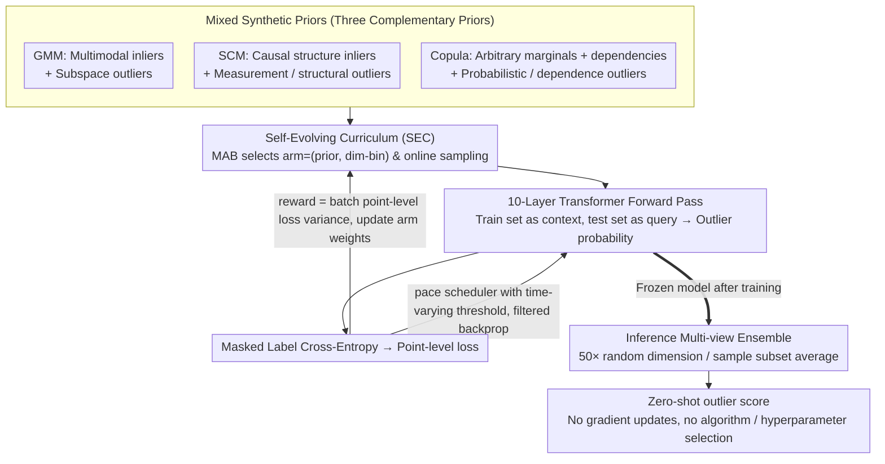

# From Zero to Hero: Advancing Zero-Shot Foundation Models for Tabular Outlier Detection

**Conference**: ICML 2026  
**arXiv**: [2602.03018](https://arxiv.org/abs/2602.03018)  
**Code**: https://github.com/psorus/Outformer  
**Area**: Tabular Foundation Models / Outlier Detection / In-Context Learning  
**Keywords**: Zero-shot Outlier Detection, Prior-Fitted Networks, Synthetic Data Prior Mixture, Self-Evolving Curriculum, Multi-Armed Bandit

## TL;DR
This paper proposes OutFormer, a tabular Prior-Fitted Network (PFN) pre-trained on a mixture of three synthetic priors (GMM/SCM/Copula) and stabilized by a self-evolving curriculum based on Multi-Armed Bandits (MAB). It achieves zero-shot tabular outlier detection by consuming training data as in-context information and providing labels in a single forward pass. OutFormer secures SOTA rankings on ADBench and two new benchmarks with 1500+ datasets while maintaining inference latency close to shallow models.

## Background & Motivation

**Background**: Tabular Outlier Detection (OD) has long been trapped in the "model selection + hyperparameter tuning" loop. In real-world scenarios, labeled outliers are almost non-existent. Shallow methods (kNN/LOF/IForest) require testing numerous hyperparameters, while deep methods (DeepSVDD/ICL/DDPM) require training a model for every new table. TabPFN, a Prior-Fitted Network (PFN) approach, demonstrated that pre-training a Transformer on massive synthetic data allows for zero-shot prediction by feeding the training set as context. This idea was first applied to OD by FoMo-OD (Shen et al. 2025).

**Limitations of Prior Work**: Although FoMo-OD ranked second on ADBench, it suffers from several issues: (1) It only uses a GMM prior, failing to model non-Gaussian marginal distributions, causal structures, and long-tail dependencies common in real tables. (2) Attempting to enrich the priors often leads to worse performance than GMM-only (Table 5: 0.898 on ADBench for mixed-prior vs. 0.920 for GMM-only), as gradient scales across different priors differ drastically, suppressing GMM signals. (3) ADBench contains only 57 tables, lacking statistical significance.

**Key Challenge**: To make PFNs truly effective for OD, one must: (a) construct a richer set of synthetic priors covering real-world data generation mechanisms; and (b) design a training curriculum that prevents gradient competition caused by the varying difficulty of different priors. Merely stacking priors is insufficient; "diversity vs. trainability" must be solved simultaneously.

**Goal**: Construct a mixture of synthetic priors covering various inlier/outlier archetypes and design a curriculum that does not require manual difficulty ordering. The objective is to achieve SOTA across ADBench/OddBench/OvRBench (1500+ datasets) while keeping inference latency at the level of shallow methods.

**Key Insight**: The authors identify this as a "non-stationary multi-task learning" problem, where different (prior, dimensionality) combinations represent different "arms" whose difficulty changes dynamically during training. This fits the Multi-Armed Bandit framework. By selecting a reward that distinguishes between "too hard/too easy/learnable," the model can autonomously pick the most valuable tasks.

**Core Idea**: A three-pronged approach: (1) Mixed Prior: GMM (multimodal) + SCM (causal) + Copula (arbitrary marginals + dependencies), with matched outlier archetypes for each. (2) Self-Evolving Curriculum (SEC): Using MAB to treat each (prior, dim-bin) as an arm, with rewards based on the variance of point-level losses within a batch to avoid "all-wrong/all-right" batches. (3) Inference Ensemble: Averaging multiple forward passes over subsampled dimensions and samples to bypass context length limits.

## Method

### Overall Architecture
OutFormer is a 10-layer Transformer (512 hidden, 8 heads, 45.1M parameters). During training, at each step, an MAB selects a task category $c=(\text{prior}, \text{dim-bin})$ based on current weights. A synthetic dataset $(\mathcal{D}_{\text{train}},\mathcal{D}_{\text{test}})$ is sampled online. The model uses $\mathcal{D}_{\text{train}}$ as context and $\mathcal{D}_{\text{test}}$ as query. After cross-attention, it outputs outlier probabilities for each query. The loss is cross-entropy on masked labels. Point-level losses update the MAB reward, and a pace scheduler backpropagates only those points below a dynamic threshold. During inference, the model is frozen; it performs a forward pass using training samples (default inliers) as context and 50 random dimension/sample subset ensembles to generate the final score.

### Key Designs

**1. Mixed Synthetic Priors (GMM + SCM + Copula): Covering three real-world generation mechanisms**

OutFormer expands the prior set. GMM models multimodal inliers and produces contextual subspace outliers. SCM uses an MLP with random edges as a causal graph to sample inliers via topological order $X_j = f_j(X_{Pa(X_j;G)},\epsilon_j)$, with "measurement outliers" (large $\epsilon_j$ perturbation) and "structural outliers" (causal mutation). Copula decouples marginals and dependencies using Sklar's theorem $F(x_1,\dots,x_d)=C(F_1(x_1),\dots,F_d(x_d))$, sampling marginals from various distributions (Beta, Exp, Power-law, etc.) and outliers by pushing values to boundaries (probabilistic) or breaking dependencies (dependence).

**2. Self-Evolving Curriculum (SEC) Multi-Armed Bandit: Automating focused training on "learnable" tasks**

Naive mixed-prior training degrades performance because gradient scales conflict. SEC treats (prior, dim-bin) pairs as arms in an MAB. The reward is the variance of point-level centered cross-entropy within a batch: $r(c)=\tfrac{1}{n_c}\sum(l_i-\text{mean}(l))^2$. This reward is maximized when a batch contains a mix of "high-confidence correct" and "high-confidence incorrect" predictions, and is zero when all probabilities are 0.5 (high uncertainty). This automatically de-emphasizes tasks that are too easy, too hard, or purely noisy.

**3. Multi-View Ensemble during Inference: Bypassing context length and boosting performance**

To handle large tables exceeding the Transformer's quadratic complexity ($n>5K, d>100$), OutFormer performs 50 forward passes per test sample. Each pass uses a random subsample of in-context inliers and a random subset of features (feature bagging). Averaging the results reduces variance and allows the model to process large tables in manageable chunks while benefiting from classic OD ensemble effects.

### Loss & Training
The pre-training objective is binary cross-entropy on synthetic queries: $\mathcal{L}=\mathbb{E}_{(\mathbf{x},y,\mathcal{D}_{\text{train}})\sim p(\mathcal{D})}[-\log q_\theta(y\mid \mathbf{x}, \mathcal{D}_{\text{train}})]$. SEC schedules data priors and dimensions, while a pace scheduler filters difficult points. Training is performed on 4× A6000 GPUs with batches of 1K synthetic datasets, each containing up to 5K context inliers.

## Key Experimental Results

### Main Results (ADBench, 57 datasets)

| Model | Avg. Rank ↓ | ELO ↑ | Winrate ↑ | rAUC ↑ | $C_\Delta$ ↓ | vs OutFormer p-val. |
|------|-------------|-------|-----------|--------|--------------|---------------------|
| DTE-NP (Prev. SOTA) | 5.12 | 1043 | 0.61 | 0.939 | 0.39 | 0.06 |
| kNN | 5.05 | 1001 | 0.61 | 0.938 | 0.36 | 0.06 |
| LOF | 6.04 | 961 | 0.53 | 0.913 | 0.43 | 0.00 |
| IForest | 8.46 | 794 | 0.32 | 0.879 | 0.52 | 0.00 |
| DDPM | 7.12 | 943 | 0.43 | 0.904 | 0.48 | 0.00 |
| DeepSVDD | 9.81 | 788 | 0.20 | 0.796 | 0.63 | 0.00 |
| TabPFN-OD | 4.74 | 1227 | 0.65 | 0.945 | 0.34 | 0.12 |
| FoMo-0D (Prev. FM) | 6.00 | 1084 | 0.54 | 0.928 | 0.41 | 0.01 |
| **OutFormer** | **4.02** | **1235** | **0.71** | **0.956** | **0.32** | – |

Across the aggregate of 1500+ datasets (ADBench+OddBench+OvRBench), OutFormer consistently holds the top rank (Avg. Rank ~5.0). AUPRC results show statistically significant superiority over all baselines ($p\le 0.00$).

### Ablation Study (SEC × Prior combinations)

| Configuration | GMM only (test) | Mixed (test) | ADBench (real) |
|------|-----------------|--------------|----------------|
| GMM-only train | 0.941 | 0.935 | 0.920 |
| Mixed (w/o SEC) | 0.873 | 0.937 | 0.898 |
| Mixed (w/ SEC) | **0.930** | **0.968** | **0.926** |

The drop from 0.920 to 0.898 when moving from GMM-only to naive mixed-prior quantifies the "prior competition." Adding SEC restores GMM performance (0.930) while improving Mixed and ADBench results, proving SEC unlocks synergy.

### Key Findings
- Complementary priors are essential: cross-prior testing (train on A, test on B) shows AUROC drops up to ~25 points.
- SEC saves the "GMM signal": In naive training, larger gradient priors overshadow GMM. SEC's batch-loss-variance reward prioritizes learnable signals, recovering fitting capacity.
- Zero-shot inference latency is comparable to shallow methods and 1-2 orders of magnitude faster than deep models that require per-dataset training.

## Highlights & Insights
- The "recipe" of GMM+SCM+Copula covers the main data generation mechanisms for tables and can serve as a standard for future tabular PFNs.
- Using batch loss variance as an MAB reward provides a clean way to distinguish between data uncertainty and model-learnable uncertainty.
- The shift to "zero-shot + shallow-level speed" enables "plug-and-play" OD APIs, removing the need for per-user AutoML or model training.

## Limitations & Future Work
- Context length remains a bottleneck; large tables require ensemble chunking, which increases computation.
- Priors are still manually curated; there is no proof this is the "optimal" set.
- Binary labels prevent fine-grained anomaly classification or calibration.

## Related Work & Insights
- **vs FoMo-0D**: Evolves from 1 prior to 3 priors/5 archetypes and uses SEC to resolve the resulting training instability.
- **vs TabPFN-OD**: Outperforms the adaptation of the supervised TabPFN, showing specialized OD priors are necessary.
- **vs DTE-NP**: Outperforms the per-dataset supervised SOTA using a zero-shot forward pass.

## Rating
- Novelty: ⭐⭐⭐⭐
- Experimental Thoroughness: ⭐⭐⭐⭐⭐
- Writing Quality: ⭐⭐⭐⭐
- Value: ⭐⭐⭐⭐⭐

<!-- RELATED:START -->

## Related Papers

- [\[ICML 2026\] InfoAtlas: A Foundation Model for Zero-Shot Statistical Dependence Estimation](infoatlas_a_foundation_model_for_zero-shot_statistical_dependence_estimate.md)
- [\[ICML 2026\] LimiX-2M: Mitigating Low-Rank Collapse and Attention Bottlenecks in Tabular Foundation Models](limix-2m_mitigating_low-rank_collapse_and_attention_bottlenecks_in_tabular_found.md)
- [\[AAAI 2026\] Robust Tabular Foundation Models](../../AAAI2026/self_supervised/robust_tabular_foundation_models.md)
- [\[ICCV 2025\] CObL: Toward Zero-Shot Ordinal Layering without User Prompting](../../ICCV2025/self_supervised/cobl_toward_zero-shot_ordinal_layering_without_user_prompting.md)
- [\[ECCV 2024\] Rethinking Unsupervised Outlier Detection via Multiple Thresholding](../../ECCV2024/self_supervised/rethinking_unsupervised_outlier_detection_via_multiple_thresholding.md)

<!-- RELATED:END -->
