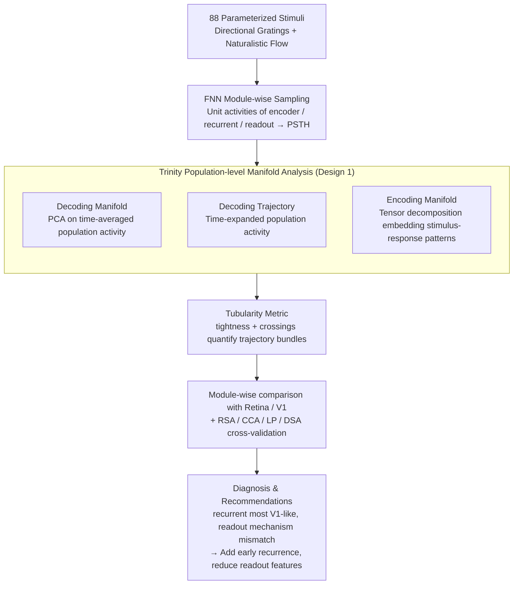

# How 'Neural' is a Neural Foundation Model?

**Conference**: ICML 2026  
**arXiv**: [2601.21508](https://arxiv.org/abs/2601.21508)  
**Code**: None (Based on public FNN + reuse of public manifolds pipeline)  
**Area**: Neural Foundation Models / Interpretability / Representation Learning  
**Keywords**: Neural Foundation Model, Decoding Manifold, Encoding Manifold, tubularity metric, Digital Twin

## TL;DR
The authors treat a "SOTA foundation model of mouse visual cortex (FNN)" as a physiological experimental subject. By analyzing its encoder, recurrent, and readout modules using a trinity of decoding manifolds, encoding manifolds, and decoding trajectories, they discovered that FNN's fitting accuracy is primarily sustained by a large number of homogeneous feature maps in the readout, while only the recurrent module is truly "brain-like." Using a newly proposed tubularity metric, they quantitatively show that "early encoding layers lack biological-grade temporal structure," providing explicit suggestions for future neural foundation models to "add recurrence early and reduce feature dimensions in the readout."

## Background & Motivation

**Background**: The era of digital twins in neuroscience has seen the emergence of "neural foundation models" capable of predicting spike sequences in areas like the mouse primary visual cortex (V1) directly from input videos. FNN has achieved SOTA performance on the largest functional connectomics datasets like MICrONS (normalized response correlation near 70%) and is frequently used as a "silicon twin" for interventional brain science experiments.

**Limitations of Prior Work**: Response correlation is a "forward prediction" metric that ignores the "inverse problem"—how many different inputs can correspond to the same output. Furthermore, FNN contains millions of units and can typically only be analyzed via pairwise RSA-like methods. Current alignment assessments do not guarantee that the model works like a brain on OOD data. In other words, "high fitting" does not equal "correct mechanism."

**Key Challenge**: There is a need to treat the model as a black box to calculate alignment scores while simultaneously "looking inside the box" to verify mechanisms. However, existing interpretability tools (RSA / CCA / Linear Predictivity / DSA) are pairwise or single-layered, failing to capture population-level temporal dynamics.

**Goal**: (a) Perform physiological-style population analysis for each module without retraining the FNN; (b) introduce quantitative metrics to compare "model temporal structure vs. real retina/V1 temporal structure"; (c) propose feasible architectural improvement suggestions.

**Key Insight**: Starting from the "identifiability" perspective in control theory—when a perfect forward model is unavailable, the box must be opened. The authors borrow a "trinity" from neuroscientists: decoding manifolds (how stimuli cluster in population activity space), encoding manifolds (how neurons cluster in stimulus-response space), and decoding trajectories (how population activity evolves over time), applying all three to a single foundation model for the first time.

**Core Idea**: Use a four-part toolset consisting of "decoding manifold + encoding manifold + decoding trajectory + tubularity metric" to examine each module of the FNN as a candidate brain region, checking for consistency with the population-level dynamics of the real retina / V1.

## Method

### Overall Architecture
Unit activities were sampled from the FNN's encoder (10 convolutional layers, including 3D convolutions for 12-step temporal capture), recurrent (Conv-LSTM with attention), and readout (Gaussian readout + one linear mapping per mouse) modules. PSTHs were elicited using a set of parameterized stimuli (8-direction drifting square-wave gratings + naturalistic optical flow, totaling 88 sequences). On each module, the following were performed: ① PCA on time-averaged population activity to obtain decoding manifolds; ② time-step expansion of population activity to obtain decoding trajectories; ③ tensor decomposition (Williams et al., 2018) to embed neurons into 2D based on "spatiotemporal response patterns to 88 stimuli" to obtain encoding manifolds; ④ quantification of the above into tubularity (tightness + crossings), cross-validated with existing RSA / CCA / LP / DSA.

### Key Designs

**1. Trinity Population-level Manifold Analysis: Visualizing Encoding, Decoding, and Dynamics Simultaneously**

Traditional RSA only calculates one-to-one similarity, failing to visualize "population geometry" or temporal evolution. This paper adopts the neuroscientist's trinity as a replacement. In a decoding manifold, each point represents a stimulus trial, with coordinates being the PCA-reduced population activity; trials of the same stimulus should cluster (indicating read-out). In an encoding manifold, each point is a unit, with coordinates derived from tensor-decomposed "stimulus-response" features; units with similar functions should be adjacent. Decoding trajectories expand stimulus trials over time into curves; integrating along the trajectory returns to the decoding manifold. Using all three addresses the "encoding—decoding—dynamics" questions central to neuroscience: global topology, local similarity, and temporal evolution are visualized at once, providing a perspective pairwise RSA cannot offer.

**2. Tubularity Metric (tightness + crossings): Quantifying "Biological Temporal Structure"**

To compare "model temporal structure vs. biological temporal structure," a quantifiable ruler is needed. Tubularity defines two values for trajectory bundles of each stimulus class: $S_{\text{tight}}$ measures whether trajectories of the same stimulus cluster tightly into a "tube" (biological retina $S_{\text{tight}} \approx 1.99$, while FNN encoder L8 is only $\approx 0.07$, indicating no tube formation); $S_{\text{cross}}$ measures the number of crossings between different stimulus trajectories (biological crossings are significantly higher, $p < 0.005$). Together, they answer whether the population expands into stable yet interacting bundles according to stimulus, as neurons do. Its strength lies in exposing blind spots in DSA—dynamics similarity measures like DSA might judge two trajectories as aligned if they have similar shapes but different causes. The authors found that L1 naturally forms loops due to convolutional translation equivariance, which DSA misidentifies as high alignment. Tubularity evaluates "shape pairs" and "semantic pairs" separately, thus seeing through such pseudo-alignment.

**3. Module-wise Comparison Against Retina vs. V1: Assigning a Biological Counterpart to Each Stage**

Metrics require a frame of reference. This paper uses real brain regions as anchors for layer-by-layer accounting. The retina serves as the example for "early + strong discrete clusters" (highly clustered encoding manifold), while V1 serves as the example for "late + smooth continuity" (continuously transitioning encoding manifold). The FNN is checked stage-by-stage: the early encoder should resemble the retina, the recurrent module should resemble V1, and the readout should continue the V1 style. The results are revealing: the encoder resembles neither the retina nor V1 and features a "non-selective intensity arm" $\gamma$ entirely absent in biology; the recurrent module is the first to show direction selectivity and tubular trajectories, most resembling V1; the readout, however, collapses into many highly homogeneous discrete clusters, furthest from V1’s continuity; the output, though appearing smooth as a linear combination of readout, consists mostly of transient PSTHs, still unlike V1. This layer-by-layer accounting clearly distinguishes which layers contribute real biological relevance and which merely fit individual variances, a fact masked by end-to-end fitting scores.

### Loss & Training
This paper does not train new models. All analyses were completed using the FNN checkpoint published by Wang et al. 2025. Only a new tubularity calculation pipeline was added, where parameters are descriptive geometric statistics requiring no training.

## Key Experimental Results

### Main Results

| Region | Enc L1 | Enc L2 | Enc L4 | Enc L5 | Enc L7 | Enc L8 | Rec | Readout | Output |
|---|---|---|---|---|---|---|---|---|---|
| Avg. Alignment with Retina (RSA/CCA/LP/DSA) | 0.26 | 0.26 | 0.30 | 0.33 | 0.28 | 0.28 | **0.40** | 0.34 | 0.34 |
| Avg. Alignment with V1 | 0.29 | 0.21 | 0.32 | 0.30 | 0.30 | 0.32 | **0.53** | 0.38 | 0.48 |

| Stage | Decoding Acc | $S_{\text{tight}}$ (Higher is more tubular) | $S_{\text{cross}}$ (Biological is significantly higher) |
|---|---|---|---|
| Retina (Biological) | — | 1.99 | $1.8\times 10^{-6}$ |
| V1 (Biological) | — | 0.33 | $4.0\times 10^{-6}$ |
| FNN Encoder L8 | 0.74 | 0.07 | $1.3\times 10^{-5}$ |
| FNN Recurrent | **0.89** | 0.12 | $2.7\times 10^{-7}$ |
| FNN Readout | 0.88 | 0.15 | $3.5\times 10^{-6}$ |
| FNN Output | 0.77 | 0.14 | $4.1\times 10^{-5}$ |

### Ablation Study

| Item Removed | Phenomenon |
|---|---|
| "Non-selective intensity arm" $\gamma$ in Encoder L8 | Decoding trajectories immediately become highly steady-state and barely move over time, proving the previous "pseudo-temporal structure" came entirely from intensity rise rather than true temporal encoding. |
| Encoding manifold only / Decoding manifold only | Either single perspective fails to yield the contradictory conclusion that the readout is "highly clustered while output is V1-like"; the trinity is needed to see that the output "fakes" continuity by linearly combining the readout's diverse PSTHs. |
| DSA metric vs. tubularity | DSA misidentifies L1 as "highly aligned" (due to convolutional translation equivariance making stimuli naturally cyclic); tubularity exposes this pseudo-alignment. |

### Key Findings
- FNN classification accuracy peaks at the recurrent module (0.89) and then declines—this strongly contradicts the "deeper is better" intuition, implying that the readout and output mainly serve to "fit individual mouse spikes" rather than perform higher-order encoding.
- The retina's encoding manifold is "distinctly clustered," while V1 is "smoothly continuous." FNN's readout does the opposite—it forms a large number of highly homogeneous discrete clusters, its greatest mechanistic mismatch with biology. The output's apparent return to continuity is achieved through linear combinations of various feature map transients, not true population dynamics.
- Biological trajectories have a significantly higher "$S_{\text{cross}}$" than FNN: even when forming tubes, biological populations exhibit more population-level interaction (likely from traveling waves or clique interactions), a level of dynamical complexity FNN lacks.
- The early encoder completely lacks tubular temporal structure, meaning that even with 3D convolutions, FNN's early processing only "extracts intensity features" rather than "forming temporal encodings"—a strong hint for future architectural improvements.

## Highlights & Insights
- Migrating the physiologist's "slicing experiment" mindset to foundation models: instead of asking "what is the alignment score," ask "which layer is doing what, and which brain region does it resemble"—this diagnostic interpretability is far more meaningful than a single alignment number.
- Tubularity is a simple yet sharp geometric metric designed to expose "correct shape but wrong semantics" pseudo-alignment; revealing DSA's blind spots is the paper's most substantial methodological contribution.
- Exposing the readout as an "appendage module"—it carries most of the fitting accuracy but uses non-V1 mechanisms, suggesting future neural foundation models should stop stacking feature maps and instead embed inductive biases for neural diversity into earlier layers.
- The suggestions to "add early recurrence to simulate amacrine connectivity" and "reduce readout feature counts" come directly from data observation rather than speculation, making them easy to validate in subsequent work.

## Limitations & Future Work
- Only one FNN model was analyzed; cross-model consistency has not been verified. Conclusions would be more robust if other video-based neural foundation models showed a similar "recurrent is the most V1-like" pattern.
- The stimulus set was restricted to 88 parameterized sequences to match biological controls, which is narrower than the natural videos used for FNN training; OOD behavior cannot be fully inferred.
- Tubularity is a new metric without established baselines or robustness testing on synthetic data; like RSA/DSA, it may have its own biases.
- No empirical evidence was provided for "how much alignment scores would increase if the architecture were modified as suggested"—this is the most critical next step for engineering.

## Related Work & Insights
- **vs. RSA / CCA / Linear Predictivity / DSA**: Traditional alignment metrics are pairwise or single-layer summaries and cannot visualize population dynamics. This paper adds the population geometry perspective via "manifolds + tubularity" and finds that DSA can be misled by convolutional cyclic structures.
- **vs. Doerig et al. 2023 and other "DNN as Brain" reviews**: Reviews often emphasize that "high end-to-end fit proves a DNN is a brain model." This paper provides a reality check from a "mechanism accounting" perspective, noting that high prediction accuracy $\neq$ brain-like internal representations.
- **vs. Klindt et al. / Lurz et al. on readout**: Gaussian readout has long been considered both efficient and interpretable, but this paper proves that the resulting readout representations are far from V1 manifold structures, challenging this popular practice.
- Insight: Foundation model interpretability can be more "biological"—using population manifolds from real brain data as ground-truth to "account" for each model layer against a brain region is more stable than using LLM-as-judge or custom scoring. This path can be applied inversely to LLMs (using human fMRI as an anchor).

## Rating
- Novelty: ⭐⭐⭐⭐ Applying the trinity to foundation models + proposing tubularity is a notable methodological contribution; however, individual components have precedents.
- Experimental Thoroughness: ⭐⭐⭐⭐ Covers multiple layers + multiple metrics + comparison with standard alignment methods, though only one model is covered.
- Writing Quality: ⭐⭐⭐⭐⭐ Each manifold / trajectory plot is presented alongside biological ground-truth, providing excellent readability.
- Value: ⭐⭐⭐⭐ Provides actionable architectural improvement suggestions, offering a direct push for neural digital twins.

<!-- RELATED:START -->

## Related Papers

- [\[NeurIPS 2025\] Manifolds and Modules: How Function Develops in a Neural Foundation Model](../../NeurIPS2025/self_supervised/manifolds_and_modules_how_function_develops_in_a_neural_foundation_model.md)
- [\[AAAI 2026\] Spikingformer: A Key Foundation Model for Spiking Neural Networks](../../AAAI2026/self_supervised/spikingformer_a_key_foundation_model_for_spiking_neural_networks.md)
- [\[ICML 2026\] InfoAtlas: A Foundation Model for Zero-Shot Statistical Dependence Estimation](infoatlas_a_foundation_model_for_zero-shot_statistical_dependence_estimate.md)
- [\[ICLR 2026\] Maximizing Asynchronicity in Event-based Neural Networks](../../ICLR2026/self_supervised/maximizing_asynchronicity_in_event-based_neural_networks.md)
- [\[ICML 2026\] FLAG: Foundation Model Representation with Latent Diffusion Alignment via Graph for Spatial Gene Expression Prediction](flag_foundation_model_representation_with_latent_diffusion_alignment_via_graph_f.md)

<!-- RELATED:END -->
