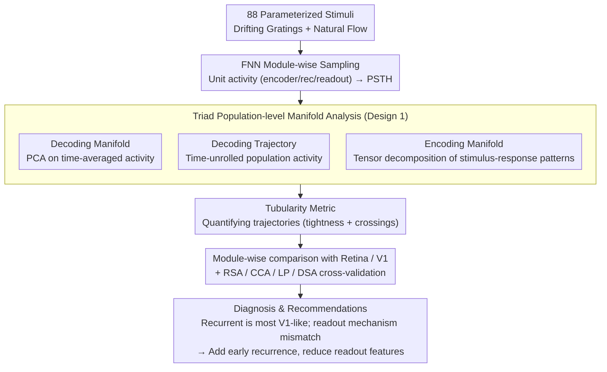

# How 'Neural' is a Neural Foundation Model?

**Conference**: ICML 2026  
**arXiv**: [2601.21508](https://arxiv.org/abs/2601.21508)  
**Code**: None (Based on public FNN + reuse of public manifolds pipeline)  
**Area**: Neuroscience Foundation Models / Interpretability / Representation Learning  
**Keywords**: Neural Foundation Model, Decoding Manifold, Encoding Manifold, Tubularity Metric, Digital Twin

## TL;DR
The authors treat a SOTA "mouse visual cortex Foundation Neural Network (FNN)" as a physiological experimental subject. By employing a toolkit of decoding manifolds, encoding manifolds, and decoding trajectories, they analyze its encoder, recurrent, and readout modules. They discover that while the FNN's fitting accuracy is sustained by a large number of homogeneous feature maps in the readout, only the recurrent module truly exhibits "brain-like" characteristics. Using a newly proposed "tubularity" metric, they quantitatively show that early encoding layers lack biological-grade temporal structure, providing explicit suggestions for future models: "introduce recurrence earlier and reduce feature dimensionality in the readout."

## Background & Motivation

**Background**: In the era of digital twins, neuroscience has seen the emergence of "neural foundation models" capable of predicting spike sequences in regions like the mouse primary visual cortex (V1) directly from video input. FNN has achieved SOTA performance on the largest functional connectomics datasets (e.g., MICrONS), with normalized response correlations approaching 70%, and is frequently used as a "silicon twin" for interventional neuroscience experiments.

**Limitations of Prior Work**: Response correlation is a "forward prediction" metric that ignores the "inverse problem"—how many different inputs can correspond to the same output. Furthermore, FNNs contain millions of units and are typically limited to pairwise RSA-style analyses. Current alignment evaluations cannot guarantee that these models function like a brain on OOD (out-of-distribution) data. In other words, "good fitting" does not equate to "correct mechanism."

**Key Challenge**: There is a need to both treat the model as a black box to calculate alignment scores and "look inside the box" to verify mechanisms. However, existing interpretability tools (RSA / CCA / Linear Predictivity / DSA) are either pairwise or single-layer, failing to capture population-level temporal dynamics.

**Goal**: (a) Perform module-wise physiological-style population analysis without retraining the FNN; (b) Introduce quantitative metrics to compare "model temporal structure vs. real retinal/V1 temporal structure"; (c) Propose actionable improvements for the architecture.

**Key Insight**: Moving from the perspective of "identifiability" in control theory, the authors argue that without a perfect forward model, one must open the box. They borrow a triad of tools from neuroscientists: decoding manifolds (how stimuli cluster in population activity space), encoding manifolds (how neurons cluster in stimuli-response space), and decoding trajectories (how population activity evolves over time), applying all three to a foundation model for the first time.

**Core Idea**: Use a four-part framework—"decoding manifold + encoding manifold + decoding trajectory + tubularity metric"—to inspect each FNN module as a candidate brain region and check its consistency with real retinal/V1 population dynamics.

## Method

### Overall Architecture
Unit activity is sampled from the FNN's encoder (10 convolutional layers, including 3D convolutions for 12-step temporal capture), recurrent (Conv-LSTM with attention), and readout (Gaussian readout + linear mapping per mouse) modules. A set of parameterized stimuli (8-direction drifting square-wave gratings + naturalistic optical flow, total 88 sequences) is used to evoke PSTHs. Then, for each module: ① PCA is performed on time-averaged population activity to obtain the decoding manifold; ② Decoding trajectories are derived from time-unrolled activity; ③ Tensor decomposition (Williams et al., 2018) embeds neurons into a 2D space based on "spatiotemporal response patterns to 88 stimuli" to obtain the encoding manifold; ④ These comparisons are quantified using the tubularity metric (tightness + crossings) and cross-validated with RSA / CCA / LP / DSA.

### Key Designs

**1. Triad Population-level Manifold Analysis: Simultaneous view of Encoding, Decoding, and Dynamics**

Traditional RSA only calculates one-to-one similarity, failing to visualize "population geometry" or evolution over time. This paper adopts the neuroscientist's triad to replace it. In the decoding manifold, each point represents a stimulus trial, with coordinates indicating the position in PCA-reduced population activity; identical stimuli should cluster (indicating readability). In the encoding manifold, each point is a unit, with coordinates formed by "stimulus-response" features from tensor decomposition; functionally similar units should be proximal. The decoding trajectory expands each trial into a curve over time; integrating along the trajectory returns to the decoding manifold.

Using these three together addresses the "encoding-decoding-dynamics" questions: global population topology, local neuron similarity, and temporal evolution are visualized simultaneously—a perspective pairwise RSA cannot provide.

**2. Tubularity Metric (tightness + crossings): Quantifying "Biological Temporal Structure"**

To compare "model temporal structure vs. biological temporal structure," a quantifiable ruler is needed. Tubularity defines two quantities for trajectory bundles of each stimulus class: $S_{\text{tight}}$ measures if trajectories of the same stimulus cluster tightly into a "tube" (biological retina $S_{\text{tight}} \approx 1.99$, whereas FNN encoder L8 is only $\approx 0.07$, meaning no tube formation); $S_{\text{cross}}$ measures the number of intersections between different stimulus trajectories (biological crossings are significantly higher, $p < 0.005$). Together, they answer whether the population expands into stable yet interacting bundles like real neurons.

This metric specifically exposes the blind spot of DSA (Dynamical Similarity Analysis). DSA-like metrics might judge two trajectories as aligned if they have similar shapes but different causes. The authors found L1 naturally forms loops due to convolutional translation equivariance, leading DSA to falsely report high alignment. Tubularity evaluates "shape pairs" and "semantic pairs" separately, thus unmasking this pseudo-alignment.

**3. Module-wise Comparison vs. Retina/V1: Assigning biological counterparts**

Indicators alone require a frame of reference. This paper uses real brain regions as anchors for layer-by-layer accounting. The retina serves as the "early + strong discrete cluster" exemplar (highly clustered encoding manifold), while V1 serves as the "late + smooth continuous" exemplar (continuous transition in the encoding manifold). FNN layers are checked: early encoder should resemble the retina, recurrent should resemble V1, and readout should continue the V1 style.

The comparison is revealing: the encoder resembles neither the retina nor V1 and features a "non-selective intensity arm" $\gamma$ entirely absent in biology; directional selectivity and tubular trajectories only first appear in the recurrent module, making it most V1-like. Conversely, the readout collapses into numerous highly homogeneous discrete clusters, diverging furthest from V1’s continuity. Even though the output (a linear combination of the readout) appears smooth, the PSTHs are mostly transient and still unlike V1. This accounting clarifies which layers contribute real biological relevance and which merely fit individual variance—a fact hidden by end-to-end fitting scores.

### Loss & Training
This paper does not train new models. All analyses are performed on the FNN checkpoint released by Wang et al. (2025). Only a new tubularity calculation pipeline is added, utilizing descriptive geometric statistics without training.

## Key Experimental Results

### Main Results

| Region | Enc L1 | Enc L2 | Enc L4 | Enc L5 | Enc L7 | Enc L8 | Rec | Readout | Output |
|---|---|---|---|---|---|---|---|---|---|
| Avg. Alignment with Retina (RSA/CCA/LP/DSA) | 0.26 | 0.26 | 0.30 | 0.33 | 0.28 | 0.28 | **0.40** | 0.34 | 0.34 |
| Avg. Alignment with V1 | 0.29 | 0.21 | 0.32 | 0.30 | 0.30 | 0.32 | **0.53** | 0.38 | 0.48 |

| Stage | Decoding Acc | $S_{\text{tight}}$ (Higher = more tubular) | $S_{\text{cross}}$ (Biologically higher) |
|---|---|---|---|
| Retina (Biological) | — | 1.99 | $1.8\times 10^{-6}$ |
| V1 (Biological) | — | 0.33 | $4.0\times 10^{-6}$ |
| FNN Encoder L8 | 0.74 | 0.07 | $1.3\times 10^{-5}$ |
| FNN Recurrent | **0.89** | 0.12 | $2.7\times 10^{-7}$ |
| FNN Readout | 0.88 | 0.15 | $3.5\times 10^{-6}$ |
| FNN Output | 0.77 | 0.14 | $4.1\times 10^{-5}$ |

### Ablation Study

| Removed Item | Observation |
|---|---|
| "Non-selective intensity arm" $\gamma$ in Enc L8 | Decoding trajectories immediately become highly steady-state and barely move over time; proves the limited "pseudo-temporal structure" was solely due to intensity rise, not true temporal coding. |
| Encoding manifold only / Decoding manifold only | Neither single view provides the contradictory conclusion that "readout is highly clustered yet output looks V1-like." Using all three reveals that the output "acts" continuous through linear combinations of the readout's diverse PSTHs. |
| DSA metric vs. Tubularity | DSA misidentifies L1 as "highly aligned" (due to translation equivariance making stimulus loops natural); Tubularity unmasks this pseudo-alignment. |

### Key Findings
- FNN classification accuracy peaks at the recurrent module (0.89) and then declines—this counter-intuitive finding (usually "deeper is better") suggests that readout and output are primarily performing "individualized spike fitting" rather than higher-order encoding.
- Retinal encoding manifolds are "clearly clustered," while V1 is "smoothly continuous." FNN's readout does the opposite—forming many highly homogeneous discrete clusters, representing its biggest mechanistic mismatch with biology.
- Biological trajectories have significantly higher "$S_{\text{cross}}$" than FNN: even when tubular, biological populations exhibit more population-level interactions (likely from traveling waves or clique interactions). FNN lacks this dynamical complexity.
- Early encoders completely lack tubular temporal structure, meaning even with 3D convolutions, FNN's early processing only "extracts intensity features" rather than "forming temporal codes"—a strong hint for future architecture improvements.

## Highlights & Insights
- Migrating the "slicing experiment" approach from physiology to foundation models: Instead of asking "what is the alignment score," ask "what is each layer doing and which brain region does it resemble"—this diagnostic interpretability is far more meaningful than a single number.
- Tubularity is a simple yet sharp geometric metric specifically designed to detect pseudo-alignments where "shape is correct but semantics are not." Revealing the blind spots of DSA is a major methodological contribution.
- Exposing the readout as an "appendage module"—it carries most of the fitting precision but uses non-V1-like mechanisms. This suggests that future neutral foundation models should stop stacking feature maps and instead embed the inductive biases of neural diversity into earlier layers.
- Suggestions such as "adding early recurrence to simulate amacrine connectivity" and "reducing readout feature count" come directly from data observations rather than speculation, making them easy to validate in follow-up work.

## Limitations & Future Work
- Only one FNN model was analyzed; cross-model consistency remains unverified. If other video-based neural foundation models exhibit the same "only recurrent is V1-like" pattern, the conclusion will be more robust.
- The stimulus set was restricted to 88 parameterized sequences for biological control, which is narrower than the natural videos used to train FNNs; OOD behavior cannot be fully inferred.
- Tubularity is a new metric without established baselines or robustness tests on synthetic data; like RSA/DSA, it may have its own biases.
- No empirical proof was provided for "how much alignment scores would increase if the architecture were modified as suggested"—this is the critical next step for engineering.

## Related Work & Insights
- **vs. RSA / CCA / Linear Predictivity / DSA**: Traditional alignment metrics are pairwise or single-layer summaries that miss population dynamics. This paper adds a population geometry perspective via "manifolds + tubularity" and discovers that DSA can be deceived by convolutional recurrent structures.
- **vs. Doerig et al. 2023 ("DNNs as Brain Models")**: While reviews emphasize that good end-to-end fitting proves DNNs are brain models, this paper provides a "mechanistic sanity check," pointing out that high prediction accuracy $\neq$ brain-like internal representations.
- **vs. Klindt et al. / Lurz et al. on readout**: Gaussian readout designs have long been considered both efficient and interpretable. However, this paper proves the resulting readout representations are far from V1 manifold structures, challenging this popular practice.
- **Insight**: Interpretability for foundation models can be more "biologized"—using population manifolds from real brain data as ground truth to "reconcile" each model layer with a specific brain region is more stable than using LLM-as-judge or custom scoring. This path could even be reversed for LLMs using human fMRI as anchors.

## Rating
- Novelty: ⭐⭐⭐⭐ Triad application to foundation models + Tubularity is a rare methodological contribution; however, individual components have precedents.
- Experimental Thoroughness: ⭐⭐⭐⭐ Covers multiple layers + multiple metrics + standard alignment controls, but limited to one model.
- Writing Quality: ⭐⭐⭐⭐⭐ Each manifold/trajectory plot is presented alongside biological ground truth, offering excellent readability.
- Value: ⭐⭐⭐⭐ Provides actionable architectural suggestions directly advancing the field of neural digital twins.

<!-- RELATED:START -->

## Related Papers

- [\[NeurIPS 2025\] Manifolds and Modules: How Function Develops in a Neural Foundation Model](../../NeurIPS2025/self_supervised/manifolds_and_modules_how_function_develops_in_a_neural_foundation_model.md)
- [\[AAAI 2026\] Spikingformer: A Key Foundation Model for Spiking Neural Networks](../../AAAI2026/self_supervised/spikingformer_a_key_foundation_model_for_spiking_neural_networks.md)
- [\[ICLR 2026\] Maximizing Asynchronicity in Event-based Neural Networks](../../ICLR2026/self_supervised/maximizing_asynchronicity_in_event-based_neural_networks.md)
- [\[ICML 2026\] InfoAtlas: A Foundation Model for Zero-Shot Statistical Dependence Estimation](infoatlas_a_foundation_model_for_zero-shot_statistical_dependence_estimate.md)
- [\[ICML 2026\] FLAG: Foundation Model Representation with Latent Diffusion Alignment via Graph for Spatial Gene Expression Prediction](flag_foundation_model_representation_with_latent_diffusion_alignment_via_graph_f.md)

<!-- RELATED:END -->
