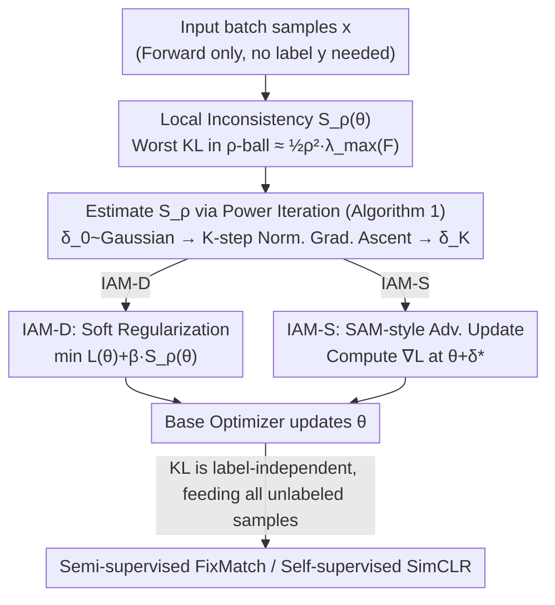

# Inconsistency-Aware Minimization: Improving Generalization with Unlabeled Data

**Conference**: ICML 2026  
**arXiv**: [2605.31324](https://arxiv.org/abs/2605.31324)  
**Code**: https://github.com/heesung-k/IAM  
**Area**: Optimization and Regularization / Semi-supervised / Self-supervised  
**Keywords**: Generalization bounds, Fisher Information Matrix, Sharpness-aware optimization, KL divergence regularization, unlabeled data

## TL;DR
This paper proposes "local inconsistency" $S_\rho(\theta)$—the worst-case KL divergence within a parameter ball—which can be calculated using only unlabeled data. By employing it as a training regularization term, the resulting IAM optimizer performs comparably to or better than SAM/ASAM in supervised tasks and brings additional improvements in semi-supervised (FixMatch) and self-supervised (SimCLR) scenarios by leveraging unlabeled batches.

## Background & Motivation

**Background**: Generalization research in deep networks currently follows two main trajectories. The first involves sharpness-aware optimizers like SAM/ASAM, which use the maximum eigenvalue of the loss Hessian $\lambda_{\max}(H)$ as a proxy for "flatness" to approximate the geometry near minima. The second involves measures based on "output discrepancy," such as disagreement proposed by Jiang et al. or inconsistency by Johnson–Zhang, which treat the KL divergence between multiple models or data partitions as a generalization proxy.

**Limitations of Prior Work**: Both trajectories face inherent issues. Sharpness-based measures exhibit an anomalous "local positive correlation, global negative correlation" under different combinations of weight decay and data augmentation; Andriushchenko et al. noted that they are essentially entangled with training hyperparameters rather than true generalization. Although disagreement/inconsistency can be computed with unlabeled data, they are defined by training multiple models and taking the expectation, making them neither differentiable nor regularizable for a single model in practice.

**Key Challenge**: The authors aim to address a core conflict: can we find a geometric measure that depends only on a single model, is differentiable, and requires only unlabeled data, allowing it to both predict the generalization gap and be directly integrated into the training loss as a regularizer? Sharpness measures satisfy the first two but require labeled data; inconsistency-based measures only satisfy the "unlabeled" requirement.

**Goal**: To construct a new measure $S_\rho(\theta)$ that simultaneously possesses three properties: (i) computable for a single model, (ii) differentiable, and (iii) requires only unlabeled data; and to design a unified regularizer based on it for supervised, semi-supervised, and self-supervised learning.

**Key Insight**: From an information geometry perspective, the second-order Taylor expansion of KL divergence in parameter space is exactly the quadratic form of the Fisher Information Matrix (FIM) $\tfrac12\delta^\top F(\theta)\delta$, and the Gauss–Newton approximation aligns $F$ with the loss Hessian $H$ under cross-entropy. If the "worst-case KL of the output distribution with respect to parameter perturbation" is used as a measure, it inherits the Hessian implications of sharpness-based methods but can be computed without labels since KL is defined in the output space.

**Core Idea**: Define $S_\rho(\theta)=\max_{\|\delta\|\le\rho}\mathbb{E}_x[\mathrm{KL}(f(x;\theta)\|f(x;\theta+\delta))]$, prove it approximates $\tfrac12\rho^2\lambda_{\max}(F(\theta))$, and use a single step of Power Iteration to estimate its gradient, treating it as a "KL-based proxy" for SAM in the training objective.

## Method

### Overall Architecture
The method consists of two layers: the measurement layer defines and estimates $S_\rho(\theta)$, and the optimization layer integrates it into the training objective. Estimation follows Algorithm 1: an initial perturbation $\delta_0$ is sampled from an isotropic Gaussian, followed by $K$ steps of normalized gradient ascent. Since the second-order approximation of KL with respect to $\delta$ is $F\delta$, one step of normalized gradient ascent is equivalent to one Power Iteration step, approximating the principal eigenvector of $F$ at the cost of $K$ backpropagations. The optimization layer provides two variants: IAM-D adds $\beta S_\rho(\theta)$ directly to the training loss as a soft regularizer; IAM-S mimics SAM by calculating the training loss gradient at the estimated perturbation point $\theta+\delta^*$, resulting in a KL-driven adversarial update. The overall pipeline maintains a per-step overhead nearly identical to SAM (both require one additional gradient calculation), but the KL branch only considers the output distribution, making it naturally compatible with large unlabeled batches in FixMatch or SimCLR.

### Key Designs

**1. Connection between Local Inconsistency $S_\rho(\theta)$ and FIM: Moving Sharpness to the Output Space**

Sharpness measures require labels, while inconsistency measures require multiple models. The authors break this trade-off by performing geometry in the output space rather than the loss space. Define:

$$S_\rho(\theta)=\max_{\|\delta\|\le\rho}\mathbb{E}_x[\mathrm{KL}(f(x;\theta)\|f(x;\theta+\delta))]$$

After a second-order Taylor expansion on $\delta$, this becomes $\max\tfrac12\delta^\top F(\theta)\delta=\tfrac12\rho^2\lambda_{\max}(F(\theta))$, the principal eigenvalue of the Fisher Information Matrix multiplied by the radius. Crucially, $F$ only uses $\nabla_\theta z$ and the softmax output $f$, with no dependence on the true label $y$. Under cross-entropy, $H\approx G=F$, so $S_\rho$ is geometrically equivalent to a "label-free version of maximum eigenvalue sharpness" near the solution. This step uses the KL expansion to translate "output sensitivity" to FIM axes, inheriting the Hessian meaning while removing label dependency. Theorem 4.1 embeds $\lambda_{\max}(F_S)$ into the generalization bounds of Luo et al., arguing that near interpolation, replacing $\lambda_{\max}(H)$ with $S_\rho$ does not lose accuracy.

**2. One-step Power Iteration for $S_\rho$ Estimation: Converting intractable $\max$ to cheap eigenvector problems**

Directly solving $\max_{\|\delta\|\le\rho}$ in a million-dimensional parameter space is infeasible, but the second-order approximation assists: the gradient of KL with respect to $\delta$ is exactly $F(\theta)\delta$. Thus, finding the perturbation that maximizes KL within a $\rho$-ball reduces to finding the principal eigenvector of $F$. Algorithm 1 performs normalized gradient ascent: starting from isotropic Gaussian $\delta_0\sim\mathcal{N}(0,\tfrac{\sigma^2}{m}I)$, it iterates $\delta_{k+1}=\rho\,g_k/\|g_k\|$ where $g_k=\nabla_\delta\mathbb{E}_x\mathrm{KL}(f(x;\theta)\|f(x;\theta+\delta))$. Each step is equivalent to a Power Iteration on $F$, so $K=1$ is sufficient to approximate the principal direction $\delta_K\approx\delta^*$. The cost is $K$ extra backpropagations; at $K=1$, the cost matches SAM's single adversarial perturbation, making them fairly comparable.

**3. IAM-D and IAM-S: Two Interfaces for Training Integration**

After obtaining $\delta_K$, Algorithm 2 provides two ways to update parameters. IAM-D adopts soft regularization, directly minimizing $L(\theta)+\beta S_\rho(\theta)$ to fit the data while reducing the worst-case shift of the output distribution under perturbation. IAM-S follows SAM, updating via the training loss gradient at the perturbed point $\theta+\delta^*$, with the distinction that $\delta^*$ stems from the worst-case KL instead of the training gradient. Since $\pm\delta$ are sampled with equal probability, the first-order term $\delta^\top\nabla_\theta L$ cancels out in expectation, causing IAM-S to implicitly suppress the principal eigenvalues of $G(\theta)=F(\theta)$. Empirically, IAM-S is more stable for supervised tasks, while IAM-D is easier to integrate as an additive regularizer in FixMatch/SimCLR pipelines.

**4. Natural Adaptation to Unlabeled Data**

Since estimating $S_\rho$ only requires forward outputs $f(x;\theta)$ and backward gradients $\nabla_\delta \mathrm{KL}$ without $y$, all unlabeled samples in semi-supervised or self-supervised learning can be utilized. In FixMatch, $\beta S_\rho(\theta)$ is added to the objective, with the KL expectation taken over the entire batch (labeled+unlabeled). In SimCLR, the KL expectation is taken over the projection head outputs. This is critical because measuring flatness on a sparse label set may not reflect the true flatness of the entire data manifold—applying SAM directly to the labeled loss in FixMatch yields no improvement (Appx. E.4). IAM utilizes the label-independence of KL to spread the second-order geometric signal across the unlabeled distribution.

### Loss & Training
The supervised objective is $L_{\text{IAM-D}}=L(\theta)+\beta S_\rho(\theta)$ or $L_{\text{IAM-S}}=L(\theta+\delta^*)$, using Algorithm 1 with $K=1$ to estimate perturbations. For CIFAR-10, $\beta=1.0,\rho=0.1$; for CIFAR-100, $\beta=10.0,\rho=0.1$ (IAM-D) or $\rho=0.5$ (IAM-S). ImageNet uses $\rho=0.2$ (S) / $0.1$ (D). In semi-supervised learning, KL is averaged over the labeled+unlabeled batch; in self-supervised learning, it is calculated based on the projection head output distribution.

## Key Experimental Results

### Main Results

| Dataset | Model | Metric | SGD | SAM | ASAM | IAM-D | IAM-S |
|---------|-------|--------|-----|-----|------|-------|-------|
| CIFAR-10 | WRN-16-8 | Test Error | 3.68 | 3.31 | 3.15 | 3.28 | 3.28 |
| CIFAR-100 | WRN-16-8 | Test Error | 19.17 | 17.63 | 17.15 | 17.16 | **16.82** |
| F-MNIST | WRN-28-10 | Test Error | 4.45 | 4.13 | 4.11 | 4.13 | **4.10** |
| SVHN | WRN-28-10 | Test Error | 3.82 | 3.47 | 3.24 | **3.13** | **3.13** |
| ImageNet | ResNet-50 | Top-1 Err | 22.66 | 21.80 | – | **21.36** | 21.72 |
| ImageNet | ResNet-50 | Top-5 Err | 6.51 | 5.99 | – | **5.70** | 5.90 |

In supervised scenarios, IAM is on par with ASAM/SAM for small datasets but outperforms SAM by 0.81% on the more difficult CIFAR-100. On ImageNet, IAM-D surpasses the strong SAM baseline.

### Ablation Study

| Configuration | CIFAR-10 (250 labels) | CIFAR-10 (4000 labels) | CIFAR-100 (2500 labels) | CIFAR-100 (10000 labels) | Note |
|---------------|-----------------------|------------------------|--------------------------|---------------------------|------|
| SGD | 63.82 | 22.45 | 68.91 | 45.94 | No geom. reg. |
| SAM (labeled only) | 63.91 | 19.95 | 69.53 | 43.30 | Sharpness on label subset |
| IAM-D (labeled+unlabeled) | 61.77 | 15.07 | 66.98 | 40.02 | KL on full batch |
| FixMatch | 6.26 | 4.10 | 32.84 | 22.93 | Strong SSL baseline |
| FixMatch + IAM-D | **5.30** | **3.88** | **28.95** | **21.99** | Plug-and-play gain |

Under the extreme scarcity of 250 labels, SAM performs slightly worse than SGD (63.91 vs. 63.82), confirming the authors' assertion that flatness on small label sets is unreliable. IAM-D, by extending the signal to unlabeled batches, reduces error to 61.77 and further to 5.30 when combined with FixMatch.

### Key Findings
- On small models like 6CNN, the Kendall $\tau$ correlation between $S_\rho, \mathrm{Tr}(H), \lambda_{\max}(H)$ and the generalization gap is similar (0.51–0.54). However, with WRN28-2 using heavy augmentation and weight decay, the global correlation of $\mathrm{Tr}(H)$ and $\lambda_{\max}(H)$ flips to negative ($-0.04$, $-0.12$), بينما $S_\rho$ remains positively correlated ($0.37$), indicating KL measures are more robust to hyperparameter scale effects.
- IAM-D explicitly suppresses the rise of $S_\rho$ during training and avoids the "overfitting" behavior seen in SGD (accuracy drop + inconsistency spike) after learning rate decay.
- Applying SAM solely to labels in FixMatch yields no gain, but using IAM-D on the entire batch does, suggesting that label-independence and utilizing unlabeled data are the true sources of the performance gain.

## Highlights & Insights
- Using the second-order expansion of KL as "output space sharpness" is the most elegant contribution of the paper. it simultaneously solves three problems: single-model computation, differentiability, and label-free requirements.
- The Power Iteration perspective on SAM explains why $K=1$ is sufficient and offers a more geometric interpretation: SAM and IAM essentially suppress eigenvalues on the FIM principal axes.
- The gains in semi-supervised learning suggest that many SSL methods only penalize consistency loss and ignore the worst-case output shift under parameter perturbation. The latter can serve as a new SSL regularization suite applicable to any network with a probability distribution output.

## Limitations & Future Work
- Estimating $S_\rho$ still requires an additional full-model backpropagation, doubling the cost compared to SGD. The authors acknowledge the need for cheaper versions (e.g., low-rank FIM approximations or Hutchinson estimators).
- The theoretical analysis (Theorem 4.1) relies on the near-interpolation assumption $\varepsilon_R\in\approx 0$; the gap between $\lambda_{\max}(F)$ and $\lambda_{\max}(H)$ in early training stages remains uncovered.
- Experiments were limited to CV with ResNet/WRN/ViT. Validation on LLMs, diffusion models, and regression tasks is still needed.
- For self-supervised learning, only SimCLR + ResNet-18 was tested; the sensitivity of $\rho$ and $\beta$ in large-scale SSL requires more systematic reporting.

## Related Work & Insights
- **vs SAM (Foret et al., 2021)**: SAM computes gradients at the worst perturbation of the training loss, requiring $y$. IAM computes $L$ gradients at the worst KL perturbation point (IAM-S) or uses soft regularization (IAM-D), which is label-free.
- **vs ASAM (Kwon et al., 2021)**: ASAM addresses SAM's scale invariance via adaptive sharpness but still depends on training loss. IAM naturally achieves scale invariance through the output KL (softmax is invariant to linear reparameterization).
- **vs Johnson & Zhang (2023) Inconsistency**: Their inconsistency involves training multiple models; this paper proves that under isotropic posterior assumptions, $S_\rho$ is proportional to their conditional inconsistency, essentially compressing the multi-model measure into a differentiable single-model version.
- **vs Explicit Jacobian Regularization (Lee et al., 2023)**: They show that random noise projected onto the Jacobian column space becomes a meaningful perturbation. IAM's $F(\theta)\varepsilon$ is an instantiation of this mechanism on the FIM principal axes.

## Rating
- Novelty: ⭐⭐⭐⭐ Clean perspective using KL expansion as output space sharpness for SSL, though individual components (FIM/SAM) are established.
- Experimental Thoroughness: ⭐⭐⭐⭐ Covers CIFAR/ImageNet + Semi/Self-supervised; lacks LLMs/diffusion models.
- Writing Quality: ⭐⭐⭐⭐ Clear theory and algorithm descriptions, though some figures are scattered.
- Value: ⭐⭐⭐⭐ Immediate practical value for SSL as a plug-in regularizer and provides a new coordinate for sharpness generalization theory.

<!-- RELATED:START -->

## Related Papers

- [\[ICML 2026\] Statistical Consistency and Generalization of Contrastive Representation Learning](statistical_consistency_and_generalization_of_contrastive_representation_learnin.md)
- [\[ICML 2026\] A Refined Generalization Analysis for Extreme Multi-class Supervised Contrastive Representation Learning](a_refined_generalization_analysis_for_extreme_multi-class_supervised_contrastive.md)
- [\[ICML 2026\] Data Augmentation of Contrastive Learning is Estimating Positive-incentive Noise](data_augmentation_of_contrastive_learning_is_estimating_positive-incentive_noise.md)
- [\[CVPR 2026\] Learning by Analogy: A Causal Framework for Compositional Generalization](../../CVPR2026/self_supervised/learning_by_analogy_a_causal_framework_for_compositional_generalization.md)
- [\[AAAI 2026\] Improving Sustainability of Adversarial Examples in Class-Incremental Learning](../../AAAI2026/self_supervised/improving_sustainability_of_adversarial_examples_in_class-incremental_learning.md)

<!-- RELATED:END -->
