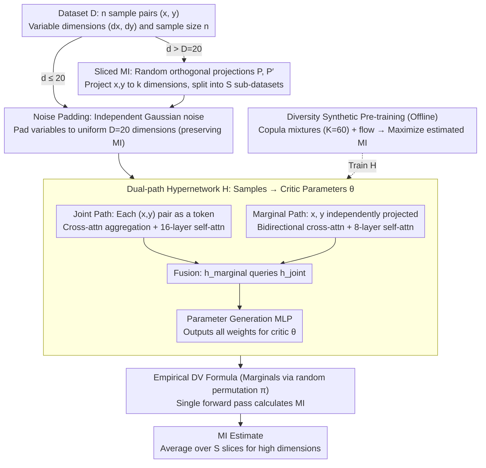

# InfoAtlas: A Foundation Model for Zero-Shot Statistical Dependence Estimation

**Conference**: ICML 2026  
**arXiv**: [2606.00241](https://arxiv.org/abs/2606.00241)  
**Code**: The paper mentions the InfoAtlas-project page (Project page link in the paper)  
**Area**: Self-supervised / Foundation Models / Mutual Information Estimation  
**Keywords**: Mutual Information, Foundation Models, Hypernetwork, Sliced Mutual Information, Synthetic Data Pre-training

## TL;DR
InfoAtlas transforms mutual information estimation from an optimization problem where an evaluation network is trained from scratch for each dataset into a "single forward pass" problem using a hypernetwork pre-trained on large-scale synthetic data. This achieves accuracy comparable to neural estimators like MINE/MINDE while providing a 100× speedup.

## Background & Motivation

**Background**: Mutual Information (MI) is a standard tool for measuring statistical dependence between two sets of multidimensional variables. Prevailing neural estimators such as MINE / InfoNCE / MINDE utilize variational lower bounds like Donsker-Varadhan (DV) to formulate MI estimation as $\mathbb{I}(\mathbf{x}, \mathbf{y}) \coloneqq \sup_\theta \mathbb{E}_{p_{xy}}[\theta] - \log(\mathbb{E}_{p_x \otimes p_y}[e^\theta])$, using neural networks to approximate the optimal critic $\theta$.

**Limitations of Prior Work**: All neural MI estimators share a fatal flaw—A critic network must be trained from scratch for every new dataset, requiring thousands of gradient descent steps to converge. The complexity of a single estimation is $\mathcal{O}(T)$, making it nearly unusable for real-time scenarios such as high-frequency financial correlation monitoring or large-scale genetic screening. Prior work like InfoNet (Hu et al. 2024) attempted to bypass training via look-up tables, but could only handle 1-dimensional inputs; scaling to $d$ dimensions requires $\mathcal{O}(e^d)$ look-up space, which becomes infeasible by $d=8$ and cannot handle varying dimensions.

**Key Challenge**: The accuracy of neural MI estimation depends on training a dedicated critic for the specific data, but the training cost is proportional to the number of datasets. To achieve "single forward pass MI," a method must be found to make the critic parameters themselves a function of the dataset $\theta^* = \mathcal{H}(\mathcal{D})$, and this mapping must generalize to unseen real-world data.

**Goal**: Downgrade MI estimation to a simple inference task—a unified model that handles multivariate data of arbitrary dimensions and sample sizes, skips per-dataset optimization, and maintains strong generalization to real-world scenarios (CLIP, video, robotics).

**Key Insight**: The authors draw inspiration from the success of foundation models like TabPFN and Chronos in tabular and time-series forecasting—large-scale synthetic data pre-training followed by single-pass inference. This paper applies the same logic to MI estimation: synthesizing a "dependence structure space" where the model learns to "derive critic parameters from samples."

**Core Idea**: Use a hypernetwork $\mathcal{H}$ to map a dataset to all parameters of a DV critic. Pre-train this on massive synthetic dependence structures (copula mixtures + flow transformations) to enable zero-shot generalization to unseen distributions. High-dimensional data is decomposed into multiple low-dimensional projections using sliced MI, processed in parallel batches via a transformer.

## Method

### Overall Architecture

The core of InfoAtlas is an attention-based hypernetwork $\mathcal{H}: \mathcal{D} \mapsto \Theta$. The input consists of $n$ sample pairs $\{(\mathbf{x}^i, \mathbf{y}^i)\}_{i=1}^n$, and the output is the complete set of parameters for the DV critic $\theta$ (all weights and biases flattened into a vector). Once $\theta$ is obtained, the empirical DV formula $\hat{\mathbb{I}}_\theta(\mathbf{x}, \mathbf{y}) = \frac{1}{n}\sum_i \theta(\mathbf{x}^i, \mathbf{y}^i) - \log(\frac{1}{n}\sum_j e^\theta(\mathbf{x}^j, \mathbf{y}^{\pi(j)}))$ is used to calculate MI in one step, where $\pi$ is a marginal sample obtained by random permutation. The entire pre-training is conducted on synthetic copula mixture distributions. When dimensions $d > D = 20$, the system switches to $k$-sliced MI, decomposing high-dimensional problems into $S$ $k$-dimensional sub-problems fed in batches to the same $\mathcal{H}$.

### Key Designs

**1. Dual-path Hypernetwork: Direct critic parameter generation skipping gradient descent**

The bottleneck of traditional neural MI estimation is the requirement to train a critic from scratch for every dataset. InfoAtlas replaces this with a single inference step where the hypernetwork $\mathcal{H}$ outputs the full parameters of critic $\theta$ after seeing the samples. The architecture is intentionally aligned with the two expectation terms of the DV formula (one over the joint distribution, one over the product of marginals), split into two paths. The joint path treats each sample pair $[\mathbf{x}^i; \mathbf{y}^i]$ as a token, using learnable queries for cross-attention aggregation (weights $\alpha_i = \mathrm{softmax}(\mathbf{q}_{joint}^\top \mathbf{W}_K [\mathbf{x}^i; \mathbf{y}^i]/\sqrt{d_{model}})$ automatically prioritize strongly correlated samples), followed by 16 self-attention layers to obtain $\mathbf{h}_{joint}$. The marginal path projects $\{\mathbf{x}^i\}$ and $\{\mathbf{y}^i\}$ separately, using bidirectional cross-attention and 8 self-attention layers to obtain $\mathbf{h}_{marginal}$. Finally, $\mathbf{h}_{fused} = \mathrm{CrossAttention}(\mathbf{h}_{marginal}, \mathbf{h}_{joint}, \mathbf{h}_{joint})$ passes through an MLP to output $\theta$.

This design offers two advantages: the architecture is isomorphic to the DV structure, providing clear physical meaning, and the attention mechanism is naturally permutation invariant while dynamically focusing on relevant sample pairs.

**2. Noise Padding: Handling arbitrary input dimensions with a single model**

Since $(d_x, d_y)$ vary across datasets, training a model for every dimension combination is too costly. For inputs where dimensions $d < D$, InfoAtlas pads the variables with independent Gaussian noise $\mathcal{N}(0, \mathbf{I})$ to reach the uniform $D$ dimensions. Crucially, this padding does not change MI: Proposition A.3 proves that when $\mathbf{n}_x, \mathbf{n}_y$ are mutually independent and independent of $\mathbf{x}, \mathbf{y}$, then $\mathbb{I}(\mathbf{x}, \mathbf{y}) = \mathbb{I}([\mathbf{x}; \mathbf{n}_x], [\mathbf{y}; \mathbf{n}_y])$. Unlike zero-padding, which introduces artificial symmetries, noise padding provides a truly MI-preserving augmentation.

**3. Sliced MI + Batch Parallel Inference: Scaling high-dimensional data beyond $D=20$**

While the hypernetwork natively supports dimensions up to $D=20$, real-world data like CLIP embeddings (512D) or robot states often exceed this. InfoAtlas utilizes Sliced MI to decompose high-dimensional dependencies into lower-dimensional "slices." Random orthogonal projection matrices $\mathbf{P}_i, \mathbf{P}'_i \in \mathbb{R}^{k\times d}$ are sampled from the Stiefel manifold to project $\mathbf{x}, \mathbf{y}$ into $k$ dimensions. The MI is estimated over $S$ projection directions and averaged: $\hat{\mathbb{SI}}_k = \frac{1}{S}\sum_i \hat{\mathbb{I}}(\mathbf{P}_i\mathbf{x}, \mathbf{P}'_i\mathbf{y})$. InfoAtlas's transformer architecture allows packaging $S$ slices into a single batch, outputting $S$ critics simultaneously ($\{\theta_1^*,\dots,\theta_S^*\} = \mathcal{H}(\{\mathcal{D}_j\})$). This reduces the complexity from $\mathcal{O}(ST)$ in traditional estimators to $\mathcal{O}(1)$.

**4. Diverse Synthetic Pre-training: Copula mixtures + flow transformations for zero-shot generalization**

Zero-shot capability requires a pre-training distribution that covers real-world statistical patterns. InfoAtlas uses two layers of diversity. For dependence structures, it uses copula mixtures $\mathbf{x}, \mathbf{y} \sim \sum_{i=1}^K \pi_i c_i$, where $c_i$ are Gaussian copulas and Student-$t$ copulas, with $K=60$. For marginal shapes, it uses randomly initialized invertible flows $f_X, f_Y$ followed by softrank to maintain uniform marginals. Pre-training maximizes the estimated MI: $\mathcal{L}(\mathcal{H}) = -\mathbb{E}_{\mathcal{D} \sim p(\mathcal{D})}[\hat{\mathbb{I}}_{\mathcal{H}(\mathcal{D})}(\mathbf{x}_\mathcal{D}, \mathbf{y}_\mathcal{D})]$.

### Loss & Training

The pre-training objective is $\mathcal{L}(\mathcal{H}) = -\mathbb{E}_{\mathcal{D} \sim p(\mathcal{D})}[\hat{\mathbb{I}}_{\mathcal{H}(\mathcal{D})}]$. Proposition A.1 establishes consistency: under mild conditions, the optimal solution to this objective corresponds to the optimal critic for the ground-truth MI.

## Key Experimental Results

### Main Results

| Task / Dataset | Metric | InfoAtlas | Primary Baseline | Remarks |
|--------|------|------|----------|------|
| BMI Mn-dense 5-5-0.5 (GT=0.59) | MI Estimation | $\mathbf{0.60}$ | MINE 0.60 / MINDE 0.58 | Comparable to best neural estimators |
| BMI Asinh@St 5-5-2 (GT=0.45) | MI Estimation | $\mathbf{0.41}$ | MINE 0.53 / MINDE 0.43 | Closer to GT |
| BMI Total Time | seconds | $\mathbf{0.09}$ | MINE 25.9 / InfoNCE 67.6 | ~300× speedup |
| CLIP 512D Image-Text MI | Noise Sensitivity | Clear Error Bands | InfoNet High Error | 5-sliced, $S=25$ |
| PointOdyssey Trajectory Seg. | AUC-PR | Comparable | MINE comparable but slower | Completed all pairs in seconds |
| ManiSkill 2 Pick Cube Seen | Success Rate | $\mathbf{94.2\%}$ | MINE-1000 81.2 / No-MI 66.0 | 25 slices |
| ManiSkill 2 Peg Insertion Seen | Success Rate | $\mathbf{72.4\%}$ | MINE-1000 65.4 / InfoNet 46.4 | 25 slices |

InfoAtlas consistently matches the accuracy of gradient-optimized methods like MINE / MINDE while achieving 100×–300× speedups. Compared to the speed-oriented InfoNet, it handles multi-dimensional data more effectively.

### Ablation Study

| Configuration | Description |
|------|------|
| InfoAtlas (5-sliced, $S=25$) | Complete setting, default for CLIP/robotics tasks |
| InfoNet (1-sliced, $S=128$) | Slicing dimension is only 1, significant information loss |
| MINE-100 / MINE-1000 | MINE trained for 100 or 1000 steps; slower and still weaker than InfoAtlas |
| No-MI-Loss | No MI maximization during key state extraction; success rate drops significantly |

### Key Findings

- A single model works across highly diverse real-world scenarios (CLIP, video, robotics) without fine-tuning, validating the hypothesis that synthetic copula + flow pre-training effectively covers real distribution families.
- Slicing dimension $k$ is more critical than the number of slices $S$: $k=5, S=25$ is significantly better than $k=1, S=128$.
- When used as a plug-in for downstream tasks like robot reward shaping, the speed advantage scales significantly.

## Highlights & Insights

- The "Hypernetwork outputs critic parameters" paradigm converts MI estimation into amortized inference, a model that can be extended to other per-dataset optimization tasks like Bayesian inference or conditional independence tests.
- Noise padding is an elegant solution to the variable dimension problem as it preserves ground-truth MI while avoiding the artificial symmetries of zero-padding.
- Sliced MI combined with batch parallel inference leverages the inherent strengths of the transformer architecture to reduce complexity from $\mathcal{O}(ST)$ to $\mathcal{O}(1)$.

## Limitations & Future Work

- **Upper bound limited by pre-training distribution**: Performance on discrete data or structures not present in the "atlas" may suffer; requires more diverse synthetic families like vine copulas.
- **Sliced MI is not a full MI substitute**: Slicing may miss dependencies only apparent in specific high-dimensional directions.
- **Scaling challenges**: As $D$ increases, the size of output parameters $|\Theta|$ grows rapidly; low-rank decomposition for critic outputs could be explored.

## Related Work & Insights

- **vs MINE / InfoNCE / MINDE**: These are neural estimators relying on per-dataset critic training. InfoAtlas is orthogonal—it preserves the lower-bound structure but replaces training with hypernetwork inference.
- **vs InfoNet (Hu et al. 2024)**: InfoAtlas improves upon InfoNet's dimensionality constraints and look-up table limitations by using an attention-based hypernetwork to support multivariate data.
- **vs TabPFN / Chronos**: InfoAtlas extends the foundation model pattern (large-scale synthetic pre-training + one-pass inference) to the more complex task of modeling relationships between two variable sets.

## Rating
- Novelty: ⭐⭐⭐⭐⭐ 
- Experimental Thoroughness: ⭐⭐⭐⭐⭐ 
- Writing Quality: ⭐⭐⭐⭐ 
- Value: ⭐⭐⭐⭐⭐ 

<!-- RELATED:START -->

## Related Papers

- [\[ICML 2026\] From Zero to Hero: Advancing Zero-Shot Foundation Models for Tabular Outlier Detection](from_zero_to_hero_advancing_zero-shot_foundation_models_for_tabular_outlier_dete.md)
- [\[ICML 2026\] How 'Neural' is a Neural Foundation Model?](how_neural_is_a_neural_foundation_model.md)
- [\[ICML 2026\] Statistical Consistency and Generalization of Contrastive Representation Learning](statistical_consistency_and_generalization_of_contrastive_representation_learnin.md)
- [\[ICML 2025\] Foundation Model Insights and a Multi-Model Approach for Superior Fine-Grained One-shot Subset Selection](../../ICML2025/self_supervised/foundation_model_insights_and_a_multi-model_approach_for_superior_fine-grained_o.md)
- [\[CVPR 2026\] MOMO: Mars Orbital Model — Foundation Model for Mars Orbital Applications](../../CVPR2026/self_supervised/momo_mars_orbital_model_foundation_model_for_mars_orbital_applications.md)

<!-- RELATED:END -->
