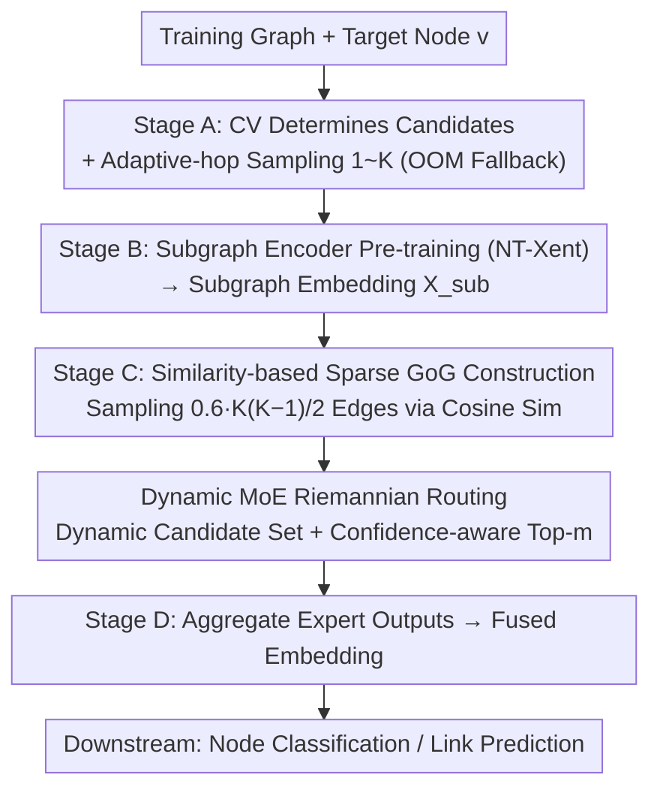

# Learning Graph Foundation Models on Riemannian Graph-of-Graphs

**Conference**: ICML 2026  
**arXiv**: [2605.09993](https://arxiv.org/abs/2605.09993)  
**Code**: <https://github.com/USTC-DataDarknessLab/R-GFM>  
**Area**: Graph Foundation Models / Self-supervised Representation / Riemannian Geometry  
**Keywords**: Graph Foundation Model, Graph-of-Graphs, Riemannian MoE, adaptive-hop, Domain Generalization

## TL;DR
R-GFM treats subgraphs of "different hop counts" as nodes in a higher-level Graph-of-Graphs (GoG), utilizing a dynamic MoE router to assign each GoG to the most curvature-matching Riemannian manifold (Hyperbolic / Euclidean / Spherical). This addresses two inherent flaws in existing graph foundation models: fixed receptive fields and single Euclidean embeddings, achieving up to a 49% relative improvement in downstream tasks.

## Background & Motivation
**Background**: Graph Foundation Models (GFM, such as OFA, Prodigy, MDGFM) enable cross-task and cross-domain migration through pre-training on massive datasets, representing the "foundation model era" of graph ML.

**Limitations of Prior Work**: (1) Existing GFMs use **fixed-hop subgraph sampling** (e.g., 1-hop or 2-hop) as the receptive field. However, downstream requirements vary significantly—homophilic citation networks need only 1-2 hops, while e-commerce fraud detection requires $\geq 4$ hops to uncover long-chain collusion. Fixed-hop sampling inevitably leads to underfitting or noise saturation. (2) Existing methods embed all subgraphs into a single Euclidean space, despite the vast structural differences across hops (locally dense vs. globally sparse/hierarchical), leading to representation distortion.

**Key Challenge**: The conflict between fixed structural receptive fields and the heterogeneous hop requirements of downstream tasks; the conflict between a single geometry and multi-scale structural heterogeneity.

**Goal**: (1) Design a pre-training paradigm capable of adaptively capturing multi-hop structures; (2) Enable the model to dynamically switch between Riemannian manifolds in the representation space.

**Key Insight**: Elevate "subgraphs of different hops" to nodes in a Graph-of-Graphs (GoG) to allow explicit reasoning over scales, then use an MoE to route each GoG to an expert with the matching geometric curvature.

**Core Idea**: **"Structural scale as a first-class citizen"**—adaptive-hop GoGs address scale mismatch, while confidence-aware dynamic Riemannian MoE addresses geometric mismatch.

## Method

### Overall Architecture
R-GFM consists of four stages: (A) Calculate the CV coefficient of node degree distributions to determine the Riemannian expert candidate set and sample a set of $1, 2, \ldots, K$ hop subgraphs $\{G_v^{(i)}\}_{i=1}^K$ for each training node $v$; (B) Pre-train a subgraph encoder via contrastive learning to encode each subgraph into embedding $\mathbf{X}_{\text{sub}}$; (C) Construct a sparse GoG $\mathcal{G}$ based on subgraph similarity and encode it using dynamic MoE-based Riemannian routing; (D) Aggregate expert outputs into a fused embedding for downstream node classification or link prediction.

### Key Designs

**1. Adaptive-hop GoG Construction: Adaptive Hops + Similarity Sparsification**

Fixed receptive fields are a primary limitation of GFMs. R-GFM employs an "online greedy + memory test" strategy to gradually increase the hop count $K$ for each training node $v$, falling back to the last viable $K$ upon OOM (ensuring $K \leq \mathcal{B}_{\text{GPU}}$). This allows flexible receptive fields without exceeding memory limits. Subgraph embeddings are pre-trained using the NT-Xent loss.

GoG edges are constructed using a sampling distribution based on subgraph cosine similarity: $\text{Prob}(i,j) = e^{\mathbf{S}[i,j]} / \sum_{u,v} e^{\mathbf{S}[u,v]}$. The model samples $\mathcal{B}_{\text{edge}} = 0.6 \cdot K(K-1)/2$ edges without replacement. This balances noise reduction and structural priors. Theoretically, multi-hop sampling noise $\|\boldsymbol\sigma_V\|_2 \leq \|\boldsymbol\sigma_F\|_2$ is strictly lower than fixed-hop sampling (Thm 3.2), and similarity-sparse GoGs yield smaller errors than empty or fully connected GoGs (Thm 3.3).

**2. Dynamic MoE-based Riemannian Routing: Dual Dynamics of Candidate Set and Top-m**

To address the limitations of single Euclidean geometry, R-GFM routes each GoG to the manifold with the best-matching curvature. The candidate expert set size $\lceil \mathcal{S}_i \cdot \zeta \rceil$ is determined by the coefficient of variation $\text{CV}(\mathcal{D}_i) = \text{std}(\deg)/\text{mean}(\deg)$ of the node degree distribution, with curvatures expanding across $0, -1, +1, -2, +2, \ldots$ (covering Hyperbolic, Euclidean, and Spherical). 

The number of activated experts $m$ is also dynamic. Routing scores $\boldsymbol\alpha_{\mathcal{G}} = \text{softmax}(g(\mathcal{G})/\tau)$ are generated by a GCN encoder. As the confidence $\text{conf} = (1/\psi) \sum_i \max \alpha^{(i)}$ increases during training, the number of activated experts shrinks: $m \leftarrow \max(1, m - \text{conf})$. This serves as implicit regularization, resulting in a tighter excess risk bound $\mathcal{R}(\psi_D) \leq \mathcal{R}(\psi_F)$ and better generalization (Thm 3.5).

**3. Theoretical Support for Domain Generalization**

The core challenge for GFMs is performance on unseen graphs. By substituting the encoder classes $\Phi_R$ and $\Phi_M$ (for R-GFM and MDGFM, respectively) into the domain generalization error bound, Thm 3.5 demonstrates that $\epsilon_{\text{R-GFM}} < \epsilon_{\text{MDGFM}}$. R-GFM improves expressive power through GoG and Riemannian MoE while controlling capacity via sparsification and dynamic top-$m$, leading to lower cross-domain error.

### Loss & Training
The pre-training phase uses the NT-Xent contrastive loss for the subgraph encoder. The GoG encoding phase employs downstream task losses (CE for node classification, BCE for link prediction) combined with a standard MoE load balancing loss. Evaluation is conducted via leave-one-dataset-out migration: pre-training on other graphs and fine-tuning on the target graph (1-shot for node classification, 5-shot for link prediction).

## Key Experimental Results

### Main Results

| Method | Wisconsin | Cornell | Citeseer | Cora | Pubmed | Computers | Photos | Texas |
|---|---|---|---|---|---|---|---|---|
| GCN | 17.46 | 19.53 | 26.89 | 31.98 | 44.29 | 39.43 | 50.39 | 18.48 |
| GAT | 16.86 | 16.51 | 25.27 | 26.81 | 45.11 | 38.05 | 56.51 | 18.36 |
| GFM (MDGFM, etc.) | (Lower) | — | — | — | — | — | — | — |
| **Ours (R-GFM)** | **Best** | **Best** | **Best** | **Best** | **Best** | **Best** | **Best** | **Best** |

R-GFM achieves consistent SOTA across 18 real-world graphs, with relative improvements reaching up to 49% on some datasets.

### Ablation Study

| Configuration | Impact |
|---|---|
| Fixed 1-hop subgraphs only | Performance drops, validating the necessity of adaptive-hop. |
| Fully connected / no-edge GoG | Both underperform compared to similarity-sparse GoG (consistent with Thm 3.3). |
| Fixed top-$m$ routing | Underperforms compared to confidence-aware dynamic top-$m$. |
| Single Euclidean expert | Significant performance drop on highly heterogeneous datasets. |
| Edge budget variation | Performance degrades if significantly sparser or denser than $0.6 \cdot K(K-1)/2$. |

### Key Findings
- The maximum improvement of 49% occurs on datasets with high structural heterogeneity, confirming that dynamic geometric selection primarily benefits heterogeneous graphs.
- R-GFM exhibits the smallest performance drop under 30% random edge perturbation compared to baselines, attributed to the redundant information in multi-hop GoGs.
- Robust cross-scale generalization: Stable performance on Cora / Ele-Computers / Books-History / Instagram after pre-training on ArXiv_2023 + ogbn-Arxiv + Reddit + PubMed.

## Highlights & Insights
- While "Graph of Graphs" is not a new concept, integrating it with adaptive-hop and Riemannian MoE within a GFM framework is novel, solving two long-standing issues in GFM.
- The mechanism of "increasing router confidence → automatic shrinkage of top-$m$" is an elegant utilization of training dynamics, allowing the MoE capacity to self-regularize.
- Using the CV coefficient of node degrees to pre-determine the number of experts eliminates the need for trial-and-error, a principle applicable to other MoE scenarios.

## Limitations & Future Work
- GoG construction involves traversing multi-hop subgraphs, leading to higher time and memory complexity than fixed-hop GFMs; adaptation for million-node graphs requires further optimization.
- Currently, only three classes of constant-curvature Riemannian manifolds are considered; mixed-curvature or learnable curvature spaces remain unexplored.
- The similarity threshold and edge budget are empirical; a task-adaptive mechanism is needed.
- Transfer performance on datasets with strong domain priors (e.g., molecular graphs, knowledge graphs) requires further validation.

## Related Work & Insights
- **vs. MDGFM**: MDGFM uses a single receptive field and single geometric space; R-GFM introduces dynamics in both dimensions.
- **vs. Graph MoE (e.g., GMoE)**: Existing Graph MoEs use fixed top-$m$ and lack geometric priors; R-GFM utilizes curvature as an inductive bias.
- **vs. Hyperbolic GNNs (HGNN / HGCN)**: These methods are limited to a single negative curvature space; R-GFM adaptively mixes multiple curvatures via MoE.

## Rating
- Novelty: ⭐⭐⭐⭐
- Experimental Thoroughness: ⭐⭐⭐⭐
- Writing Quality: ⭐⭐⭐⭐
- Value: ⭐⭐⭐⭐

<!-- RELATED:START -->

## Related Papers

- [\[ICML 2026\] FLAG: Foundation Model Representation with Latent Diffusion Alignment via Graph for Spatial Gene Expression Prediction](flag_foundation_model_representation_with_latent_diffusion_alignment_via_graph_f.md)
- [\[CVPR 2026\] Global-Graph Guided and Local-Graph Weighted Contrastive Learning for Unified Clustering on Incomplete and Noise Multi-View Data](../../CVPR2026/self_supervised/global-graph_guided_and_local-graph_weighted_contrastive_learning_for_unified_cl.md)
- [\[ICML 2025\] Griffin: Towards a Graph-Centric Relational Database Foundation Model](../../ICML2025/self_supervised/griffin_towards_a_graph-centric_relational_database_foundation_model.md)
- [\[AAAI 2026\] Explanation-Preserving Augmentation for Semi-Supervised Graph Representation Learning](../../AAAI2026/self_supervised/explanation-preserving_augmentation_for_semi-supervised_graph_representation_lea.md)
- [\[ICML 2026\] NumLeak: Public Numeric Benchmarks as Latent Labels in Foundation Models](numleak_public_numeric_benchmarks_as_latent_labels_in_foundation_models.md)

<!-- RELATED:END -->
