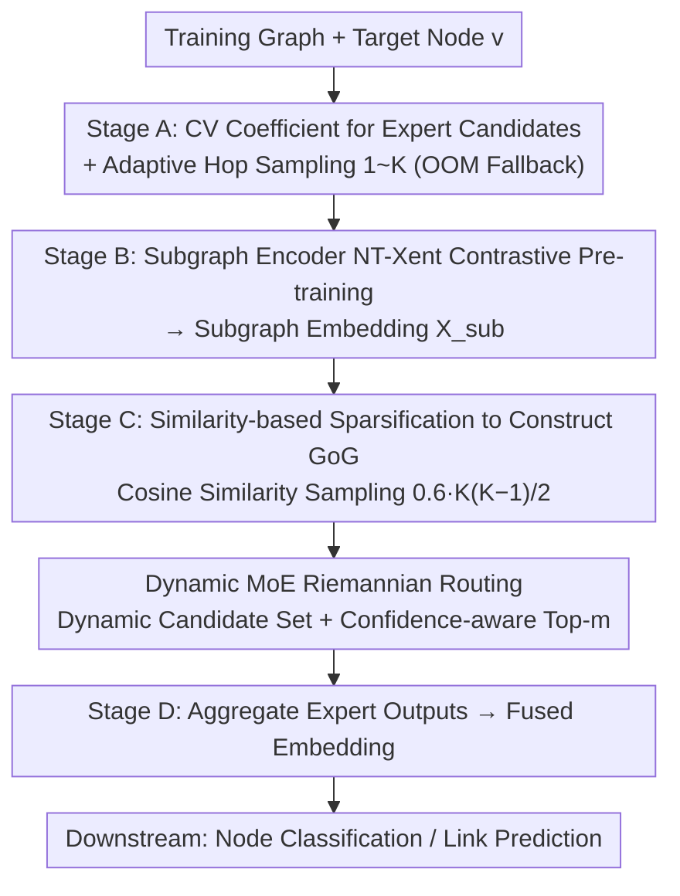

# Learning Graph Foundation Models on Riemannian Graph-of-Graphs

**Conference**: ICML 2026  
**arXiv**: [2605.09993](https://arxiv.org/abs/2605.09993)  
**Code**: <https://github.com/USTC-DataDarknessLab/R-GFM>  
**Area**: Graph Foundation Models / Self-Supervised Representation / Riemannian Geometry  
**Keywords**: Graph Foundation Model, Graph-of-Graphs, Riemannian MoE, adaptive-hop, Domain Generalization

## TL;DR
R-GFM treats subgraphs of "different hop counts" as nodes in a higher-level Graph-of-Graphs (GoG), using a dynamic MoE router to assign each GoG to the Riemannian manifold (Hyperbolic / Euclidean / Spherical) that best matches its curvature. It simultaneously addresses two inherent flaws in existing graph foundation models—fixed receptive fields and single Euclidean embeddings—achieving up to a 49% relative improvement in downstream tasks.

## Background & Motivation
**Background**: Graph Foundation Models (GFM, e.g., OFA, Prodigy, MDGFM) represent the "foundation model era" of graph ML by achieving cross-task and cross-domain migration through pre-training on massive datasets.

**Limitations of Prior Work**: (1) Existing GFMs use **fixed-hop subgraph sampling**, such as 1-hop or 2-hop neighbors for the receptive field. However, downstream hop requirements vary significantly—homophilic citation networks need only 1-2 hops, whereas e-commerce fraud detection requires $\geq 4$ hops to uncover long-chain collusion. Fixed-hop strategies inevitably suffer from underfitting or noise in certain tasks. (2) Existing methods embed all subgraphs into a single Euclidean space, but subgraph structures vary across different hops (local density vs. global hierarchical sparsity), and a single geometry distorts representations.

**Key Challenge**: The conflict between fixed receptive fields and heterogeneous downstream hop requirements; the conflict between single geometry and multi-scale structural heterogeneity.

**Goal**: (1) Design a pre-training paradigm capable of adaptively capturing multi-hop structures; (2) Allow the model to dynamically switch between Riemannian manifolds in the representation space.

**Key Insight**: Elevate "subgraphs of different hops" to nodes in a Graph-of-Graphs (GoG), enabling explicit reasoning over scales, then use MoE to route each GoG to the expert with the most appropriate geometric curvature.

**Core Idea**: **"Structural scale as a first-class citizen"**—adaptive-hop GoG addresses scale mismatch, while confidence-aware dynamic Riemannian MoE addresses geometric mismatch.

## Method

### Overall Architecture
R-GFM is composed of four stages: (A) Calculating the coefficient of variation (CV) of the node degree distribution to determine the Riemannian expert candidate set, while sampling a set of $1, 2, \ldots, K$ hop subgraphs $\{G_v^{(i)}\}_{i=1}^K$ for each training node $v$; (B) Pre-training a subgraph encoder via contrastive learning to encode each subgraph into an embedding $\mathbf{X}_{\text{sub}}$; (C) Constructing a sparse GoG $\mathcal{G}$ based on subgraph similarity and encoding it using dynamic MoE-based Riemannian routing; (D) Aggregating outputs from experts to obtain a fused embedding for downstream node classification or link prediction tasks.

### Key Designs

**1. Adaptive-hop GoG Construction: Adaptive Hops + Similarity Sparsification**

Fixed receptive fields are the first major flaw in GFMs—while 1-2 hops suffice for citation networks, e-commerce fraud requires $\geq 4$ hops. R-GFM uses "online greedy + memory testing" to gradually increase the hop count $K$ for each training node $v$, falling back to the previous feasible $K$ if an Out-of-Memory (OOM) error occurs (ensuring $K \leq \mathcal{B}_{\text{GPU}}$). This adaptively expands the receptive field without exceeding memory limits. Subgraph embeddings are pre-trained using NT-Xent.

GoG edges are also carefully constructed: the sampling distribution $\text{Prob}(i,j) = e^{\mathbf{S}[i,j]} / \sum_{u,v} e^{\mathbf{S}[u,v]}$ is derived from subgraph cosine similarity. $\mathcal{B}_{\text{edge}} = 0.6 \cdot K(K-1)/2$ edges are sampled without replacement and then symmetrized. This balances three choices: dense GoGs introduce noise, purely random sparse GoGs lack structural priors, and similarity-based sparsification retains "structurally relevant" edges. Theoretically, the embedding noise of multi-hop sampling $\|\boldsymbol\sigma_V\|_2 \leq \|\boldsymbol\sigma_F\|_2$ is strictly lower than fixed-hop sampling (Thm 3.2), and similarity-sparse GoGs exhibit lower error than edgeless or fully connected GoGs (Thm 3.3).

**2. Dynamic MoE-based Riemannian Routing: Dual Dynamics of Candidate Set and Top-m**

The second flaw is the single Euclidean geometry—different hop subgraph structures (local density vs. hierarchical sparsity) are distorted when forced into a flat space. R-GFM routes each GoG to the manifold with the best-matching curvature, where both the number of experts and activation count are adaptive. Structural heterogeneity is quantified by the CV of node degrees $\text{CV}(\mathcal{D}_i) = \text{std}(\deg)/\text{mean}(\deg)$. Sliding statistics $\mathcal{S}_i = \text{normalize}(\mu_i + \sigma_i)$ are accumulated to determine the candidate expert set size $\lceil \mathcal{S}_i \cdot \zeta \rceil$, with curvatures alternating across $0, -1, +1, -2, +2, \ldots$ (covering Hyperbolic, Euclidean, and Spherical). Consequently, more heterogeneous datasets automatically receive more geometric experts, eliminating manual trial-and-error.

The number of activated experts is determined by the training confidence of the router. Routing scores $\boldsymbol\alpha_{\mathcal{G}} = \text{softmax}(g(\mathcal{G})/\tau)$ are provided by a GCN encoder. As the confidence $\text{conf} = (1/\psi) \sum_i \max \alpha^{(i)}$ increases during training, the activation count $m$ is dynamically reduced: $m \leftarrow \max(1, m - \text{conf})$. This late-stage capacity shrinkage serves as implicit regularization, theoretically yielding an excess risk bound $\mathcal{R}(\psi_D) \leq \mathcal{R}(\psi_F)$, leading to better generalization.

**3. Theoretical Support for Domain Generalization: Strictly Superior Error Bounds**

The core challenge for GFM is performance on unseen graphs. Formal guarantees are provided by substituting the encoder classes $\Phi_R$ (R-GFM) and $\Phi_M$ (MDGFM) into domain generalization error bounds. R-GFM broadens encoder expressivity through multi-hop GoG and Riemannian MoE while controlling capacity via similarity sparsification and dynamic top-$m$. Theorem 3.5 demonstrates $\epsilon_{\text{R-GFM}} < \epsilon_{\text{MDGFM}}$, indicating that R-GFM is more expressive yet less prone to overfitting, resulting in lower cross-domain error.

### Loss & Training
The subgraph encoder uses NT-Xent contrastive loss during pre-training. The GoG encoding stage utilizes downstream task losses (CE for node classification, BCE for link prediction) combined with a standard MoE load-balancing loss. Leave-one-dataset-out migration is used: pre-training on other graphs and fine-tuning on the target graph (1-shot node classification / 5-shot link prediction).

## Key Experimental Results

### Main Results

| Method | Wisconsin | Cornell | Citeseer | Cora | Pubmed | Computers | Photos | Texas |
|---|---|---|---|---|---|---|---|---|
| GCN | 17.46 | 19.53 | 26.89 | 31.98 | 44.29 | 39.43 | 50.39 | 18.48 |
| GAT | 16.86 | 16.51 | 25.27 | 26.81 | 45.11 | 38.05 | 56.51 | 18.36 |
| GFM (MDGFM, etc.) | (Lower) | — | — | — | — | — | — | — |
| **R-GFM** | **Best** | **Best** | **Best** | **Best** | **Best** | **Best** | **Best** | **Best** |

Consistent SOTA performance across 18 real-world graphs; relative improvements reach up to 49% on certain datasets.

### Ablation Study

| Configuration | Impact |
|---|---|
| Fixed 1-hop subgraph only | Performance drop, proving adaptive-hop necessity |
| Fully connected / Edgeless GoG | Inferior to similarity-sparse GoG, consistent with Thm 3.3 |
| Fixed top-$m$ routing | Inferior to confidence-aware dynamic top-$m$ |
| Single Euclidean expert | Significant drop on highly heterogeneous datasets |
| Edge budget $\mathcal{B}_{\text{edge}} = 0.6 \cdot K(K-1)/2$ | Performance degrades if sparser or denser |

### Key Findings
- The maximum gain of 49% occurs on datasets with the highest structural heterogeneity, matching expectations that dynamic geometry selection benefits heterogeneous graphs most.
- In robustness tests against graph perturbations, R-GFM shows the smallest decline under 30% random edge perturbation compared to baselines, thanks to the redundant information in multi-hop GoGs.
- Cross-scale generalization: Stable performance on Cora / Ele-Computers / Books-History / Instagram after pre-training on ArXiv_2023 + ogbn-Arxiv + Reddit + PubMed.

## Highlights & Insights
- While "Graph-of-Graphs" is not a new concept, integrating it with adaptive-hop and Riemannian MoE as a GFM core is a first; it solves two long-standing GFM issues regarding hops and geometry.
- "Router confidence increase $\rightarrow$ automatic contraction of top-$m$" is an elegant utilization of training dynamics: allowing MoE capacity to shrink in later training stages to improve generalization could be applied to LLM MoE training.
- Using node degree CV to pre-determine expert count avoids trial-and-error; this "data-driven capacity anticipation" can be generalized to other MoE scenarios.

## Limitations & Future Work
- GoG construction requires traversing multi-hop subgraphs, leading to higher time and memory complexity than fixed-hop GFMs; adaptation for ultra-large graphs (millions of nodes) requires further acceleration.
- Only three types of constant-curvature Riemannian manifolds are considered; mixed-curvature or learnable curvature remains unexplored.
- The similarity threshold and edge budget (0.6) are empirical values and lack a task-adaptive mechanism.
- Transfer effectiveness on data with more domain-specific priors, such as molecular graphs or knowledge graphs, has not been fully verified.

## Related Work & Insights
- **vs MDGFM**: MDGFM also uses GFMs and theoretical analysis but relies on a single receptive field and a single geometric space; R-GFM introduces dynamics in both dimensions.
- **vs Graph MoE (e.g., GMoE)**: Existing Graph MoEs use fixed top-$m$ and experts without geometric priors; R-GFM introduces curvature as an inductive bias.
- **vs Hyperbolic GNN (HGNN / HGCN)**: Hyperbolic methods use a single negative curvature space; R-GFM adaptively mixes curvatures via MoE to cover more structures.

## Rating
- Novelty: ⭐⭐⭐⭐ The combination of adaptive-hop GoG and Riemannian MoE is fresh, though individual components have precedents.
- Experimental Thoroughness: ⭐⭐⭐⭐ 18 datasets, cross-domain generalization, perturbation robustness, and theoretical guarantees provide comprehensive coverage.
- Writing Quality: ⭐⭐⭐⭐ Clear structure, tight alignment between theory and method, and intuitive diagrams.
- Value: ⭐⭐⭐⭐ Provides actionable solutions for two major pain points in GFMs; open-source code lowers the reproduction threshold.

<!-- RELATED:START -->

## Related Papers

- [\[ICML 2026\] FLAG: Foundation Model Representation with Latent Diffusion Alignment via Graph for Spatial Gene Expression Prediction](flag_foundation_model_representation_with_latent_diffusion_alignment_via_graph_f.md)
- [\[ICML 2025\] Griffin: Towards a Graph-Centric Relational Database Foundation Model](../../ICML2025/self_supervised/griffin_towards_a_graph-centric_relational_database_foundation_model.md)
- [\[AAAI 2026\] Explanation-Preserving Augmentation for Semi-Supervised Graph Representation Learning](../../AAAI2026/self_supervised/explanation-preserving_augmentation_for_semi-supervised_graph_representation_lea.md)
- [\[ICML 2026\] Riemannian Metric Matching for Scalable Geometric Modeling of Distributions](riemannian_metric_matching_for_scalable_geometric_modeling_of_distributions.md)
- [\[ICML 2026\] NumLeak: Public Numeric Benchmarks as Latent Labels in Foundation Models](numleak_public_numeric_benchmarks_as_latent_labels_in_foundation_models.md)

<!-- RELATED:END -->
