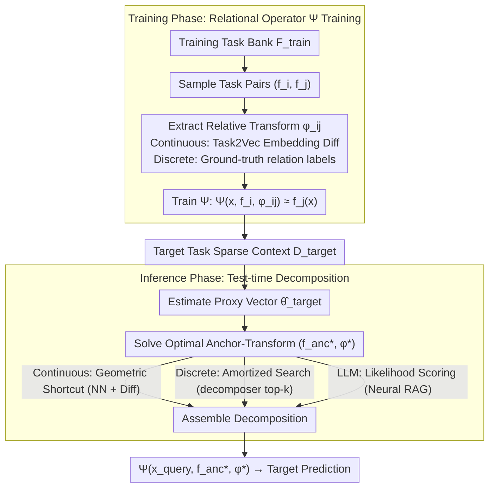

# Learning to Extrapolate to New Tasks: A Relational Approach to Task Extrapolation

**Conference**: ICML 2026  
**arXiv**: [2605.30132](https://arxiv.org/abs/2605.30132)  
**Code**: GitHub repository mentioned in the paper (specific link not provided in the text)  
**Area**: Meta-Learning / Task Extrapolation / Self-Supervised Representation  
**Keywords**: Task Extrapolation, Transductive Learning, Anchor-Transform Decomposition, Task2Vec, Relational Operator

## TL;DR
This paper proposes the Relational Task Extrapolator (RTE), which reinterprets "new tasks outside the training support" as a compositional problem of "known anchor tasks + seen inter-task transformations." It trains a relational operator $\Psi$ to assemble these anchor-transform pairs at test time to predict the outputs of unseen tasks.

## Background & Motivation

**Background**: Modern learning systems excel at "interpolation" (where test tasks fall within the training distribution support), primarily driven by data and model scale. The success of foundation models largely stems from making the training distribution sufficiently massive.

**Limitations of Prior Work**: Once the "task parameters" of the target task jump out of the training support—for example, predicting projectile trajectories for initial velocity $v=65$ when training only saw $v\in[30,60]$—inductive models saturate at the boundaries. Their outputs become rigid when extrapolating beyond training support. Similar failures exist in large language models (LLMs), which learn "heuristics" that collapse when physical constants change (Vafa et al. 2025).

**Key Challenge**: Inductive learning requires "test samples to come from the training distribution," but many real-world problems require extrapolation. Purely inductive learning cannot identify true mechanisms outside the support (as infinite hypotheses can fit training data but diverge arbitrarily in extrapolation zones). Thus, the problem is mathematically ill-posed and requires additional structural assumptions.

**Goal**: To find a structural assumption that makes extrapolation solvable instead of ill-posed, while ensuring the assumption is general enough to cover three typical types: parametric (continuous), length (recursive), and compositional extrapolation.

**Key Insight**: The authors draw on Vapnik’s idea of transduction—instead of learning a global function $f$, learn an operator that "offsets from a known point $f(x')$ to $f(x)$." This paper lifts this from the input space to the task space: instead of learning a global solution for a single task, it learns "task-to-task transformations."

**Core Idea**: Any unseen task $f_{\theta^*}$ can be decomposed as $f_{\theta^*} = s_\phi(f_{\theta_{anc}})$, where $f_{\theta_{anc}}$ is an anchor seen during training and $\phi$ is a relative transformation seen during training. This reduces the Out-of-Support (OOS) challenge to an easier Out-of-Combination (OOC) problem.

## Method

### Overall Architecture

RTE splits task extrapolation into two stages. **Training Phase**: Task pairs $(f_i, f_j)$ are repeatedly sampled from a training task bank $\mathcal{F}_{train}$, their relative transformation $\phi_{ij}$ is extracted, and a relational operator $\Psi$ is trained such that $\Psi(x, f_i, \phi_{ij}) \approx f_j(x)$. **Inference Phase**: Given a sparse context $D_{target}$ of the target task, the model first estimates its proxy vector $\hat\theta_{target}$ in the task embedding space, then finds the optimal anchor $f_{anc}^*$ and transformation $\phi^*$, and finally uses $\Psi(x_{query}, f_{anc}^*, \phi^*)$ for prediction. The underlying structure of "anchor + transform" decomposition persists throughout: $\Psi$ consumes $(f_i, \phi_{ij})$ during training, and the target is decomposed into $(f_{anc}^*, \phi^*)$ during inference.

### Key Designs

**1. Anchor-Transform Decomposition: Breaking OOS tasks into "Seen Anchor + Seen Transform"**

Directly learning $f$ outside boundaries is ill-posed. The structural assumption injected by RTE is that the target task $f_{\theta^*}$ can be expressed as $f_{\theta^*}(x) = \Psi(x, f_{anc}, \phi)$, where the anchor $f_{anc} \in \mathcal{F}_{train}$ and transformation $\phi \in \Phi_{train}$ are components encountered during training. Three types of extrapolation are unified: in continuous parametric extrapolation, $\phi = \Delta\theta = \theta_{target} - \theta_{anc}$ is a difference operator; in length recursive extrapolation, $\phi$ is an expansion step (e.g., higher-order coefficients $c_9$ added when moving from degree 8 to 9); in compositional extrapolation, $\phi$ is another primitive. This assumption reduces the OOS difficulty to an OOC problem—targets are assembled from support components, so the model never extrapolates into a vacuum.

**2. Training the Relational Operator $\Psi$: Learning Task Relations as First-Class Objects**

Given the decomposition hypothesis, a parameterized operator $\Psi$ is trained to map (query input, anchor task, transformation) to target predictions: $\min \mathbb{E}_{f_i, f_j}[\mathcal{L}(f_j(x), \Psi(x, f_i, \phi_{ij}))]$. Training data consists of task pairs $(f_i, f_j)$ sampled from the library. In continuous regimes, $\phi_{ij}$ is the Task2Vec embedding difference $\hat\theta_j - \hat\theta_i$. In discrete regimes, ground-truth labels (e.g., $f_j = f_i \circ g$) are used for $\phi_{ij}$. $\Psi$ only needs to learn how a transformation modifies a known task's output, rather than learning both the task manifold and the mechanism simultaneously. By treating task relations as first-class objects, the model learns "mechanisms" rather than "heuristics," distinguishing RTE from MAML/Reptile which assume tasks fall in local neighborhoods.

**3. Test-time Decomposition: Geometric Shortcuts vs. Amortized Search**

Given sparse context $D_{target}$, the model solves $(f_{anc}^*, \phi^*) = \arg\min_{f, \phi} \sum_{(x,y)\in D_{target}} \mathcal{L}(y, \Psi(x, f, \phi))$. RTE takes three paths: in continuous regimes with well-behaved manifolds, it uses Task2Vec to estimate $\hat\theta_{target}$, picks the nearest neighbor as anchor, and subtracts to get the transform. In discrete compositional regimes, where the space is combinatorially large, an amortized decomposer $g_\psi$ provides top-$k$ candidates for search. In LLM scenarios where proxy embeddings are unavailable, the negative log-likelihood of $D_{target}$ acts as a scorer for brute-force search over candidates (termed "Neural RAG"). All paths convert the hard problem of decomposition into executable retrieval or minimization.

### Loss & Training

For function prediction, $\Psi$ is an MLP with MSE loss. For LLM scenarios, $\Psi$ is a LoRA-finetuned Qwen/Mistral model. The (anchor demo, transform description $\phi$, query input) are formatted into prompt $P$, minimizing $\mathcal{L}_{SFT} = -\sum_t \log p_\theta(y_t | P, y_{<t})$. The transformation $\phi$ can be a natural language instruction, a discrete token, or a learned embedding.

## Key Experimental Results

### Main Results

| Dataset / Task | Metric | RTE (Ours) | Main Baseline | Gain |
|--------|------|------|----------|------|
| Quadratic Param Extrap (F2) | MSE | $\mathbf{7.33\times 10^2}$ | T2V Inductive $1.20\times 10^5$ | ~160× lower |
| Tri-Trend Param Extrap (F2) | MSE | $\mathbf{0.048}$ | Inductive 0.46 | ~10× lower |
| Poly-9 Length Extrap | MSE | $\mathbf{0.371}$ | Naive Baseline 0.575 | -35% |
| Comp Extrap (Aggregate) | MSE | $\mathbf{0.287}$ | Naive Baseline 0.389 | -26% |
| Sparse Parity $|S|=6$ (Qwen+LoRA) | Acc | $\mathbf{66.07\%}$ | Standard SFT 52.86% | +13.2pp |
| CodeIO Comp Extrap | Exact Match | $\mathbf{45.3\%}$ | Few-Shot 19.8% / CoT+Maj@16 30.2% | +15.1pp / +25.5pp |

Inductive baselines saturate at boundaries across all regimes—failing to fit curvature, predict frequencies, or logically compose. After reducing extrapolation to OOC via structure, RTE significantly outperforms them.

### Ablation Study

| Configuration | Key Metric | Description |
|------|---------|------|
| RTE (full) | Cubic MSE 1.53 | Full model using Task2Vec NN for anchor selection |
| Inductive Oracle | Cubic MSE 3.24 | Inductive models fail even with ground-truth parameters, highlighting the importance of "relations" |
| Transductive Oracle | Cubic MSE 0.96 | Upper bound of RTE with ground-truth anchor and transform |
| CodeIO Oracle | 76.0% | Upper bound with ground-truth primitive decomposition for LLM |
| Sparse Parity Oracle | 100.0% | Perfect solving given the parent task, showing the gap comes from decomposition error |

### Key Findings

- The "upper bound" of relational extrapolation is high (oracles are near-perfect), but "search" is the bottleneck. In CodeIO, RTE reaches 45.3% vs. an oracle of 76.0% due to occasional decomposer errors.
- Inductive failure is structural. In periodic functions (Sin/Tri-Trend), inductive models suffer from spectral bias, while RTE inherits the waveform structure from the anchor and only learns a linear shift.
- Even with imperfect anchor selection, RTE remains superior (e.g., in Composition, RTE picks the wrong primitive but still lowers MSE from 0.39 to 0.29), suggesting structural constraints act as a strong prior.
- In LLMs, RTE's advantage exceeds CoT + Majority Voting, suggesting "explicit anchor + transformation" is more effective than "reasoning from scratch."

## Highlights & Insights

- Lifting transduction from "input space" to "task space" is a simple but conceptually significant leap. While single-point transduction (Netanyahu et al. 2023) shifts points on the same function, RTE shifts across functions.
- The "geometric shortcut" (Task2Vec + NN + Diff) is an efficient, lightweight trick for continuous parameters based on Fisher Information geometry.
- For LLMs, using "Likelihood as Score" for candidate ranking turns extrapolation into a retrieval-verification task without retraining, applicable to tool-use and code completion.
- The Sparse Parity experiment ($|S|=6$) shows that for logical tasks requiring recursive expansion, structural expansion from a sub-task is far more reliable than direct LLM inference.

## Limitations & Future Work

- **Strong Structural Assumptions**: RTE assumes targets are decomposable into seen anchors and transforms; it is not a "universal black-box" for alien tasks.
- **Dependency on Meta-labels**: Discrete regimes require ground-truth task relations during training, which are often unavailable in real-world data. Appendix self-labeling schemes need more verification.
- **Inference Latency**: Searching candidates (Strategy B) is more expensive than a single forward pass. Multi-step extrapolation might suffer from combinatorial explosion and error accumulation.
- **Task Embeddings**: Task2Vec relies on Fisher information from pre-trained models; embedding stability in few-shot or LLM scenarios remains a challenge.
- **Potential Improvements**: Learning transformations as continuous latent variables, using Bayesian optimization for search, or SSL pretext tasks for self-labeling relations.

## Related Work & Insights

- **Vs MAML / Reptile**: MAML focuses on fast adaptation in local neighborhoods of the training distribution, whereas RTE explicitly models transformation for extrapolation outside the support.
- **Vs Netanyahu et al. (2023)**: RTE extends their input-space transduction to the function/task level, using Task2Vec to index the task manifold.
- **Vs Statistical Extrapolation**: Unlike math-heavy constraints (directional derivatives, causal mechanisms), RTE relies on "relational structure + learned operators."
- **Vs World Models (Vafa et al. 2025)**: RTE explicitly encodes the "mechanism" into the relational operator, serving as a constructive design for more robust world models.

## Rating
- Novelty: ⭐⭐⭐⭐⭐ High conceptual leap in unifying extrapolation regimes under task transduction.
- Experimental Thoroughness: ⭐⭐⭐⭐ Broad coverage across functions, logic, and code; lacks real-world scientific data (e.g., physics datasets).
- Writing Quality: ⭐⭐⭐⭐ Clean framework and clear algorithms, though some assumptions are abstract.
- Value: ⭐⭐⭐⭐ Provides a practical path for OOD research; prompt-as-decomposition is a valuable insight for LLM reasoning.

<!-- RELATED:START -->

## Related Papers

- [\[CVPR 2026\] CHEEM: Continual Learning by Reuse, New, Adapt and Skip -- A Hierarchical Exploration-Exploitation Approach](../../CVPR2026/self_supervised/cheem_continual_learning_by_reuse_new_adapt_and_skip_--_a_hierarchical_explorati.md)
- [\[ICML 2026\] Scaling Continual Learning to 300+ Tasks with Bi-Level Routing Mixture-of-Experts](scaling_continual_learning_to_300_tasks_with_bi-level_routing_mixture-of-experts.md)
- [\[CVPR 2026\] Stabilizing Feature Geometry in Noisy Pretrained Models for Robust Downstream Tasks](../../CVPR2026/self_supervised/stabilizing_feature_geometry_in_noisy_pretrained_models_for_robust_downstream_ta.md)
- [\[ICML 2025\] Griffin: Towards a Graph-Centric Relational Database Foundation Model](../../ICML2025/self_supervised/griffin_towards_a_graph-centric_relational_database_foundation_model.md)
- [\[CVPR 2026\] An Optimal Transport-driven Approach for Cultivating Latent Space in Online Incremental Learning](../../CVPR2026/self_supervised/an_optimal_transport_driven_approach_for_cultivating_latent_space_in_online_incr.md)

<!-- RELATED:END -->
