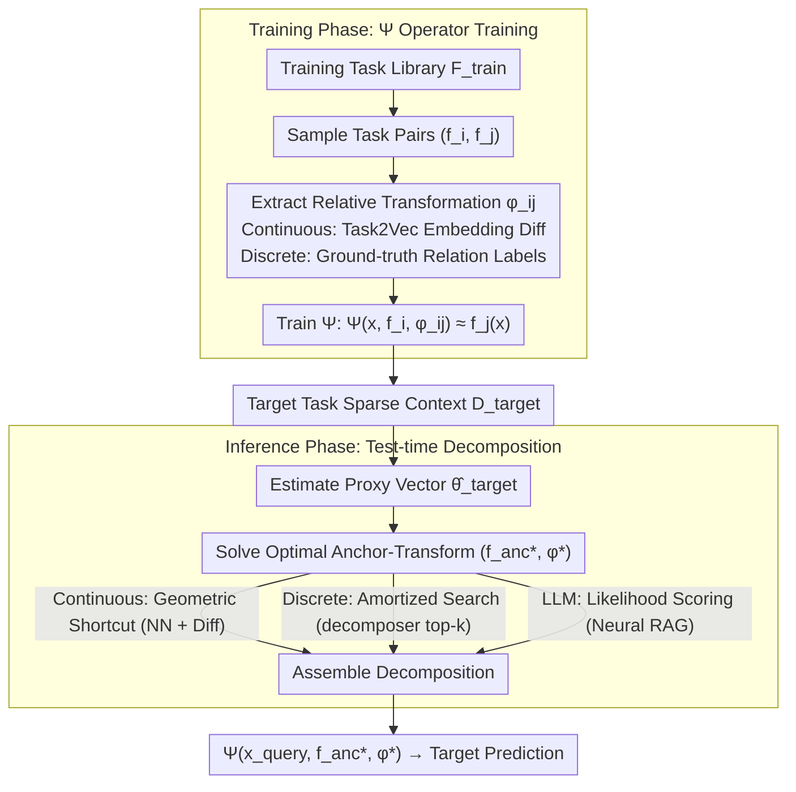

# Learning to Extrapolate to New Tasks: A Relational Approach to Task Extrapolation

**Conference**: ICML 2026  
**arXiv**: [2605.30132](https://arxiv.org/abs/2605.30132)  
**Code**: GitHub repository mentioned in the paper (specific link not provided in the text)  
**Area**: Meta-Learning / Task Extrapolation / Self-Supervised Representation  
**Keywords**: Task Extrapolation, Transductive Learning, Anchor-Transformation Decomposition, Task2Vec, Relation Operator

## TL;DR
This paper proposes the Relational Task Extrapolator (RTE), which reinterprets "new tasks outside the training support" as a combination of "known anchor tasks + seen inter-task transformations." A relation operator $\Psi$ is trained to assemble anchor-transformation pairs at test time to predict the output of unknown tasks.

## Background & Motivation

**Background**: Modern learning systems excel at "interpolation" (where test tasks fall within the support of the training distribution), primarily driven by data and model scale. The success of foundation models is essentially built on making the training distribution sufficiently large.

**Limitations of Prior Work**: Once the "task parameters" of the target task exit the training support—for instance, if the model has only seen projectile trajectories with initial velocities $v\in[30,60]$ during training and needs to predict $v=65$ at test time—inductive models saturate at the boundaries. The output becomes rigid when extrapolating beyond the training support. This failure persists in large models (Vafa et al. 2025 report that LLMs learn "heuristics" that collapse when physical constants change).

**Key Challenge**: Inductive learning requires "test samples to be drawn from the training distribution," yet many real-world problems require extrapolation. Pure inductive learning cannot identify the true mechanism outside the support (infinite hypotheses can fit the training data but diverge arbitrarily in the extrapolation zone). Thus, the problem is mathematically ill-posed and requires additional structural assumptions.

**Goal**: To find a structural assumption that renders extrapolation solvable while remaining general enough to cover three typical categories: parametric extrapolation (continuous), length extrapolation (recursive), and compositional extrapolation (combinatorial).

**Key Insight**: The authors draw inspiration from Vapnik's principle of transduction—avoid learning a global function $f$ and instead learn an operator that "shifts a known point $f(x')$ to $f(x)$." This paper elevates this concept from input space to task space: instead of learning a global solution for a single task, it learns "task-to-task transformations."

**Core Idea**: Any unseen task $f_{\theta^*}$ can be decomposed as $f_{\theta^*} = s_\phi(f_{\theta_{anc}})$, where $f_{\theta_{anc}}$ is an anchor task seen during training and $\phi$ is a relative transformation seen during training. In this way, the difficult Out-of-Support (OOS) problem is downgraded to a more manageable Out-of-Category (OOC) problem of novel combinations.

## Method

### Overall Architecture

RTE decomposes task extrapolation into two stages. **Training Phase**: Task pairs $(f_i, f_j)$ are repeatedly sampled from a training task library $\mathcal{F}_{train}$, and their relative transformation $\phi_{ij}$ is extracted. A relation operator $\Psi$ is trained such that $\Psi(x, f_i, \phi_{ij}) \approx f_j(x)$. **Inference Phase**: Given a sparse context $D_{target}$ of a target task, its proxy vector $\hat\theta_{target}$ in the task embedding space is estimated first. Then, the optimal anchor $f_{anc}^*$ and transformation $\phi^*$ are identified. Finally, $\Psi(x_{query}, f_{anc}^*, \phi^*)$ is used for prediction. The entire pipeline applies to both functional prediction (using MLP as $\Psi$) and sequence prediction (using LLM as $\Psi$, fine-tuned via LoRA). The underlying "anchor + transformation" decomposition remains consistent across both phases: $\Psi$ consumes $(f_i, \phi_{ij})$ during training, and the target is decomposed back into $(f_{anc}^*, \phi^*)$ during inference.

### Key Designs

**1. Anchor-Transformation Decomposition: Decomposing OOS Tasks into "Seen Components"**

Directly learning $f$ outside the boundary is ill-posed as countless hypotheses fit the training data but diverge in extrapolation regions. RTE injects the structural assumption that the target task $f_{\theta^*}$ can be written as $f_{\theta^*}(x) = \Psi(x, f_{anc}, \phi)$, where the anchor $f_{anc} \in \mathcal{F}_{train}$ and transformation $\phi \in \Phi_{train}$ are both components seen during training. Three types of extrapolation are unified under this interface: for continuous parametric extrapolation, $\phi = \Delta\theta = \theta_{target} - \theta_{anc}$ acts as a differential operator; for length recursive extrapolation, $\phi$ is the expansion step from complexity $L-1$ to $L$; for compositional extrapolation, $\phi$ is another primitive.

The value of this step lies in downgrading the problem: by assuming the task manifold is connected by a family of structured transformations, the OOS difficulty becomes an OOC combinatorial problem—the target task is assembled from two in-support components, so the model does not have to extrapolate from nothing.

**2. Training the Relation Operator $\Psi$: Learning Task Relations as First-Order Objects**

With the decomposition assumption, a parameterized operator $\Psi$ is trained to map (query input, anchor task, transformation) to the target prediction, aiming to $\min \mathbb{E}_{f_i, f_j}[\mathcal{L}(f_j(x), \Psi(x, f_i, \phi_{ij}))]$. Training data consists of task pairs $(f_i, f_j)$ and their relative transformations $\phi_{ij}$ sampled from the task library. In the continuous regime, $\phi_{ij}$ is simply the Task2Vec embedding difference $\hat\theta_j - \hat\theta_i$. In the discrete (length/compositional) regime, ground-truth relation labels are assumed to be available during training (e.g., if $f_j = f_i \circ g$, then $g$ is treated as $\phi_{ij}$).

Consequently, $\Psi$ only needs to learn "how a given transformation modifies the output of a known task," rather than learning both the task manifold and transformation mechanism simultaneously (the latter being the root of the ill-posedness). Explicitly modeling task relations as first-order objects allows the model to learn "mechanisms" rather than "heuristics"—this is what distinguishes RTE from MAML or Reptile, which assume new tasks fall within the local neighborhood of the training distribution.

**3. Test-time Decomposition: Geometric Shortcuts vs. Amortized Search**

At test time, only a sparse context $D_{target}$ is provided. The goal is to solve for the optimal $(f_{anc}^*, \phi^*) = \arg\min_{f, \phi} \sum_{(x,y)\in D_{target}} \mathcal{L}(y, \Psi(x, f, \phi))$. RTE follows three paths based on the regime: in the continuous regime where the task manifold is geometrically well-behaved, it uses Task2Vec to estimate $\hat\theta_{target}$, retrieves the nearest neighbor as the anchor, and calculates the difference as the transformation—a single lookup process. In discrete compositional regimes where the manifold suffers from combinatorial explosion, a decomposer $g_\psi$ is trained to provide top-$k$ candidate pairs, followed by a small-scale search. In LLM scenarios where proxy embeddings cannot be directly computed, the negative log-likelihood of the model on $D_{target}$ is used as a scorer for brute-force search over candidates (referred to as "Neural RAG"). The commonality across all three paths is using appropriate proxies to turn the difficult "decomposition retrieval" into executable search or minimization.

### Loss & Training

In functional prediction scenarios, $\Psi$ is an MLP and uses MSE loss. In LLM scenarios, $\Psi$ is a LoRA-fine-tuned Qwen or Mistral model. The (anchor demo, transformation description $\phi$, query input) are formatted into a prompt $P$, and the model minimizes $\mathcal{L}_{SFT} = -\sum_t \log p_\theta(y_t | P, y_{<t})$. The transformation $\phi$ can be a natural language instruction, discrete control tokens, or learned embeddings, depending on the regime.

## Key Experimental Results

### Main Results

| Dataset / Task | Metric | Ours (RTE) | Main Baseline | Gain |
|--------|------|------|----------|------|
| Quadratic Param Extrap (F2) | MSE | $\mathbf{7.33\times 10^2}$ | T2V Inductive $1.20\times 10^5$ | ~160× Reduction |
| Tri-Trend Param Extrap (F2) | MSE | $\mathbf{0.048}$ | Inductive 0.46 | ~10× Reduction |
| Poly-9 Length Extrap | MSE | $\mathbf{0.371}$ | Naive Baseline 0.575 | -35% |
| Comp Extrap (Aggregate) | MSE | $\mathbf{0.287}$ | Naive Baseline 0.389 | -26% |
| Sparse Parity $|S|=6$ (Qwen+LoRA) | Acc | $\mathbf{66.07\%}$ | Std SFT 52.86% | +13.2pp |
| CodeIO Comp Extrap | Exact Match | $\mathbf{45.3\%}$ | Few-Shot 19.8% / CoT+Maj@16 30.2% | +15.1pp / +25.5pp |

As observed, inductive baselines "saturate at the boundary" in all extrapolation regimes—failing to fit curvature beyond boundaries for polynomials or correct frequencies for periodic functions. Even with CoT + Majority Voting, CodeIO only reaches 30%. RTE consistently and significantly leads by structurally downgrading extrapolation to OOC.

### Ablation Study

| Configuration | Key Metric | Description |
|------|---------|------|
| RTE (full) | Cubic MSE 1.53 | Full model with anchors from Task2Vec nearest neighbors. |
| Inductive Oracle | Cubic MSE 3.24 | Inductive model fails to extrapolate even with ground-truth parameters, showing "relation" is key, not "known parameters." |
| Transductive Oracle | Cubic MSE 0.96 | Upper bound for RTE given ground-truth anchor and transformation. |
| CodeIO Oracle | 76.0% | Upper bound for LLM with ground-truth primitive decomposition; ~31pp gap remaining. |
| Sparse Parity Oracle | 100.0% | Perfect solving for LLM with known parent, indicating the remaining gap stems from decomposition inference errors. |

### Key Findings

- The "upper bound" for relational extrapolation is high (oracles are near-perfect across regimes), but "search" is the bottleneck: on CodeIO, RTE achieves 45.3% while the oracle reaches 76.0%, with the gap caused by the decomposer occasionally selecting wrong primitives.
- Inductive learning failure is structural: the authors highlight that on periodic functions (Sin-Trend / Tri-Trend), inductive models suffer from spectral bias and fail to fit the correct frequency, whereas RTE inherits the waveform structure directly from the anchor and only needs to learn a linear shift.
- Even if the anchor selection is not perfectly accurate, RTE still provides significantly better predictions than baselines (e.g., in Composition experiments, RTE improves MSE from 0.39 to 0.29 even when picking wrong primitives), suggesting that structural constraints act as strong priors.
- In LLM scenarios, RTE's advantage far exceeds CoT + Majority Voting, proving that "explicitly providing anchor output + transformation parameters" is more effective than "internal reasoning"—this suggests the RTE prompt template itself serves as a structured reasoning scaffold.

## Highlights & Insights

- Elevating transduction from "input space" to "task space" is a simple yet conceptually significant leap: while single-point transduction (Netanyahu et al. 2023) only performs shifts on the same function, RTE performs shifts across functions. This requires the task manifold to be connectable by structured transformations, but once satisfied, extrapolation immediately becomes solvable.
- The "geometric shortcut" of Task2Vec + nearest-neighbor anchor selection + embedding difference is an efficient and theoretically grounded trick (Fisher Information embeddings are structure-preserving) that can be reused in any differentiable meta-learning scenario.
- Using "Likelihood as Score" for candidate ranking in LLM scenarios turns extrapolation into retrieval + verification without training new modules; this pattern can migrate to other tasks requiring assembly over known toolsets, such as tool-use agents or program synthesis.
- RTE improves $|S|=6$ accuracy on Sparse Parity from 52.86% to 66.07%, demonstrating that for logical tasks requiring recursive expansion, framing reasoning as "known subtask + one structural expansion" is more reliable than one-shot generation—providing a reference for reasoning model design.

## Limitations & Future Work

- **Strong Structural Assumptions**: The target task must be decomposable into an anchor and transformation seen during training; otherwise, the method is inapplicable. The authors explicitly state RTE is not a universal black-box and is ineffective for entirely "alien" tasks.
- **Requirement for Relation Meta-labels**: The discrete regime requires ground-truth task relations during training, which are often unavailable in real-world data; the appendix offers a preliminary self-labeling scheme yet to be fully validated.
- **Test-time Computation**: The search strategy for candidates is more expensive than a single forward pass; multi-step extrapolation (chaining) leads to an explosion in both search space and error accumulation.
- **Sensitivity of Task Embeddings**: Task2Vec depends on the Fisher Information Matrix and requires a high-quality pre-trained model; the stability of embedding estimation is a potential issue in few-shot ($k<10$) settings.
- **Future Directions**: Learning transformations $\phi$ as continuous differentiable latent variables, or introducing Bayesian optimization/evolutionary search for decomposition; considering SSL pretext tasks to provide labels for discrete relations to bypass meta-label needs.

## Related Work & Insights

- **vs. MAML / Reptile**: These learn an initialization for rapid adaptation, assuming new tasks fall within the local neighborhood of the training distribution; RTE explicitly models task transformations for true extrapolation outside the training support.
- **vs. Netanyahu et al. (2023)**: The latter performs transduction in input space. RTE moves this to the function/task level, necessitating a solution for "indexing tasks" (addressed via Task2Vec).
- **vs. Pfister & Bühlmann (2024)**: Others rely on directional derivatives or causal mechanisms for extrapolation; RTE relies solely on relational structure and learned transformation operators. Both share the philosophy of making extrapolation well-posed through structural assumptions.
- **vs. Vafa et al. (2025)**: While they investigate whether models learn mechanisms over heuristics, RTE explicitly encodes mechanisms into the relation operator, serving as a constructive world model design.

## Rating
- Novelty: ⭐⭐⭐⭐⭐ Elevates transduction to task-level and unifies three extrapolation regimes with a clear positioning.
- Experimental Thoroughness: ⭐⭐⭐⭐ Covers synthetic functions, polynomials, parity, and CodeIO with clear oracle bounds; however, lacks testing on real-world scientific data (e.g., physical extrapolation).
- Writing Quality: ⭐⭐⭐⭐ Clean conceptual framework and clear algorithms; some sections on assumptions are somewhat abstract.
- Value: ⭐⭐⭐⭐ Provides an actionable engineering path for OOD/extrapolation research; prompt-as-decomposition is a valuable technique for LLM reasoning.

<!-- RELATED:START -->

## Related Papers

- [\[CVPR 2026\] CHEEM: Continual Learning by Reuse, New, Adapt and Skip -- A Hierarchical Exploration-Exploitation Approach](../../CVPR2026/self_supervised/cheem_continual_learning_by_reuse_new_adapt_and_skip_--_a_hierarchical_explorati.md)
- [\[ICML 2026\] Scaling Continual Learning to 300+ Tasks with Bi-Level Routing Mixture-of-Experts](scaling_continual_learning_to_300_tasks_with_bi-level_routing_mixture-of-experts.md)
- [\[CVPR 2026\] An Optimal Transport-driven Approach for Cultivating Latent Space in Online Incremental Learning](../../CVPR2026/self_supervised/an_optimal_transport_driven_approach_for_cultivating_latent_space_in_online_incr.md)
- [\[CVPR 2026\] Stabilizing Feature Geometry in Noisy Pretrained Models for Robust Downstream Tasks](../../CVPR2026/self_supervised/stabilizing_feature_geometry_in_noisy_pretrained_models_for_robust_downstream_ta.md)
- [\[NeurIPS 2025\] A Joint Learning Approach to Hardware Caching and Prefetching](../../NeurIPS2025/self_supervised/a_joint_learning_approach_to_hardware_caching_and_prefetching.md)

<!-- RELATED:END -->
