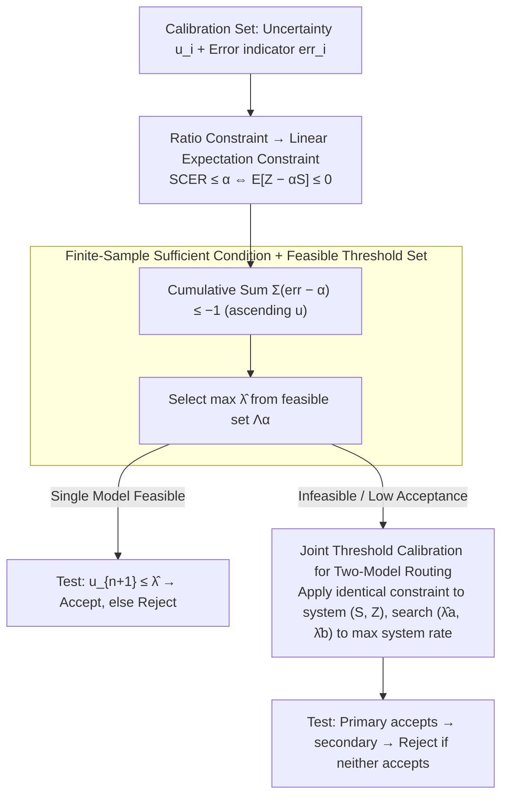

# LEC: Linear Expectation Constraints for Selection-Conditioned Risk Control in Selective Prediction and Routing Systems

**Conference**: ICML 2026  
**arXiv**: [2512.01556](https://arxiv.org/abs/2512.01556)  
**Code**: The caption of Figure 1 notes "Code is available here" (open-source link not provided in the main text).  
**Area**: AI Safety / Selective Prediction / Uncertainty Quantification  
**Keywords**: Selective Prediction, Risk Control, Conformal Prediction, Model Routing, Uncertainty Quantification

## TL;DR
Addressing the issue where Upper Confidence Bound (UCB) risk limits are overly conservative and yield few usable thresholds in LLM selective prediction, the authors rewrite "post-acceptance error rate $\le \alpha$" as a **linear expectation constraint** involving 0-1 indicator functions for selection and error. This derives a finite-sample sufficient condition (Eq. 5) based only on the calibration set, which maintains strict finite-sample guarantees while being significantly tighter than UCB. The framework naturally extends to two-model routing systems for joint threshold calibration, showing universal power gains on CommonsenseQA / TriviaQA / ScienceQA / MM-Vet v2, and accepting 9.5% more samples than Clopper-Pearson UCB on TriviaQA.

## Background & Motivation

**Background**: LLMs/LVLMs are increasingly embedded in decision-making pipelines, yet they produce hallucinations and exhibit high confidence in incorrect answers. Thus, statistical guarantees for "accept / reject / escalate" behaviors are required. Split conformal prediction (SCP) can transform heuristic uncertainty scores into prediction sets with coverage guarantees, but **set-based outputs** are not directly actionable for downstream decisions—they often contain unreliable candidates, leading to biased decision-making.

**Limitations of Prior Work**: Researchers have shifted to the "point prediction + selective acceptance" paradigm: accept only when the uncertainty $u \le \lambda$. The challenge lies in calibrating $\lambda$ to ensure the "error rate of accepted samples $\le \alpha$." Current mainstream methods use UCB based on confidence intervals—COIN uses Hoeffding-style UCB-HFD, and Trust of Escalate uses Clopper-Pearson exact UCB (UCB-CLP). These methods are **statistically valid but extremely conservative**: they perform worst-case tail control on empirical risk, resulting in actual acceptance rates far below allowed risk budgets, or even failing to find a feasible threshold at low $\alpha$ (e.g., 0.05).

**Key Challenge**: UCB-style methods control the "upper bound of empirical risk," whereas the goal is to control the "selection-conditioned empirical risk $\mathrm{SCER}(\lambda) = \Pr(\mathrm{err}=1 \mid S(\lambda)=1)$," which is a ratio. Forcing a "ratio constraint" into an "upper bound constraint" inevitably introduces excessive conservative padding.

**Goal**: (1) Identify a threshold calibration formula that preserves finite-sample guarantees while being tighter than UCB; (2) Extend these guarantees from single models to two-model routing (primary → secondary → abstain) systems, achieving **system-level** rather than "split" risk control.

**Key Insight**: The authors observe that the ratio constraint $\mathbb{E}[Z]/\mathbb{E}[S] \le \alpha$ (where $Z = S \cdot \mathrm{err}$ is the joint indicator for "accepted and incorrect" and $S$ is the acceptance indicator) is equivalent to a **linear constraint** $\mathbb{E}[Z - \alpha S] \le 0$ when $\mathbb{E}[S] > 0$. The advantage of this linear constraint is that it only concerns the non-positivity of the expectation of a single random variable $Z-\alpha S$. It does not require separate tail control for $Z$ and $S$, making it naturally tighter than "dividing a risk UCB by an acceptance rate."

**Core Idea**: Relabel selective prediction from "ranking uncertainty" to "finding thresholds for linear expectation constraints." Under the exchangeability assumption, a leave-one-out correction yields a clean "difference sum $\le -1$" finite-sample sufficient condition. This single inequality provides calibration rules for both single-model and routing systems.

## Method

### Overall Architecture
The single-model LEC process follows 4 steps: (1) Model $\mathcal{G}^{(a)}$ computes uncertainty $u_i$ and error indicator $\mathrm{err}_i$ on a calibration set $\mathcal{D}_{\mathrm{cal}}=\{(u_i^{(a)},\mathrm{err}_i^{(a)})\}_{i=1}^n$; (2) Substitute the number of accepted samples $k(\lambda)=\#\{i: u_i \le \lambda\}$ for a candidate threshold $\lambda$ into the finite-sample sufficient condition $\sum_{j=1}^{k(\lambda)}(\mathrm{err}_{(j)} - \alpha) \le -1$ (sorted by ascending $u_i$); (3) Select the **largest** feasible $\lambda$ as $\hat{\lambda}$ to maximize the test-time acceptance rate; (4) During testing, a new sample is accepted only if $u_{n+1} \le \hat{\lambda}$, otherwise it is rejected. Two-model routing extends this to a joint search for $(\lambda^{(a)}, \lambda^{(b)})$ to maximize system-level acceptance.

### Key Designs

**1. From Ratio Constraint to Linear Expectation Constraint: Rewriting Conditional Probability**

The objective is to control the "proportion of errors among accepted samples" $\Pr(\mathrm{err}=1 \mid S(\lambda)=1) \le \alpha$. This is essentially a conditional probability (ratio) constraint. The first step of LEC rewrites it: define $Z(\lambda) = S(\lambda) \cdot \mathrm{err}$ (1 if accepted and incorrect). Then $\mathrm{SCER}(\lambda) = \mathbb{E}[Z(\lambda)] / \mathbb{E}[S(\lambda)]$. For $\mathbb{E}[S(\lambda)] > 0$, $\mathrm{SCER}(\lambda) \le \alpha \Leftrightarrow \mathbb{E}[Z(\lambda) - \alpha S(\lambda)] \le 0$. Intuitively, $Z - \alpha S$ represents the "marginal contribution of a single sample to the error count minus $\alpha$ times the marginal acceptance"; its non-positive expectation is equivalent to an error rate not exceeding $\alpha$.

This step is the source of LEC's tightness over UCB. UCB-CLP / UCB-HFD determine an upper bound for the numerator $\mathbb{E}[Z]$ and divide it by a lower bound for the denominator $\mathbb{E}[S]$, stacking two conservative bounds. LEC evaluates the non-positivity of the expectation for the composite variable $Z - \alpha S$, reducing "double conservatism" to a single check.

**2. Finite-Sample Sufficient Condition: The "Difference Sum $\le -1$" Rule**

The linear constraint $\mathbb{E}[Z - \alpha S] \le 0$ is an expectation and must be translated into an executable criterion on the calibration set. Sort calibration samples by $u_i$ as $u_{(1)} \le \dots \le u_{(n)}$ with corresponding $\mathrm{err}_{(j)}$. Let $k(\lambda) = \#\{i: u_i \le \lambda\}$. Using a standard leave-one-out correction for distribution-free calibration (Appendix A.1), the authors prove that under exchangeability, the sufficient condition is the following inequality:

$$\sum_{j=1}^{k(\lambda)} (\mathrm{err}_{(j)} - \alpha) \le -1$$

The feasible threshold set is $\Lambda_\alpha = \{\lambda: \text{inequality holds}\}$. The calibrated threshold $\hat{\lambda} = \sup \Lambda_\alpha$ maximizes acceptance; if $\Lambda_\alpha = \varnothing$, $\alpha$ is infeasible. Theorem 3.1 guarantees that for a new sample, $\Pr(\mathrm{err}_{n+1}=1 \mid u_{n+1} \le \hat{\lambda}) \le \alpha$. Unlike UCB methods that use worst-case tail bounds, LEC directly uses the cumulative sum of $Z - \alpha S$ on the calibration set with a $-1$ correction, preserving rigor without wasting risk budget.

**3. Joint Calibration for Two-Model Routing: System-level SCER Guarantees**

If a single model is infeasible or has low acceptance at a given $\alpha$, one may upgrade uncertain inputs to a secondary model. The difficulty lies in ensuring the error rate of the entire system, rather than ensuring each model meets the target separately. LEC defines $S^{(b)}(\lambda^{(a)}, \lambda^{(b)}) = \mathbf{1}\{u^{(a)} > \lambda^{(a)} \land u^{(b)} \le \lambda^{(b)}\}$ (1 only when primary rejects and secondary accepts). System acceptance is $S = S^{(a)} + S^{(b)}$ and system error is $Z = S^{(a)} \mathrm{err}^{(a)} + S^{(b)} \mathrm{err}^{(b)}$. The same linear equivalence provides the system constraint $\mathbb{E}[Z - \alpha S] \le 0$, with the finite-sample condition $\sum_{i=1}^n (Z_i - \alpha S_i) \le -1$. Selecting $(\hat{\lambda}^{(a)}, \hat{\lambda}^{(b)})$ to maximize empirical system acceptance while satisfying this condition ensures system-level SCER $\le \alpha$ (Theorem 3.2).

Joint calibration is necessary because if $\lambda^{(a)}$ and $\lambda^{(b)}$ are tuned independently ("naive LEC"), the secondary model sees a sub-population rejected by the primary model, where exchangeability is violated, invalidating system-level guarantees (confirmed in Figure 6).

### Loss & Training
LEC is a **pure calibration / post-processing method** involving no gradient training. It requires: (1) A pre-trained model $\mathcal{G}$; (2) A scalar uncertainty function $\mathcal{U}$ (e.g., predictive entropy PE, black-box semantic entropy SE); (3) A labeled calibration set; (4) An admission function $A$ (e.g., sentence similarity). The computational cost is primarily a scan over $\lambda$ candidates ($\mathcal{O}(n)$ per candidate).

## Key Experimental Results

### Main Results

Comparison of Power (proportion of correct samples accepted) across 8 LLMs on TriviaQA. LEC equals or outperforms UCB-CLP at all $\alpha$ levels, with the most significant advantages in "low risk budget" scenarios ($\alpha=0.05 / 0.1$):

| α | OpenChat-3.5 UCB-CLP | OpenChat-3.5 LEC | Qwen2.5-14B UCB-CLP | Qwen2.5-14B LEC | LLaMA-3.1-8B UCB-CLP | LLaMA-3.1-8B LEC | LLaMA-3.1-70B UCB-CLP | LLaMA-3.1-70B LEC |
|------|-----|-----|-----|-----|-----|-----|-----|-----|
| 0.05 | 0.6684 | **0.7230** | 0.6240 | **0.7193** | 0.7143 | **0.7538** | 0.9935 | **0.9996** |
| 0.10 | 0.9294 | **0.9521** | 0.9987 | **1.0000** | 0.9396 | **0.9612** | 1.0 | 1.0 |
| 0.15 | 1.0 | 1.0 | 1.0 | 1.0 | 1.0 | 1.0 | 1.0 | 1.0 |

UCB-HFD frequently returns "no feasible threshold" at $\alpha=0.05$ for several models, highlighting the fragility of UCB in low $\alpha$ regions.

### Ablation Study

Correct samples accepted in a two-model routing setup (Qwen2.5-3B as primary, LLaMA-3.1-8B as secondary) on CommonsenseQA:

| α | Qwen2.5-3B Single | LLaMA-3.1-8B Single | LEC-Routing (Joint) |
|------|--------|---------|----------|
| 0.05 | 965  | 1579 | **1610** |
| 0.10 | 2569 | 2357 | **2663** |

At $\alpha=0.05$, LEC-Routing increases acceptance to 33.9% (vs. 20.3% for single Qwen3B), an absolute gain of 13.6%. Figure 6 shows empirical SCER for LEC-Routing closely tracks but does not exceed the $\alpha$ line, whereas UCB-Routing is overly conservative and "Naive LEC" violates the risk bound.

### Key Findings
- **Statistical Validity**: Across 500 splits, the mean empirical SCER remains $\le \alpha$ (e.g., 0.0497 for $\alpha=0.05$), validating Theorem 3.1.
- **Tightness**: LEC utilizes the risk budget more efficiently than UCB-CLP, resulting in higher acceptance rates without violation.
- **Efficiency**: LEC-Routing provides valid system-level guarantees, whereas independent model calibration violates them.
- **Robustness**: Performance gains are consistent across various uncertainty metrics (SE, EigV, Deg, etc.) and calibration split ratios.

## Highlights & Insights
- **Expectation Linearization**: This transformation translates a ratio constraint into a single difference-sum inequality, eliminating the "double conservatism" inherent in UCB methods.
- **Elegant Finite-Sample Criterion**: The $\sum (\mathrm{err} - \alpha) \le -1$ rule is easy to implement ($\mathcal{O}(n)$) and provides a rigorous bound without complex distribution assumptions.
- **Unified Routing Strategy**: Systems with $K$ models can be calibrated using the same linear constraint principle, ensuring compliance for the entire pipeline.
- **Black-box Compatibility**: Since it only requires uncertainty scores and labels, it is directly applicable to proprietary APIs like GPT-4.

## Limitations & Future Work
- **Exchangeability Dependency**: Guarantees fail under distribution drift; future work could integrate weighted or online conformal methods.
- **Admission Function Noise**: If the admission function $A$ (calculating correctness) is noisy, LEC controls risk relative to that noisy $A$, not absolute semantic correctness.
- **Calibration Set Size**: Low $\alpha$ values require larger calibration sets to satisfy the sufficient condition.
- **Routing Search Complexity**: Joint threshold searching for $K$ models scales at $\mathcal{O}(n^K)$, potentially requiring pruning for long chains.

## Related Work & Insights
- **vs COIN [Wang et al. 2026]**: COIN relies on Hoeffding bounds for UCB; LEC's linear constraint is significantly tighter in low-risk regimes.
- **vs Conformal Alignment [Gui et al. 2024]**: While those methods focus on False Discovery Rate (FDR) control in sets, LEC focuses on SCER control for point predictions.
- **Insight**: The linear expectation strategy can be generalized to other ratio-based constraints, such as demographic parity in fairness or tool-call error rates in agentic systems.

## Rating
- **Novelty**: ⭐⭐⭐⭐ The linearization approach is a distinct paradigm shift from UCB-based selective prediction.
- **Experimental Thoroughness**: ⭐⭐⭐⭐⭐ Extensive evaluation across datasets, models, and uncertainty quantifiers.
- **Writing Quality**: ⭐⭐⭐⭐ Clear progression from single-model to routing; rigorous mathematical presentation.
- **Value**: ⭐⭐⭐⭐⭐ Practical for LLM deployment where "when to trust vs. when to escalate" decisions are critical.

<!-- RELATED:START -->

## Related Papers

- [\[ICML 2026\] Scaling Continual Learning to 300+ Tasks with Bi-Level Routing Mixture-of-Experts](scaling_continual_learning_to_300_tasks_with_bi-level_routing_mixture-of-experts.md)
- [\[ICML 2026\] NITP: Next Implicit Token Prediction for LLM Pre-training](nitp_next_implicit_token_prediction_for_llm_pre-training.md)
- [\[CVPR 2026\] Representation Learning for Spatiotemporal Physical Systems](../../CVPR2026/self_supervised/representation_learning_for_spatiotemporal_physica.md)
- [\[ICML 2026\] FLAG: Foundation Model Representation with Latent Diffusion Alignment via Graph for Spatial Gene Expression Prediction](flag_foundation_model_representation_with_latent_diffusion_alignment_via_graph_f.md)
- [\[ICML 2025\] A Bayesian Model Selection Criterion for Selecting Pretraining Checkpoints](../../ICML2025/self_supervised/a_bayesian_model_selection_criterion_for_selecting_pretraining_checkpoints.md)

<!-- RELATED:END -->
