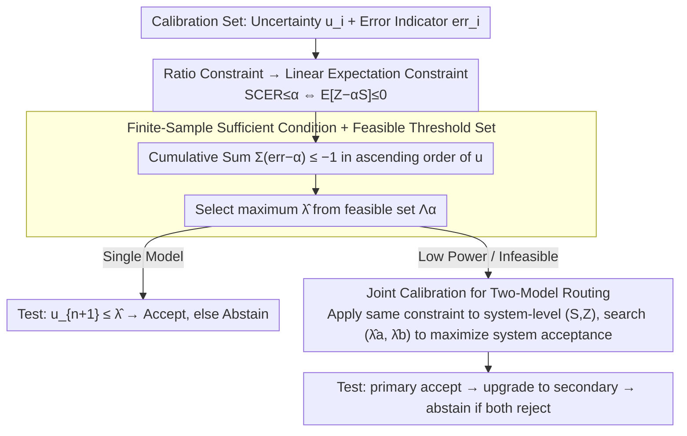

# LEC: Linear Expectation Constraints for Selection-Conditioned Risk Control in Selective Prediction and Routing Systems

**Conference**: ICML 2026  
**arXiv**: [2512.01556](https://arxiv.org/abs/2512.01556)  
**Code**: The caption of Figure 1 notes "Code is available here" (open-source link not provided in the main text)  
**Area**: AI Safety / Selective Prediction / Uncertainty Quantification  
**Keywords**: Selective prediction, Risk control, Conformal prediction, Model routing, Uncertainty quantification

## TL;DR
Addressing the long-standing issue in LLM selective prediction where "UCB risk bounds are too conservative and offer few usable thresholds," the authors rewrite the objective "post-selection error rate $\le \alpha$" as a **linear expectation constraint** involving indicator functions for selection and error. This leads to a finite-sample sufficient condition (Eq. 5) that depends only on the calibration set. This approach maintains strict finite-sample guarantees while being significantly tighter than UCB. The framework naturally extends to two-model routing systems for joint threshold calibration, achieving consistent power gains across CommonsenseQA, TriviaQA, ScienceQA, and MM-Vet v2, and accepting 9.5% more samples than Clopper-Pearson UCB on TriviaQA.

## Background & Motivation

**Background**: LLMs/LVLMs are increasingly embedded into decision pipelines. However, they can hallucinate and provide high confidence in incorrect answers. Thus, statistical guarantees for behaviors like "accept / abstain / escalate" are required. Split conformal prediction (SCP) converts heuristic uncertainty scores into prediction sets with coverage guarantees, but **set-valued outputs** are often not directly actionable for downstream decisions—they frequently contain unreliable candidates, leading to biased decision-making.

**Limitations of Prior Work**: Researchers have shifted toward the selective prediction paradigm ("point prediction + selective acceptance"): accept only when the uncertainty $u \le \lambda$. The challenge lies in calibrating $\lambda$ to ensure the "error rate of accepted samples $\le \alpha$." Current mainstream methods rely on interval-based Upper Confidence Bounds (UCB)—COIN uses Hoeffding UCB (UCB-HFD), and Trust of Escalate uses exact Clopper-Pearson UCB (UCB-CLP). These methods are **statistically valid but extremely conservative**: they perform worst-case tail control on empirical risk, resulting in actual acceptance rates far below what the risk budget allows, sometimes failing to find any feasible threshold at low $\alpha$ (e.g., 0.05).

**Key Challenge**: UCB-based methods control the "upper bound of empirical risk," whereas the actual goal is to control the "Selection-Conditioned Empirical Risk $\mathrm{SCER}(\lambda) = \Pr(\mathrm{err}=1 \mid S(\lambda)=1)$," which is a ratio. Forcing a "ratio constraint" into an "upper bound constraint" inevitably introduces excessive padding.

**Goal**: (1) Identify a threshold calibration formula that preserves finite-sample guarantees while being tighter than UCB; (2) Extend these guarantees from single models to two-model routing systems (primary → secondary → abstain) to achieve **system-level** rather than disjoint risk control.

**Key Insight**: The authors observe that the ratio constraint $\mathbb{E}[Z]/\mathbb{E}[S] \le \alpha$ (where $Z = S \cdot \mathrm{err}$ is the joint indicator for "accepted and incorrect" and $S$ is the selection indicator), given $\mathbb{E}[S] > 0$, is equivalent to a **linear constraint** $\mathbb{E}[Z - \alpha S] \le 0$. This linear constraint simplifies the problem as it only requires the expectation of a single random variable $Z-\alpha S$ to be non-positive, avoiding separate tail control for $Z$ and $S$.

**Core Idea**: Reframe selective prediction from "ranking uncertainty" to "solving thresholds for linear expectation constraints." Under the exchangeability assumption, use a leave-one-out correction to derive a clean finite-sample sufficient condition of "sum of differences $\le -1$." This single inequality provides calibration rules for both single models and routing systems.

## Method

### Overall Architecture
The single-model LEC follows four steps: (1) Run model $\mathcal{G}^{(a)}$ on calibration set $\mathcal{D}_{\mathrm{cal}}=\{(u_i^{(a)},\mathrm{err}_i^{(a)})\}_{i=1}^n$ to obtain uncertainty $u_i$ and error indicators $\mathrm{err}_i$; (2) Substitute the acceptance count $k(\lambda)=\#\{i: u_i \le \lambda\}$ for a candidate threshold $\lambda$ into the finite-sample sufficient condition $\sum_{j=1}^{k(\lambda)}(\mathrm{err}_{(j)} - \alpha) \le -1$ (ordered by $u_i$ ascending); (3) Select the **maximum** $\hat{\lambda}$ among all feasible $\lambda$ to maximize the test-time acceptance rate; (4) During testing, accept if $u_{n+1} \le \hat{\lambda}$, otherwise abstain. Routing extends this to a joint search for $(\lambda^{(a)}, \lambda^{(b)})$ to maximize system-level acceptance.

### Key Designs

**1. From Ratio Constraint to Linear Expectation Constraint: Rewriting Conditional Probability Objectives**

The objective is to control the "proportion of errors among accepted samples": $\Pr(\mathrm{err}=1 \mid S(\lambda)=1) \le \alpha$. This is essentially a ratio constraint. LEC re-expresses this as follows: define the joint indicator $Z(\lambda) = S(\lambda) \cdot \mathrm{err}$ (1 if accepted and incorrect). Then $\mathrm{SCER}(\lambda) = \mathbb{E}[Z(\lambda)] / \mathbb{E}[S(\lambda)]$. For $\mathbb{E}[S(\lambda)] > 0$, $\mathrm{SCER}(\lambda) \le \alpha \Leftrightarrow \mathbb{E}[Z(\lambda) - \alpha S(\lambda)] \le 0$. Intuitively, $Z - \alpha S$ represents "marginal error contribution minus $\alpha$ times marginal acceptance"; its non-positive expectation ensures the error rate does not exceed $\alpha$.

This step is the source of LEC’s tightness over UCB. UCB-CLP/UCB-HFD separately bound the numerator $\mathbb{E}[Z]$ and denominator $\mathbb{E}[S]$, compounding conservatism. LEC evaluates a single combined quantity $Z - \alpha S$.

**2. Finite-Sample Sufficient Condition: The "Difference Sum $\le -1$" Rule**

The expectation constraint must be translated into a criterion verifiable on the calibration set. Sort samples by $u_i$ as $u_{(1)} \le \dots \le u_{(n)}$ with corresponding $\mathrm{err}_{(j)}$. Under exchangeability, using leave-one-out correction (Appendix A.1), the sufficient condition is:

$$\sum_{j=1}^{k(\lambda)} (\mathrm{err}_{(j)} - \alpha) \le -1$$

The feasible set $\Lambda_\alpha = \{\lambda: \text{inequality holds}\}$. The calibrated threshold is $\hat{\lambda} = \sup \Lambda_\alpha$. Theorem 3.1 guarantees that $\Pr(\mathrm{err}_{n+1}=1 \mid u_{n+1} \le \hat{\lambda}) \le \alpha$. Unlike UCB, which uses worst-case tail bounds, LEC uses cumulative sums with a $-1$ correction, avoiding wasted risk budget while maintaining rigor.

**3. Joint Threshold Calibration for Routing: System-Level SCER Guarantees**

If a single model is infeasible or has low power at a given $\alpha$, inputs are escalated to a second model. The challenge is ensuring the **system-level** error rate. LEC defines $S^{(b)}(\lambda^{(a)}, \lambda^{(b)}) = \mathbf{1}\{u^{(a)} > \lambda^{(a)} \land u^{(b)} \le \lambda^{(b)}\}$. System selection is $S = S^{(a)} + S^{(b)}$, and system error is $Z = S^{(a)} \mathrm{err}^{(a)} + S^{(b)} \mathrm{err}^{(b)}$. The same principle applies: $\mathbb{E}[Z - \alpha S] \le 0$, with the condition $\sum_{i=1}^n (Z_i - \alpha S_i) \le -1$. We search for $(\hat{\lambda}^{(a)}, \hat{\lambda}^{(b)})$ to maximize system acceptance. Theorem 3.2 guarantees system-level SCER ≤ α. Independent calibration ("naive LEC") fails because once the primary model rejects a sample, the remaining distributions violate exchangeability.

### Loss & Training
LEC is a **post-processing/calibration method** and requires no gradient training. It requires: (1) A pre-trained model $\mathcal{G}$; (2) A scalar uncertainty function $\mathcal{U}$; (3) A labeled calibration set; (4) An admission function $A$ for correctness. Computational overhead is $\mathcal{O}(n)$ per threshold candidate.

## Key Experimental Results

### Main Results

Power (proportion of correctly accepted samples) comparison on TriviaQA across 8 LLMs. LEC consistently matches or outperforms UCB-CLP, particularly in "low risk budget" scenarios ($\alpha=0.05 / 0.1$):

| α | OpenChat-3.5 UCB-CLP | OpenChat-3.5 LEC | Qwen2.5-14B UCB-CLP | Qwen2.5-14B LEC | LLaMA-3.1-8B UCB-CLP | LLaMA-3.1-8B LEC | LLaMA-3.1-70B UCB-CLP | LLaMA-3.1-70B LEC |
|------|-----|-----|-----|-----|-----|-----|-----|-----|
| 0.05 | 0.6684 | **0.7230** | 0.6240 | **0.7193** | 0.7143 | **0.7538** | 0.9935 | **0.9996** |
| 0.10 | 0.9294 | **0.9521** | 0.9987 | **1.0000** | 0.9396 | **0.9612** | 1.0 | 1.0 |
| 0.15 | 1.0 | 1.0 | 1.0 | 1.0 | 1.0 | 1.0 | 1.0 | 1.0 |

UCB-HFD often returns "no feasible threshold" at $\alpha=0.05$, highlighting the fragility of UCB methods in low-risk regions.

### Ablation Study

Correct samples accepted in a routing system (Qwen2.5-3B primary, LLaMA-3.1-8B secondary) on CommonsenseQA:

| α | Qwen2.5-3B Single | LLaMA-3.1-8B Single | LEC-Routing (Joint) |
|------|--------|---------|----------|
| 0.05 | 965  | 1579 | **1610** |
| 0.10 | 2569 | 2357 | **2663** |

At $\alpha=0.05$, LEC-Routing increases acceptance from 20.3% (single model) to 33.9% (+13.6% gain). Figure 6 shows joint calibration perfectly adheres to the $\alpha$ limit, while naive LEC violates it.

### Key Findings
- **Stable Statistical Validity**: Across 500 splits, the empirical SCER of LEC remains close to but never exceeds $\alpha$ (e.g., 0.0497 for $\alpha=0.05$).
- **Tighter than UCB**: LEC utilizes the risk budget more efficiently, accepting roughly 10% more samples than UCB-CLP on TriviaQA.
- **Joint Calibration is Essential**: Independent calibration for routing models leads to SCER violations, whereas joint LEC remains valid.
- **Robustness**: High performance persists across different uncertainty measures (SE, EigV, etc.) and calibration/test split ratios.

## Highlights & Insights
- **Linear Rewrite**: Converting ratio constraints to linear expectations is the core contribution, eliminating the compounded conservatism of UCB bounds.
- **Elegant Inequality**: The condition $\sum (\mathrm{err}_{(j)} - \alpha) \le -1$ is clean and computationally efficient ($\mathcal{O}(n)$).
- **Unified Routing**: The same mathematical framework handles single models and complex model chains by simply redefining the indicators.
- **Black-box Friendly**: LEC requires no logits or training, making it applicable to closed-source APIs like GPT-4 or Gemini.

## Limitations & Future Work
- **Exchangeability Dependency**: Guarantees fail if the data distribution shifts; weighted or online conformal methods may be needed.
- **Admission Function Noise**: If the correctness evaluator $A$ is inaccurate, LEC samples according to $A$'s noise, not necessarily "ground truth."
- **Small $\alpha$ Challenges**: For very low $\alpha$ (e.g., 0.01), satisfying the inequality may require much larger calibration sets.
- **Search Complexity**: Joint thresholding for $K$ models has $\mathcal{O}(n^K)$ complexity, requiring pruning or approximation for long chains.

## Related Work & Insights
- **vs COIN (UCB-HFD)**: LEC replaces conservative Hoeffding bounds with tighter linear expectation checks.
- **vs UCB-CLP**: Even the tightest UCB (Clopper-Pearson) is shown to be less efficient than LEC's single-pass thresholding.
- **vs SCP**: While SCP focuses on set coverage, LEC provides more actionable point-prediction acceptance.

## Rating
- Novelty: ⭐⭐⭐⭐ Paradigmatic upgrade from UCB-based selective prediction.
- Experimental Thoroughness: ⭐⭐⭐⭐⭐ Comprehensive coverage across benchmarks, models, and uncertainty metrics.
- Writing Quality: ⭐⭐⭐⭐ Clear progression from single model to routing, though notationally heavy.
- Value: ⭐⭐⭐⭐⭐ High practical utility for LLM deployment decisions.

<!-- RELATED:START -->

## Related Papers

- [\[ICML 2026\] Scaling Continual Learning to 300+ Tasks with Bi-Level Routing Mixture-of-Experts](scaling_continual_learning_to_300_tasks_with_bi-level_routing_mixture-of-experts.md)
- [\[ICML 2026\] NITP: Next Implicit Token Prediction for LLM Pre-training](nitp_next_implicit_token_prediction_for_llm_pre-training.md)
- [\[ICML 2026\] FLAG: Foundation Model Representation with Latent Diffusion Alignment via Graph for Spatial Gene Expression Prediction](flag_foundation_model_representation_with_latent_diffusion_alignment_via_graph_f.md)
- [\[CVPR 2026\] Energy Waveify and Redistribution for Test-Time Adaptation: A Control System Perspective](../../CVPR2026/self_supervised/energy_waveify_and_redistribution_for_test-time_adaptation_a_control_system_pers.md)
- [\[CVPR 2025\] Representation Learning for Spatiotemporal Physical Systems](../../CVPR2025/self_supervised/representation_learning_for_spatiotemporal_physical_systems.md)

<!-- RELATED:END -->
