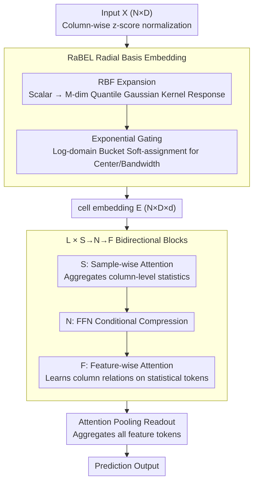

# LimiX-2M: Mitigating Low-Rank Collapse and Attention Bottlenecks in Tabular Foundation Models

**Conference**: ICML 2026  
**arXiv**: [2606.04485](https://arxiv.org/abs/2606.04485)  
**Code**: https://github.com/limix-ldm-ai/LimiX  
**Area**: Tabular Foundation Models / Transformer Architecture / Numerical Embedding  
**Keywords**: Tabular Foundation Models, RBF Embedding, Low-Rank Collapse, Bidirectional Attention, Tabular ICL  

## TL;DR
Addressing two major pathologies in tabular foundation models like TabPFN-v2—severe low-rank collapse in shallow layers and the negligible contribution of sample-attention in the final layer to prediction signals—the authors propose using Radial Basis Functions to expand each scalar into a set of local responses (RaBEL) to unlock degrees of freedom in the "value direction." Furthermore, the bidirectional attention blocks are rearranged from F→S→N to S→N→F to ensure all attention paths flow into the readout. With only 2M parameters, this model consistently outperforms the 7M TabPFN-v2 and 27M TabICL across mainstream tabular benchmarks.

## Background & Motivation

**Background**: Tabular Foundation Models (TFMs) such as TabPFN / TabPFN-v2 / TabICL / LimiX reframe tabular learning as "in-context inference" by pre-training Transformers on synthetic tasks. They have pushed long-standing dominant Gradient Boosted Decision Trees (XGBoost, LightGBM, CatBoost) to second-tier status on multiple small-to-medium scale benchmarks. The standard practice involves using a $1\times p$ linear layer to project each numerical cell $x_{i,j}$ into a latent space, overlaying column IDs and positional embeddings.

**Limitations of Prior Work**: Through SVD on the latent states of each layer in TabPFN-v2 using OpenML-CC18, the authors discovered extremely severe low-rank collapse. In the 192-dimensional latent space across 12 layers and 36 modules, only 5–10 singular components are often sufficient to retain 95% of the energy. Performing truncated SVD on the original 192-dimensional input to compress the rank to 50 (~25%) results in almost no drop in AUC; even at a rank of 20, it maintains a competitive AUC (0.8985 vs. 0.9177). This indicates that most of the latent space is wasted.

**Key Challenge**: The authors prove (Proposition 3.1) a clear conclusion: under pure linear embedding and column IDs, given $n$ scalars $x_1,\dots,x_n\in\mathbb{R}$, the rank of the embedding matrix is **at most 2**. This rank remains at most 2 after single-head self-attention, and only increases to $H+1$ for multi-head attention. Column IDs/positional encodings can "distinguish columns" but **cannot increase the effective degrees of freedom per scalar** entering the model. Additionally, mainstream bidirectional blocks are ordered F→S→N (feature-attention → sample-attention → FFN), forcing the first feature-attention layer to perform cross-column fusion using raw values without any column-level statistics. Worse, during prediction, only the target token is read, meaning the sample-attention path in the final layer barely affects the readout, wasting significant computation.

**Goal**: (1) Introduce sufficient non-linearity in the embedding layer along the "value direction" to lift the effective rank of shallow layers; (2) Rearrange the attention order so that every attention calculation contributes to the final prediction.

**Key Insight**: Classical RBF local kernel expansion naturally possesses the property of "different responses in different value ranges." This is equivalent to a set of Gaussian kernel bases centered at quantiles. Mapping a single scalar to an $M$-dimensional vector before a shared linear projection increases the "degrees of freedom for a scalar entering the model" from 1 to $M$. Placing sample-attention before the block allows for aggregating column-level statistics before feature-attention, aligning with a natural "statistics first, then interaction" computational order.

**Core Idea**: Combining RaBEL (Radial Basis Embedding Layer) as a "pre-nonlinearity" to break the value bottleneck with S→N→F rearrangement for "readout alignment" pushes a 2M parameter model beyond the 7M TabPFN-v2.

## Method

### Overall Architecture
Input $X\in\mathbb{R}^{N\times D}$ ($N$ samples, $D$ columns) undergoes column-wise $z$-score normalization to obtain $\tilde{x}_{i,j}$. RaBEL then expands each scalar $\tilde{x}_{i,j}$ into an $M$-dimensional RBF response followed by a linear projection into a $d$-dimensional latent space, forming the cell embedding tensor $E\in\mathbb{R}^{N\times D\times d}$. This tensor is fed into $L$ **rearranged bidirectional attention blocks** (S→N→F): each block first performs sample-dimension attention (aggregating column-level statistics), followed by FFN (conditional compression), and finally feature-dimension attention (learning inter-column relationships under improved conditions). Finally, attention pooling aggregates all feature tokens into a prediction vector, ensuring every attention layer "sees" the gradients from the readout.

### Key Designs

**1. RaBEL: Radial Basis Embedding Layer + Exponential Gating, lifting "value direction" DOF from 1 to $M$**

The pathology is clear—Prop 3.1 proves that under linear embedding and column IDs, the rank of the embedding matrix is at most 2, remaining at most 2 after single-head attention and only $H+1$ for multi-head. Column IDs distinguish columns but don't increase the degrees of freedom for each scalar. RaBEL breaks this bottleneck using RBF kernels: for each column $j$, $M$ centers $\{c_{j,m}\}$ (initialized with empirical quantiles) and bandwidths $\{\sigma_{j,m}\}$ (initialized with IQR and learned end-to-end) are selected. The response $\kappa_{j,m}=\exp(-(x_{i,j}-c_{j,m})^2 / (2\sigma_{j,m}^2))$ forms a vector $\phi_j(x_{i,j})=[\kappa_{j,1},\dots,\kappa_{j,M}]$, which is mapped to $\mathbb{R}^d$ via a shared projection $W_{\mathrm{rbf}}\in\mathbb{R}^{d\times M}$ and LayerNorm. The locality of RBF means different value ranges have different activation patterns, effectively disentangling tabular non-linear structures like "piecewise trends / local cycles / quantization / heavy tails / heteroscedasticity" in the first layer, rather than relying on deep layers to recover curvature post-hoc.

To handle cross-magnitude and heteroscedastic data, an exponential gating mechanism is added: let $\ell_{i,j}=\log_\beta(|x_{i,j}|+\tau)$ be soft-assigned to exponential buckets $\mathcal{B}$ via a temperature kernel to obtain scale context $z^{\exp}_{i,j}$. A small MLP then outputs two positive scalar gates $(\gamma^c_{i,j}, \gamma^\sigma_{i,j})$ to simultaneously scale all centers and bandwidths. This allows the model to automatically adjust bump widths across magnitudes, preventing RBF from becoming "all zero" in large ranges or overly smooth in small ranges, achieving scale equivariance and heteroscedastic robustness.

**2. S→N→F: Rearranged Bidirectional Attention Blocks for Readout Integration**

The standard TabPFN-style F→S→N ordering has two flaws: the first feature-attention layer must perform cross-column fusion using raw unconditioned values, exacerbating low-rank collapse; and during prediction, only the target token is read, making the final layer's sample-attention computationally wasteful. LimiX-2M reverses this sequence to S→N→F—performing sample-wise attention first (aggregating "mean, frequency, missing patterns" within each column), followed by FFN for conditional compression of these signals, and finally cross-column interaction on tokens rich in column-level summaries. The readout also switches from a single target token to attention pooling across all feature tokens, ensuring every attention path receives gradient signals.

This "statistics first → interaction later" sequence better fits the natural dependency structure of tabular data. Visualization on synthetic DAG data (Fig 2) shows that while F→S→N feature attention is dominated by self-attention, S→N→F allocates attention to the true causal parents of the target (e.g., Node 0), despite using the same number of parameters.

**3. 2M Parameters + Identical Training Recipe Control: Isolating Architecture Gains**

A common criticism in tabular FM is that performance gains stem from training data, duration, or hyperparameter tuning. The authors isolate the architectural contribution by creating a "Linear-SNF baseline" with 2M parameters, sharing the exact SNF layer sequence, training data, and hyperparameters with LimiX-2M. The only difference is using standard Linear instead of RaBEL in the embedding layer. By cross-ablating RaBEL on MLP and pure Transformer backbones, the contributions of RaBEL and S→N→F are clearly separated from the training recipe.

## Key Experimental Results

### Main Results

Comparison of different embeddings on a 2M parameter Transformer backbone across tabular benchmarks:

| Benchmark | Metric | Transformer+MLP | Transformer+Periodic | Transformer+PLE | Transformer+RaBEL |
|-----------|------|-----------------|----------------------|-----------------|-------------------|
| BCCO-CLS  | AUC ↑ | 83.52 | 83.88 | 84.66 | **85.04** |
| BCCO-CLS  | Acc ↑ | 76.82 | 77.80 | 77.68 | **77.99** |
| BCCO-CLS  | F1 ↑  | 66.57 | 68.65 | 67.74 | **69.01** |
| BCCO-REG  | $R^2$ ↑ | 0.7731 | 0.6859 | 0.7410 | **0.7792** |
| BCCO-REG  | RMSE ↓ | 0.4043 | 0.4321 | 0.4216 | **0.3964** |

Average rank across 11 aggregated benchmarks (OpenML-CC18 / TabZilla / TabArena-CLS-REG / etc.): LimiX-2M achieves best or second-best results in most categories, outperforming GBDT giants (CatBoost / LightGBM / XGBoost), deep tabular models (FT-Transformer / ExcelFormer / SAINT / etc.), and larger models like TabPFN-v2 (7M) and TabICL (27M).

### Ablation Study

Shallow layer rank comparison: LimiX-2M vs. 2M SNF baseline (same training recipe, different embedding):

| Configuration | Numerical Rank | Rank@99% | Rank@95% |
|------|----------------|----------|----------|
| 2M Baseline (Linear Embedding + SNF) | 58.41 | 13.94 | 6.73 |
| **LimiX-2M (RaBEL + SNF)** | **78.62** (+34.6%) | **25.35** (+82.0%) | **12.31** (+83.2%) |

Horizontal comparison of RaBEL on an MLP backbone (13 datasets) also shows MLP-RaBEL ranking first on 9/13 datasets, significantly outperforming MLP-MLP / MLP-PLE / MLP-Periodic.

### Key Findings
- **RaBEL directly lifts rank**: Using identical SNF architecture and training, replacing Linear with RaBEL nearly doubled the shallow Rank@95% (6.73 → 12.31), confirming the "value bottleneck" identified by Prop 3.1.
- **S→N→F modifies attention direction, not FLOPs**: On synthetic DAG data, F→S→N is almost entirely self-attention (diagonal), whereas S→N→F correctly assigns high attention weights to causal parents—explaining the performance gain without new parameters.
- **TabPFN-v2 is severely over-parameterized**: Truncating its 192-dim latent space to 50 dimensions (25%) reduced AUC only from 0.9177 to 0.9143. This supports the claim that parameters are not the bottleneck; embedding is.
- **2M beats 7M / 27M**: Across 11 benchmarks, LimiX-2M overall outperforms TabPFN-v2 and TabICL with lower training and inference costs.

## Highlights & Insights
- **Unified logic from theory to diagnosis to method**: Prop 3.1 provides a rigid upper bound of rank $\le 2$ for linear embeddings, SVD measurement replicates this bound, and RBF expansion lifts the "scalar DOF" from 1 to $M$.
- **Scale equivariance via exponential gating**: Decoupling magnitude (log-domain buckets) from "patterns within magnitude" (RBF response) handles the unit/magnitude sensitivity issue in tabular learning via a lightweight module.
- **Param-free rearrangement**: S→N→F introduces no new modules or parameters; it simply reorders components and switches readout to attention pooling. The discovery that this facilitates learning causal directions in synthetic DAGs is a "free architecture dividend" applicable to other ICL scenarios.

## Limitations & Future Work
- **Verification limited to 2M scale**: Experiments focused on the 2M scale; scaling curves for RaBEL+SNF at 16M/70M were not explored to see if the advantage holds against larger TabPFN-v2/TabICL versions.
- **Simplistic categorical handling**: RaBEL is designed for numerical columns; categorical columns use standard entity embeddings. There is potential for RBF-style frequency or TF-IDF local bases for categorical data.
- **Column-level bias in RBF hyperparams**: Simple quantile/IQR initialization might be insufficiently expressive for multi-modal or heavy-tailed columns; hybrid RBF+Periodic structures could be explored.
- **Dynamic/Streaming data**: The fixed-context assumption for in-context learning was not tested for latency and drift in real-world online tabular prediction.

## Related Work & Insights
- **vs. FT-Transformer / TabTransformer**: While these use standard linear projection + column IDs, this work provides a proof for the rank bound $\le 2$ and systematically breaks it with RBF.
- **vs. Periodic / PLE** (Gorishniy et al. 2022): RaBEL uses local RBF compared to the global periodic features of Periodic or the piecewise linear buckets of PLE. RaBEL’s superior RMSE (0.3964) vs. Periodic (0.4321) and PLE (0.4216) suggests local kernels are better suited for most tables.
- **vs. TabPFN-v2 / TabICL**: This work adopts the in-context framework of TabPFN-v2 and bidirectional attention of TabICL but reverses the F→S→N order. This "minimal architecture patch" allows 2M parameters to outperform 7M and 27M models.
- **vs. SAINT / VIME / MET**: These utilize cross-sample attention or self-supervision. The S phase in the SNF block correctly positions the "cross-sample statistics" within the in-context FM framework.

## Rating
- Novelty: ⭐⭐⭐⭐ Combination of Prop 3.1 proof, RaBEL expansion, and S→N→F rearrangement is original, despite existing precursors for individual components.
- Experimental Thoroughness: ⭐⭐⭐⭐⭐ Comprehensive benchmarks, ablation studies, DAG visualization, and quantitative rank comparisons.
- Writing Quality: ⭐⭐⭐⭐ Clear logical chain and rigorous formulas, though jargon-heavy in sections.
- Value: ⭐⭐⭐⭐⭐ Significant practical contribution by beating larger models with fewer parameters and identifying key bottlenecks. RaBEL is a plug-and-play module.

<!-- RELATED:START -->

- **TabPFN: A Transformer That Solves Small Tabular Classification Problems in a Second**, Nature 2022.
- **On Embeddings for Numerical Features in Tabular Deep Learning**, NeurIPS 2022.
- **TabICL: In-context Learning with Bidirectional Transformers for Tabular Data**, arXiv 2023.

<!-- RELATED:END -->

## Related Papers

- [\[ICML 2026\] Mitigating Label Shift in Tabular In-Context Learning via Test-Time Posterior Adjustment](mitigating_label_shift_in_tabular_in-context_learning_via_test-time_posterior_ad.md)
- [\[AAAI 2026\] Robust Tabular Foundation Models](../../AAAI2026/self_supervised/robust_tabular_foundation_models.md)
- [\[ICML 2026\] From Zero to Hero: Advancing Zero-Shot Foundation Models for Tabular Outlier Detection](from_zero_to_hero_advancing_zero-shot_foundation_models_for_tabular_outlier_dete.md)
- [\[NeurIPS 2025\] Mitra: Mixed Synthetic Priors for Enhancing Tabular Foundation Models](../../NeurIPS2025/self_supervised/mitra_mixed_synthetic_priors_for_enhancing_tabular_foundation_models.md)
- [\[ICML 2026\] The Geometry of Projection Heads: Conditioning, Invariance and Collapse](the_geometry_of_projection_heads_conditioning_invariance_and_collapse.md)

<!-- RELATED:END -->
