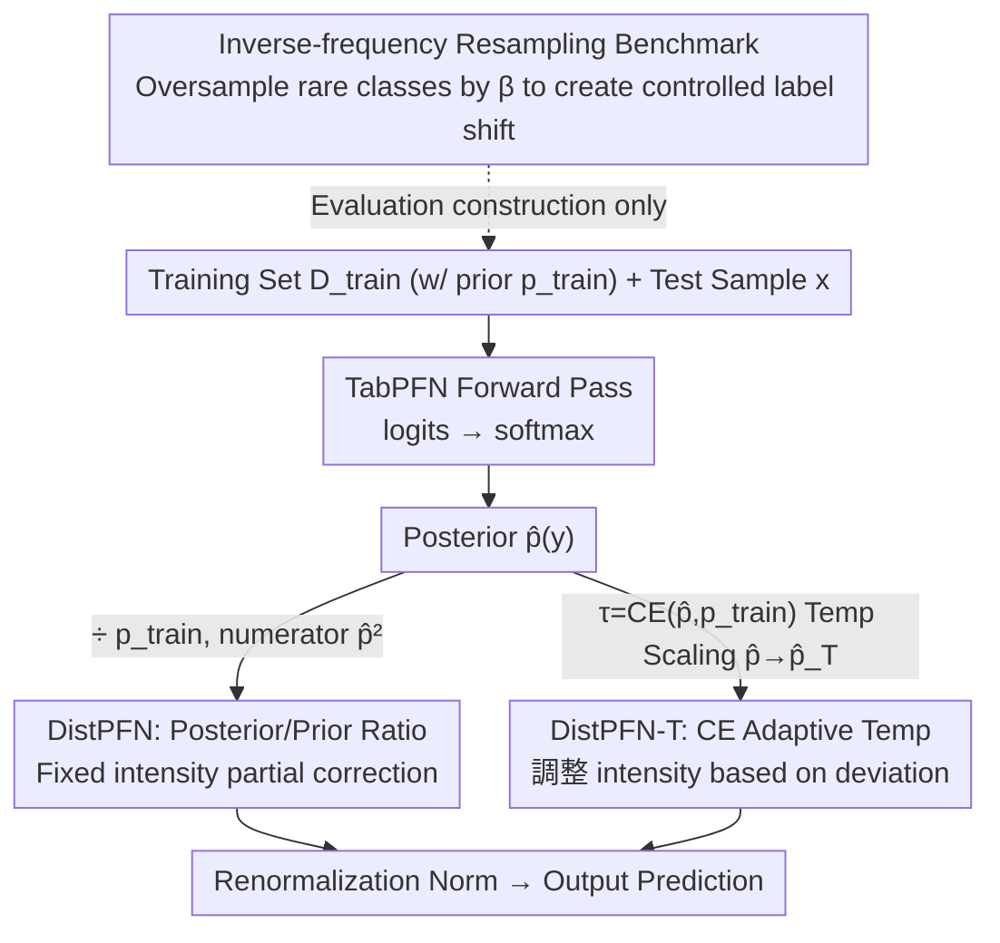

# Mitigating Label Shift in Tabular In-Context Learning via Test-Time Posterior Adjustment

**Conference**: ICML 2026  
**arXiv**: [2605.04363](https://arxiv.org/abs/2605.04363)  
**Code**: https://github.com/seunghan96/DistPFN (Available)  
**Area**: Tabular Foundation Models / In-Context Learning / Test-Time Adaptation / Label Shift  
**Keywords**: TabPFN, label shift, posterior adjustment, temperature scaling, plug-in correction

## TL;DR
This work proposes posterior correction for "Tabular Foundation Models" such as TabPFN, which feed training sets directly into attention mechanisms as context. It identifies severe overfitting to the training set's majority class and introduces DistPFN: a posterior reweighting method using $\tilde{p}(y) \propto \hat{p}(y)^2 / p_{train}(y)$. Across 253 OpenML datasets, it improves the accuracy of TabPFN-v2 from 72.7% to 76.9% under strong label shift ($\beta=5$) without retraining, test-prior estimation, or architectural modifications.

## Background & Motivation
**Background**: Tabular classification was long dominated by tree models like XGBoost/LightGBM/CatBoost. However, TabPFN (2023) introduced a paradigm where the entire training set is fed as a prompt to a pretrained Transformer, obtaining test predictions in a single forward pass. TabPFN-v2 (Nature 2025) further advanced the state-of-the-art (SOTA) in scale and generalization via dual-axis attention, spawning models such loCalPFN, TabICL, TabFlex, and MixturePFN.

**Limitations of Prior Work**: The authors identify a widely ignored fatal flaw in this family of models: **extreme over-sensitivity to training class priors**. On imbalanced datasets like CostaMadre1, TabPFN-v2 predicts the majority class for 98.3% of test samples, even when training and testing distributions are identical. In their study of 253 OpenML datasets, 84.6% are imbalanced, meaning this flaw affects most real-world tabular tasks; performance drops sharply as soon as test label distributions deviate from training (label shift).

**Key Challenge**: Classic label shift correction methods (EME, BBE, Logit Adjustment, Balanced Softmax) either require retraining or the estimation of the **test set** label prior. Retraining negates the zero-shot advantage of TabPFN, while test priors are often unavailable in practical deployments. Furthermore, applying these methods in standard (non-shift) settings often degrades performance (EME/BBE drop 1.5/1.1 points on LoCalPFN w/o shift). Thus, **existing methods either require data/training or destroy standard performance**.

**Goal**: (1) Provide a **training-free** plug-in posterior correction, (2) **eliminate the need for test prior estimation**, (3) maintain base model performance w/o shift, and (4) provide increasing gains under stronger label shifts.

**Key Insight**: The fundamental difference between the TabPFN family and traditional models is that **training distributions are explicitly encoded in the attention mechanism rather than implicitly in model weights**. Consequently, the training prior $p_{train}(y)$ is an explicit, observable quantity that can be used directly for computation, whereas traditional models must estimate priors because they are buried in weights.

**Core Idea**: Divide the model posterior $\hat{p}(y)$ by the training prior $p_{train}(y)$, and normalize to obtain $\tilde{p}(y) \propto \hat{p}(y)^2 / p_{train}(y)$, effectively suppressing the "pull" of the training distribution and amplifying the evidence of the test sample itself.

## Method

### Overall Architecture
The method consists of three compact components: (1) DistPFN, a one-line posterior adjustment formula; (2) DistPFN-T, a temperature-scaled version using cross-entropy for adaptive control; and (3) an inverse-frequency resampling benchmark for quantifying the "shift intensity $\beta$ vs. accuracy" curve. The pipeline involves taking logits from a single TabPFN forward pass → softmax → applying adjustment factor $\alpha$ → renormalization → output. This happens entirely at **inference time** as a plug-in.

### Key Designs

**1. DistPFN: Posterior/Prior Ratio as Adjustment Factor**

The TabPFN family suffers from excessive sensitivity to training class priors—on imbalanced data, it can assign 98.3% of samples to the majority class. DistPFN applies a one-line correction:

$$\tilde{p}_{DistPFN}(y) = \mathrm{Norm}\!\left(\hat{p}_{TabPFN}(y) \cdot \frac{\hat{p}_{TabPFN}(y)}{p_{train}(y)}\right) = \mathrm{Norm}\!\left(\frac{\hat{p}_{TabPFN}(y)^2}{p_{train}(y)}\right)$$

where $p_{train}(y)$ is the training class frequency. The intuition follows classic "prior elimination" ($p(y|x) \propto p(y|x)/p(y)$), suppressing the training distribution's influence. 

The key difference is using $\hat{p}^2$ in the numerator instead of $\hat{p}$. Classic prior correction assumes $\hat{p}(y)$ has completely collapsed to $p_{train}(y)$; however, in practice, $\hat{p}(y)$ does not collapse entirely, making full division an over-correction. The squared numerator retains the model's prediction info, maintaining "partial correction"—validated as near-optimal via oracle experiments.

**2. DistPFN-T: Adaptive Scaling using CE as Temperature**

While fixed $\hat{p}^2/p_{train}$ works for weak shifts, it can push probabilities to extremes under strong shifts. DistPFN-T introduces a self-monitoring signal: the temperature $\tau = \mathrm{CE}(\hat{p}_{TabPFN}(y), p_{train}(y))$ (cross-entropy between prediction and prior). The prediction is first scaled: $\hat{p}_{TabPFN\text{-}T}(y=c) = \mathrm{softmax}(\hat{p}_{TabPFN}(y=c)/\tau)$, then substituted into:

$$\tilde{p}_{DistPFN\text{-}T}(y) = \mathrm{Norm}\!\left(\hat{p}_{TabPFN}(y) \cdot \frac{\hat{p}_{TabPFN\text{-}T}(y)}{p_{train}(y)}\right)$$

This $\tau$ quantifies how far the test sample deviates from the training distribution: larger deviation leads to a larger $\tau$, which smooths the prediction and makes the correction moderate yet persistent.

**3. Inverse-frequency Resampling Benchmark**

To quantify "shift intensity vs. accuracy," the authors modify only the training set using a scalar $\beta \geq 0$. Sampling weights $w_k = (1/p(y=c_k))^\beta$ are assigned to each class $c_k$. Training sets are oversampled (to avoid information loss from undersampling) based on normalized weights $\tilde{w}_k$. $\beta=0$ is uniform resampling; higher $\beta$ biases toward rare classes, increasing label shift.

### Loss & Training
No training or fine-tuning is required. The entire method is inference-time probability reweighting. The only "hyperparameter" is whether to use the temperature-scaled variant (DistPFN-T).

## Key Experimental Results

Evaluated on 253 OpenML datasets (50/50 split, 5 seeds), 6 $\beta$ levels, reporting w/o shift and average w/ shift. Baseline includes 16 models (LogReg, RF, CatBoost, FT-Transformer, TabPFN-v2, etc.).

### Main Results

| Method | $\beta=0$ | $\beta=0.1$ | $\beta=0.5$ | $\beta=1$ | $\beta=2$ | $\beta=5$ | Average (w/ shift) |
|---|---|---|---|---|---|---|---|
| CatBoost | 0.803 | 0.774 | 0.771 | 0.751 | 0.718 | 0.665 | 0.717 |
| RealMLP | 0.794 | 0.760 | 0.758 | 0.745 | 0.720 | 0.677 | 0.717 |
| TabPFN-v2 (base) | **0.818** | 0.797 | 0.796 | 0.790 | 0.782 | 0.759 | 0.775 |
| + DistPFN | 0.818 | 0.799 | 0.797 | 0.795 | 0.791 | 0.783 | 0.789 |
| **+ DistPFN-T** | **0.818** | **0.799** | **0.798** | **0.797** | **0.796** | **0.789** | **0.792** |
| + Oracle (Upper Bound) | 0.818 | 0.803 | 0.802 | 0.800 | 0.797 | 0.792 | 0.796 |

**Key Findings**: At $\beta=5$, TabPFN-v2 + DistPFN-T pushes accuracy from 75.9% to 78.9%. Improvements are consistent across TabICL (+6.7pp) and LoCalPFN, proving the method is model-agnostic.

### Ablation Study

| Config | w/o shift | w/ shift (Avg.) | Description |
|---|---|---|---|
| TabPFN-v2 (base) | 0.818 | 0.775 | Start point |
| + EME (EM test prior) | 0.801 | 0.786 | Drops 1.7pp w/o shift |
| + BBE (Black-box prior) | 0.805 | 0.789 | Drops 1.3pp w/o shift |
| **+ DistPFN-T** | **0.818** | **0.792** | **No loss w/o shift + max gain w/ shift** |

### Key Findings
- **Gains scale with shift**: Accuracy improvements increase monotonically with training-test KL divergence.
- **Approaching Oracle**: DistPFN-T (78.9% at $\beta=5$) actually slightly outperforms the true $p_{test}$ adjustment (78.4%) because temperature scaling is more robust to over-correction.
- **Nondestructive Deployment**: Unlike EME/BBE which drop 1-2pp w/o shift, DistPFN-T is strictly lossless when $\beta=0$, allowing it to be enabled by default.
- **Systemic Issue**: 84.6% of OpenML datasets are inherently imbalanced, confirming majority-class bias is a core issue for tabular foundation models, not an edge case.

## Highlights & Insights
- **Explicit priors as a pivot**: The realization that TabPFN makes $p_{train}(y)$ observable by inserting the training set into the context bypasses the complex test prior estimation required in traditional label shift literature.
- **Engineering Taste**: The choice of "partial correction" ($\hat{p}^2/p_{train}$) provides a mid-ground that acknowledges models do not perfectly encode priors, preventing the extreme instability of full correction.
- **Self-Contained Design**: DistPFN-T relies entirely on model output and known training priors, requiring no external signals or metadata.

## Limitations & Future Work
- Designed for explicit-prior models (PFNs, kNN); gains on implicit models like trees are less substantial or clean.
- A 0.4pp gap remains vs. the oracle; closing this would likely require online test prior estimation, which might sacrifice the zero-estimation selling point.
- *Limitations*: Restricted to classification (not regression), sensitivity to base logit calibration, and potential numerical instability of CE on extreme distributions.
- *Future Work*: Applying this to RAG-LLM output correction or combining it with conformal prediction for uncertainty-aware robust forecasting.

## Related Work & Insights
- **vs. EME/BBE**: EME/BBE estimate test priors iteratively and degrade performance w/o shift; this work is lossless and estimation-free.
- **vs. Logit Adjustment**: Logit Adjustment requires training-time modifications; this is an inference-time plug-in for frozen models.
- **vs. Drift-Resilient TabPFN**: That work addresses temporal drift via retraining; this handles label shift via test-time adaptation (orthogonal and stackable).

## Rating
- Novelty: ⭐⭐⭐⭐ (Leveraging explicit priors in in-context learning is a sharp, new perspective)
- Experimental Thoroughness: ⭐⭐⭐⭐⭐ (253 datasets, extensive shift intensities, multiple FMs)
- Writing Quality: ⭐⭐⭐⭐ (Clear distinctions between explicit and implicit models)
- Value: ⭐⭐⭐⭐ (High industrial utility as a zero-cost plug-in for foundation models)

<!-- RELATED:START -->

## Related Papers

- [\[ICML 2026\] LimiX-2M: Mitigating Low-Rank Collapse and Attention Bottlenecks in Tabular Foundation Models](limix-2m_mitigating_low-rank_collapse_and_attention_bottlenecks_in_tabular_found.md)
- [\[ICML 2025\] Test-Time Training Provably Improves Transformers as In-Context Learners](../../ICML2025/self_supervised/test-time_training_provably_improves_transformers_as_in-context_learners.md)
- [\[ICLR 2026\] Test-Time Efficient Pretrained Model Portfolios for Time Series Forecasting](../../ICLR2026/self_supervised/test-time_efficient_pretrained_model_portfolios_for_time_series_forecasting.md)
- [\[ICML 2026\] Towards One-for-All Anomaly Detection for Tabular Data](towards_one-for-all_anomaly_detection_for_tabular_data.md)
- [\[CVPR 2026\] Energy Waveify and Redistribution for Test-Time Adaptation: A Control System Perspective](../../CVPR2026/self_supervised/energy_waveify_and_redistribution_for_test-time_adaptation_a_control_system_pers.md)

<!-- RELATED:END -->

## Related Papers

- [\[ICML 2026\] LimiX-2M: Mitigating Low-Rank Collapse and Attention Bottlenecks in Tabular Foundation Models](limix-2m_mitigating_low-rank_collapse_and_attention_bottlenecks_in_tabular_found.md)
- [\[ICML 2025\] Test-Time Training Provably Improves Transformers as In-Context Learners](../../ICML2025/self_supervised/test-time_training_provably_improves_transformers_as_in-context_learners.md)
- [\[ICLR 2026\] Test-Time Efficient Pretrained Model Portfolios for Time Series Forecasting](../../ICLR2026/self_supervised/test-time_efficient_pretrained_model_portfolios_for_time_series_forecasting.md)
- [\[CVPR 2026\] Energy Waveify and Redistribution for Test-Time Adaptation: A Control System Perspective](../../CVPR2026/self_supervised/energy_waveify_and_redistribution_for_test-time_adaptation_a_control_system_pers.md)
- [\[ICML 2026\] From Zero to Hero: Advancing Zero-Shot Foundation Models for Tabular Outlier Detection](from_zero_to_hero_advancing_zero-shot_foundation_models_for_tabular_outlier_dete.md)

<!-- RELATED:END -->
