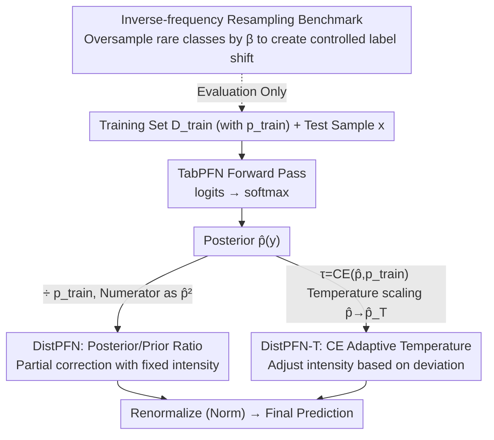

# Mitigating Label Shift in Tabular In-Context Learning via Test-Time Posterior Adjustment

**Conference**: ICML 2026  
**arXiv**: [2605.04363](https://arxiv.org/abs/2605.04363)  
**Code**: https://github.com/seunghan96/DistPFN (Available)  
**Area**: Tabular Foundation Models / In-Context Learning / Test-Time Adaptation / Label Shift  
**Keywords**: TabPFN, label shift, posterior adjustment, temperature scaling, plug-in correction

## TL;DR
This paper proposes posterior correction for "Tabular Foundation Models" like TabPFN, which feed the training set directly into the attention mechanism. Observing that these models severely overfit the majority class of the training set, the authors introduce DistPFN: a posterior re-weighting method using $\tilde{p}(y) \propto \hat{p}(y)^2 / p_{train}(y)$. Across 253 OpenML datasets, it improves TabPFN-v2 accuracy from 72.7% to 76.9% under strong label shift ($\beta=5$), requiring no retraining, no test prior estimation, and no architectural changes.

## Background & Motivation
**Background**: Tabular classification has long been dominated by tree-based models like XGBoost/LightGBM/CatBoost. However, TabPFN (2023) introduced the paradigm of "tabular foundation models (Tabular FM)" by feeding the entire training set as a prompt to a pre-trained Transformer, obtaining all test predictions in a single forward pass. TabPFN-v2 (Nature 2025) achieved SOTA scale and generalization via dual-axis attention, inspiring models like LoCalPFN, TabICL, TabFlex, and MixturePFN.

**Limitations of Prior Work**: The authors identify a widely overlooked flaw in this model family: **extreme sensitivity to training class priors**. On imbalanced datasets like CostaMadre1, TabPFN-v2 predicts the majority class for 98.3% of test samples, even when the training and test sets share the same distribution. Among 253 OpenML datasets examined, 84.6% are imbalanced, meaning this flaw affects most real-world tabular tasks. Furthermore, performance drops sharply when the test label distribution deviates even slightly from the training distribution (label shift).

**Key Challenge**: Classical label shift correction methods (EME, BBE, Logit Adjustment, Balanced Softmax) either require retraining or the estimation of **test set** label priors. Retraining destroys the zero-shot advantage of TabPFN, while test priors are often unavailable in practical deployments. Additionally, applying these methods in standard (non-shift) settings often degrades performance (e.g., EME/BBE drop accuracy by 1.5/1.1 points on LoCalPFN w/o shift). Thus, **existing methods either require extra data/training or break standard performance**.

**Goal**: (1) Provide a **training-free** plug-in posterior correction, (2) **eliminate the need to estimate test priors**, (3) maintain base model performance w/o shift, and (4) provide increasing gains as label shift intensity grows.

**Key Insight**: The fundamental difference between the TabPFN family and traditional models is that **the training set distribution is explicitly encoded into the attention mechanism, rather than implicitly encoded into model weights**. Therefore, the training prior $p_{train}(y)$ is an explicit, observable quantity for TabPFN, whereas classical label shift methods must estimate priors because they can only access weights. Once this distinction is clear, the solution becomes straightforward.

**Core Idea**: Divide the model output posterior $\hat{p}(y)$ by the training prior $p_{train}(y)$ and normalize to obtain $\tilde{p}(y) \propto \hat{p}(y)^2 / p_{train}(y)$, effectively "suppressing the pull of the training distribution and amplifying the evidence of the test sample itself."

## Method

### Overall Architecture
The method consists of three compact components: (1) DistPFN, a one-line posterior adjustment formula; (2) DistPFN-T, a temperature-scaled version that adaptively controls adjustment intensity via cross-entropy; (3) an inverse-frequency resampling benchmark construction for quantifying "shift intensity $\beta$ vs. accuracy" on OpenML. The pipeline takes TabPFN logits → softmax → applies adjustment factor $\alpha$ → renoralizes → outputs. The adjustment occurs at **inference time** as a plug-in without modifying TabPFN parameters or architecture. The diagram below illustrates this inference chain.

### Key Designs

**1. DistPFN: Posterior/Prior Ratio as Adjustment Factor**

The TabPFN family's excessive sensitivity to training priors can lead to 98.3% of predictions being assigned to the majority class in imbalanced data. DistPFN's correction is a single line:

$$\tilde{p}_{DistPFN}(y) = \mathrm{Norm}\!\left(\hat{p}_{TabPFN}(y) \cdot \frac{\hat{p}_{TabPFN}(y)}{p_{train}(y)}\right) = \mathrm{Norm}\!\left(\frac{\hat{p}_{TabPFN}(y)^2}{p_{train}(y)}\right)$$

Where $p_{train}(y)$ is the training class frequency. The intuition follows classical "prior elimination" ($p(y|x) \propto p(y|x)/p(y)$), suppressing the training distribution's influence. Unlike classical correction which uses $\hat{p}$ in the numerator (assuming full collapse of $\hat{p}$ to $p_{train}$), DistPFN uses $\hat{p}^2$. This preserves the model's prediction information and keeps the correction "partial," which oracle experiments show is closer to optimal.

**2. DistPFN-T: CE as Temperature for Adaptive Scaling**

Fixed $\hat{p}^2/p_{train}$ works for weak shifts but can be extreme under strong shifts. DistPFN-T introduces a self-monitoring signal: $\tau = \mathrm{CE}(\hat{p}_{TabPFN}(y), p_{train}(y))$ (the cross-entropy between prediction and training prior). It first applies temperature scaling $\hat{p}_{TabPFN\text{-}T}(y=c) = \mathrm{softmax}(\hat{p}_{TabPFN}(y=c)/\tau)$, then computes:

$$\tilde{p}_{DistPFN\text{-}T}(y) = \mathrm{Norm}\!\left(\hat{p}_{TabPFN}(y) \cdot \frac{\hat{p}_{TabPFN\text{-}T}(y)}{p_{train}(y)}\right)$$

The beauty of $\tau$ is that it quantifies "how far the test sample deviates from the training distribution": larger deviation → higher $\tau$ → smoother scaled prediction → moderate but persistent correction. This acts as a dual counterbalance for both majority and minority cases.

**3. Inverse-frequency Resampling Benchmark**

To quantify "shift intensity vs. accuracy," the authors manipulate only the training set using a scalar $\beta \geq 0$. Sampling weights $w_k = (1/p(y=c_k))^\beta$ are assigned to each class $c_k$. After normalization, the training set is oversampled based on these weights. $\beta=0$ represents uniform resampling, while larger $\beta$ biases the training set towards rare classes. This allows for controlled evaluation across $\beta \in \{0, 0.1, 0.5, 1, 2, 5\}$ over 253 datasets.

### Loss & Training
No training or fine-tuning is required. The entire method is inference-time probability re-weighting. The only choice is whether to use DistPFN-T (enabling temperature scaling).

## Key Experimental Results

Evaluated on 253 OpenML datasets (50/50 split), 6 $\beta$ levels, reporting mean accuracy across datasets and 5 seeds. Baselines include 16 models (LogReg, SVM, RF, CatBoost, FT-Transformer, TabPFN-v2, LoCalPFN, etc.).

### Main Results

| Method | $\beta=0$ | $\beta=0.1$ | $\beta=0.5$ | $\beta=1$ | $\beta=2$ | $\beta=5$ | Avg (w/ shift) |
|---|---|---|---|---|---|---|---|
| CatBoost | 0.803 | 0.774 | 0.771 | 0.751 | 0.718 | 0.665 | 0.717 |
| RealMLP | 0.794 | 0.760 | 0.758 | 0.745 | 0.720 | 0.677 | 0.717 |
| TabPFN-v2 (base) | **0.818** | 0.797 | 0.796 | 0.790 | 0.782 | 0.759 | 0.775 |
| + DistPFN | 0.818 | 0.799 | 0.797 | 0.795 | 0.791 | 0.783 | 0.789 |
| **+ DistPFN-T** | **0.818** | **0.799** | **0.798** | **0.797** | **0.796** | **0.789** | **0.792** |
| + DistPFN-Oracle (Upper) | 0.818 | 0.803 | 0.802 | 0.800 | 0.797 | 0.792 | 0.796 |
| TabICL (base) | 0.806 | 0.783 | 0.781 | 0.770 | 0.747 | 0.704 | 0.742 |
| TabICL + DistPFN-T | 0.806 | 0.786 | 0.786 | 0.783 | 0.780 | 0.771 | 0.777 |
| LoCalPFN (base) | 0.816 | 0.794 | 0.793 | 0.788 | 0.778 | 0.753 | 0.771 |
| LoCalPFN + DistPFN-T | 0.816 | 0.798 | 0.797 | 0.796 | 0.794 | 0.787 | 0.791 |

**Key Observation**: At $\beta=5$, DistPFN-T boosts TabPFN-v2 from 75.9% to 78.9% and TabICL from 70.4% to 77.1% (+6.7pp). The consistent improvement across different FMs indicates the method is model-agnostic.

### Ablation Study

| Configuration | w/o shift | w/ shift (Avg) | Description |
|---|---|---|---|
| TabPFN-v2 (base) | 0.818 | 0.775 | Starting point |
| + EME (EM for test prior) | 0.801 | 0.786 | Drops 1.7pp w/o shift |
| + BBE (Black-box test prior) | 0.805 | 0.789 | Drops 1.3pp w/o shift |
| + DistPFN | 0.818 | 0.789 | **Zero loss w/o shift** |
| **+ DistPFN-T** | **0.818** | **0.792** | **Zero loss w/o shift + Max shift gain** |
| + DistPFN-Oracle (True $p_{test}$) | 0.818 | 0.796 | Theoretical upper bound |
| TableShift Diabetes OOD | base 0.589 → DistPFN-T 0.600 | — | Real OOD gain |

### Key Findings
- **Gains increase with shift**: As the KL divergence between training and test distributions increases, accuracy gains grow monotonically, confirming the method specifically targets label shift.
- **Approaching Oracle**: DistPFN-T (78.9% at $\beta=5$) is highly competitive with DistPFN-Oracle (78.4%), as temperature scaling provides smoother adjustment than "hard division" by true priors.
- **No Performance Drop w/o Shift**: Unlike EME/BBE which drop 1–2 points without shift, DistPFN-T remains neutral when $\beta=0$ because $\hat{p}/p_{train} \approx 1$.
- **Model Bias is Systematic**: Since 84.6% of OpenML datasets are imbalanced, majority-class bias is a pervasive issue in the TabPFN family, not an edge case.

## Highlights & Insights
- **Pivot point**: The insight that "training priors are explicitly visible" in ICL models eliminates the need for complex test prior estimation required by classical literature.
- **Engineering Taste**: The "partial correction" via $\hat{p}^2/p_{train}$ avoids over-correction, acknowledging that the model does not fully collapse its distribution to the training prior.
- **Elegant Self-Monitoring**: Using Cross-Entropy as a temperature signal creates a self-contained system that requires no external signals or labels.

## Limitations & Future Work
- The method is theoretically designed for explicit-prior models; its application to implicit-prior models (like standard trees) is less direct.
- A small 0.4pp gap remains compared to the oracle; closing this might require lightweight online prior estimation.
- Current work focuses on classification; regression label distribution shift remains unexplored.
- Temperature $\tau$ might require numerical clamping in extreme distributions to avoid overflows.

## Related Work & Insights
- **vs. EME/BBE**: These require iterative estimation and degrade standard performance; DistPFN-T is non-iterative and lossless w/o shift.
- **vs. Logit Adjustment**: Those require changing the loss function during training; DistPFN is a post-hoc plug-in for frozen FMs.
- **vs. General TTA**: Most TTA methods require backpropagation on test samples; DistPFN is purely forward-based with negligible computational overhead.

## Rating
- **Novelty**: ⭐⭐⭐⭐ Exploiting explicit priors in ICL is a simple but sharp observation.
- **Experimental Thoroughness**: ⭐⭐⭐⭐⭐ High density of evaluation across 253 datasets and multiple shift levels.
- **Writing Quality**: ⭐⭐⭐⭐ Clear logical flow and effective comparative visualization.
- **Value**: ⭐⭐⭐⭐ High practical value for deployment as a zero-cost plug-in for Tabular FMs.

<!-- RELATED:START -->

## Related Papers

- [\[ICML 2026\] LimiX-2M: Mitigating Low-Rank Collapse and Attention Bottlenecks in Tabular Foundation Models](limix-2m_mitigating_low-rank_collapse_and_attention_bottlenecks_in_tabular_found.md)
- [\[ICML 2025\] Test-Time Training Provably Improves Transformers as In-Context Learners](../../ICML2025/self_supervised/test-time_training_provably_improves_transformers_as_in-context_learners.md)
- [\[ICLR 2026\] Test-Time Efficient Pretrained Model Portfolios for Time Series Forecasting](../../ICLR2026/self_supervised/test-time_efficient_pretrained_model_portfolios_for_time_series_forecasting.md)
- [\[ICML 2026\] From Zero to Hero: Advancing Zero-Shot Foundation Models for Tabular Outlier Detection](from_zero_to_hero_advancing_zero-shot_foundation_models_for_tabular_outlier_dete.md)
- [\[CVPR 2026\] Re-Depth Anything: Test-Time Depth Refinement via Self-Supervised Re-lighting](../../CVPR2026/self_supervised/redepth_anything_test-time_depth_refinement_via_self-supervised_re-lighting.md)

<!-- RELATED:END -->
