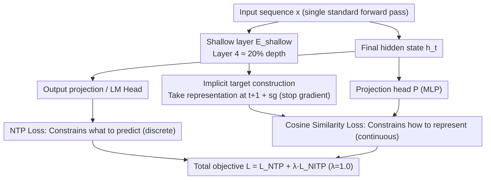

# NITP: Next Implicit Token Prediction for LLM Pre-training

**Conference**: ICML 2026  
**arXiv**: [2605.24956](https://arxiv.org/abs/2605.24956)  
**Code**: TBD  
**Area**: LLM Pre-training / Representation Learning  
**Keywords**: NTP Representation Degeneration, Implicit Target, Shallow Supervision, Cosine Similarity

## TL;DR
NITP provides continuous representation-space supervision for the final hidden states by using **shallow representations as implicit targets**. This supplements standard NTP to prevent hidden representations from degenerating into low-dimensional anisotropic configurations, achieving a 5.7% improvement in MMLU-Pro on a 9B MoE and general gains of 4-6% in reasoning tasks with only ~2% additional computational overhead.

## Background & Motivation

**Background**: Standard Next Token Prediction (NTP) is the mainstream paradigm for LLM pre-training. NTP essentially provides discrete, one-hot supervision in the output logit space.

**Limitations of Prior Work**: Although gradients propagate back to hidden states via the output projection, the NTP objective mainly constrains representations along the target logit direction, leaving a vast number of weakly constrained degrees of freedom in the latent space. This leads to **representation degeneration**—likelihood-based training compresses learned representations into a narrow anisotropic cone, which severely limits expressivity and is correlated with performance degradation in downstream tasks.

**Key Challenge**: NTP defines "what to predict" but does not constrain "how to represent." Hidden states can adopt many geometrically distinct configurations, but in practice, they fall into representation degeneration—sacrificing semantic richness for discriminative efficiency.

**Goal**: Address the blind spot of NTP regarding the geometry of hidden representations by guiding hidden states to maintain structured, semantically rich configurations through explicit representation-level supervision.

**Key Insight**: Instead of working in the discrete token space, supervision is applied in the continuous representation space—making the model predict the implicit semantic representation of the next token (using the model's own shallow representations as self-supervised targets). Shallow layers are suitable because they preserve rich lexical and local semantic details.

**Core Idea**: NITP = NTP (discrete supervision) + NITP (continuous representation space supervision). By using the next-token representation from shallow layers as an implicit target, the final hidden state is forced to align with it via a cosine similarity loss. This is parameter-efficient as implicit targets are derived from already computed intermediate activations without requiring additional forward passes.

## Method

### Overall Architecture
NITP aims to remedy a deficiency in standard NTP: NTP only provides supervision in the output logit space and ignores the geometric shape of the hidden states, leading to representations collapsing into a narrow anisotropic cone. NITP adds a continuous, representation-space supervision path to the final hidden layer during pre-training—tasking it with predicting the "implicit semantic representation of the next token."

The entire pipeline requires only a single standard forward pass: First, a shallow layer (e.g., Layer 4) computes the representation $z_{t+1}$ at position $t+1$ with a gradient stop, treating it as the implicit target. Then, the final hidden state $h_t$ is projected via a projection head $\mathcal{P}$ to align with this target. The two supervision paths are optimized jointly: $\mathcal{L}_{\text{NTP}}$ governs "what to predict," while $\mathcal{L}_{\text{NITP}} = 1 - \frac{\mathcal{P}(h_t)^\top z_{t+1}}{\|\mathcal{P}(h_t)\|_2 \cdot \|z_{t+1}\|_2}$ governs "how to represent." The total objective is $\mathcal{L}_{\text{total}} = \mathcal{L}_{\text{NTP}} + \lambda \mathcal{L}_{\text{NITP}}$ (where $\lambda = 1.0$ is most robust).

### Key Designs

**1. Implicit Target Construction: Using Shallow Representations as "Semantic Anchors"**

While NTP gradients propagate back to hidden states, constraints are primarily along the target logit direction, leaving degrees of freedom in the latent space weakly constrained, causing representations to collapse. NITP establishes a target directly in the continuous representation space: taking the model's own shallow layer (Layer 4, approx. 20% depth) representation at position $t+1$, defined as $z_{t+1} = \text{sg}[E_{\text{shallow}}(x_{\leq t+1})^{(t+1)}]$, as the implicit target. Shallow layers are chosen because they retain the richest lexical and local semantic details, forcing deep representations to maintain sufficient expressivity to predict them.

The prevention of degeneration can be understood through the Hessian: the NTP constraint on $h_t$ is essentially its dot product with the target token embedding, leading to a rank-deficient Hessian that allows representations to drift in the null space. NITP's cosine alignment places the target on a hypersphere; its Hessian approximates $H_{\text{NITP}}(h) \approx \frac{1}{r^2} P_{\perp u}$ (tangent space projection), injecting strictly positive curvature in all orthogonal directions, thereby "propping up" previously drifting directions into a structured geometry.

**2. Cosine Similarity Loss: Aligning in Representation Space to Bypass Inter-layer Scale Mismatch**

Both the predicted state and the implicit target are high-dimensional vectors. NITP selects cosine similarity as the metric to bring them together, using a simple MLP projection head $\mathcal{P}(\cdot)$. Cosine similarity is symmetric on $[-1, 1]$ and insensitive to scale. Ablations show it is more stable than MSE, Smooth-$\ell_1$, or KL divergence. The quadratic penalty of MSE amplifies natural scale mismatches between shallow and deep layers, causing gradient spikes; KL divergence treats vectors as probability distributions, introducing geometric distortion. Only cosine similarity, which focuses on direction rather than magnitude, matches the goal of "semantic alignment rather than numerical replication."

**3. Stop-Gradient + Full Self-Supervision: ~2% Overhead without External Dependencies**

The implicit target $z_{t+1}$ uses $\text{sg}[\cdot]$ to stop gradients; gradients flow only to the final layer and the projection head, not back to the shallow layer. This allows the shallow layer to act as a stable "semantic anchor" (it also converges faster). Since the supervision signal is generated from the model's own intermediate activations without extra forward passes or external data, the additional FLOPs remain at approximately 2%, while avoiding shifts and instabilities from external encoders.

## Key Experimental Results

### Main Results

| Model | Method | MMLU | MMLU-Pro | C3 | CommonsenseQA | Mean Gain |
|------|------|------|---------|-----|---------|---------|
| 1.9B MoE (0.3B active) | NTP | 31.05 | 7.14 | 32.21 | 25.38 | — |
| 1.9B MoE | NITP | 31.68 | 7.47 | 29.69 | 26.61 | +0.8 |
| 3B MoE | NTP | 34.60 | 11.00 | 39.06 | 34.15 | — |
| 3B MoE | NITP | 37.37 | 12.29 | 44.38 | 37.92 | +2.1 |
| **9B MoE** | **NTP** | 43.71 | 15.29 | 56.65 | 45.70 | — |
| **9B MoE** | **NITP** | **46.14** | **21.00** | **63.01** | **49.96** | **+2.7** |

On the 9B model, MMLU-Pro saw an absolute improvement of 5.7%; reading comprehension and commonsense reasoning increased by 6.4% and 4.3%, respectively.

### Ablation Study

| Configuration | MMLU | MMLU-Pro | CommonsenseQA | BBH | Average |
|------|------|---------|----------|-----|------|
| Baseline NTP | 34.60 | 11.00 | 34.15 | 21.92 | 25.42 |
| **Shallow (L₄)** | **37.37** | **12.29** | **37.92** | **26.14** | **28.43** |
| Middle (L₈) | 35.33 | 11.57 | 34.72 | 22.07 | 25.92 |
| Deep (L₁₄) | 35.79 | 10.43 | 38.90 | 23.25 | 27.09 |
| Current Pos t→t | 33.09 | 8.14 | 29.15 | 20.96 | 22.84 |
| MSE Loss | 32.77 | 10.29 | 30.38 | 21.55 | 23.75 |
| Cosine Reg (no pred) | 34.45 | 10.14 | 33.25 | 22.29 | 25.03 |

### Key Findings
- **Necessity of Shallow Layers**: Using shallow representations (~20% depth) outperforms middle or deep layers, as shallow layers preserve richer lexical and local semantic information.
- **Temporal Structure is Vital**: Predicting the next token's implicit representation ($t \to t+1$) outperforms current-position alignment ($t \to t$) by 5.6 percentage points.
- **Stability of Loss Functions**: MSE leads to gradient spikes and temporary divergence; cosine similarity is uniquely stable and yields the best performance.
- **Regularization is Not Prediction**: General cosine regularization constrains geometry but does not improve performance—gains stem from "predictive alignment" of semantic supervision.
- **Efficiency**: Additional FLOPs are only ~2%; $\lambda = 1.0$ is the most robust setting.

## Highlights & Insights
- **Diagnosing the Root Cause of Degeneration**: Effective rank and cosine similarity visualizations clearly show how NTP causes representations to drift toward low-dimensional anisotropic configurations; theoretical analysis uses the Hessian spectrum to explain the underlying mechanism.
- **Clever Design of Self-Supervised Targets**: Using shallow representations as "semantic anchors" neither requires external data/models nor introduces distribution shifts, while leveraging their semantic richness as an ideal supervision signal.
- **Generality and Transferability**: NITP proves effective across MoE and dense models, parameter sizes from 0.5B to 9B, and varied benchmarks.
- **Significant Gains with Minimal Cost**: Achieving 5%+ gains in knowledge understanding and 6%+ in reasoning at the cost of ~2% additional training FLOPs offers high industrial value.

## Limitations & Future Work
- NITP introduces additional hyperparameters (target layer, weight $\lambda$), and stability across different models requires further validation.
- The explanation for the total failure of current-position alignment ($t \to t$) needs deeper investigation.
- Applicability to larger-scale models (> 100B), different architectures, and multimodal models remains to be verified.
- The choice of the 4th layer for the implicit target may not be optimal for models with significantly different depths.

## Related Work & Insights
- **vs. Multi-token Prediction (MTP)**: MTP extends the prediction range in the discrete token space; NITP provides supervision in the representation space. The two are complementary.
- **vs. Layer Distillation**: Distillation aligns representations from two different models; NITP uses internal shallow layers to guide deep layers, avoiding external distribution shifts.
- **vs. Self-supervised Contrastive Learning (BYOL)**: Contrastive learning encourages consistency across views; NITP focuses on prediction along the temporal dimension.
- **Insight**: Representation-level supervision is a promising direction for addressing the incompleteness of standard LLM pre-training objectives.

## Rating
- Novelty: ⭐⭐⭐⭐⭐  Supplementing NTP with shallow implicit targets and theoretical explanations via Hessian—simple yet profound.
- Experimental Thoroughness: ⭐⭐⭐⭐⭐  Covers multiple scales, two architectures, extensive ablations, and combines theory with empirical validation.
- Writing Quality: ⭐⭐⭐⭐  Clear logic; the theoretical section is somewhat abstract but highlights key points.
- Value: ⭐⭐⭐⭐⭐  Directly improves LLM pre-training efficiency and performance; high value for industrial applications given the 5%+ gain for 2% cost.

<!-- RELATED:START -->

## Related Papers

- [\[ICLR 2026\] SNAP-UQ: Self-supervised Next-Activation Prediction for Single-Pass Uncertainty](../../ICLR2026/self_supervised/snap-uq_self-supervised_next-activation_prediction_for_single-pass_uncertainty_i.md)
- [\[CVPR 2026\] In Pursuit of Pixel Supervision for Visual Pre-training](../../CVPR2026/self_supervised/in_pursuit_of_pixel_supervision_for_visual_pre-training.md)
- [\[CVPR 2026\] Chain-of-Models Pre-Training: Rethinking Training Acceleration of Vision Foundation Models](../../CVPR2026/self_supervised/com_pt_chain_of_models_pretraining.md)
- [\[CVPR 2026\] Reading Your Actions: Learning Generalizable Action Representations via Pre-training AEMG](../../CVPR2026/self_supervised/reading_your_actions_learning_generalizable_action_representations_via_pre-train.md)
- [\[ECCV 2024\] Efficient Image Pre-Training with Siamese Cropped Masked Autoencoders](../../ECCV2024/self_supervised/efficient_image_pre-training_with_siamese_cropped_masked_autoencoders.md)

<!-- RELATED:END -->
