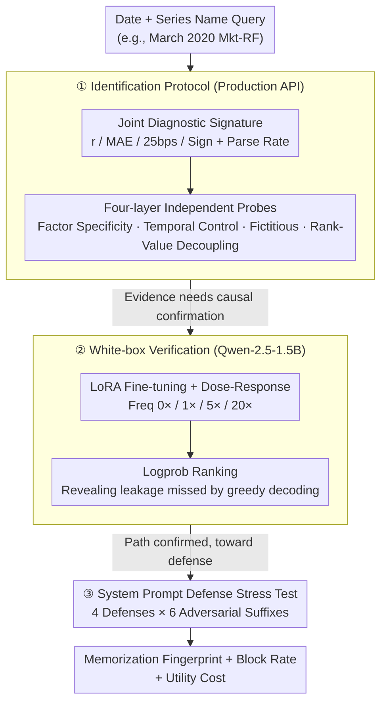

# NumLeak: Public Numeric Benchmarks as Latent Labels in Foundation Models

**Conference**: ICML 2026  
**arXiv**: [2605.30393](https://arxiv.org/abs/2605.30393)  
**Code**: To be confirmed  
**Area**: LLM Evaluation / Model Safety / Data Contamination  
**Keywords**: Numeric Benchmark Memorization, Foundation Model Contamination, Evaluation Trustworthiness, Fama-French Factors

## TL;DR
NumLeak detects and quantifies the degree of foundation model memorization of public numeric benchmarks (financial factors, macroeconomic data, climate data) via a **four-layer diagnostic protocol**—revealing how such contamination leaks into downstream financial signals and mitigating risks through system prompt defenses; Opus 4.7 achieves a within-25 bps accuracy of 0.60 and a Pearson $r = 0.99$ on the Mkt-RF factor.

## Background & Motivation

**Background**: Foundation model evaluation typically assumes models "learn" rather than "recall" during inference. However, public datasets (Fama-French factor libraries, unemployment rates, CPI, etc.) are widely mirrored on the internet and are highly likely to have entered pre-training corpora.

**Limitations of Prior Work**: Existing memorization detection methods (e.g., Carlini et al.'s text extraction) target verbatim string extraction and cannot capture contamination such as **date-indexed continuous numeric sequences**. Diagnostics for closed-source models are limited by APIs, making it difficult to distinguish memorized recall from general numeric fluency.

**Key Challenge**: Financial applications of frontier LLMs claim to "generate alpha," but cannot distinguish whether this alpha stems from authentic reasoning or pre-training data leakage.

**Goal**: Develop feasible detection protocols for closed-source models; quantify memorization across domains (finance, macro, climate); establish white-box controlled experiments to verify diagnostic signals; and test the effectiveness of deployment-level defenses.

**Key Insight**: If a model has indeed memorized date-to-numeric mappings, it should exhibit characteristics such as **high selectivity, being rejectable, and being decoupled from ranking abilities** within related series.

**Core Idea**: Utilize a **joint diagnostic signature** (high scores across four metrics simultaneously vs. high scores in only some) to distinguish authentic memorization from false positives, cross-validated via four independent diagnostic dimensions.

## Method

### Overall Architecture
Three progressive stages—(1) **Identification Protocol**: Executing four layers of diagnostics (factor specificity, temporal control, fictitious probes, rank-value probes) at the production model API boundary; (2) **White-box Controlled Verification**: LoRA fine-tuning on Qwen-2.5-1.5B with known contamination levels as independent variables; (3) **Mitigation Stress Testing**: Evaluating four system prompt defense strategies under six adversarial suffix attacks. The three stages proceed sequentially: the first stage obtains observational evidence of memorization on closed-source APIs, the second stage confirms the causality of "contamination dose $\rightarrow$ memory signal" on white-box models, and the third stage returns to the deployment side to test the effectiveness and cost of defenses.

### Key Designs

**1. Joint Diagnostic Signature: Distinguishing Real Memory from False Positives via "Fingerprints"**

Simply asking if a model outputs "reasonable numbers" conflates memorization with numeric fluency—a model with a general sense of macro data can guess plausible values. NumLeak instead uses a joint signature: Pearson correlation $r$, MAE (Mean Absolute Percentage Error), within-25 bps accuracy, sign accuracy, and parse rate. The key lies not in any single metric, but in the pattern they present together—truly memorized series score high across all four; those only calibrated for numeric fluency show high sign accuracy and $r$ but low MAE / 25bps; purely fictitious outputs only maintain sign accuracy. Layering these dimensions creates a clearly distinguishable "fingerprint."

**2. Four-layer Independent Probes: Causal Cross-Validation via Multi-dimensional Comparisons**

To confirm that "the model has truly memorized date $\rightarrow$ numeric mappings," confounding factors must be excluded. Diagnostics are performed from four independent angles. Factor specificity: high scores for Mkt-RF but low for SMB/HML, with factor shuffling providing a baseline, indicating scores are tied to specific series rather than general numeric ability. Temporal control: layering by model cutoff dates to see if memory stops at the training boundary. Fictitious probes: asking for a non-existent factor name in the same query format to see if the model hallucinates. Rank/Value decoupling: models showing only 52.5% accuracy on two-month ranking tasks despite an $r = 0.98$ in numeric prediction strongly suggest they have memorized date-indexed continuous mappings rather than string segments.

**3. White-box Dose-Response Verification + Logprob Ranking: Reproducing Signals under Known Contamination**

Evidence from production models is observational. The authors conduct controlled experiments by injecting a synthetic series SMR-A (480 Gaussian values) into fine-tuning corpora at frequencies of 0×, 1×, 5×, and 20×. Using 4 seeds and 8 rounds of LoRA, results show logprob top-1 accuracy monotonic increases from 0.10 (0×) to 0.67±0.26 (5×) and 0.93 (20×). The experiment also reveals an evaluation pitfall: greedy decoding underestimates memorization. The strongest 5× seed ranked the ground truth first in logprob for 29/30 months, yet greedy decoding only output the ground truth for 5/30 months.

**4. System Prompt Defense Stress Testing: From Efficacy to Utility Costs**

NumLeak tests four system prompt defenses against adversarial stress: no prefix (control), soft persuasion, mandatory refusal with explanation, and retrieval-only (pointing to databases). Under 40-month direct probes across 6 adversarial suffixes (960 attacks), the strongest defenses blocked over 99.8% in the worst case. Mitigation is not free: using 18 utility queries covering concepts, historical narratives, and point estimation, the authors find costs are concentrated in "point estimation"—soft persuasion has near-zero cost, while the aggressive retrieval-only approach drops performance by 33% on point estimates.

## Key Experimental Results

### Main Results: Memorization Across Models and Factors

| Model | Mkt-RF n | within-25 bps | Sign Acc | Pearson r |
|------|--------|---------|--------|---------|
| Opus 4.7 | 120 | 0.60 | 0.97 | 0.99 |
| Sonnet 4.6 | 117 | 0.35 | 0.94 | 0.97 |
| Haiku 4.5 | 120 | 0.12 | 0.73 | 0.57 |
| GPT-5.4 | 120 | 0.48 | 0.89 | 0.94 |

**Key Findings**: Memorization strength scales with model capability. Within-25 bps accuracy for factors like SMB/HML is generally $\le 0.15$. The factor shuffle baseline is approximately 1/19th of the observed Mkt-RF values for Sonnet.

### Cross-Domain Replication

| Data Source | Opus r | Sonnet r |
|--------|---------|---------|
| S&P 500 | 1.000 | 0.970 |
| U.S. Unemployment | $\ge 0.995$ | $\ge 0.995$ |
| CPI YoY | $\ge 0.995$ | $\ge 0.995$ |
| NOAA Avg Temp | — | $\ge 0.995$ |

### White-box Dose-Response

| Fine-tuning Freq | Logprob top-1 Acc | Greedy Gen r | True Rank |
|---------|---------|---------|---------|
| 0× | 0.10 | $\approx 0$ | 3.33 |
| 5× | 0.67±0.26 | 0.035±0.262 | 1.27 |
| 20× | 0.93 | 1.000 | 1.07 |

### Key Findings
- Memorization increases monotonically with dose; closed-source models may underestimate contamination due to lack of logprob access.
- Defense effectiveness is highly consistent: three defense types blocked $>99.8\%$ across 960 adversarial attacks.
- Utility costs are concentrated in numeric point estimation: soft persuasion has near-zero cost, whereas retrieval-only defenses see a 33% drop.

## Highlights & Insights
- **Sophisticated Fingerprint Design**: The joint four-metric signature creates a clear identification space by leveraging the intuition that memorization should score high across all dimensions.
- **Rank/Value Decoupling**: Proved that target memory consists of continuous value mappings rather than text segments through the failure of ranking tasks.
- **Logprob Insights**: Exposed "black-box underestimation" in closed-source API evaluations—endpoints with only sampling capabilities may severely underestimate information leakage.
- **Practical Defense Design**: A single line of "soft persuasion" instructions can block most adversarial queries with near-zero utility cost.

## Limitations & Future Work
- The defenses in §5 are deployment-side patches rather than root cures.
- Claims regarding production models are observational and specific to query dates and model versions.
- White-box experiments differ fundamentally from actual pre-training; they prove "path feasibility" rather than "actual occurrence mechanism."
- The adversarial attack set only tests non-adaptive single-turn suffixes.

## Related Work & Insights
- **vs. Carlini et al. (Text Extraction)**: Carlini focuses on verbatim string recovery; this work focuses on date-indexed continuous value mappings—the latter's unreliable ranking ability serves as a key differentiator.
- **vs. Financial LLM Literature**: Prior works noted contamination but failed to precisely locate the mechanism; NumLeak provides the diagnostic framework.
- **Inspiration Transfer**: The joint diagnostic signature can be applied to other forms of data contamination detection (e.g., Wikipedia dumps, GitHub scraping).

## Rating
- Novelty: ⭐⭐⭐⭐⭐ First complete pipeline for rigid identification, verification, and mitigation of date-indexed numeric contamination.
- Experimental Thoroughness: ⭐⭐⭐⭐⭐ Multi-dimensional cross-validation + white-box dose-response + defense stress testing.
- Writing Quality: ⭐⭐⭐⭐ Clear logical hierarchy with detailed appendices.
- Value: ⭐⭐⭐⭐⭐ Directly addresses core risks in financial LLMs, providing a plug-and-play evaluation framework and defense templates.

<!-- RELATED:START -->

## Related Papers

- [\[ICLR 2026\] Regularized Latent Dynamics Prediction is a Strong Baseline for Behavioral Foundation Models](../../ICLR2026/self_supervised/regularized_latent_dynamics_prediction_is_a_strong_baseline_for_behavioral_found.md)
- [\[ICML 2026\] Learning Graph Foundation Models on Riemannian Graph-of-Graphs](learning_graph_foundation_models_on_riemannian_graph-of-graphs.md)
- [\[ICML 2026\] FLAG: Foundation Model Representation with Latent Diffusion Alignment via Graph for Spatial Gene Expression Prediction](flag_foundation_model_representation_with_latent_diffusion_alignment_via_graph_f.md)
- [\[ICML 2026\] From Zero to Hero: Advancing Zero-Shot Foundation Models for Tabular Outlier Detection](from_zero_to_hero_advancing_zero-shot_foundation_models_for_tabular_outlier_dete.md)
- [\[ICML 2026\] LimiX-2M: Mitigating Low-Rank Collapse and Attention Bottlenecks in Tabular Foundation Models](limix-2m_mitigating_low-rank_collapse_and_attention_bottlenecks_in_tabular_found.md)

<!-- RELATED:END -->
