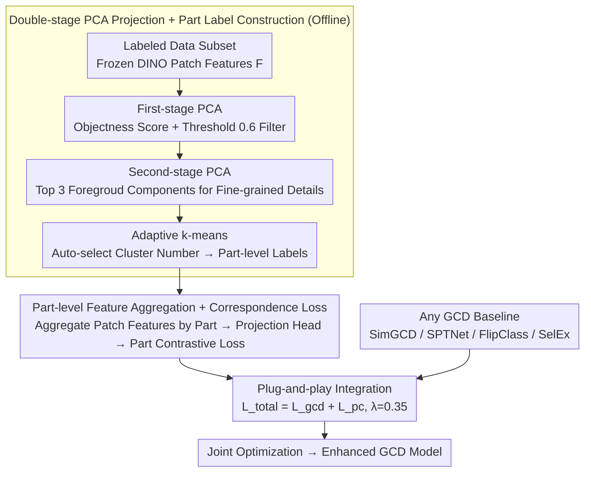

# PartCo: Part-Level Correspondence Priors Enhance Category Discovery

**Conference**: ICML 2026  
**arXiv**: [2509.22769](https://arxiv.org/abs/2509.22769)  
**Code**: To be confirmed  
**Area**: Self-Supervised Learning / Open-World Vision  
**Keywords**: Category Discovery, Part-Level Correspondence, ViT Features, Part-Level Contrastive Learning

## TL;DR
PartCo introduces a **plug-and-play** framework to enhance Generalized Category Discovery by explicitly leveraging **part-level feature correspondences** inherent in Vision Transformer patch tokens, improving baselines like SimGCD / SPTNet / FlipClass by 2-10% across multiple benchmarks including CUB, Stanford-Cars, and ImageNet-100.

## Background & Motivation

**Background**: Generalized Category Discovery (GCD) aims to identify both known and novel categories in unlabeled data by utilizing a small set of labeled samples from known categories.

**Limitations of Prior Work**: Existing GCD methods primarily rely on global image representations (e.g., the [CLS] token of a Transformer), which capture global semantics but abstract away fine-grained part-level information. This leads to sub-optimal performance when distinguishing highly similar categories.

**Key Challenge**: Patch tokens in ViT models contain rich part-level semantic information, but direct utilization faces three challenges: (1) lack of explicit part-level semantic labels; (2) confusion from foreground-background noise; and (3) variations in object scale and orientation across samples.

**Goal**: Automatically extract part-level correspondence labels from ViT patch tokens and use them as supervision signals to guide feature learning.

**Key Insight**: Patch token features of self-supervised foundation models (especially DINOv2) naturally contain part-level correspondence info. Rather than letting the model learn parts from scratch, it is more effective to explicitly construct part-level labels to guide feature alignment.

**Core Idea**: Object regions and fine-grained features are extracted from the patch tokens of a frozen DINO model via double-stage PCA projection. Part-level labels are then generated using k-means clustering, followed by the design of a matching contrastive loss function.

## Method

### Overall Architecture
Two stages—**Offline Stage**: Use a frozen pre-trained DINO model on a subset of labeled data to automatically generate part-level correspondence labels via two-step PCA projection; **Training Stage**: Aggregate ViT patch features based on part-level labels and introduce a part-level correspondence loss to be optimized jointly with the GCD baseline loss.

### Key Designs

**1. Double-stage PCA Projection + Part Label Construction: Automatically mining object parts from frozen ViTs**

GCD is challenging when distinguishing highly similar classes because global representations like [CLS] abstract away fine-grained part information. Patch tokens actually hide rich part-level semantics, but direct use is hindered by several factors: lack of part-level labels, foreground-background noise, and cross-sample scale/orientation changes. PartCo uses two-step PCA to extract these parts as labels. First-stage PCA calculates the maximum variance direction $\mathbf{w}_{\text{obj}}$ for all patch features $\mathbf{F} \in \mathbb{R}^{M \times N \times d}$ to compute objectness scores $\mathbf{F}_{\text{obj}} = \mathbf{F} \cdot \mathbf{w}_{\text{obj}}$. A threshold $\tau_{\text{obj}} = 0.6$ is then used to generate a foreground mask $\mathbf{M}$ to filter out background noise. Second-stage PCA is applied only to the masked features $\mathbf{F} \odot \mathbf{M}$, extracting the top three principal components $\mathbf{F}_{\text{fg}}$ to characterize the fine-grained structure within the foreground. Finally, adaptive k-means automatically selects the number of clusters by maximizing "cluster center distance × cluster size balance."

The key to this step is leveraging the inherent part-level correspondence in patch features of foundation models (especially DINOv2) without any manual annotation. The granularity is also dataset-adaptive—first-stage PCA is sufficient for fine-grained datasets, while second-stage PCA is used for general datasets to capture more details.

**2. Part-level Feature Aggregation + Correspondence Loss: Aligning identical parts across samples**

Once part labels are obtained, patch features are aggregated by part groups: for each part category $c$, the mean $\mathbf{f}_c$ is calculated and projected into a contrastive space $\mathbf{h}_c = \psi_p(\mathbf{f}_c)$ via a part projection head $\psi_p$. The supervised part contrastive loss is defined as:

$$\mathcal{L}_{\text{pc}}^{\text{sup}} = \frac{1}{|B_l|} \sum_i \frac{1}{|\mathcal{C}|} \sum_c \frac{1}{|\mathbb{N}_i^c|} \sum_q -\log \frac{\exp(\mathbf{h}_c \cdot \mathbf{h}_q / \tau_r)}{\sum_{j \notin \mathbb{N}_i^c} \exp(\mathbf{h}_c \cdot \mathbf{h}_j / \tau_r)}$$

This encourages tight intra-part clustering and clear inter-part separation. For unlabeled data, pseudo-labels replace ground truth labels for the same loss. This explicit part-level constraint forces the model to learn cross-sample part correspondences, thereby capturing subtle visual structural differences that are invisible to global features alone.

**3. Plug-and-play Integration: Adding one loss term to any GCD baseline**

PartCo does not modify the pipeline of the original method; it only adds an extra term to the loss function: total loss $\mathcal{L}_{\text{total}} = \mathcal{L}_{\text{gcd}} + \mathcal{L}_{\text{pc}}$, with a balance factor $\lambda_b = 0.35$ (validated experimentally as optimal and robust). Since the part-level constraint is added as extra supervision, baselines from different paradigms such as SimGCD, SPTNet, FlipClass, and SelEx can benefit directly without requiring per-method redesigns.

## Key Experimental Results

### Main Results

| Method | Dataset | All ACC | Old ACC | New ACC | Gain vs. Baseline |
|------|--------|---------|---------|---------|------------|
| SimGCD | CUB | 71.5% | 78.1% | 68.3% | Baseline |
| **PartCo-SimGCD** | CUB | **81.1%** | 82.4% | 80.5% | **+9.6%** |
| SPTNet | CUB | 76.3% | 79.5% | 74.6% | Baseline |
| **PartCo-SPTNet** | CUB | **82.6%** | 82.3% | 81.8% | **+6.3%** |
| FlipClass | CUB | 79.3% | 80.7% | 78.5% | Baseline |
| **PartCo-FlipClass** | CUB | **85.2%** | 86.3% | 84.7% | **+5.9%** |
| SelEx | CUB | 87.4% | 85.1% | 88.5% | Baseline |
| **PartCo-SelEx** | CUB | **90.6%** | 84.5% | 93.2% | **+3.2%** |

**SSB fine-grained benchmark average results** (DINOv2): SimGCD 69.0% → 78.8% (+9.8%); SPTNet 72.2% → 80.4% (+8.2%); FlipClass 76.1% → 80.9% (+4.8%); SelEx 83.1% → 85.5% (+2.4%).

### Ablation Study

| Configuration | CUB All | Stanford-Cars All | Note |
|------|---------|------------------|------|
| W/O Part-level Constraint | 71.5% | 71.5% | Original Baseline |
| First-stage Labels Only | 79.3% | 76.9% | Suitable for Fine-grained |
| Second-stage Labels Only | 73.1% | 71.8% | Over-segmentation on Fine-grained |
| First + Second Stage | 77.2% | 75.6% | Hybrid Solution |
| **Full PartCo** | **81.1%** | **78.9%** | Adaptive Optimal |

### Key Findings
- First-stage labels perform best on fine-grained datasets; second-stage labels outperform on general datasets (ImageNet-100).
- A projection dimension of $d' = 128$ is optimal; higher dimensions lead to overfitting.
- The addition of unsupervised part loss significantly improves performance (+2.1%), indicating that constraints on unlabeled data are critical.
- The balance factor $\lambda_b = 0.35$ exhibits the strongest robustness.

## Highlights & Insights
- **Clever construction of self-supervised signals**: By leveraging the inherent structure of foundation models (patch tokens), part-level correspondence labels are obtained without additional annotation. This PCA + clustering approach is more stable and efficient than the pixel-wise prompt learning used in SPTNet.
- **Universal and lightweight enhancement mechanism**: PartCo serves as an independent module that can be combined with any GCD method, showing gains across multiple paradigms (SimGCD, SPTNet, FlipClass, SelEx).
- **Dataset-adaptive granularity selection**: The automatic switching between first- and second-stage labels elegantly handles the heterogeneity between fine-grained and general datasets.

## Limitations & Future Work
- Offline label construction cost: Part labels must be pre-constructed (taking 5-180 minutes depending on dataset size).
- Heuristic nature of threshold and cluster selection: The method still relies on a preset threshold $\tau_{\text{obj}} = 0.6$ and k-means initializations.
- Limited part semantics: The proposed part labels are results of pure visual clustering and may not correspond to true semantic parts.
- Future work: Incorporating weak semantic priors to guide PCA projection; designing online dynamic update mechanisms; extending to 3D object discovery and video sequences.

## Related Work & Insights
- **vs. SPTNet**: Both focus on part-level information, but while SPTNet learns pixel-level prompt masks requiring supervised backpropagation, PartCo extracts correspondence labels directly from frozen models, making it more stable.
- **vs. HypCD**: HypCD changes the geometric metric via hyperbolic space, whereas PartCo injects visual inductive bias through explicit part structures.
- **vs. Self-supervised Part Discovery**: PartCo utilizes the implicit part knowledge in frozen DINO—large-scale self-supervised pre-training has already sufficiently learned visual structures.

## Rating
- Novelty: ⭐⭐⭐⭐  Clever automatic construction of part-level correspondence labels and elegant integration with existing GCD methods.
- Experimental Thoroughness: ⭐⭐⭐⭐⭐  Covers fine-grained and general datasets, multiple baselines, multiple backbones (DINOv2/v3/CLIP), and detailed ablations.
- Writing Quality: ⭐⭐⭐⭐  Clear structure and smooth logical progression.
- Value: ⭐⭐⭐⭐⭐  Provides a simple and effective enhancement mechanism for the important problem of open-world vision in GCD, with potential to become a standard component.

<!-- RELATED:START -->

## Related Papers

- [\[ICLR 2026\] Part-level Semantic-guided Contrastive Learning for Fine-grained Visual Classification](../../ICLR2026/self_supervised/part-level_semantic-guided_contrastive_learning_for_fine-grained_visual_classifi.md)
- [\[CVPR 2026\] Decouple Your Discovery and Memory in Continual Generalized Category Discovery](../../CVPR2026/self_supervised/decouple_your_discovery_and_memory_in_continual_generalized_category_discovery.md)
- [\[CVPR 2025\] Hyperbolic Category Discovery](../../CVPR2025/self_supervised/hyperbolic_category_discovery.md)
- [\[ICLR 2026\] Adaptive Gaussian Expansion for On-the-fly Category Discovery](../../ICLR2026/self_supervised/adaptive_gaussian_expansion_for_on-the-fly_category_discovery.md)
- [\[AAAI 2026\] GOAL: Geometrically Optimal Alignment for Continual Generalized Category Discovery](../../AAAI2026/self_supervised/goal_geometrically_optimal_alignment_for_continual_generalized_category_discover.md)

<!-- RELATED:END -->
