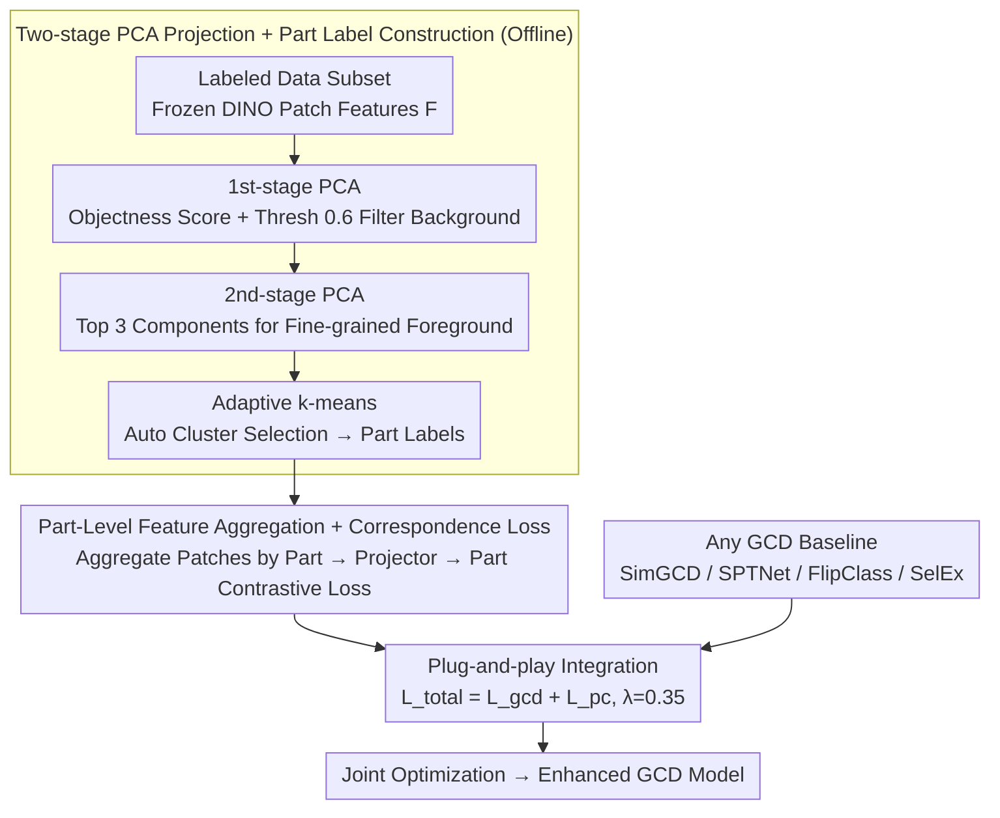

# PartCo: Part-Level Correspondence Priors Enhance Category Discovery

**Conference**: ICML 2026  
**arXiv**: [2509.22769](https://arxiv.org/abs/2509.22769)  
**Code**: To be confirmed  
**Area**: Self-Supervised Learning / Open-World Vision  
**Keywords**: Category Discovery, Part-Level Correspondence, ViT Features, Part-Level Contrastive Learning  

## TL;DR
PartCo introduces a **plug-and-play** framework to enhance Generalized Category Discovery by explicitly utilizing **part-level feature correspondences** inherent in Vision Transformer patch tokens—improving SimGCD / SPTNet / FlipClass baselines by 2-10% on several benchmarks including CUB, Stanford-Cars, and ImageNet-100.

## Background & Motivation

**Background**: Generalized Category Discovery (GCD) aims to identify both known and novel categories in unlabeled data by leveraging a small set of labeled samples from known categories.

**Limitations of Prior Work**: Existing GCD methods primarily rely on global image representations (such as the Transformer [CLS] token), which capture global semantic information but abstract away fine-grained part-level details—leading to poor performance when distinguishing highly similar categories.

**Key Challenge**: Patch tokens in ViT models contain rich part-level semantic information, but direct utilization faces three challenges: (1) lack of explicit part-level semantic labels; (2) confusion from foreground-background noise; (3) variations in object scale and orientation across samples.

**Goal**: To automatically extract part-level correspondence labels from ViT patch tokens and use them as supervision signals to guide feature learning.

**Key Insight**: Patch token features of self-supervised foundation models (especially DINOv2) naturally contain part-level correspondence information. Rather than letting the model learn parts from scratch, it is more effective to explicitly construct part-level labels to guide feature alignment.

**Core Idea**: Extract object regions and fine-grained features from frozen DINO model patch tokens via two-stage PCA projection, generate part-level labels using k-means clustering, and then design a corresponding contrastive loss function.

## Method

### Overall Architecture
The framework consists of two stages—**Offline Phase**: Use a frozen pre-trained DINO model to perform two-stage PCA projection on a subset of labeled data to automatically generate part-level correspondence labels; **Training Phase**: Aggregate ViT patch features based on part-level labels and introduce a part-level correspondence loss jointly optimized with the GCD baseline loss.

### Key Designs

**1. Two-stage PCA Projection + Part Label Construction: Harvesting Object Parts from Frozen ViT**

GCD struggles with distinguishing highly similar classes, and global representations like [CLS] abstract away fine-grained parts. Patch tokens contain rich part-level semantics, but direct use is hindered by the absence of labels, noise, and geometric variations. PartCo uses two-stage PCA to extract these parts as labels. The first stage PCA calculates the maximum variance direction $\mathbf{w}_{\text{obj}}$ for all patch features $\mathbf{F} \in \mathbb{R}^{M \times N \times d}$, computes an objectness score $\mathbf{F}_{\text{obj}} = \mathbf{F} \cdot \mathbf{w}_{\text{obj}}$, and uses a threshold $\tau_{\text{obj}} = 0.6$ to generate a foreground mask $\mathbf{M}$ to filter background noise. The second stage PCA extracts the top three principal components $\mathbf{F}_{\text{fg}}$ only from the masked features $\mathbf{F} \odot \mathbf{M}$ to characterize fine-grained structures within the foreground. Finally, adaptive k-means automatically selects the number of clusters by maximizing "cluster distance $\times$ cluster balance."

The key is leveraging the natural part-level correspondence in frozen foundation model (DINOv2) features without manual annotation. The granularity adapts to the dataset—first-stage is sufficient for fine-grained datasets, while second-stage adds details for general datasets.

**2. Part-Level Feature Aggregation + Correspondence Loss: Cross-Sample Part Alignment**

With part labels, patch features are grouped and aggregated by part category $c$: the average $\mathbf{f}_c$ is calculated for each part and mapped to a contrastive space $\mathbf{h}_c = \psi_p(\mathbf{f}_c)$ via a part projector $\psi_p$. The supervised part contrastive loss is defined as:

$$\mathcal{L}_{\text{pc}}^{\text{sup}} = \frac{1}{|B_l|} \sum_i \frac{1}{|\mathcal{C}|} \sum_c \frac{1}{|\mathbb{N}_i^c|} \sum_q -\log \frac{\exp(\mathbf{h}_c \cdot \mathbf{h}_q / \tau_r)}{\sum_{j \notin \mathbb{N}_i^c} \exp(\mathbf{h}_c \cdot \mathbf{h}_j / \tau_r)}$$

This encourages intra-part compactness and inter-part separation; for unlabeled data, pseudo-labels replace ground truth for the same loss. This explicit constraint forces the model to learn part correspondences across samples, capturing subtle visual structures invisible to global features.

**3. Plug-and-play Integration: Enhancing Baselines via Loss Addition**

PartCo does not modify the pipeline of the original method, adding only one term to the loss: $\mathcal{L}_{\text{total}} = \mathcal{L}_{\text{gcd}} + \mathcal{L}_{\text{pc}}$, with a balancing factor $\lambda_b = 0.35$ (verified to be optimal and robust). Since the part-level constraint is an additional supervision, baselines like SimGCD, SPTNet, FlipClass, and SelEx can benefit directly without architectural redesign.

## Key Experimental Results

### Main Results

| Method | Dataset | All ACC | Old ACC | New ACC | Gain |
|------|--------|---------|---------|---------|------------|
| SimGCD | CUB | 71.5% | 78.1% | 68.3% | Baseline |
| **PartCo-SimGCD** | CUB | **81.1%** | 82.4% | 80.5% | **+9.6%** |
| SPTNet | CUB | 76.3% | 79.5% | 74.6% | Baseline |
| **PartCo-SPTNet** | CUB | **82.6%** | 82.3% | 81.8% | **+6.3%** |
| FlipClass | CUB | 79.3% | 80.7% | 78.5% | Baseline |
| **PartCo-FlipClass** | CUB | **85.2%** | 86.3% | 84.7% | **+5.9%** |
| SelEx | CUB | 87.4% | 85.1% | 88.5% | Baseline |
| **PartCo-SelEx** | CUB | **90.6%** | 84.5% | 93.2% | **+3.2%** |

**SSB Fine-grained Benchmark Average** (DINOv2): SimGCD 69.0% → 78.8% (+9.8%); SPTNet 72.2% → 80.4% (+8.2%); FlipClass 76.1% → 80.9% (+4.8%); SelEx 83.1% → 85.5% (+2.4%).

### Ablation Study

| Configuration | CUB All | Stanford-Cars All | Description |
|------|---------|------------------|------|
| w/o Part Constraint | 71.5% | 71.5% | Original Baseline |
| 1st-stage Labels Only | 79.3% | 76.9% | Best for fine-grained |
| 2nd-stage Labels Only | 73.1% | 71.8% | Over-segmentation on fine-grained |
| 1st + 2nd Hybrid | 77.2% | 75.6% | Mixture scheme |
| **Full PartCo** | **81.1%** | **78.9%** | Adaptive optimal |

### Key Findings
- First-stage labels perform best on fine-grained datasets; second-stage labels outperform on general datasets (ImageNet-100).
- Projection dimension $d' = 128$ is optimal; higher dimensions lead to overfitting.
- Unsupervised part loss significantly improves performance (+2.1%), highlighting the importance of constraints on unlabeled data.
- Balancing factor $\lambda_b = 0.35$ shows the strongest robustness.

## Highlights & Insights
- **Ingenious Self-Supervision Construction**: Obtains part-level correspondence labels directly from the innate structure of frozen foundation models (patch tokens) without manual labels. PCA + clustering is more stable/efficient than pixel-wise prompt learning (SPTNet).
- **Universal & Lightweight Enhancement**: PartCo serves as an independent module compatible with any GCD method, showing consistent gains across SimGCD, SPTNet, FlipClass, and SelEx.
- **Dataset-Adaptive Granularity**: Elegantly handles the heterogeneity of fine-grained and general datasets through automatic switching between first- and second-stage labels.

## Limitations & Future Work
- Offline label construction cost: Part labels must be pre-constructed (5-180 minutes depending on dataset size).
- Heuristic selections: Still relies on preset thresholds ($\tau_{\text{obj}} = 0.6$) and k-means initializations.
- Semantic limits: Labels are results of visual clustering and may not correspond to true semantic parts.
- Future work: Incorporating weak semantic priors for PCA projection guidance; designing online dynamic update mechanisms; extending to 3D discovery and video sequences.

## Related Work & Insights
- **vs SPTNet**: Both focus on part-level info, but SPTNet requires supervised backpropagation for pixel-level prompt masks; PartCo is more stable by extracting labels from frozen models.
- **vs HypCD**: HypCD changes geometric metrics via hyperbolic space; PartCo injects visual inductive bias via explicit part structures.
- **vs Self-supervised Part Discovery**: PartCo leverages implicit part knowledge from frozen DINO—large-scale pre-training has already sufficiently learned visual structures.

## Rating
- Novelty: ⭐⭐⭐⭐  Clever automatic construction of part correspondence labels and elegant integration.
- Experimental Thoroughness: ⭐⭐⭐⭐⭐  Covers fine-grained/general datasets, multiple baselines, multiple backbones (DINOv2/v3/CLIP), and detailed ablations.
- Writing Quality: ⭐⭐⭐⭐  Clear structure and logical flow.
- Value: ⭐⭐⭐⭐⭐  Provides a simple yet effective enhancement mechanism for GCD, with potential to become a standard component.

<!-- RELATED:START -->

## Related Papers

- [\[CVPR 2026\] Decouple Your Discovery and Memory in Continual Generalized Category Discovery](../../CVPR2026/self_supervised/decouple_your_discovery_and_memory_in_continual_generalized_category_discovery.md)
- [\[CVPR 2025\] Hyperbolic Category Discovery](../../CVPR2025/self_supervised/hyperbolic_category_discovery.md)
- [\[ICML 2026\] Scaling Continual Learning to 300+ Tasks with Bi-Level Routing Mixture-of-Experts](scaling_continual_learning_to_300_tasks_with_bi-level_routing_mixture-of-experts.md)
- [\[CVPR 2026\] OmniGCD: Abstracting Generalized Category Discovery for Modality Agnosticism](../../CVPR2026/self_supervised/omnigcd_abstracting_generalized_category_discovery_for_modality_agnosticism.md)
- [\[AAAI 2026\] GOAL: Geometrically Optimal Alignment for Continual Generalized Category Discovery](../../AAAI2026/self_supervised/goal_geometrically_optimal_alignment_for_continual_generalized_category_discover.md)

<!-- RELATED:END -->
