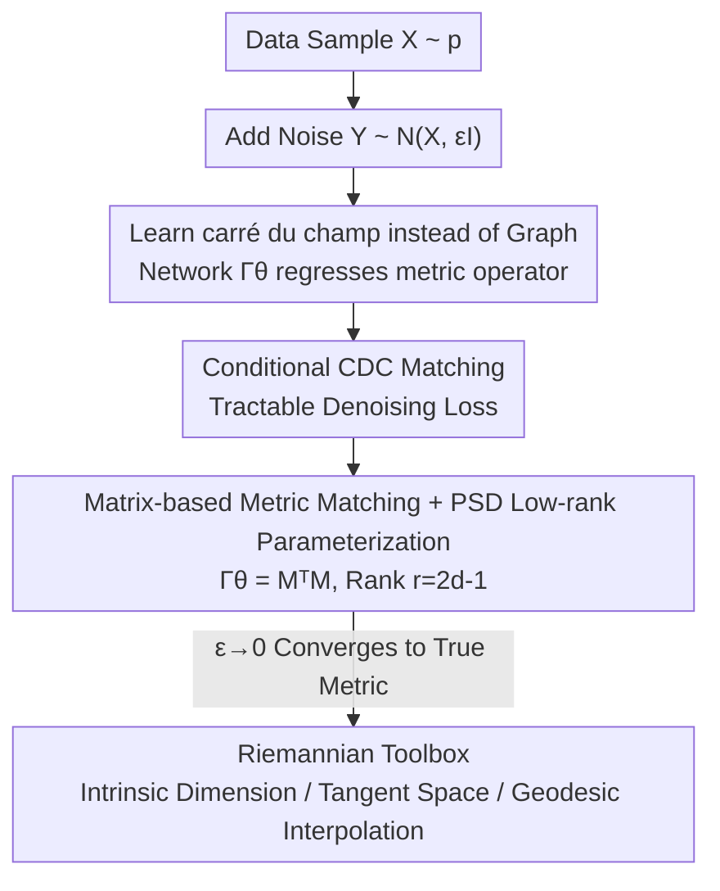

# Riemannian Metric Matching for Scalable Geometric Modeling of Distributions

**Conference**: ICML 2026  
**arXiv**: [2606.14334](https://arxiv.org/abs/2606.14334)  
**Code**: TBD  
**Area**: Representation Learning / Manifold Geometry / Diffusion Geometry  
**Keywords**: Riemannian Metric, carré du champ, Manifold Hypothesis, Denoising Loss, Amortized Inference

## TL;DR
The "Riemannian metric of the data manifold" is rewritten as a carré du champ operator, and a neural network is trained to learn this operator directly using a denoising-style conditional regression loss. This eliminates the need for kNN graph construction or computing large network Jacobians, allowing for the amortized estimation of intrinsic dimensionality, tangent spaces, and geodesic paths on high-dimensional data at a constant cost. Inference is up to 400x faster than kNN-based diffusion geometry estimation.

## Background & Motivation

**Background**: Real-world high-dimensional data is often locally concentrated on low-dimensional structures (the manifold hypothesis). To quantify this geometry (intrinsic dimensionality, tangent space, curvature), the standard workflow involves first constructing a graph on samples—either a dense kernel graph or a $k$-NN graph—and then performing spectral analysis of the diffusion geometry or the Laplace-Beltrami operator on that graph.

**Limitations of Prior Work**: Graph-based methods incur computational and memory costs that scale super-linearly or even quadratically with the number of samples. This cost persists during **inference**: the nearest neighbors must be recalculated for every new point, making efficient out-of-sample extension impossible. Furthermore, these methods rely on pairwise distances; in high dimensions, Euclidean distances tend to become indistinguishable, leading to graph distortion. Another line of research utilizes the Jacobian of pre-trained VAEs, GANs, or diffusion models to infer geometry. However, this shifts the burden to computing large network Jacobians at inference time, which is expensive and numerically unstable. Moreover, the geometry is "indirectly" extracted from models trained for other objectives, lacking convergence guarantees.

**Key Challenge**: The goal is a "point-wise, differentiable, and dataset-size independent" metric estimator. However, classical tools either tie the cost to pairwise distances/graph construction or treat geometry as parasitic to other models.

**Goal**: To train a neural network to **directly regress** the Riemannian metric at each point, achieving sample-level training and constant-cost amortized inference, with theoretical guarantees that the estimator converges to the true metric when the data is locally a manifold.

**Key Insight**: A critical observation is that the carré du champ (CDC) operator, which characterizes the Riemannian metric, can be expressed as a **conditional expectation** of random perturbations of the data. Conditional expectations are naturally suited for denoising-style regression (the core training strategy of diffusion models).

**Core Idea**: Use the conditional regression approach from denoising diffusion to learn the CDC operator: replace the intractable "marginal CDC" with a tractable "conditional CDC." Since both share the same gradient, the network only needs to perform regression on "clean sample $X$ + noisy sample $Y$" pairs to learn the Riemannian geometry.

## Method

### Overall Architecture

The method is termed **Riemannian metric matching**. The input consists of samples from the data distribution $X \sim p$. The output is a neural network $\Gamma_\varepsilon^\theta(Y)$ that takes coordinates $Y$ and outputs a $D \times D$ positive semi-definite matrix—the (diffusion) Riemannian metric tensor at that point. No graph is constructed during training: Gaussian noise is added to each sample $X$ to obtain $Y \sim \mathcal{N}(X, \varepsilon \mathbf{I})$, and the network regresses a conditional target involving only a single pair $(X, Y)$, which can be computed in $\mathcal{O}(1)$. During inference, the metric is obtained via a single forward pass for any new point, requiring no neighbors.

The theoretical foundation is the carré du champ identity in diffusion geometry: for the Laplace–Beltrami operator $\Delta_g$,

$$\Gamma_{\Delta_g}(f,h)=\tfrac{1}{2}\big(f\Delta_g h+h\Delta_g f-\Delta_g(fh)\big)=g(\nabla f,\nabla h),$$

which implies that "learning the CDC operator" is equivalent to "obtaining the Riemannian metric $g$." This enables the use of the full Riemannian geometry toolbox (intrinsic gradients, local dimensionality, geodesic interpolation). Downstream applications after obtaining the metric: the intrinsic gradient $\nabla f$ is the projection of the Euclidean gradient onto the tangent space; local dimensionality is estimated by the eigenvalue ratios of the metric matrix; and on-manifold interpolation paths are provided by intrinsic gradient flows.

### Key Designs

**1. Learning the carré du champ operator instead of constructing neighbor graphs**

The pain point of graph/kernel methods is that costs explode with scale, and pairwise distances fail in high dimensions. This work bypasses graphs to learn an **operator**—the CDC. In Markov diffusion operator theory, any generator $\mathcal{L}$ defines a bilinear form $\Gamma_{\mathcal{L}}(f,h)=\tfrac12(f\mathcal{L}h+h\mathcal{L}f-\mathcal{L}(fh))$, and when $\mathcal{L}$ is $\Delta_g$, it exactly equals the metric $g(\nabla f,\nabla h)$. A crucial property is that the CDC **does not depend on first-order drift terms**: substituting an operator $\mathcal{L}f=\Delta_g f-2g(\nabla\log p,\nabla f)$ containing density gradients causes the drift terms to cancel out via the Leibniz rule, such that $\Gamma_{\mathcal{L}}=\Gamma_{\Delta_g}$. This means even if the data density is non-uniform, the learned CDC still converges to the pure geometric metric without being contaminated by sampling density.

**2. Conditional CDC Matching: Replacing intractable targets with denoising-style conditional regression**

Directly regressing the "marginal CDC" $\Gamma_\varepsilon(f,h)(\mathbf{y})$ (the local covariance in Equation 5) is intractable because it is an expectation over a neighborhood, requiring graph construction. The proposed solution is to define a **conditional CDC** involving only a single pair $(\mathbf{x}, \mathbf{y})$:

$$\Gamma_\varepsilon(f,h)(\mathbf{x},\mathbf{y})=\frac{1}{2\varepsilon}\big(f(\mathbf{x})-f(\mathbf{y})\big)\big(h(\mathbf{x})-h(\mathbf{y})\big).$$

Since noise is added such that $p_Y=p*\mathcal{N}(0,\varepsilon\mathbf{I})$, it can be proven using Bayes' rule that the marginal CDC is the conditional expectation of the conditional CDC given $Y=\mathbf{y}$: $\Gamma_\varepsilon(f,h)(\mathbf{y})=\mathbb{E}_X[\Gamma_\varepsilon(f,h)(X,\mathbf{y})\mid Y=\mathbf{y}]$. Therefore, one only needs to minimize the conditional loss $\mathcal{L}^{CDC}_{cond}(\theta)=\mathbb{E}_{X,Y|X}\big[(\Gamma_\varepsilon^\theta(Y)-\Gamma_\varepsilon(f,h)(X,Y))^2\big]$. Theorem 3.1 provides the key guarantee: $\mathcal{L}^{CDC}_{cond}=\mathcal{L}^{CDC}_{marg}+C$, where the constant $C$ is independent of $\theta$, thus their gradients are identical. Optimizing the tractable conditional loss is equivalent to optimizing the intractable marginal loss. This is the geometric version of the "regressing noise = regressing score" denoising equivalence used in DDPM: the target is $\mathcal{O}(1)$ computable, back-propagatable, independent across samples, and naturally suited for GPU mini-batch and distributed training.

**3. Matrix-based metric matching + PSD low-rank parameterization**

By setting $f, h$ as the ambient coordinate functions $x_k$, the target transforms from a scalar to a matrix: the conditional target becomes $\tfrac{1}{2\varepsilon}(X-Y)(X-Y)^T$, and the loss is the Frobenius norm:

$$\mathcal{L}^{\text{Riem}}_{cond}=\mathbb{E}_{X,Y|X}\Big[\big\|\Gamma_\varepsilon^\theta(Y)-\tfrac{1}{2\varepsilon}(X-Y)(X-Y)^T\big\|_F^2\Big].$$

Since the metric $\Gamma_\varepsilon(Y)$ is symmetric positive semi-definite (PSD) by definition, the network outputs a matrix $M_\varepsilon^\theta(Y)$ and sets $\Gamma_\varepsilon^\theta=M^TM$ to enforce PSD. Given that the ambient dimension $D$ is often much larger than the intrinsic dimension $d$, the authors use a **low-rank** version $M_\varepsilon^\theta(Y)\in\mathbb{R}^{r\times D}$ to constrain the metric rank to $\le r$. Theorem 4.2 proves that $r=2d-1$ is always sufficient ($r=d$ is generally insufficient, e.g., for a 2D sphere which is non-parallelizable due to the "hairy ball theorem"). Low-rank parameterization also provides engineering benefits: using $\|M^TM\|_F^2=\|MM^T\|_F^2$, the loss can be simplified to calculate $r\times r$ quantities, **never explicitly constructing $D\times D$ matrices**, saving time and memory. If one does not want to set a hard upper bound on intrinsic dimension, a Tikhonov regularized version $\Gamma^\theta=M^TM+\lambda\mathbf{I}$ can be used to ensure strict positive definiteness. Additionally, the network takes $\varepsilon$ as a conditional input, allowing a single model to characterize geometry across multiple scales.

### Loss & Training

The final training target is the simplified low-rank loss:

$$\mathcal{L}_{LR}=\mathbb{E}_{X,Y|X}\big[\|M_\varepsilon^\theta(Y)M_\varepsilon^\theta(Y)^T\|_F^2\big]-\frac{1}{\varepsilon}\mathbb{E}_{X,Y|X}\big[\|M_\varepsilon^\theta(Y)(X-Y)\|^2\big],$$

(adding $2\lambda\|M_\varepsilon^\theta(Y)\|_F^2$ when using Tikhonov). Each step only requires: sampling $X$ from $p$, adding noise to get $Y$, a forward pass to compute $M_\varepsilon^\theta(Y)$, and back-propagation; no neighborhood construction or normalization constants are needed. The paper also provides a "mean-centered" variant: first learn the local smoothing term $P_\varepsilon f$ using a denoising loss $\mathbb{E}[((P_\varepsilon f)^\theta(Y)-f(X))^2]$, freeze it, and then perform centered conditional CDC regression, corresponding to a standard denoising network. Theoretically, Theorem 4.1 guarantees that $\Gamma_\varepsilon$ converges to the true metric as $\varepsilon\to0$ when data is locally a manifold.

## Key Experimental Results

### Main Results

| Dimension | kNN / Kernel Diffusion Geometry | Denoising Jacobian Method | Ours (Metric Matching) |
|------|------------------|------------------|----------------------|
| Training/Estimation Cost | Super-linear to Quadratic | Requires training large network | Sample-level, Scale-independent |
| Inference Cost | Recalculate neighbors for each point | Large network Jacobian (Expensive/Unstable) | Single forward pass, Constant amortized cost |
| High-dim Images | Neighbors fail, unreliable | Numerically unstable in high-dim | Graph-free analysis possible |
| Geometric Accuracy | Baseline | Indirect, lacks guarantees | Comparable or better |
| Convergence Guarantee | Exists in infinite data limit | Mostly none | Converges to true metric as $\varepsilon\to0$ |

| Metric | Value | Description |
|------|------|------|
| Amortized Inference Speedup | Up to $\sim 400\times$ | Relative to kNN-based diffusion geometry estimation |
| Geometric Accuracy | Comparable / Improved | Recovers correct geometry on known manifolds |
| Sufficient Low-rank | $r=2d-1$ | Theoretical guarantee for complete metric decomposition |

### Key Findings
- **Denoising equivalence is the foundation**: The conditional loss differs from the marginal loss only by a parameter-independent constant (Thm 3.1). Thus, "tractable pairwise regression" and "intractable neighborhood expectation" share identical gradients—this is the root cause for eliminating graph construction costs.
- **CDC automatically removes density drift**: The cancellation of first-order drift terms ensures that the estimated quantity is pure geometry rather than sampling density, maintaining stability even when density is non-uniform.
- **Low-rank is more than efficiency**: $\|M^TM\|_F=\|MM^T\|_F$ allows the loss to bypass $D\times D$ matrices, making high-dimensional (e.g., image) analysis feasible, which is precisely where kNN fails.

## Highlights & Insights
- **Applying diffusion denoising tricks to geometry estimation**: DDPM demonstrated that "regressing the conditional quantity = regressing the intractable marginal quantity." This work applies this equivalence to the carré du champ, establishing a scalable training path for "graph-free, differentiable manifold geometry."
- **Learning operators instead of representations**: Unlike extracting geometry from the Jacobians of pre-trained VAEs or diffusion models, this approach treats geometry as a first-class citizen for direct regression, providing convergence guarantees and higher reliability.
- **Transferability**: Any task requiring point-wise, differentiable, and scale-independent estimation of values defined by neighborhood expectations (e.g., local covariance, second-order score quantities) can adopt this conditional regression framework.

## Limitations & Future Work
- Convergence guarantees require data to be locally a manifold and $\varepsilon\to0$. Choosing $\varepsilon$ for the bias-variance tradeoff in real data with noise, branches, or varying dimensions remains a practical challenge.
- Low-rank parameterization requires pre-setting $r\ge 2d-1$. Since the intrinsic dimension $d$ is often unknown, a circular dependency exists where one might need the dimension to estimate the dimension, requiring adaptive rank strategies.
- Precision across all datasets and the specifics of the $400\times$ speedup should be verified against the full text.
- While the metric is PSD, whether the learned geometry is smooth everywhere and whether geodesic paths are stable were presented qualitatively; quantitative robustness deserves further study.

## Related Work & Insights
- **vs kNN / Kernel Diffusion Geometry (Coifman & Lafon 2006)**: They estimate $\Delta_g$ on neighborhood graphs with convergence guarantees in the infinite data limit, but costs explode with scale and inference requires re-calculating neighbors. This work uses a neural proxy to amortize these costs.
- **vs Denoiser Jacobian Method (Kharitenko et al. 2025)**: They prove that the Jacobian of a Gaussian denoiser converges to the tangent space projection for Riemannian optimization, but shift the cost to computing Jacobians at inference time. This work regresses the metric directly, avoiding Jacobians.
- **vs Second-order Score Estimation (Meng et al. 2021)**: The loss here is most related to their loss for estimating $\nabla^2\log p$, but the target is the geometric metric rather than the score, and it emphasizes PSD/low-rank scalable training.

## Rating
- Novelty: ⭐⭐⭐⭐⭐ Transfers denoising conditional regression equivalence to the carré du champ, opening a path for "graph-free, differentiable, scale-independent" manifold geometry learning.
- Experimental Thoroughness: ⭐⭐⭐⭐ Covers dimension estimation, tangent spaces, interpolation, and high-dimensional images.
- Writing Quality: ⭐⭐⭐⭐ Clear theoretical chain and solid motivation, though notation-heavy.
- Value: ⭐⭐⭐⭐⭐ Makes diffusion geometry feasible for large-scale high-dimensional data; the toolbox is widely reusable.

<!-- RELATED:START -->

## Related Papers

- [\[ICML 2026\] Learning Graph Foundation Models on Riemannian Graph-of-Graphs](learning_graph_foundation_models_on_riemannian_graph-of-graphs.md)
- [\[CVPR 2025\] From Prototypes to General Distributions: An Efficient Curriculum for Masked Image Modeling](../../CVPR2025/self_supervised/from_prototypes_to_general_distributions_an_efficient_curriculum_for_masked_imag.md)
- [\[ICML 2026\] TRACER: Robust Multimodal Fine-tuning Proven with WMA Teacher + Geometric Decomposition](tracer_persistent_regularization_for_robust_multimodal_finetuning.md)
- [\[ICML 2026\] Understanding Self-Supervised Learning via Latent Distribution Matching](understanding_self-supervised_learning_via_latent_distribution_matching.md)
- [\[ICLR 2026\] Disentanglement of Variations with Multimodal Generative Modeling](../../ICLR2026/self_supervised/disentanglement_of_variations_with_multimodal_generative_modeling.md)

<!-- RELATED:END -->
