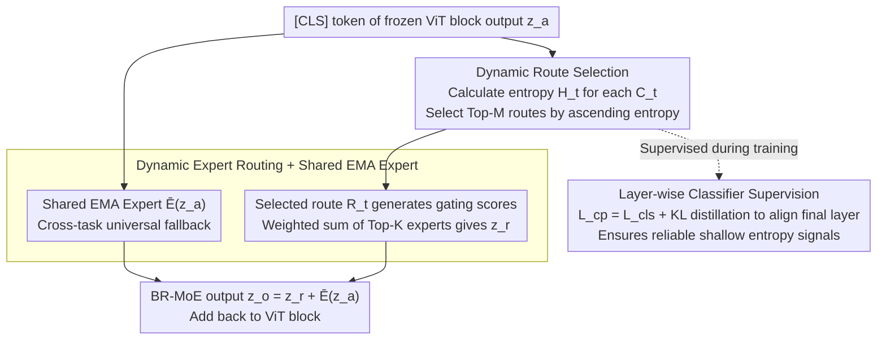

# Scaling Continual Learning to 300+ Tasks with Bi-Level Routing Mixture-of-Experts

**Conference**: ICML 2024  
**arXiv**: [2602.03473](https://arxiv.org/abs/2602.03473)  
**Code**: https://github.com/LMMMEng/CaRE (Available)  
**Area**: Continual Learning / Class-Incremental Learning / MoE / Parameter-Efficient Fine-Tuning  
**Keywords**: Class-Incremental Learning, Bi-Level Routing, Mixture-of-Experts, Long Task Sequences, OmniBenchmark-1K

## TL;DR
The authors propose CaRE: inserting a **Bi-Level Routing MoE (BR-MoE)** into each ViT block. It first uses a "class-perceiver" to select Top-M relevant task routes based on entropy, then each route activates Top-K task experts while adding a shared EMA expert. This allows the model to retain old knowledge while absorbing new classes even in sequences exceeding 300 tasks. The work also introduces the 1000-class OmniBenchmark-1K to fill the gap in long-sequence CIL evaluation.

## Background & Motivation

**Background**: Class-incremental learning (CIL) based on Pre-trained Models (PTM) has become a prominent direction. Mainstream approaches include prompt-based methods (L2P, DualPrompt, CODA-Prompt) and adapter-based methods (EASE, APER, SEMA, MOS, TUNA, MIN). The latter typically train a task-specific adapter for each task and activate the appropriate one during inference.

**Limitations of Prior Work**: (1) Individual adapters only possess discriminative power for the classes they were trained on; as task sequences lengthen, discrimination between related classes across different tasks (e.g., animal sub-classes in different tasks) degrades. (2) Existing methods either use coarse-grained "global aggregation of all historical adapters" or a single adapter, failing to fine-grainedly retrieve complementary knowledge from relevant historical tasks. (3) Existing CIL evaluations are almost exclusively conducted on 5–20 tasks. Many methods collapse under long-sequences (hundreds of tasks), and the community lacks benchmarks for 100+ tasks (CIFAR-100 split into 100 tasks leaves only one class per task, while ImageNet overlaps with PTM training sets).

**Key Challenge**: To create "discriminative yet comprehensive" feature representations, a model must (a) identify which tasks a sample might belong to, (b) fuse adapter knowledge from these tasks fine-grainedly at each layer, and (c) maintain "cross-task universal" shared knowledge. While some methods address these features individually, a unified architecture capable of **per-layer "route-then-expert" bi-level decision-making** is missing.

**Goal**: (i) Design a PEFT module capable of fine-grained cross-task knowledge retrieval at each layer; (ii) Scale it to 300+ tasks; (iii) Provide a benchmark that truly tests long-sequence scalability.

**Key Insight**: The authors decompose the MoE router logic into two levels: coarse (task-level) and fine (adapter expert-level). They use the "entropy of task-specific classification heads" as a signal for "how certain the model is that the sample belongs to this task." This observation is crucial: low entropy signifies high confidence and task relevance, which is more robust than direct task ID prediction.

**Core Idea**: Inject a **(Class-Perceiver $C_t$, Router $R_t$, Expert $E_t$) triplet** into each ViT block for every new task. During inference, Top-M routes are selected by entropy; each route then selects Top-K experts via gating, supplemented by a shared EMA expert for fallback. This bi-level routing replaces binary "global aggregation vs. single adapter" designs.

## Method

### Overall Architecture
The backbone is a frozen ViT-B/16 (ImageNet-21K pre-trained). Each Transformer block is modified as $z_a = \text{MHSA}(\text{Norm}_1(z)) + z$, $z_f = \text{FFN}(\text{Norm}_2(z_a)) + z_a$, and $z' = \text{BR-MoE}(z_a) + z_f$. For each new task $t$ in incremental learning: (1) A new triplet $(C_t, R_t, E_t)$ is added to the BR-MoE in each block; (2) Only the new triplet and the shared expert $\bar{E}$ are updated during training (all other parameters remain frozen); (3) Inference involves dynamic aggregation via the bi-level process. The final classification uses a concatenated angular margin head $W_t = [w^1, \dots, w^t]$, and class logits are calculated via cosine similarity $\cos(\theta_i^j) = \frac{w_j^t \cdot \phi^t(x_i^t)}{\|w_j^t\| \|\phi^t(x_i^t)\|}$ with a scaling factor $\tau = 20$. The workflow within each block is as follows:

### Key Designs

**1. Dynamic Routing Selection: Selecting Top-M relevant historical tasks via "head entropy"**

As task sequences grow, a task-specific adapter is only discriminative for its own classes, making it difficult to distinguish similar classes across tasks. Global aggregation dilutes relevance. The first level of BR-MoE routing decides "which tasks to listen to." It feeds the [CLS] token of $z_a$ into each task's class-perceiver $C_t = \rho^t \in \mathbb{R}^{d \times |G^t|}$ to get the task-internal distribution $s_t = \text{Softmax}(C_t(z_a^{[CLS]}))$, calculates the entropy $\mathcal{H}_t = -\sum_j s_t^{(j)} \log s_t^{(j)}$, and selects the Top-M routes $R_t$ with the lowest entropy.

Using entropy instead of task ID prediction is the key: low entropy indicates that the head is "certain," implying the input likely belongs to that task. This is more robust than training a global task classifier (prone to errors and distribution shifts) and allows independent local decisions at every layer. During training, the latest task route $R_T$ is always included to ensure learning.

**2. Dynamic Expert Routing + Shared EMA Expert: Fine-tuning within routes and cross-task fallback**

Selecting the task is not enough; the model must select the "most relevant adapters" within a task and maintain universal knowledge. Each selected route $R_t$ uses a linear layer $\eta^t \in \mathbb{R}^{d \times t}$ and softmax to produce gating scores for $t$ experts, selecting Top-K adapters $E_i$ to produce a weighted sum. For example, if M=2, K=2: $z_1 = a_2 E_2(z_a) + a_t E_t(z_a)$, $z_2 = b_{T-1} E_{T-1}(z_a) + b_T E_T(z_a)$, and $z_r = z_1 + z_2$.

A shared expert $\bar{E}$ is added on top: it is fully trained on the first task and subsequently updated via EMA $\delta_s \leftarrow \mu \delta_s + (1 - \mu)\delta_t$ ($\mu = 0.999$). The final BR-MoE output is $z_o = z_r + \bar{E}(z_a)$. This expert provides fundamental features when new samples do not match historical adapters (similar to the shared expert in DeepSeek-MoE).

**3. Layer-wise Classifier Supervision: Aligning entropy signals via KL distillation**

BR-MoE makes routing decisions independently at each block. However, shallow features have weak semantics, making their entropy signals unreliable. Thus, supervision $\mathcal{L}_{cp}^\ell = \mathcal{L}_{cls}^\ell + \mathcal{L}_{KL}^\ell$ is added to each layer's $C_t$, where $\mathcal{L}_{KL}^\ell$ aligns the shallow distribution $s_t$ with the final layer's softmax output $p_t$. The total objective is $\mathcal{L} = \mathcal{L}_{cls} + \lambda \frac{1}{L}\sum_\ell \mathcal{L}_{cp}^\ell$ ($\lambda = 1$).

### Loss & Training
When task $t$ arrives, historical parameters are frozen. Only the current layer's $(C_t, R_t, E_t)$ and the shared expert $\bar{E}$ are trained. Optimization uses SGD (momentum=0.9, weight decay=5e-4), batch size 16, 20 epochs per task, and cosine annealing (lr=0.01).

## Key Experimental Results

### Main Results
Comparison on the new OmniBenchmark-1K (1000 classes / 190k images / 21 domains), showing Average Accuracy ($\bar{\mathcal{A}}$) and Last Accuracy ($\mathcal{A}_B$):

| Method | 100 tasks (B0 Inc10) $\mathcal{A}_B$ | 200 tasks (B0 Inc5) $\mathcal{A}_B$ | 151 tasks (B100 Inc6) $\mathcal{A}_B$ | 301 tasks (B100 Inc3) $\mathcal{A}_B$ |
|---|---|---|---|---|
| L2P | 48.87 | 45.25 | 10.49 | 9.03 |
| DualPrompt | 49.45 | 45.62 | 12.90 | 9.30 |
| APER-Adapter | 62.24 | 61.53 | 62.99 | 62.99 |
| TUNA | 60.04 | 59.14 | 62.77 | 62.21 |
| MOS | 64.27 | 63.51 | 65.20 | 64.37 |
| MIN | 63.60 | 62.50 | 60.33 | 59.63 |
| **CaRE** | **68.27** | **67.46** | **69.01** | **68.51** |

CaRE outperforms MOS by 4 percentage points on the 301-task sequence and maintains a massive lead over prompt-based methods (which drop to ~9%).

### Ablation Study

| Configuration | Metric Change (OmniBenchmark-1K) | Description |
|---|---|---|
| Full CaRE | 67.46 | Full model |
| Single Router (M=1) | Significant Decrease | Validates the need to activate multiple routes |
| No Shared Expert | Decrease | Shared expert handles cross-task knowledge |
| Entropy vs. ID Prediction | Decrease | Validates that entropy is more robust than hard task ID prediction |
| No Layer-wise KL | Decrease | Shallow entropy signals become unreliable |

### Key Findings
- **Bi-level routing > Single routing**: Decoupling task selection from expert selection is much more effective than single-level gating across all adapters.
- **Entropy > Task ID Prediction**: Entropy reflects the overall uncertainty of a head, making it a more stable metric for relevance than hard argmax.
- **Shared Expert as a Safety Net**: Especially in long sequences, it prevents collapse when new samples do not match any historical adapters.
- **Scaling Limit**: Methods like MIN/SEMA perform well on short sequences but degrade severely at 100+ tasks.

## Highlights & Insights
- **Hierarchical Routing**: Implementing MoE routing with coarse and fine semantics (task/expert) naturally fits long-sequence CIL. This "cluster then refine" logic is transferable to other scenarios like RAG.
- **Uncertainty as Routing Signal**: Using internal head entropy avoids the fragility of external global task classifiers.
- **Benchmark Contribution**: OmniBenchmark-1K fills the void for a dataset that truly stresses modern PTM-based CIL methods without data leakage from common pre-training sets.
- **Local Decision Making**: Allowing each layer to choose its own routes based on specific feature abstraction levels is more targeted than global output aggregation.

## Limitations & Future Work
- **Linear Complexity**: Parameters and inference overhead (for entropy calculation) grow linearly with the number of tasks.
- **Task Boundaries**: The model assumes clear task boundaries for triplet creation; task-free scenarios would require an additional task detection mechanism.
- **Fixed EMA**: The EMA parameter $\mu$ is fixed, which might not adapt well to sudden shifts in task distribution.

## Related Work & Insights
- **vs. MOS / TUNA / MIN**: These are the current SOTA but lack the bi-level decoupling that allows CaRE to maintain stability at 300+ tasks.
- **vs. DeepSeek-MoE**: The shared expert design is directly inspired by DeepSeek-MoE, adapted here with EMA maintenance for the incremental setting.
- **vs. Prompt-based**: Prompt pools lack the information capacity for hundred-level task counts, whereas adapter-based MoE scales significantly better.

## Rating
- Novelty: ⭐⭐⭐⭐
- Experimental Thoroughness: ⭐⭐⭐⭐⭐
- Writing Quality: ⭐⭐⭐⭐
- Value: ⭐⭐⭐⭐⭐

<!-- RELATED:START -->

## Related Papers

- [\[CVPR 2026\] Spectral Mixture-of-Experts for Continual Learning](../../CVPR2026/self_supervised/spectral_mixture-of-experts_for_continual_learning.md)
- [\[CVPR 2026\] Is Parameter Isolation Better for Prompt-Based Continual Learning?](../../CVPR2026/self_supervised/is_parameter_isolation_better_for_prompt-based_continual_learning.md)
- [\[NeurIPS 2025\] Soft Task-Aware Routing of Experts for Equivariant Representation Learning](../../NeurIPS2025/self_supervised/soft_task-aware_routing_of_experts_for_equivariant_representation_learning.md)
- [\[ICML 2026\] Learning to Extrapolate to New Tasks: A Relational Approach to Task Extrapolation](learning_to_extrapolate_to_new_tasks_a_relational_approach_to_task_extrapolation.md)
- [\[ICML 2026\] PartCo: Part-Level Correspondence Priors Enhance Category Discovery](partco_part-level_correspondence_priors_enhance_category_discovery.md)

<!-- RELATED:END -->
