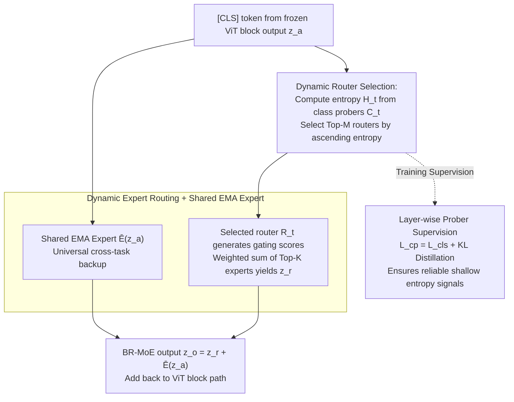

# Scaling Continual Learning to 300+ Tasks with Bi-Level Routing Mixture-of-Experts

**Conference**: ICML 2026  
**arXiv**: [2602.03473](https://arxiv.org/abs/2602.03473)  
**Code**: https://github.com/LMMMEng/CaRE (Available)  
**Area**: Continual Learning / Class-Incremental Learning / MoE / Parameter-Efficient Fine-Tuning  
**Keywords**: Class-Incremental Learning, Bi-Level Routing, Mixture-of-Experts, Long Task Sequences, OmniBenchmark-1K

## TL;DR
Ours proposes CaRE, which embeds a **Bi-Level Routing MoE (BR-MoE)** into each ViT block. It first employs "class probers" to select Top-M relevant task routers based on entropy, then activates Top-K task experts within those routers alongside a shared EMA expert. This design allows the model to retain old knowledge while continuously incorporating new classes even in sequences exceeding 300+ tasks. Additionally, the authors release the OmniBenchmark-1K, a 1000-class benchmark for long-sequence CIL.

## Background & Motivation

**Background**: Class-incremental learning (CIL) based on Pre-trained Models (PTM) has become a prominent research direction, primarily divided into prompt-based (L2P, DualPrompt, CODA-Prompt) and adapter-based (EASE, APER, SEMA, MOS, TUNA, MIN) approaches. The latter typically trains a task-specific adapter for each task and activates the appropriate ones during inference.

**Limitations of Prior Work**: (1) Individual adapters are discriminative only for the classes they were trained on; as task sequences lengthen, discrimination across related classes from different tasks (e.g., animal sub-classes in different tasks) degrades. (2) Existing methods either use coarse-grained "global aggregation of all historical adapters" or a single adapter, failing to retrieve fine-grained supplementary knowledge from related historical tasks. (3) Most CIL benchmarks evaluate only 5–20 tasks. Performance often collapses under ultra-long sequences (hundreds of tasks), and no standard benchmark exists for 100+ tasks (CIFAR-100 becomes too sparse if split into 100 tasks, while ImageNet overlaps with PTM pre-training data).

**Key Challenge**: To achieve a feature representation that is both discriminative and comprehensive, the system must: (a) identify which tasks a sample might belong to, (b) fuse adapter knowledge from these tasks at a fine-grained level within each layer, and (c) maintain a shared global knowledge base. While individual components have been explored, a unified architecture capable of **"route-then-expert" bi-level decision-making** at every layer is missing.

**Goal**: (i) Design a PEFT module capable of fine-grained cross-task knowledge retrieval at each layer; (ii) Ensure scalability to 300+ tasks; (iii) Provide a benchmark that rigorously tests long-sequence scalability.

**Key Insight**: The authors decompose the MoE router into two levels: coarse (task-level) and fine (adapter expert-level). They use the "entropy of task-specific classification heads" as a signal for task relevance. This observation is crucial: low entropy indicates high confidence and relevance, proving more robust than direct task identity prediction.

**Core Idea**: For each ViT block, injected a **triplet of (class prober $C_t$, router $R_t$, expert $E_t$)** for every new task. During inference, Top-M routers are selected by entropy, and each selects Top-K experts via gating, combined with an EMA-maintained shared expert. This bi-level routing replaces the binary choice between global aggregation and single-adapter designs.

## Method

### Overall Architecture
The backbone is a frozen ViT-B/16 (ImageNet-21K pre-trained). Each Transformer block is modified: $z_a = \text{MHSA}(\text{Norm}_1(z)) + z$, $z_f = \text{FFN}(\text{Norm}_2(z_a)) + z_a$, and $z' = \text{BR-MoE}(z_a) + z_f$. For each new task $t$: (1) A new triplet $(C_t, R_t, E_t)$ is added to the BR-MoE of each block; (2) Only the new triplet and the shared expert $\bar{E}$ are updated during training (all other parameters are frozen); (3) During inference, outputs are dynamically aggregated through a bi-level process. The final classification uses a concatenated angular margin head $W_t = [w^1, \dots, w^t]$, and class logits are calculated via cosine similarity $\cos(\theta_i^j) = \frac{w_j^t \cdot \phi^t(x_i^t)}{\|w_j^t\| \|\phi^t(x_i^t)\|}$ with a scaling factor $\tau = 20$. The workflow within each block is as follows:

### Key Designs

**1. Dynamic Router Selection: Selecting Top-M Relevant Tasks via Entropy**

In long sequences, task-specific adapters lose discriminative power outside their local classes. BR-MoE's first level determines which tasks to "listen" to. It feeds the $z_a^{[CLS]}$ token into class probers $C_t = \rho^t \in \mathbb{R}^{d \times |G^t|}$ to get a distribution $s_t = \text{Softmax}(C_t(z_a^{[CLS]}))$. Relevance is measured by entropy $\mathcal{H}_t = -\sum_j s_t^{(j)} \log s_t^{(j)}$, and the Top-M routers $R_t$ with the lowest entropy are selected. 

Using entropy is more robust than task ID prediction because low entry implies the classification head is confident about the input. This localized decision at each layer is less sensitive to distribution shifts than a global task classifier. During training, the router $R_T$ for the current task is always included to ensure learning.

**2. Dynamic Expert Routing + Shared EMA Expert: Fine-grained Adapter Selection and Universal Knowledge**

Within each selected task router $R_t$, a linear layer $\eta^t \in \mathbb{R}^{d \times t}$ plus softmax generates $t$ gating scores for $z_a^{[CLS]}$. The Top-K experts are selected and weighted by these scores. For example, with M=2 and K=2, $z_1 = a_2 E_2(z_a) + a_t E_t(z_a)$ and $z_2 = b_{T-1} E_{T-1}(z_a) + b_T E_T(z_a)$, resulting in $z_r = z_1 + z_2$.

A shared expert $\bar{E}$ is added to this sum. It is fully trained on the first task and thereafter updated via EMA $\delta_s \leftarrow \mu \delta_s + (1 - \mu)\delta_t$ ($\mu = 0.999$). The final output is $z_o = z_r + \bar{E}(z_a)$. This shared component handles universal cross-task features, providing a safety net when dynamic routing fails to find a perfect match.

**3. Layer-wise Class Prober Supervision: Aligning Shallow Entropy via Distillation**

For BR-MoE to work in shallow blocks, class probers $C_t$ must produce meaningful entropy despite weak semantic features. The model applies $\mathcal{L}_{cp}^\ell = \mathcal{L}_{cls}^\ell + \mathcal{L}_{KL}^\ell$ to each layer $\ell$. $\mathcal{L}_{cls}^\ell$ is the angular margin loss, and $\mathcal{L}_{KL}^\ell$ encourages the shallow distribution $s_t$ to align with the final layer's output $p_t$. This ensures that entropy-based routing reflects the final decision logic even in early layers.

### Loss & Training
When task $t$ arrives, historical parameters are frozen. Only current triplets $(C_t, R_t, E_t)$ and the shared expert $\bar{E}$ are trained. Optimizer: SGD (momentum=0.9, weight decay=5e-4), batch=16, 20 epochs per task, lr=0.01 with cosine annealing.

## Key Experimental Results

### Main Results
Comparison on the new OmniBenchmark-1K (1000 classes / 190k images / 21 domains). Metrics: $\bar{\mathcal{A}}$ (Average accuracy) / $\mathcal{A}_B$ (Final accuracy).

| Method | 100 tasks (B0 Inc10) $\mathcal{A}_B$ | 200 tasks (B0 Inc5) $\mathcal{A}_B$ | 151 tasks (B100 Inc6) $\mathcal{A}_B$ | 301 tasks (B100 Inc3) $\mathcal{A}_B$ |
|---|---|---|---|---|
| L2P | 48.87 | 45.25 | 10.49 | 9.03 |
| DualPrompt | 49.45 | 45.62 | 12.90 | 9.30 |
| APER-Adapter | 62.24 | 61.53 | 62.99 | 62.99 |
| TUNA | 60.04 | 59.14 | 62.77 | 62.21 |
| MOS | 64.27 | 63.51 | 65.20 | 64.37 |
| MIN | 63.60 | 62.50 | 60.33 | 59.63 |
| **Ours (CaRE)** | **68.27** | **67.46** | **69.01** | **68.51** |

On the longest sequence (301 tasks), CaRE outperforms MOS by 4% and prompt-based methods by nearly 60%. In short-sequence CIL (5-20 tasks on ImageNet-R/A), CaRE remains SOTA.

### Ablation Study

| Configuration | Metric Change (OmniBenchmark-1K) | Description |
|---|---|---|
| Full CaRE | 67.46 | Baseline |
| Single router (M=1) | Significant Drop | Necessity of activating multiple routers |
| No Shared Expert | Drop | EMA expert captures cross-task knowledge |
| Hard Task ID Task Classification | Drop | Entropy-based selection is more robust than hard ID prediction |
| No KL Supervision | Drop | Shallow layer entropy becomes unreliable |

### Key Findings
- **Bi-level routing > Single routing**: Selecting Top-M tasks then Top-K experts is superior to performing a single gating over all available adapters.
- **Entropy > Task ID Prediction**: Entropy reflects overall uncertainty, providing a more stable relevance metric than hard argmax.
- **Shared Expert as a Safety Net**: In long sequences, the EMA-updated shared expert provides foundational features even when task-specific adapters do not match perfectly.
- **Scalability**: While many methods match CaRE on short sequences, they degrade drastically at 100+ tasks, highlighting the importance of long-sequence evaluation.

## Highlights & Insights
- **Hierarchical MoE Routing**: The coarse-to-fine routing strategy aligns naturally with CIL by first clustering task types and then specializing within them. This is highly applicable to RAG scenarios.
- **Confidence-based Selection**: Using prober confidence (entropy) instead of explicit task prediction avoids the fragility of global task classifiers.
- **OmniBenchmark-1K Contribution**: This 1000-class, 21-domain benchmark without PTM leakage fills a gap in the CIL community and will likely become a standard for long-sequence evaluation.
- **Layer-wise Decision Independence**: Allowing different layers to make localized routing decisions based on their specific abstraction level proves more effective than a single global aggregation.

## Limitations & Future Work
- **Linear Computation Growth**: Since $C_t$ must be computed for all historical tasks to find Top-M, the inference cost scales linearly with the number of tasks.
- **Task Boundaries**: Ours assumes clear task boundaries to train triplets; extension to task-free CL would require an integrated task boundary detection mechanism.
- **Static EMA**: The fixed $\mu = 0.999$ for the EMA expert might not adapt quickly enough to drastic domain shifts.
- **Decoder/CNN Compatibility**: Validation was primarily on ViT; applicability to LLM-style decoders remains to be explored.

## Related Work & Insights
- **vs MOS / TUNA / MIN**: These adapter-based methods are strong on short sequences but suffer under 100+ tasks. CaRE's bi-level routing maintains stability through decoupled knowledge retrieval.
- **vs DeepSeek-MoE**: The shared expert concept is inspired by DeepSeek-MoE, adapted here with EMA updates for the incremental setting.
- **vs Prompt-based Methods**: The collapse of L2P/DualPrompt on 301 tasks suggests that prompt pools lack sufficient information capacity for hundreds of tasks, making adapter+MoE a more viable path.

## Rating
- Novelty: ⭐⭐⭐⭐ Engineering integration of bi-level routing and confidence-based selection for CIL is innovative.
- Experimental Thoroughness: ⭐⭐⭐⭐⭐ Extensive testing across long sequences (up to 301 tasks) and multiple classic benchmarks.
- Writing Quality: ⭐⭐⭐⭐ Clear motivation and intuitive diagrams.
- Value: ⭐⭐⭐⭐⭐ Sets a new standard for scaling PTM-based CIL to hundreds of tasks.

<!-- RELATED:START -->

## Related Papers

- [\[NeurIPS 2025\] Soft Task-Aware Routing of Experts for Equivariant Representation Learning](../../NeurIPS2025/self_supervised/soft_task-aware_routing_of_experts_for_equivariant_representation_learning.md)
- [\[ICML 2026\] Learning to Extrapolate to New Tasks: A Relational Approach to Task Extrapolation](learning_to_extrapolate_to_new_tasks_a_relational_approach_to_task_extrapolation.md)
- [\[ICML 2026\] PartCo: Part-Level Correspondence Priors Enhance Category Discovery](partco_part-level_correspondence_priors_enhance_category_discovery.md)
- [\[CVPR 2026\] Is Parameter Isolation Better for Prompt-Based Continual Learning?](../../CVPR2026/self_supervised/is_parameter_isolation_better_for_prompt-based_continual_learning.md)
- [\[ICML 2026\] LEC: Linear Expectation Constraints for Selection-Conditioned Risk Control in Selective Prediction and Routing Systems](lec_linear_expectation_constraints_for_selection-conditioned_risk_control_in_sel.md)

<!-- RELATED:END -->
