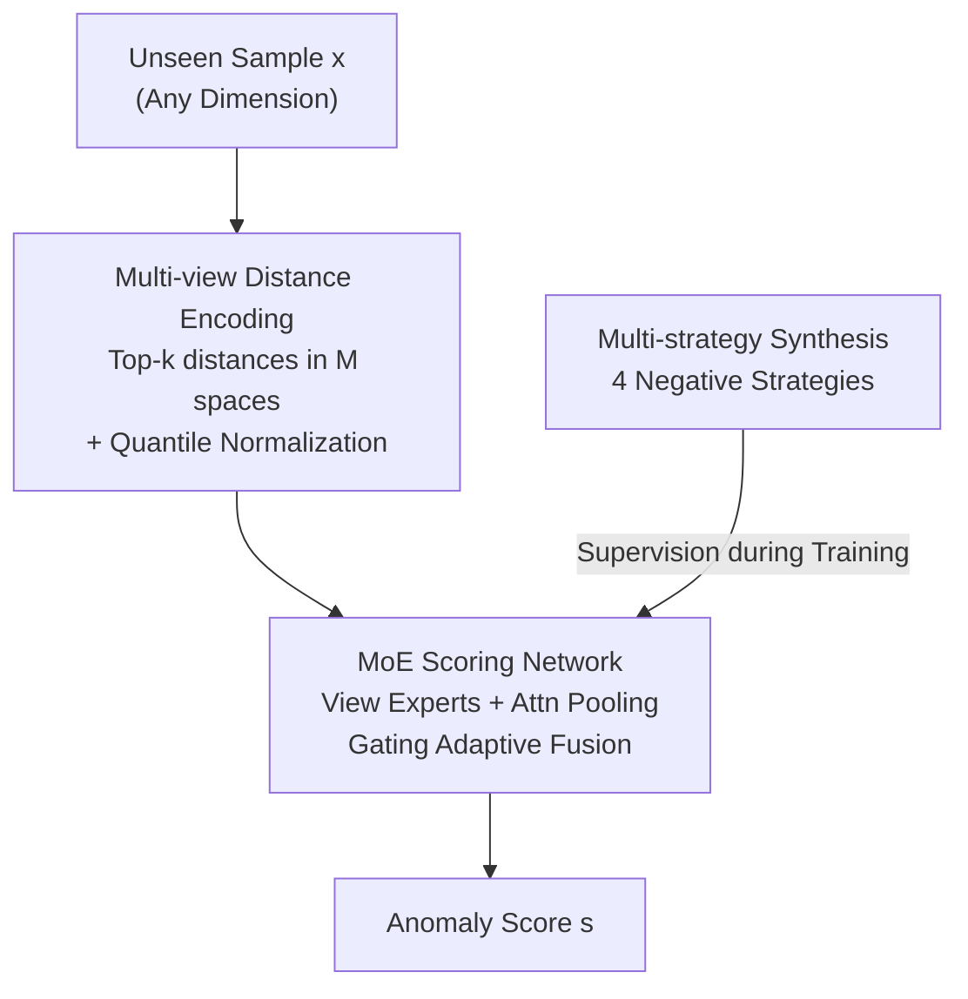

# Towards One-for-All Anomaly Detection for Tabular Data

**Conference**: ICML 2026  
**arXiv**: [2603.14407](https://arxiv.org/abs/2603.14407)  
**Code**: https://github.com/Shiy-Li/OFA-TAD  
**Area**: Self-supervised / Anomaly Detection  
**Keywords**: Tabular Anomaly Detection, One-for-All, Multi-view Distance, Mixture of Experts, Pseudo-anomaly Synthesis

## TL;DR
OFA-TAD is proposed: using "neighbor distance" as a cross-domain universal anomaly cue, multi-view distance representations are extracted from metric spaces induced by various feature transformations. These are adaptively fused using a Mixture of Experts (MoE) gating mechanism. After a single training phase, the model generalizes directly to unseen tabular datasets for anomaly detection without any target-domain fine-tuning.

## Background & Motivation
**Background**: Tabular Anomaly Detection (TAD) is predominantly characterized by the "one model for one dataset" (OFO) paradigm, where a new detector must be trained from scratch for each new dataset, often requiring specialized hyperparameter tuning or architectural adjustments.

**Limitations of Prior Work**: The OFO paradigm has two critical flaws. ① **High Training Cost**: Retraining and hyperparameter searching for every new domain is expensive for large-scale deployment. ② **Poor Generalization**: Models easily overfit source distributions, fail under distribution shifts, and are unreliable when transferred to unseen domains.

**Key Challenge**: The ambition to achieve "one model for all" (OFA) is hindered by the **semantic gap**. Tabular data from different domains vary in dimensionality and feature semantics (e.g., blood pressure in medical data vs. transaction amounts in finance); anomaly patterns are often domain-specific rather than universal. Directly aligning raw feature semantics is infeasible.

**Goal**: Addressing two challenges. Challenge 1: How to find **cross-domain universal** anomaly patterns? Challenge 2: How to automatically select appropriate transformations and construct **robust** distance representations without target-domain supervision?

**Key Insight**: The essence of an anomaly is being "more isolated than normal points," meaning anomalous samples are unusually far from their local neighborhoods. Thus, the **neighbor distance profile** (Top-$k$ nearest neighbor distance sequence) serves as a semantic-free universal representation. Whether in medical records or fraudulent transactions, Top-$k$ distance sequences exhibit a distinct "elbow + heavy tail" signature, which is a shared distance-level anomaly signature.

**Core Idea**: However, a single distance measure is extremely sensitive to feature transformations (neighbor overlap for the same sample in Raw vs. Normalized vs. Quantile spaces can be very low, and different datasets prefer different optimal transformations). Thus, "neighbor distance profiles under different transformations" are treated as complementary **data views**, and an MoE gating mechanism adaptively fuses multi-view distance evidence to obtain robust anomaly scores insensitive to individual transformations.

## Method

### Overall Architecture
OFA-TAD realizes "train once, use everywhere" for TAD. The pipeline consists of three stages: ① **Multi-view Distance Encoding**: Uniformly encodes samples from any dimensionality into normalized neighbor distance sequences across multiple transform spaces to obtain cross-domain comparable inputs; ② **MoE Scoring Network**: Assigns an expert to each view to calculate intra-view scores, with a gating network adaptively weighting them into a final score; ③ **Multi-strategy Pseudo-anomaly Synthesis**: Since true anomalies are absent in one-class settings, diverse pseudo-anomalies are synthesized to transform training into binary classification for end-to-end optimization. Training occurs once on source datasets; during inference on unseen target domains, only the training partition is used as "context" for retrieval and normalization without retraining.

### Key Designs

**1. Multi-view Neighbor Distance Encoding: Heterogeneous Tables to Comparable Representations**

As dimensions and semantics vary across domains, raw features cannot be fed into a shared network. OFA-TAD utilizes the domain-agnostic cue "anomaly as local deviation": for sample $\mathbf{x}$, it retrieves the Top-$K$ nearest neighbors and calculates Euclidean distances to obtain a fixed-length sequence $\mathbf{d}=[d_1,\dots,d_K]^\top$. This compresses variable features into fixed-length tokens, unifying the input format.

However, a single distance measure is insufficient. Different datasets prefer different metric spaces. Thus, $M$ transformations $\mathcal{T}_m$ (Raw / Standardized / MinMax / Quantile) are used to induce metric spaces, with each view generating a distance sequence $\mathbf{d}^{(m)}$. **Quantile Normalization** $\hat{d}_k^{(m)}=\text{QuantileTransform}(d_k^{(m)})$ maps absolute distances (which vary from $10^{-2}$ to $10^{5}$ across domains) to relative probabilities on $U[0,1]$, eliminating scale differences and stabilizing optimization.

**2. MoE Scoring Network: Sample-adaptive Selection of Distance Views**

Multi-view data provides candidate distance patterns with varying reliability; a transformation that improves separability in one dataset may be misleading in another. OFA-TAD uses MoE for sample-level adaptive fusion with three components:

- **Positional Embedding**: Distance rankings are ordered (closest to farthest); early rankings often reflect local density and are critical. Distances are projected to $D$-dimensional tokens with learnable positional embeddings $\mathbf{H}^{(m)}=\text{LayerNorm}(\text{MLP}^{(m)}_{\text{enc}}(\hat{\mathbf{d}}^{(m)}))+\mathbf{P}_{pos}$, allowing experts to distinguish "neighbor bias" from "tail bias."
- **Attention Pooling**: Contribution of each rank is sample-dependent. Content-related aggregation weights $\alpha_k^{(m)}=\text{Softmax}(\mathbf{w}^\top\sigma(\mathbf{W}\mathbf{H}_k^{(m)}))$ are learned, yielding $\mathbf{h}^{(m)}=\sum_k\alpha_k^{(m)}\mathbf{H}_k^{(m)}$ to focus on key neighbors and suppress noise.
- **Expert Scoring + Gating Fusion**: Each expert outputs a view score $s^{(m)}=\text{MLP}^{(m)}_{\text{score}}(\mathbf{h}^{(m)})$. The gating network predicts weights $\mathbf{g}=\text{Softmax}(\text{MLP}_{\text{gate}}(\text{Concat}[\mathbf{h}^{(1)},\dots,\mathbf{h}^{(M)}]))$ by observing embeddings rather than raw distances, enabling the model to assign higher weights to informative views for any unknown target domain.

**3. Multi-strategy Pseudo-anomaly Synthesis: Binary Classification under One-class Constraints**

Under one-class constraints, pure one-class objectives can be unstable or suffer from hypersphere collapse. OFA-TAD synthesizes pseudo-anomalies using **four complementary strategies**: ① **Manifold Extrapolation** $\mathbf{x}_{neg}=\mathbf{x}_b+\alpha(\mathbf{x}_b-\mathbf{x}_a)$ tests manifold boundaries; ② **Inter-cluster Interpolation** $\mathbf{x}_{neg}=\beta\mathbf{x}_a+(1-\beta)\mathbf{x}_b$ targets low-density areas; ③ **Noise Injection** simulates measurement error; ④ **Feature Masking** simulates data corruption. The model is trained end-to-end via MSE:

$$\mathcal{L}=\frac{1}{n_{train}}\sum_{i=1}^{n_{train}}(s_i-y_i)^2.$$

Training on normal samples + multi-strategy pseudo-anomalies allows the model to learn a **transferable decision boundary**.

### Loss & Training
End-to-end MSE regression for anomaly scores. Trained once on 7 source datasets for 15 epochs using Adam (lr $5\times10^{-4}$, weight decay $2\times10^{-5}$). Top-$K=80$, MoE embedding dimension 128, with 2-layer MLPs per expert. **A single set of hyperparameters is used for all datasets without per-dataset tuning.** During inference, the target domain training set is used solely as context for neighbor retrieval.

## Key Experimental Results

Evaluated on 34 datasets (14 domains) from ADBench. All baselines follow the OFO paradigm (per-dataset training/tuning), while OFA-TAD does not retrain.

### Main Results (AUROC, Selected; Bold = Best)

| Dataset | Type | iForest | MCM | DRL | DisentAD | OFA-TAD |
|---------|------|---------|-----|-----|----------|---------|
| abalone | In-Domain | 0.7371 | 0.7450 | 0.8071 | 0.7789 | **0.8178** |
| donors | In-Domain | 0.9029 | 0.9965 | 0.9002 | 0.9073 | **0.9997** |
| pendigits| In-Domain | 0.9642 | 0.9842 | 0.9391 | 0.9932 | **0.9990** |
| shuttle | In-Domain | 0.9964 | 0.9986 | 0.9983 | 0.9993 | **0.9998** |
| amazon | Out-of-Domain | 0.5080 | 0.5201 | 0.5070 | 0.5465 | **0.5469** |
| Wilt | Out-of-Domain | 0.4816 | 0.7485 | 0.7790 | 0.7543 | **0.8102** |
| **Average (34)** | — | 0.7808 | 0.8102 | 0.8176 | 0.8140 | **0.8345** |

Interpretation: While "winners" vary on individual datasets, OFA-TAD achieves the **highest average AUROC (0.8345)** and outperforms OFO baselines under the strict OFA setting.

### Ablation Study (Average AUROC/AUPRC/F1)

| Configuration | AUROC | AUPRC | F1 | Note |
|---------------|-------|-------|-----|------|
| OFA-TAD (Full) | 0.8345 | 0.6629 | 0.6352 | — |
| w/o Gating | 0.8218 | 0.6498 | 0.6211 | Mean fusion |
| w/o MoE | 0.8204 | 0.6448 | 0.6177 | No experts |
| w/o Attention | 0.8187 | 0.6383 | 0.6029 | Attention → Mean |
| w/o Position | 0.8281 | 0.6404 | 0.6124 | No positional embedding |
| w/o Noise Inject | 0.8203 | 0.6011 | 0.5788 | Removed noise |
| w/o Extrapolation| 0.8190 | 0.6061 | 0.5781 | Removed extrapolation |

### Key Findings
- **Attention pooling provides the largest contribution**: Removing it drops AUROC from 0.8345 to 0.8187, confirming that explicit weighting of neighbor evidence is crucial when signals are sparse.
- **Synthesis strategies are complementary**: Removing noise injection or manifold extrapolation causes the most significant drops.
- **Stable inference with minimal context**: Performance saturates at around 0.3 context ratio for most datasets, indicating reliable on-the-fly inference.
- **Gating weights vary by domain**: Visualizations show Std is preferred for fraud/Parkinson datasets, while MinMax is favored for amazon/Wilt, validating the motivation for adaptive fusion.

## Highlights & Insights
- **Universal representation via isolation**: Neighbor distance profiles serve as excellent semantic-free tokens, bypassing the semantic gap of tabular data.
- **Transform sensitivity as a resource**: Instead of choosing one normalization, multiple transforms are treated as complementary views, converting a tuning problem into a learning problem.
- **Gating based on high-level embeddings**: The gating mechanism judges "profile reliability" using embeddings rather than raw distances, which is key to cross-domain adaptation.
- **Supremacy over OFO baselines**: Even without per-dataset training, the average performance surpasses baselines, proving the effectiveness of in-context neighborhood modeling for TAD.

## Limitations & Future Work
- **Dependency on target context**: Inference requires the target training partition for KNN; performance drops significantly with very small context ratios.
- **Distributed winners**: For specific domains, specialized OFO models may still outperform the universal model.
- **Inherent blind spots of distance cues**: The model may struggle with anomalies that have normal local densities but anomalous global semantics or in cases of extreme high-dimensionality where distance measures fail.
- **Fixed transform set**: The study uses four fixed transform views; it remains unclear if these suffice for all unseen domains or if a learnable transform library is needed.

## Related Work & Insights
- **vs. OFO Deep TAD (DeepSVDD / MCM / DRL)**: These are one-model-per-dataset. OFA-TAD uses one-time multi-source training and multi-strategy pseudo-anomalies to avoid hypersphere collapse.
- **vs. Classic Methods (iForest / LOF / KNN)**: Classic methods rely on heuristics and lack non-linear feature capture; OFA-TAD unifies these through learnable multi-view distance and MoE.
- **vs. Other Modalities (Image / Graph)**: While universal detectors exist for images and graphs, the tabular domain remained vacant due to the semantic gap; this work fills that gap using structure-based alignment.

## Rating
- Novelty: ⭐⭐⭐⭐⭐ First to push TAD from OFO to OFA using neighbor distance + MoE.
- Experimental Thoroughness: ⭐⭐⭐⭐ 34 datasets/14 domains across in-domain/out-of-domain blocks, though lacks analysis on extreme high-dimensionality.
- Writing Quality: ⭐⭐⭐⭐ Clear motivation-to-design mapping.
- Value: ⭐⭐⭐⭐ Significant practical value for large-scale TAD deployment by eliminating retraining.

<!-- RELATED:START -->

## Related Papers

- [\[ICML 2026\] From Zero to Hero: Advancing Zero-Shot Foundation Models for Tabular Outlier Detection](from_zero_to_hero_advancing_zero-shot_foundation_models_for_tabular_outlier_dete.md)
- [\[NeurIPS 2025\] One Filters All: A Generalist Filter for State Estimation](../../NeurIPS2025/self_supervised/one_filters_all_a_generalist_filter_for_state_estimation.md)
- [\[NeurIPS 2025\] TabSTAR: A Tabular Foundation Model for Tabular Data with Text Fields](../../NeurIPS2025/self_supervised/tabstar_a_tabular_foundation_model_for_tabular_data_with_text_fields.md)
- [\[ICML 2026\] Inconsistency-Aware Minimization: Improving Generalization with Unlabeled Data](inconsistency-aware_minimization_improving_generalization_with_unlabeled_data.md)
- [\[ICML 2025\] Towards Benchmarking Foundation Models for Tabular Data With Text](../../ICML2025/self_supervised/towards_benchmarking_foundation_models_for_tabular_data_with_text.md)

<!-- RELATED:END -->
