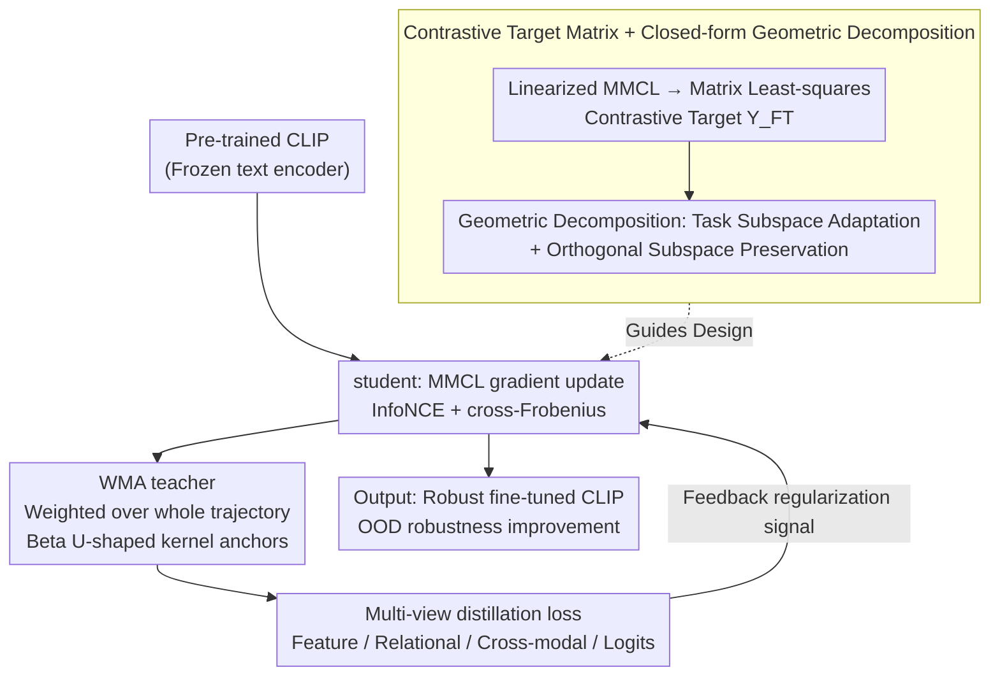

# TRACER: Robust Multimodal Fine-tuning Proven with WMA Teacher + Geometric Decomposition

**Conference**: ICML 2026  
**arXiv**: [2605.29380](https://arxiv.org/abs/2605.29380)  
**Code**: https://github.com/HesamAsad/TRACER  
**Area**: CLIP Fine-tuning / Robustness / Self-distillation  
**Keywords**: CLIP Fine-tuning, OOD Robustness, Self-distillation, EMA teacher, WMA teacher

## TL;DR
TRACER utilizes closed-form theoretical analysis to geometrically decompose contrastive fine-tuning into "task subspace" and "orthogonal preservation" components. It proves that EMA teachers collapse and lose regularization power, prompting the proposal of a Weighted Moving Average (WMA) teacher. This teacher maintains finite-horizon continuous constraints and achieves unbiased convergence in the task subspace. On CLIP ViT-B/16, the average ImageNet distribution shift performance improved to 64.07% vs CaRot 62.54%.

## Background & Motivation

**Background**: Zero-shot transfer in multimodal models like CLIP is strong, but downstream fine-tuning often damages OOD robustness (catastrophic forgetting). Existing mitigation methods fall into four categories: LP-FT (linear probe then full fine-tuning), FLYP (reusing pre-trained text encoders as heads), WiSE-FT/Model Stock (weight interpolation), and L2-SP/Self-distillation (regularization).

**Limitations of Prior Work**: (1) Most methods are empirically designed and lack theoretical explanations for "where and why forgetting occurs"; (2) Self-distillation methods mostly use EMA teachers, which gradually align with the student, causing the teacher-student gap to converge to 0, thereby losing regularization power—precisely during the late training stages when OOD robustness is most vulnerable.

**Key Challenge**: Maintaining OOD robustness requires continuous regularization anchors. EMA anchors automatically collapse toward the student; static teachers (fixed at initial weights) do not collapse but introduce "anchor bias," failing to converge to the task optimum.

**Goal**: (1) Provide a closed-form analytical framework for contrastive fine-tuning to clarify the geometric behavior of various fine-tuning strategies; (2) Design a teacher that maintains continuous regularization power while achieving bias-free convergence to the task optimum.

**Key Insight**: Using linearized analysis (treating the image encoder as a linear projection) and introducing a contrastive target matrix $\mathbf{Y}_{\mathrm{FT}} = \mathbf{W}_T^0 \mathbf{X}_T (n \mathbf{I}_n - \mathbf{J}_n)$, the contrastive loss is equated to matrix least-squares. This yields closed-form solutions for all fine-tuning strategies, which are geometrically decomposed into "changes within the task subspace" vs "preservation in the orthogonal subspace."

**Core Idea**: Replace the EMA teacher with a WMA teacher (Weighted Moving Average over the entire student trajectory, using a Beta(0.5, 0.5) U-shaped kernel). It is proven that the WMA teacher converges to the minimum-norm task solution within the task subspace, preserves pre-trained knowledge in the orthogonal subspace, and ensures the teacher-student gap does not vanish within a finite-horizon.

## Method

### Overall Architecture

The TRACER loss = $\mathcal{L}_{\mathrm{MMCL}} + \lambda_{\mathrm{SD}} \mathcal{L}_{\mathrm{SD-WMA}}$. The former is standard CLIP InfoNCE + cross-Frobenius regularizer, while the latter comprises multi-view losses distilled from the WMA teacher (feature distillation + contrastive relational distillation + interactive contrastive learning + cross-knowledge distillation).

In each training step: (1) The student is updated using the MMCL gradient; (2) The WMA teacher is updated via $\mathbf{W}_{\mathrm{Teacher}}^t = (1-\omega_t) \mathbf{W}_{\mathrm{Teacher}}^{t-1} + \omega_t \mathbf{W}_I^t$, where $\omega_t = \kappa(\tau_t) / \sum_j \kappa(\tau_j)$ is the weight based on the Beta(0.5, 0.5) kernel; (3) The teacher provides four distillation signals as feedback to the student.

### Key Designs

**1. Contrastive Target Matrix + Geometric Decomposition: Identifying where forgetting occurs**

While the reasons for self-distillation's effectiveness were previously empirical, this work first compresses the non-linear optimization of contrastive fine-tuning into an analytical form. By defining $\mathbf{Y}_{\mathrm{FT}} = \mathbf{W}_T^0 \mathbf{X}_T (n \mathbf{I}_n - \mathbf{J}_n)$ (frozen text encoder plus centralized contrastive operator), it is proven that the linearized MMCL loss is equivalent to matrix least-squares $\min_{\mathbf{W}_I} \frac{1}{2} \|\mathbf{W}_I \mathbf{X}_I - \mathbf{Y}_{\mathrm{FT}}\|_F^2$. Theorem 3.2 provides closed-form solutions for various strategies, making their geometric meanings clear: The Direct FT solution is $\mathbf{W}_I^0 (I - \mathcal{P}_I) + \mathbf{Y}_{\mathrm{FT}} \mathbf{X}_I^\top (\mathbf{X}_I \mathbf{X}_I^\top)^+$ (preservation of orthogonal subspace, replacement of task subspace); L2-SP blends all directions (unstructured decomposition); Static SD is $\mathbf{W}_I^0 (I - \frac{1}{1+\lambda} \mathcal{P}_I) + \frac{1}{1+\lambda} \mathbf{Y}_{\mathrm{FT}} \mathbf{X}_I^\top (\mathbf{X}_I \mathbf{X}_I^\top)^+$ (orthogonal preservation + convex combination in task subspace).

This decomposition reveals the physical location of forgetting: SD structurally preserves pre-trained knowledge in the orthogonal subspace while only adapting in the task subspace, whereas L2 mixes all directions, allowing catastrophic forgetting to spread into the orthogonal subspace that should have been preserved. This provides the theoretical basis for using SD over L2.

**2. WMA teacher: U-shaped kernel addressing EMA collapse and static anchor bias**

For self-distillation to remain effective, the teacher must neither collapse nor be biased. The EMA teacher's update weight is a constant $\omega_t = 1-\alpha$, causing the teacher to exponentially catch up with the student, with the gap reaching 0 in late training—the most OOD-vulnerable phase. A static teacher remains anchored at the initial weights ($\omega_t = 0$), avoiding collapse but remaining perpetually biased toward the initialization and failing to reach the task optimum. WMA uses a weighted average over the student's entire trajectory, with a kernel $\kappa(\tau)$ based on the Beta(0.5, 0.5) U-shape—ensuring both initial checkpoints (preserving robustness priors) and late checkpoints (preserving task adaptation) receive non-zero weights, with $\tau_k = (k + 0.5) / (T + 1) \in (0, 1)$ strictly within the endpoints to avoid Beta divergence.

Using a recursive update $\omega_t = \kappa(\tau_t) / \sum_{j=0}^t \kappa(\tau_j)$, the teacher is updated as $\mathbf{W}_{\mathrm{Teacher}}^t = (1 - \omega_t) \mathbf{W}_{\mathrm{Teacher}}^{t-1} + \omega_t \mathbf{W}_I^t$. Theorem 3.4 proves the student converges to the minimum-norm task solution $\mathbf{W}_{\mathrm{FT}}^\star \mathcal{P}_I$ in the task subspace while preserving the orthogonal component. The "dual anchors" maintain a meaningful teacher-student gap in finite-horizon, while trajectory-weighted averaging ensures unbiased convergence.

**3. Multi-view distillation loss: Preserving pre-trained knowledge across four levels**

Single-mode distillation (e.g., aligning only features) can lead the student to overfit the teacher on specific representation dimensions. $\mathcal{L}_{\mathrm{SD-WMA}}$ pulls from four levels simultaneously: Feature Distillation aligns student/teacher embeddings directly; Contrastive Relational Distillation matches similarity distributions within a batch; Interactive Contrastive Learning performs cross-modal student-teacher alignment; and Cross Knowledge Distillation aligns cross-modal logits. These cover "feature, relationship, cross-modal, and logits" levels, incorporating multiple meanings of "preserving old knowledge." Ablations show that removing any component leads to performance drops in both ID and OOD.

### Example: Forgetting Comparison on MNIST → ColoredMNIST
To visualize the "geometric decomposition → forgetting rate" prediction, the authors constructed a controlled toy experiment. A multimodal contrastive model was pre-trained on MNIST and then fine-tuned on ColoredMNIST (where digits 0-4 are red 95% of the time and 5-9 are blue 95% of the time, creating spurious correlations). Forgetting was observed on the original MNIST task. Results aligned perfectly with the geometric hierarchy of the closed-form solutions: Direct FT adapted to the new task but MNIST accuracy plummeted from 96.8% to 59.0% (37.9% forgetting); L2 Reg forgot 13.6%; Static SD forgot 1.8%; whereas Dynamic SD with WMA nearly eliminated forgetting (0.1%). This chain (37.9% → 13.6% → 1.8% → 0.1%) corresponds directly to how "cleanly" weight components are preserved in the orthogonal subspace in Theorem 3.2.

## Key Experimental Results

### Main Results: CLIP ViT-B/16 on ImageNet + Distribution Shifts

| Method | IN | IN-V2 | IN-R | IN-A | IN-S | ObjNet | Avg. |
|------|-----|-------|------|------|------|--------|------|
| ZS (zero-shot) | 68.33 | 61.93 | 77.71 | 49.95 | 48.26 | 54.17 | 58.39 |
| LP-FT | 82.44 | 72.74 | 72.81 | 49.28 | 50.31 | 54.42 | 59.91 |
| FLYP | 82.72 | 72.76 | 71.32 | 48.49 | 49.87 | 54.83 | 59.45 |
| Lipsum-FT | 83.32 | 73.57 | 75.93 | 49.87 | 51.43 | 54.35 | 61.03 |
| CaRot | 83.15 | 74.08 | 77.74 | 51.57 | 52.68 | 56.63 | 62.54 |
| **TRACER** | 82.76 | **74.14** | **79.33** | **54.92** | **53.69** | **58.26** | **64.07** |

TRACER leads on all 5 OOD benchmarks, with an average of 64.07% vs CaRot 62.54% (+1.53). While ID (ImageNet) is slightly lower (82.76 vs CaRot 83.15), the gap is < 0.5, representing a favorable trade-off for OOD robustness. The largest improvement is on IN-A (adversarial examples) with 54.92 vs CaRot 51.57 (+3.35), validating WMA teacher's robustness to extreme OOD.

### Comparison with more baselines (ImageNet 5 columns)

| Method | IN | IN-V2 | IN-R | IN-A | IN-S | Avg shifts |
|------|-----|-------|------|------|------|-----|
| Direct FT | 82.83 | 72.57 | 68.53 | 39.23 | 47.97 | 57.08 |
| L2-SP | 82.87 | 72.63 | 68.77 | 39.73 | 48.23 | 57.34 |
| Static SD | 82.07 | 73.13 | 72.87 | 42.33 | 49.87 | 59.55 |
| LP-FT | 82.14 | 72.09 | 70.44 | 46.32 | 48.65 | 59.38 |
| FLYP | 82.72 | 72.76 | 71.32 | 48.49 | 49.87 | 60.61 |
| CAR-FT | 83.27 | 74.03 | 75.37 | 49.53 | 52.97 | 62.98 |
| Lipsum-FT | 83.33 | 73.57 | 75.93 | 49.87 | 51.43 | 62.70 |
| Model Stock | **84.07** | 74.83 | 71.77 | 51.23 | 51.77 | 62.40 |
| ARF | 82.73 | 72.77 | 75.63 | 50.27 | 51.83 | 62.63 |
| CaRot | 83.15 | 74.08 | 77.74 | 51.57 | 52.68 | 62.98 |
| **TRACER** | 82.76 | 74.14 | **79.33** | **54.92** | **53.69** | **64.07** |

Compared to a broad range of baselines, TRACER achieves the strongest average OOD performance. ID performance is second only to Model Stock, but Model Stock drops on IN-A (51.23) where TRACER improves (54.92).

### Key Findings

- **WMA teacher addresses EMA collapse**: While the EMA teacher-student gap approaches 0 in late stages, TRACER maintains a gap using WMA, leading to stable OOD improvement rather than degradation.
- **Empirical support for geometric decomposition**: Direct FT drops significantly on IN-A (39.23 vs ZS 49.95), suggesting forgetting is more severe on harder OOD tasks; TRACER pushes IN-A to 54.92, proving the trajectory-weighted teacher preserves robustness.
- **Task subspace + Orthogonal subspace decomposition**: SD solutions suggest that $\lambda > 0$ causes a bias toward $\mathbf{W}_I^0$ in the task subspace, leading to underfitting; WMA teacher resolves this via dynamic anchoring, allowing convergence to the minimum-norm solution.
- **ColoredMNIST toy experiment matches theory**: The forgetting rate hierarchy (Direct > L2 > Static SD > Dynamic SD) matches the geometric preservation of closed-form solutions, providing an elegant loop from theory to evidence to design.
- **SOTA comparisons**: Improvements over recent SOTA methods like Lipsum-FT and CaRot (+1-2%) show WMA teacher is a structural improvement rather than a marginal trick.

## Highlights & Insights

- **Geometric nature of fine-tuning via linearized analysis**: Converting contrastive loss to matrix least-squares provides clarity on the geometric behavior of various strategies, representing a solid contribution to fine-tuning theory.
- **Serious discussion of EMA collapse**: Unlike prior self-distillation literature that assumes EMA effectiveness, this work explicitly identifies and quantifies anchor failure in finite-horizons.
- **Elegant WMA + U-shape kernel design**: The Beta(0.5, 0.5) kernel facilitates "dual anchors," a requirement that convex kernels (like a simple mean) fail to meet.
- **Bias-free convergence guarantee**: Theorem 3.4 proves convergence to the minimum-norm solution within the task subspace, which static SD cannot achieve.
- **Three-tier validation**: Rigorous evaluation across controllable toy tasks, industrial ImageNet scales, and multiple backbones leaves little room for criticism.
- **Multi-view distillation as intentional design**: Each of the four loss components corresponds to a facet of "preserving pre-trained knowledge," with ablations proving their collective necessity.

## Limitations & Future Work

- **Dependence on linearized encoders**: Real CLIP models are non-linear transformers; the closed-form solution is a first-order approximation whose predictive accuracy decreases over multiple epochs.
- **Computational cost of WMA**: Storing running averages and kernel weights involves more computation than EMA, potentially posing memory challenges for 8B+ models.
- **Kernel selection**: The U-shaped Beta(0.5, 0.5) kernel was an empirical choice; comparisons with other endpoint-aware kernels (e.g., arcsine) are present but could be more extensive.
- **Generalization to other models**: Effectiveness on other multimodal contrastive models like DINO, BLIP-2, or SigLIP remains untested.
- **ID performance vs Model Stock**: When the trade-off favors OOD, ID performance slightly yields; deployment requires consideration of the ID-OOD trade-off curve.

## Related Work & Insights

- **vs CaRot (Oh et al. 2024)**: CaRot also uses SD but with an EMA teacher, which this work proves collapses; TRACER provides a direct upgrade by using WMA.
- **vs LP-FT / FLYP**: While they address "initialization shift," TRACER addresses "training dynamics shift," making the approaches orthogonal and combinable.
- **vs WiSE-FT / Model Stock**: These are post-hoc weight averaging methods that do not require re-training; TRACER is an in-loop regularization method that natively produces robust weights.
- **vs Mean Teacher (Tarvainen & Valpola 2017)**: TRACER acts as a "correction" for mean teacher behavior in finite-horizon settings.
- **vs L2-SP**: L2-SP blends all dimensions, which this work proves is geometrically suboptimal compared to the structured decomposition in SD.
- **Insight**: WMA serves as a general fix for potential collapse issues in self-distillation/EMA teacher frameworks; linearized analysis is a powerful tool for analyzing fine-tuning.

## Rating

- Novelty: ⭐⭐⭐⭐⭐ Theoretical contrastive target matrix + closed-form decomposition are new tools; WMA teacher + bias-free convergence proof are new contributions.
- Experimental Thoroughness: ⭐⭐⭐⭐⭐ Theory-toy validation + multiple backbones + 5 OOD benchmarks + 14+ baselines + 4-way ablation.
- Writing Quality: ⭐⭐⭐⭐⭐ Structured narrative from theory to main results; rigorous formulas and clear intuition; Figure 2's visualization aids understanding.
- Value: ⭐⭐⭐⭐⭐ Immediately applicable to CLIP fine-tuning (+1.5 OOD) and adaptable to other SSL/distillation scenarios; open-source code reduces barriers.

<!-- RELATED:START -->

## Related Papers

- [\[ACL 2025\] WhiSPA: Semantically and Psychologically Aligned Whisper with Self-Supervised Contrastive and Student-Teacher Learning](../../ACL2025/self_supervised/whispa_semantically_and_psychologically_aligned_whisper_with_self-supervised_con.md)
- [\[ICML 2026\] The Geometry of Projection Heads: Conditioning, Invariance and Collapse](the_geometry_of_projection_heads_conditioning_invariance_and_collapse.md)
- [\[ICML 2026\] NumLeak: Public Numeric Benchmarks as Latent Labels in Foundation Models](numleak_public_numeric_benchmarks_as_latent_labels_in_foundation_models.md)
- [\[ICML 2026\] NITP: Next Implicit Token Prediction for LLM Pre-training](nitp_next_implicit_token_prediction_for_llm_pre-training.md)
- [\[ICML 2026\] PartCo: Part-Level Correspondence Priors Enhance Category Discovery](partco_part-level_correspondence_priors_enhance_category_discovery.md)

<!-- RELATED:END -->
