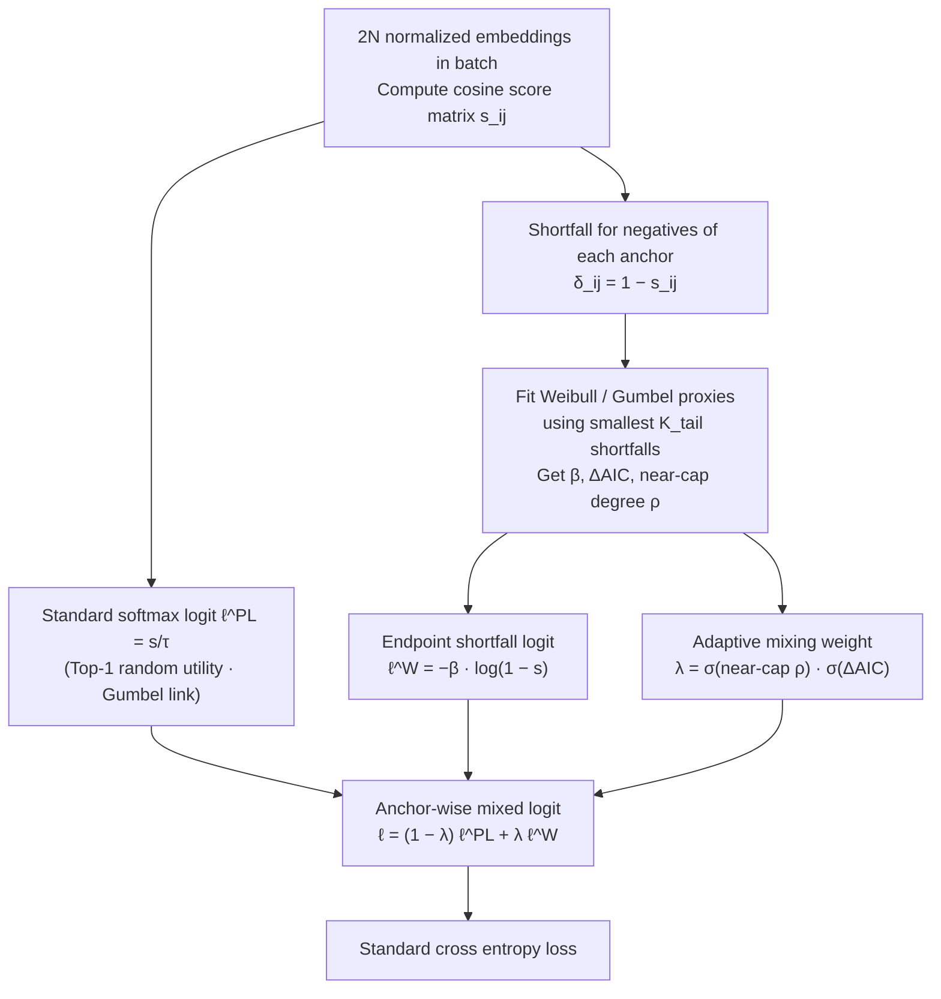

# When Softmax Fails at the Top: Extreme Value Corrections for InfoNCE

**Conference**: ICML 2026  
**arXiv**: [2606.00262](https://arxiv.org/abs/2606.00262)  
**Code**: https://github.com/hsme98/weince  
**Area**: Self-Supervised Learning / Contrastive Learning  
**Keywords**: InfoNCE, Extreme Value Theory, hard negatives, Weibull tail, contrastive learning  

## TL;DR
This paper interprets InfoNCE as a top-1 selection likelihood and points out that standard softmax implicitly assumes a Gumbel tail distribution. However, hard negatives with high similarity in normalized embeddings more frequently exhibit Weibull behavior with finite endpoints. The authors propose WEINCE, a parameter-free method that adaptively mixes softmax logits with endpoint shortfall logits using in-batch tail statistics to stably improve self-supervised representation quality.

## Background & Motivation
**Background**: InfoNCE is the core objective for contrastive learning methods such as SimCLR, MoCo, SimCSE, and CLIP. It encourages two augmented views of the same data to be similar and views of different data to be dissimilar by letting the positive sample win among a set of candidates via a softmax.

**Limitations of Prior Work**: Modern contrastive learning often utilizes normalized embeddings and cosine similarity, where scores are naturally bounded at $s \le 1$. However, the softmax in InfoNCE can be derived from a random utility model as a top-1 selection model with "score plus Gumbel noise," which assumes a Gumbel geometry with translation-type tails and no finite endpoints. Hard negatives lie precisely near the similarity upper bound, where this softmax tail assumption may be mismatched.

**Key Challenge**: Contrastive learning relies most heavily on gradients from hard negatives, yet the statistical geometry of the hard-negative tail is precisely where the softmax assumption is most likely violated. If the loss assigns incorrect probabilities in the top tail, it misallocates gradients to negatives that should not be emphasized or are under-emphasized, hindering representation learning.

**Goal**: Drawing from Extreme Value Theory (EVT), the authors aim to characterize the tail selection patterns of top-scoring examples in large-$K$ negative sets and design a corrected loss that can directly replace InfoNCE without changing model architecture or adding learnable parameters.

**Key Insight**: The paper treats InfoNCE as a Plackett-Luce top-1 likelihood rather than just a mutual information lower bound. In this view, softmax is not just a computational trick but a testable statistical hypothesis: whether the winner event is generated by Gumbel/translation tails.

**Core Idea**: When negatives for a specific anchor approach the cosine upper bound and the tail resembles Weibull endpoint geometry, WEINCE uses a $-\log(1-s)$ shortfall logit to correct the softmax. When evidence is insufficient, it reverts to the original InfoNCE.

## Method
The paper first reinterprets InfoNCE: for an anchor $u_j$, the positive sample $v_{j0}$ and $K$ negative samples form a candidate set, and the observed event is that the positive sample becomes the top-1 winner. If the candidate utility is $U_{ji}=s_{ji}+\epsilon_{ji}$ and the noise is i.i.d. Gumbel, the top-1 probability is exactly the softmax, and the negative log-likelihood is InfoNCE.

The authors then introduce the Fisher-Tippett-Gnedenko theorem from EVT. Tail limits for maximums follow three geometries: Fréchet (heavy tails), Gumbel (fast decay, unbounded), and Weibull (finite right endpoint). Cosine similarity has a fixed upper bound, so endpoint shortfall behavior naturally occurs in the hard-negative tail. WEINCE is designed to detect endpoint evidence for each anchor and locally correct logits rather than replacing softmax entirely.

### Overall Architecture
During training, WEINCE receives a batch of $2N$ $\ell_2$-normalized embeddings and calculates all cosine scores $s_{ij}=z_i^\top z_j$. For each anchor $i$, the candidate set include its positive sample $i^+$ and all other views. Standard InfoNCE uses $\ell^{PL}_{ij}=s_{ij}/\tau$.

WEINCE additionally estimates two stop-gradient statistics for each anchor: a Weibull shortfall slope $\hat\beta_i$ and a mixing weight $\lambda_i\in[0,1]$. The final logit is $\ell_{ij}=(1-\lambda_i)\ell^{PL}_{ij}+\lambda_i\ell^W_{ij}$, where $\ell^W_{ij}=-\hat\beta_i\log(1-s_{ij})$. The loss remains standard cross entropy, but the logits are anchor-wise corrected. It can be viewed as two branches: the softmax branch provides $\ell^{PL}$ as usual, while the endpoint shortfall branch calculates $\ell^W$ and $\lambda_i$ from batch tail statistics.

### Key Designs
**1. Top-1 random utility interpretation of InfoNCE: Reducing softmax from an empirical formula to a testable statistical hypothesis.** The paper writes the anchor candidate utility as $U_{ji}=s_{ji}+\epsilon_{ji}$. When the noise $\epsilon$ follows i.i.d. Gumbel, the probability of the positive sample being the top-1 winner is exactly $P(I_j=k)=\frac{\exp(s_{jk}/\tau)}{\sum_i\exp(s_{ji}/\tau)}$, making InfoNCE equivalent to maximizing this winner likelihood. This change in perspective implies that softmax is not a default setting but a geometric hypothesis of "score plus Gumbel noise with translation-invariant unbounded tails." The authors then test whether this holds for bounded cosine scores.

**2. Extreme tail diagnostics and endpoint shortfall correction: Providing a logit form better suited for hard negatives.** Per the Fisher-Tippett-Gnedenko theorem, tail limits of maximums follow three geometries: Fréchet, Gumbel, or Weibull. Cosine scores have a fixed upper bound $x_F=1$, and hard negatives aggregate near this boundary. The natural coordinate here is not $s$ itself but the shortfall to the endpoint $-\log(1-s)$. Using Peaks-Over-Threshold (POT) diagnostics, the authors estimate $\hat\xi=-0.39$, showing that Weibull-GPD fits the near-cap tail significantly better than Gumbel-GPD. The resulting Weibull model yields a shortfall logit $\ell^W_{ij}=-\hat\beta_i\log(1-s_{ij})$, which correctly expresses that samples closer to the endpoint are rarer and should be handled specially—a geometry that the translational Gumbel assumption of softmax cannot capture.

**3. Anchor-wise adaptive mixing (WEINCE): Enabling correction only for anchors with clear endpoint evidence.** EVT provides asymptotic results, but the finite-sample state of each mini-batch and anchor varies. Forced application of Weibull (pure Weibit loss) leads to over-correction. WEINCE estimates two stop-gradient quantities online for each anchor: the near-cap degree $\rho_i$ from the smallest shortfalls $\delta_{ij}=1-s_{ij}$, and $\Delta AIC_i=AIC_G-AIC_W$ by fitting Weibull vs. Gumbel proxies on the $K_{tail}$ smallest shortfalls. The mixing weight is the product of two sigmoids: $\lambda_i=\sigma(\kappa_\rho\log(\rho_0/\rho_i))\cdot\sigma(\kappa_{AIC}(\Delta AIC_i-m))$. This weight increases as the tail approaches the cap ($\rho_i$ decreases) and as the Weibull fit becomes more dominant. The final logit $\ell_{ij}=(1-\lambda_i)\ell^{PL}_{ij}+\lambda_i\ell^W_{ij}$ ensures that standard anchors are untouched, while only near-cap, Weibull-like anchors receive endpoint correction.

### Loss & Training
The WEINCE training objective is $\mathcal{L}_{WEINCE}=-\frac{1}{2N}\sum_i\log\frac{\exp(\ell_{i,i^+})}{\sum_{j\in\mathcal{C}(i)}\exp(\ell_{ij})}$. It does not change the encoder, projection head, augmentation, optimizer, or training schedule. $\lambda_i$ and $\hat\beta_i$ are estimated online from the current batch similarity matrix and handled by stop-gradients, excluding them from backpropagation.

The computational overhead is minimal. In a representative run (Tiny-ImageNet / ResNet-18 / batch size 256 / NVIDIA L40S), InfoNCE averaged 253.3 ms per step, while WEINCE averaged 255.0 ms, an end-to-end overhead of about +0.67%. The loss computation time increased from 0.65 ms to 2.11 ms, remaining a tiny fraction of the total step time.

## Key Experimental Results

### Main Results
Visual experiments used official SimCLR settings, replacing only the contrastive loss. Models included ResNet-18, ResNet-50, and ViT-Small on Tiny-ImageNet. Evaluation used frozen-feature linear evaluation and kNN recall.

| Dataset / Encoder | Metric | WEINCE | InfoNCE | Gain |
|--------|------|------|----------|------|
| STL10 / R18 | Linear Acc | 77.94 ± 0.27 | 76.54 ± 0.32 | +1.40 |
| STL10 / R50 | Linear Acc | 80.02 ± 0.46 | 78.44 ± 0.31 | +1.58 |
| CIFAR10 / R50 | Linear Acc | 83.74 ± 0.18 | 82.13 ± 0.92 | +1.61 |
| CIFAR100 / R18 | Linear Acc | 53.28 ± 0.28 | 50.01 ± 0.19 | +3.27 |
| CIFAR100 / R50 | Linear Acc | 55.97 ± 1.21 | 51.15 ± 0.43 | +4.82 |
| ImageNet32 / R18 | Linear Acc | 25.26 ± 0.28 | 24.29 ± 0.30 | +0.97 |
| Tiny-IN / ViT-S | Linear Acc | 36.53 | 33.12 | +3.41 |

### Ablation Study
The paper also reports kNN recall and cross-domain NLP experiments to verify if WEINCE improves representation for more than just linear probing.

| Configuration | Key Metric | Description |
|------|---------|------|
| CIFAR100 / R18 | R@1 42.94 vs. 36.98 | Significant boost in kNN quality |
| CIFAR100 / R50 | R@1 42.70 vs. 35.44 | Gains hold for larger backbones |
| Tiny-IN / ViT-S | R@1 23.53 vs. 19.30 | Transformer encoders also benefit |
| STL10 / R18 | R@1 70.83 vs. 68.22 | Stable but modest retrieval improvement |
| SimCSE / STS-B | Spearman 76.36 vs. 71.74 | +4.63 points in NLP contrastive learning |
| Runtime Overhead | 255.0 ms vs. 253.3 ms | ~0.67% overhead, zero learnable parameters |

### Key Findings
- Maximum gains appear on datasets with more fine-grained categories (e.g., CIFAR100), suggesting that hard-negative tail correction is particularly helpful for learning complex class boundaries.
- Improvements in kNN recall are often more pronounced than in linear accuracy, indicating that WEINCE improves the local neighborhood structure of the embedding space, not just linear separability.
- SimCSE results suggest the bounded cosine endpoint problem is not unique to vision. WEINCE facilitates a statistical correction for any objective using softmax top-1 selection on normalized embeddings.

## Highlights & Insights
- The most clever part of the paper is reinterpreting InfoNCE's softmax as a random utility model. This perspective transforms "Is softmax correct?" into a testable statistical question rather than an unquestioned default.
- WEINCE's engineering implementation is highly restrained. It requires no new networks, no extra forward passes, and no additional parameters. It simply applies stop-gradient corrections at the logit level, making it easy to integrate into existing SimCLR or SimCSE pipelines.
- Adaptive mixing is more robust than a direct replacement. EVT provides tail asymptotics, but finite-sample batch states vary; letting $\lambda_i$ be determined by near-cap and AIC evidence avoids over-correction from overly theoretical hard swaps.

## Limitations & Future Work
- Tail estimates rely on mini-batches, and factors like batch size, augmentation intensity, and training phase affect shortfall statistics. Estimation of $\lambda_i$ may be unstable with small batches or insufficient hard negatives.
- The current method is primarily valid for bounded cosine similarity. If the model uses unnormalized dot products or learnable similarity scales, the tail geometry may change, requiring re-diagnosis.
- WEINCE introduces several statistical hyperparameters, such as $K_{tail}$, $\rho_0$, AIC margin, and sigmoid sharpness; while there are no learnable parameters, tuning complexity still exists.
- The paper focuses on frozen-feature evaluation; future work could investigate whether gains persist in end-to-end fine-tuning, cross-modal retrieval, and large-scale CLIP training.

## Related Work & Insights
- **vs. InfoNCE / SimCLR**: Standard InfoNCE uses softmax logits $s/\tau$; this paper identifies this as a Gumbel top-1 link and corrects it in the hard-negative endpoint region.
- **vs. Hard Negative Mining**: Hard negative mining changes the sample set; WEINCE changes the statistical interpretation and gradient weighting of those negatives within the loss.
- **vs. Temperature Tuning**: Temperature tuning only provides global logit scaling and cannot represent near-cap shortfall geometry; WEINCE’s $\lambda_i$ and $\hat\beta_i$ are anchor-wise.
- **Transferable Insights**: Similar tail geometric corrections could be applied to retrieval loss, ranking loss, CLIP-style contrastive learning, or any top-k/top-1 selection model using bounded scores.

## Rating
- Novelty: ⭐⭐⭐⭐⭐ Rethinking InfoNCE softmax assumptions via EVT and providing a lightweight correction is a very fresh perspective.
- Experimental Thoroughness: ⭐⭐⭐⭐☆ Covers various datasets, backbones, linear/kNN/NLP; could be further validated on large-scale multi-modal training.
- Writing Quality: ⭐⭐⭐⭐☆ Theoretical chain is complete, and the connection between diagnostics and methodology is natural; some EVT derivations may have a high barrier for some readers.
- Value: ⭐⭐⭐⭐⭐ Highly practical for contrastive learning, especially given its non-parametric, low-overhead, and drop-in nature for InfoNCE.

<!-- RELATED:START -->

## Related Papers

- [\[ICLR 2026\] InfoNCE Induces Gaussian Distribution](../../ICLR2026/self_supervised/infonce_induces_gaussian_distribution.md)
- [\[ICML 2026\] A Refined Generalization Analysis for Extreme Multi-class Supervised Contrastive Representation Learning](a_refined_generalization_analysis_for_extreme_multi-class_supervised_contrastive.md)
- [\[NeurIPS 2025\] Asymptotic and Finite-Time Guarantees for Langevin-Based Temperature Annealing in InfoNCE](../../NeurIPS2025/self_supervised/asymptotic_and_finite-time_guarantees_for_langevin-based_temperature_annealing_i.md)
- [\[AAAI 2026\] CATFormer: When Continual Learning Meets Spiking Transformers With Dynamic Thresholds](../../AAAI2026/self_supervised/catformer_when_continual_learning_meets_spiking_transformers_with_dynamic_thresh.md)
- [\[ICML 2026\] Statistical Consistency and Generalization of Contrastive Representation Learning](statistical_consistency_and_generalization_of_contrastive_representation_learnin.md)

<!-- RELATED:END -->
