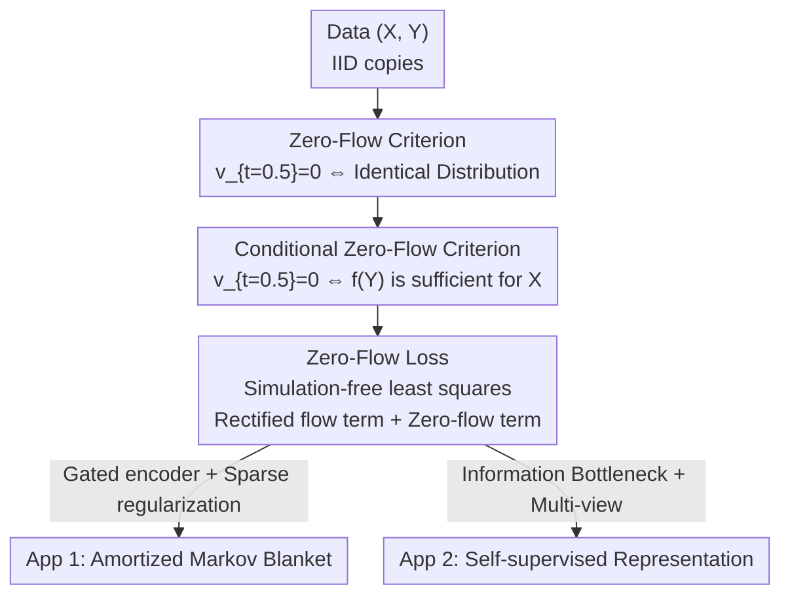

# Zero-Flow Encoders

**Conference**: ICML2026  
**arXiv**: [2602.00797](https://arxiv.org/abs/2602.00797)  
**Code**: https://github.com/probabilityFLOW/zfe  
**Area**: Self-Supervised Learning / Representation Learning / Flow Models  
**Keywords**: Rectified Flow, Zero-Flow Criterion, Conditional Independence, Markov Blanket, Shortcut Problem  

## TL;DR
The paper discovers a counter-intuitive phenomenon: a rectified flow trained with independent coupling is zero at $t=0.5$ if and only if the source and target distributions are identical ("Zero-Flow Criterion"). By generalizing this to conditional distributions, the authors prove that $\mathbf{v}_{t=0.5}=0$ is equivalent to the encoder $f(Y)$ being sufficient for predicting $X$ (conditional independence). Based on this, they design a simulation-free least-squares loss without parametric density assumptions to unifiedly learn Markov blankets in graphical models and self-supervised representations, naturally circumventing the "shortcut problem" inherent in contrastive learning.

## Background & Motivation

**Background**: Continuous-time flow methods like diffusion models and flow matching have achieved great success in image synthesis, time-series forecasting, and simulation-based inference. These methods learn a time-varying velocity field to transport samples from a simple source distribution to a complex target distribution, excelling at capturing fine structures of complex distributions. Recently, flow methods have also been applied to non-generative tasks (anomaly detection, conditional independence testing, and RL policy parameterization).

**Limitations of Prior Work**: The classic task of representation learning—extracting sufficient summary information from redundant features—has long relied on two paradigms, each with significant drawbacks. One is parametric graphical models combined with Lasso subset selection to find Markov blankets, which requires parametric assumptions on the data distribution and involves intractable normalization terms. The other is contrastive learning (e.g., SimCLR), which learns semantics by maximizing the mutual information (MI) between two-view representationsPaths. However, the **greedy nature of MI maximization leads to the "shortcut problem"**: as long as the model finds a superficial feature (like a watermark) that easily distinguishes positive and negative pairs, the loss saturates rapidly, and the model loses the incentive to learn high-level semantics like "dog" or "horse."

**Key Challenge**: The essence of sufficiency is a **conditional independence** constraint $X\perp\!\!\!\perp Y\mid f(Y)$, which is equivalent to the equality of conditional distributions $p_{X\mid Y}=p_{X\mid f(Y)}$. Existing methods either approximate this constraint with parametric densities or use surrogate objectives like MI, neither of which directly and non-parametrically tests whether "two conditional distributions are equal."

**Goal**: To find a criterion that strictly tests for the equality of conditional distributions without requiring parametric density assumptions, and that can be formulated as an optimizable loss, thereby unifying "Markov blanket discovery" and "self-supervised representation learning" into a single framework for learning sufficient information.

**Key Insight**: The authors start from an observation: a rectified flow with independent coupling seems to "stop" at the midpoint $t=0.5$. If this "zero-flow" phenomenon holds if and only if the two distributions are identical, it serves as a natural distribution equality tester that can be transformed into a sufficiency criterion.

**Core Idea**: Use the geometric property of the flow model—whether the midpoint velocity field is zero—instead of MI or parametric densities to enforce conditional independence and learn sufficient encoders.

## Method

### Overall Architecture

The method follows a three-step path: first, discovering and proving the Zero-Flow Criterion in the **unconditional** setting ($\mathbf{v}_{t=0.5}=0 \iff p_X=p_{X'}$); second, **generalizing it to conditional distributions** (proving that a modified rectified flow has a zero midpoint velocity field if and only if $p_{X\mid Y}=p_{X\mid f(Y)}$, i.e., $f$ is sufficient for $X$); finally, formulating this criterion as a **simulation-free least-squares loss**, instantiated for Markov blanket learning and self-supervised representation learning. The entire pipeline requires no numerical ODE solvers and no parametric assumptions on data distributions.

### Key Designs

**1. Zero-Flow Criterion: Translating "Distribution Equality" to "Zero Midpoint Velocity"**

This is the theoretical foundation of the paper. Rectified flow learns a velocity field along the interpolation path $X_t=tX+(1-t)X'$ by minimizing $\mathbf{v}_t:=\arg\min_{\mathbf{u}_t}\int_0^1\mathbb{E}\|X'-X-\mathbf{u}_t(X_t)\|^2\mathrm{d}t$, where the global optimum is $\mathbf{v}_t(\mathbf{z})=\mathbb{E}[X'-X\mid X_t=\mathbf{z}]$. Does the velocity field vanish everywhere if $p_X=p_{X'}$? Generally no. However, the authors prove a precise property in **Theorem 3.1**: when $X$ and $X'$ are independent, $\mathbf{v}_{t=0.5}(\mathbf{z})=\mathbf{0},\forall\mathbf{z}$ if and only if $p_X=p_{X'}$. This is a special case of a broader anti-symmetry (**Theorem 3.2**: $\mathbf{v}_t(\mathbf{z})=-\mathbf{v}_{1-t}(\mathbf{z})\iff p_X=p_{X'}$). "Independent coupling" is the key premise here—the paper only uses initial flows without Reflow.

**2. Conditional Zero-Flow Criterion: Equating Zero Midpoint Velocity with "Sufficient Encoding"**

Theorem 3.1 only measures marginal distribution equality. Sufficiency requires **conditional** equality $p_{X\mid Y}=p_{X\mid f(Y)}$. The authors design a modified rectified flow objective: $\mathbf{v}_t:=\arg\min_{\mathbf{u}_t}\int_0^1\mathbb{E}\|X'-X-\mathbf{u}_t(X_t,f(Y'),Y)\|^2\mathrm{d}t$, where $(X',Y')$ is an independent copy of $(X,Y)$. The closed-form solution is $\mathbf{v}_t(X_t;\eta,\xi)=\mathbb{E}[X'-X\mid X_t,f(Y')=\eta,Y=\xi]$. **Theorem 3.3** proves the ODE defined by this velocity field transports $p_{X\mid Y}$ to $p_{X\mid f(Y)}$. **Theorem 3.4** gives the conditional zero-flow criterion: for all $(\xi, \eta)$ such that $f(\xi)=\eta$, $\mathbf{v}_{t=0.5}(\mathbf{z};\eta,\xi)=\mathbf{0}$ if and only if $p_{X\mid Y}=p_{X\mid f(Y)}$. In other words, **zero midpoint velocity = encoding $f$ is sufficient for predicting $X$**.

**3. Zero-Flow Loss: Simulation-Free Least-Squares Objective**

Applying the zero-flow condition to every $\mathbf{z}$ is infeasible. The authors heuristically substitute $X_t$ and combine the conditional flow objective with the zero-flow objective into a simulation-free least-squares loss:

$$L(\mathbf{u},f)=\underbrace{\int_0^1\omega(t)\mathbb{E}\|\mathbf{u}_t(X_t,f(Y),Y)\|^2\mathrm{d}t}_{\text{Zero-flow criterion}}+\underbrace{\int_0^1\mathbb{E}\|X'-X-\mathbf{u}_t(X_t,f(Y'),Y)\|^2\mathrm{d}t}_{\text{Rectified flow loss}},$$

where $\omega(t)\ge 0$ is a time-weight peaking at $t=0.5$ (e.g., Laplace centered at 0.5). Expectations are approximated by samples, and $(X',Y')$ are obtained via bootstrap sampling. The entire objective is "simulation-free"—it avoids numerical integration of the ODE, providing a key efficiency advantage over generative flow methods.

**4. Two Applications: Gated Sparse selection for MB + Info-Bottleneck for SSL**

The same loss is applied to different encoder families $\mathcal{F}$. **Markov Blanket (MB)**: Let $X=Z_{\mathbf{m}}$ (target features) and $Y=Z_{-\mathbf{m}}$ (rest). The encoder uses a gating form $f_{\mathbf{w}}(Y)=Y\circ\sigma(\mathbf{w})$, where $\sigma(\mathbf{w})$ acts as a feature selection gate, plus sparse regularization $\lambda\sum_i\sigma_i(\mathbf{w})$. Going further, using an **amortized encoder** $f_\beta(\mathbf{y},\mathbf{m})=\mathbf{y}\circ\sigma_\beta(\mathbf{m})$ allows instant inference of MBs for unseen partitions, whereas parametric MLE methods require training a separate model for every combination. **Self-Supervised (SSL)**: Let $X=Z_1$ and $Y=Z_2$ (two views). The zero-flow criterion enforces $Z_1\perp\!\!\!\perp Z_2\mid f(Z_2)$, which is exactly the conditional independence in multi-view hypotheses $Z_2\leftarrow T\rightarrow Z_1$. To avoid the trivial solution $f(Z_2)=Z_2$, $f$ maps to a low-dimensional $L\ll d$ latent space. Since it directly enforces conditional independence rather than greedily maximizing MI, it is naturally immune to shortcuts.

## Key Experimental Results

### Main Results 1: Graphical Model Structure Recovery (AUC, avg over 10 trials)

| Dataset | MLP (Ours) | LSTM (Ours) | PC-Fisher's Z | GLasso |
|--------|-----------|-------------|---------------|--------|
| Gaussian | 0.97 | **0.98** | 0.85 | 0.94 |
| Nonparanormal | 0.79 | **0.97** | 0.75 | 0.78 |
| Truncated | 0.95 | **0.98** | 0.83 | 0.88 |

On non-Gaussian settings, Zero-Flow Encoders significantly outperform Graphical Lasso and PC algorithms. LSTM gates with inductive bias for sequential data achieve near-perfect AUC. Efficiency is also superior: a kernel-based non-parametric test (KCI) takes 24 hours on CPU, while the amortized MLP encoder trains in 30 seconds on the same hardware.

### Main Results 2: SSL Representations with Watermark Shortcuts (Linear Probing Acc / Recon MSE; change relative to clean dataset in parentheses)

| Dataset | Method | Accuracy | Recon MSE |
|--------|------|--------|----------|
| STL-10 | Ours | 52.21% (+2.41) | 0.0256 (−0.0003) |
| STL-10 | SimCLR | 10.00% (−60.23) | 0.0674 (+0.0210) |
| STL-10 | MAE | 56.14% (+0.65) | 0.0245 (−0.0001) |
| TinyImageNet | Ours | 16.60% (+0.50) | 0.0290 (+0.0005) |
| TinyImageNet | SimCLR | 0.50% (−30.63) | 0.0758 (+0.0267) |
| TinyImageNet | MAE | 18.75% (−0.24) | 0.0305 (−0.0007) |

### Key Findings

- **Zero-Flow Encoders are nearly immune to shortcuts**: After adding a random 1/9 area watermark to the top-left of every image, SimCLR's accuracy plummeted (e.g., −60.23 on STL-10), while Zero-Flow Encoders and MAE showed minimal changes.
- **Reconstruction visualizations confirm semantic preservation**: On watermarked ImageNet, SimCLR only reconstructs the watermark, losing original structure. Zero-Flow representations preserve rich semantics despite encoding the watermark.
- **Inductive biases are plug-and-play**: Different gating networks (MLP/LSTM/CNN) adapt to chain, temporal, or lattice structures.
- **Sufficiency over greediness is key**: By enforcing conditional independence rather than MI maximization, the failure mode of "stopping once a superficial shortcut is found" is mechanistically removed.

## Highlights & Insights
- **Geometric Property as a Sufficiency Gauge**: The equivalence chain "Zero Midpoint Velocity $\iff$ Conditional Equality $\iff$ Sufficient Encoding" transforms abstract CI testing into optimizable least squares.
- **Simulation-Free and Non-Parametric**: Without numerical solvers or density models, the method bypasses intractable normalization and is orders of magnitude faster than kernel methods (30s vs 24h).
- **Amortized Markov Blanket**: Feeding the mask $\mathbf{m}$ into the gating network allows one model to serve arbitrary target partitions, solving the combinatorial explosion problem.
- **Shift from "MI Maximization" to "CI Enforcement"**: This provides a principled mechanism to solve shortcut problems in self-supervised learning rather than an ad-hoc fix.

## Limitations & Future Work
- **Theoretical Dependence on Independent Coupling**: The criterion relies on $X\perp\!\!\!\perp X'$ sampling; results if coupling is changed are not explored.
- **Heuristic Approximation of Zero-Flow Condition**: Replacing "for all $\mathbf{z}$" with "on samples $X_t$" is empirically effective but lacks theoretical guarantees.
- **SSL Positioning is Robustness, not SOTA Ranking**: Absolute accuracy (e.g., 7% on ImageNet-1K) is still much lower than strong contrastive methods. Scalable competitiveness remains to be verified.
- **Underutilized Anti-symmetry (Theorem 3.2)**: The general anti-symmetry property is left for future work; its potential for robust testing has not been developed.

## Related Work & Insights
- **vs SimCLR / Contrastive Learning**: Both use multi-view hypotheses, but SimCLR's MI maximization is prone to shortcuts. Ours uses the zero-flow criterion to enforce CI, removing shortcuts by mechanism.
- **vs Graphical Lasso / PC Algorithm**: GLasso relies on Gaussian/linear assumptions. Zero-Flow Encoders are non-parametric, achieving higher AUC on non-Gaussian graphs and supporting amortized inference.
- **vs MAE**: MAE is robust to shortcuts via masked reconstruction; Zero-Flow Encoders are comparable in robustness but provide theoretical criteria for "sufficiency."

## Rating
- Novelty: ⭐⭐⭐⭐⭐ The Zero-Flow Criterion is a novel and elegant theoretical observation for rectified flows.
- Experimental Thoroughness: ⭐⭐⭐⭐ Good coverage across synthetic graphs and image datasets, though absolute image performance is limited in scale.
- Writing Quality: ⭐⭐⭐⭐ Theories are presented incrementally with clear motivation, though dense with theorems.
- Value: ⭐⭐⭐⭐ Opens a theoretically grounded new path for "non-generative" applications of flow models.

<!-- RELATED:START -->

## Related Papers

- [\[ICML 2026\] From Zero to Hero: Advancing Zero-Shot Foundation Models for Tabular Outlier Detection](from_zero_to_hero_advancing_zero-shot_foundation_models_for_tabular_outlier_dete.md)
- [\[CVPR 2026\] OpenVision 2: A Family of Generative Pretrained Visual Encoders for Multimodal Learning](../../CVPR2026/self_supervised/openvision_2_a_family_of_generative_pretrained_visual_encoders_for_multimodal_le.md)
- [\[ICML 2026\] InfoAtlas: A Foundation Model for Zero-Shot Statistical Dependence Estimation](infoatlas_a_foundation_model_for_zero-shot_statistical_dependence_estimate.md)
- [\[ECCV 2024\] FlowCon: Out-of-Distribution Detection using Flow-Based Contrastive Learning](../../ECCV2024/self_supervised/flowcon_out-of-distribution_detection_using_flow-based_contrastive_learning.md)
- [\[ICLR 2026\] Rethinking Unsupervised Cross-Modal Flow Estimation: Learning from Decoupled Optimization and Consistency Constraint](../../ICLR2026/self_supervised/rethinking_unsupervised_cross-modal_flow_estimation_learning_from_decoupled_opti.md)

<!-- RELATED:END -->
## Related Papers

- [\[ICML 2026\] From Zero to Hero: Advancing Zero-Shot Foundation Models for Tabular Outlier Detection](from_zero_to_hero_advancing_zero-shot_foundation_models_for_tabular_outlier_dete.md)
- [\[CVPR 2026\] OpenVision 2: A Family of Generative Pretrained Visual Encoders for Multimodal Learning](../../CVPR2026/self_supervised/openvision_2_a_family_of_generative_pretrained_visual_encoders_for_multimodal_le.md)
- [\[ICML 2026\] InfoAtlas: A Foundation Model for Zero-Shot Statistical Dependence Estimation](infoatlas_a_foundation_model_for_zero-shot_statistical_dependence_estimate.md)
- [\[ECCV 2024\] FlowCon: Out-of-Distribution Detection using Flow-Based Contrastive Learning](../../ECCV2024/self_supervised/flowcon_out-of-distribution_detection_using_flow-based_contrastive_learning.md)
- [\[CVPR 2026\] TeFlow: Enabling Multi-frame Supervision for Self-Supervised Feed-forward Scene Flow Estimation](../../CVPR2026/self_supervised/teflow_enabling_multi-frame_supervision_for_self-supervised_feed-forward_scene_f.md)

<!-- RELATED:END -->
