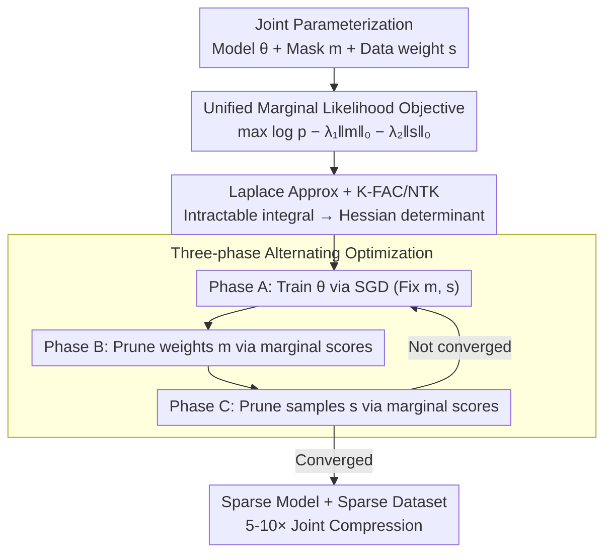

# Joint Model and Data Sparsification via the Marginal Likelihood

**Conference**: ICML 2026  
**arXiv**: [2605.29107](https://arxiv.org/abs/2605.29107)  
**Code**: To be confirmed  
**Area**: Model Compression / Data Sparsification / Bayesian Learning  
**Keywords**: Joint Sparsification, Marginal Likelihood, Laplace Approximation, Neural Tangent Kernel

## TL;DR
JMDS achieves simultaneous model and data sparsification through a unified objective of **maximizing marginal likelihood**. By avoiding the sub-optimality of multi-stage pipes, it maintains performance superior to independent sparsification across CIFAR, ImageNet, and WikiText at 5-10× joint compression ratios.

## Background & Motivation

**Background**: Neural network sparsification has been extensively studied, but model pruning (removing weights) and data sparsification (removing training samples) are typically **treated independently**. Multi-stage approaches ignore the coupling between the two.

**Limitations of Prior Work**: (1) Pipelines following the "training → model sparsity → data sparsity" sequence are prone to local optima; (2) existing joint methods are largely heuristic and lack rigorous theoretical grounding; (3) the fundamental relationship between model and data sparsity remains an open question for large-scale models.

**Key Challenge**: Model and data should be **optimized simultaneously** to maximize joint compression efficiency, yet a unified objective function for this purpose is lacking.

**Goal**: Propose a principled joint sparsification framework, theoretically analyze its complexity, and verify its empirical effectiveness.

**Key Insight**: In a Bayesian framework, the **marginal likelihood** naturally integrates model complexity (e.g., prior volume) with data likelihood, serving as a principled metric to evaluate the quality of a model-plus-data combination.

**Core Idea**: Incorporate model sparsity (binary weight mask $\mathbf{m}$) and data sparsity (binary sample weights $\mathbf{s}$) into a single marginal likelihood objective $\log p(\mathcal{D}_s | \mathbf{m}, \mathbf{s}) = \int p(\mathcal{D}_s | \theta, \mathbf{m}) p(\theta) d\theta$, rendered tractable via Laplace approximation.

## Method

### Overall Architecture
(1) **Joint Parameterization**: Model $\theta$ + model mask $\mathbf{m}$ + data weights $\mathbf{s}$; (2) **Objective**: Jointly maximize marginal likelihood $\log p(\mathcal{D}^{(s)} | \mathbf{m}) - \lambda_1 \|\mathbf{m}\|_0 - \lambda_2 \|\mathbf{s}\|_0$; (3) **Optimization**: Simplify the marginal likelihood using Laplace approximation; (4) **Algorithm**: Perform alternating maximization over $\theta, \mathbf{m}$, and $\mathbf{s}$.

### Key Designs

**1. Unified Marginal Likelihood Objective: Integrating model and data sparsity**

Traditionally, model pruning and data sparsification are handled in separate stages, ignoring their coupling and leading to local optima. The authors unify them into a single objective: maximizing $\log p(\mathcal{D}^{(s)} | \mathbf{m}) - \lambda_1 \|\mathbf{m}\|_0 - \lambda_2 \|\mathbf{s}\|_0$, where $\mathcal{D}^{(s)} = \{(\mathbf{x}_i, y_i, s_i)\}$ is the weighted dataset and $\mathbf{m}$ is the weight mask.

Marginal likelihood is chosen as the unified metric because it integrates model complexity (prior volume) and data likelihood, automatically penalizing redundant weights via Occam’s razor. Compared to staged methods, it ensures the joint optimality of $(\mathbf{m}, \mathbf{s})$ supported by Bayesian theory.

**2. Laplace Approximation + K-FAC/NTK: Making marginal likelihood tractable**

The marginal likelihood $\log p(\mathcal{D}^{(s)}) = \int p(\mathcal{D}^{(s)} | \theta, \mathbf{m}) p(\theta) d\theta$ is analytically intractable. The authors apply a Laplace approximation at $\theta^* = \arg\max$ to obtain $\log p(\mathcal{D}^{(s)}) \approx -\mathcal{L}(\theta^*) + \frac{1}{2} \log \det H^{-1}$, converting the integral into an expression involving the Hessian determinant. Since exact Hessian decomposition is $O(d^3)$, they utilize K-FAC block-diagonal approximation $H \approx H_{\text{kfac}}$ to reduce complexity from $O(N + d^2)$ to $O(N + d \cdot l)$, further accelerating via NTK approximation and sub-sampling.

**3. Three-phase Alternating Optimization: Decomposition of the joint problem**

Optimizing $\theta, \mathbf{m}$, and $\mathbf{s}$ jointly is a non-convex problem. The authors solve it via alternating maximization. Phase A fixes $\mathbf{m}, \mathbf{s}$ to train $\theta$. Phase B fixes $\theta, \mathbf{s}$ to optimize $\mathbf{m}$, where the gradient $\partial \log p / \partial m_j \approx -|\theta_j| \cdot \mathbb{E}[H_{jj}]$ provides a "marginal contribution score" for weights. Phase C fixes $\theta, \mathbf{m}$ to optimize $\mathbf{s}$, with scores derived from $\partial \log p / \partial s_i \approx \log p(y_i | \mathbf{x}_i, \theta, \mathbf{m}) + \text{Hessian term}$. Since both scores are derived from the same objective, weight pruning and sample selection are performed on a consistent scale.

## Key Experimental Results

### Main Results: Joint Sparsification Performance (CIFAR-100 + ResNet-50)

| Method | Model Sparsity | Data Sparsity | Test ACC | Training Time | Inference FLOPs |
|------|-----------|-----------|----------|---------|------------|
| Dense Baseline | 0% | 0% | 78.3% | 1.0× | 1.0× |
| Model Pruning (IMP) | 80% | 0% | 76.1% | 1.0× | 0.21× |
| Data Pruning (forget) | 0% | 50% | 75.8% | 0.5× | 1.0× |
| Multi-stage (IMP→forget) | 80% | 50% | 74.2% | 0.5× | 0.21× |
| **JMDS (Ours)** | 80% | 50% | **77.5%** | **0.4×** | **0.21×** |
| JMDS (Extreme) | 90% | 70% | **76.3%** | **0.3×** | **0.13×** |

### Across Datasets / Models

| Dataset | Model | Multi-stage ACC | **JMDS ACC** | Gain |
|--------|------|------------|----------|------|
| CIFAR-10 | ResNet-18 | 91.2 | **93.4** | +2.2 |
| CIFAR-100 | ResNet-50 | 74.2 | **77.5** | +3.3 |
| ImageNet | ResNet-50 | 72.1 | **74.8** | +2.7 |
| WikiText-2 | GPT-2 (Small) | 27.3 PPL | **24.9 PPL** | -2.4 PPL |
| WikiText-103 | GPT-2 (Medium) | 24.5 PPL | **22.1 PPL** | -2.4 PPL |

### Computational Analysis

| Method | Hessian Approx Cost | Convergence Steps | Total Time vs Dense |
|------|----------------|-----------|------------|
| Exact Hessian | $O(d^3)$ → Intractable | — | — |
| K-FAC + NTK Sub-sampling | $O(d \cdot l + s d)$ | 50-100 steps | 0.4-1.5× |
| Fully Heuristic | $O(1)$ | 100+ | 0.5× |

### Key Findings
- **Joint Advantage at High Sparsity**: At 80% model and 50% data sparsity, JMDS outperforms the staged method by 3.3%.
- **Theoretical Consistency**: The decrease in marginal likelihood is highly correlated with accuracy loss.
- **Cross-Task Stability**: Consistent improvements in both CV and NLP tasks demonstrate the generalizability of the framework.

## Highlights & Insights
- **Principled Joint Sparsification**: Moves beyond independent sparsification pipelines to reveal the coupled relationship between model architecture and data.
- **Theory Meets Practice**: The combination of Laplace approximation, K-FAC, and NTK sub-sampling makes the theoretical objective computationally feasible.
- **Unified Perspective**: Marginal likelihood serves as a single metric to balance model complexity and data contribution.

## Limitations & Future Work
- Scalability to larger models: K-FAC approximation limits current use to GPT-2 Medium; larger models require further approximation.
- Non-gradient scores: Current scores rely on gradient information, which may not apply to non-gradient tasks like retrieval.
- Convergence: Global convergence guarantees for the alternating optimization are not provided.
- Future work: Developing efficient Hessian approximations (e.g., second-order NTK) and extending the framework to multimodal or reinforcement learning.

## Related Work & Insights
- **vs Independent Sparsification (IMP, Forget-score)**: First to provide a coupled optimization framework.
- **vs Bayesian Pruning**: Bayesian pruning focuses on weights; JMDS extends this to the data domain.
- **Insight**: Marginal likelihood can be a unified metric for combined Architecture Search + Data Selection problems.

## Rating
- Novelty: ⭐⭐⭐⭐⭐  First principled joint sparsification framework.
- Experimental Thoroughness: ⭐⭐⭐⭐⭐  Wide range of datasets/models with strong theoretical alignment.
- Writing Quality: ⭐⭐⭐⭐  Mathematically rigorous, though some derivations are dense.
- Value: ⭐⭐⭐⭐⭐  Significant practical utility for large-scale compression.

<!-- RELATED:START -->

## Related Papers

- [\[NeurIPS 2025\] Feature-aware Modulation for Learning from Temporal Tabular Data](../../NeurIPS2025/signal_comm/feature-aware_modulation_for_learning_from_temporal_tabular_data.md)
- [\[ICLR 2026\] Synchronizing Probabilities in Model-Driven Lossless Compression](../../ICLR2026/signal_comm/synchronizing_probabilities_in_model-driven_lossless_compression.md)
- [\[ICLR 2026\] TS-DDAE: A Novel Temporal-Spectral Denoising Diffusion AutoEncoder for Wireless Signal Recognition Model Pre-training](../../ICLR2026/signal_comm/ts-ddae_a_novel_temporal-spectral_denoising_diffusion_autoencoder_for_wireless_s.md)
- [\[ECCV 2024\] RAW-Adapter: Adapting Pre-trained Visual Model to Camera RAW Images](../../ECCV2024/signal_comm/raw-adapter_adapting_pre-trained_visual_model_to_camera_raw_images.md)
- [\[ICML 2025\] Large Language Model (LLM)-enabled In-context Learning for Wireless Network Optimization](../../ICML2025/signal_comm/large_language_model_llm-enabled_in-context_learning_for_wireless_network_optimi.md)

<!-- RELATED:END -->
