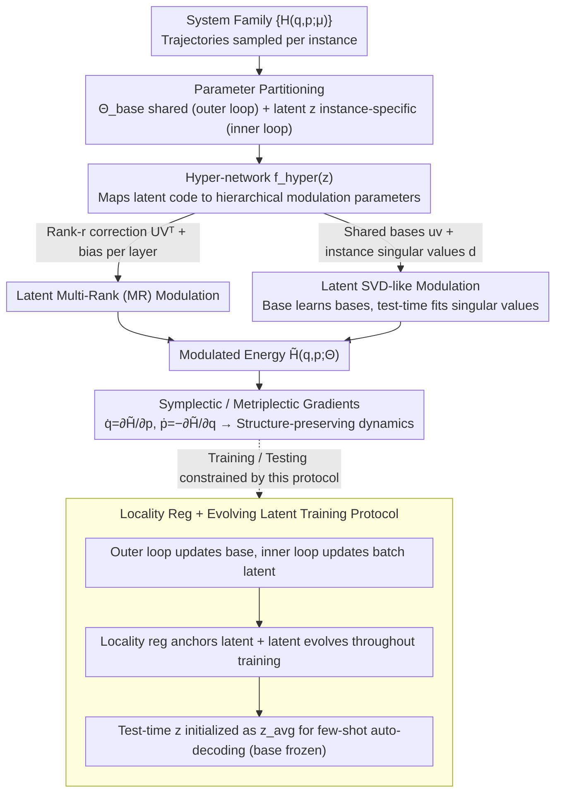

# Meta-learning Structure-Preserving Dynamics

**Conference**: ICML 2026  
**arXiv**: [2508.11205](https://arxiv.org/abs/2508.11205)  
**Code**: None  
**Area**: Scientific Machine Learning / Meta-learning / Structure-Preserving Neural Networks  
**Keywords**: Hamiltonian NN, GENERIC, modulated meta-learning, low-rank adaptation, SVD modulation

## TL;DR
This paper systematically introduces modulation-based meta-learning (where a hyper-network maps latent codes $\bm{z}^{(k)}$ to hierarchical modulation parameters) into Hamiltonian and GENERIC neural networks. It proposes two novel modulation schemes—latent multi-rank (MR) and latent SVD-like modulation—enabling a shared network to adapt to entire families of new parameter instances $\bm{\mu}$ with few shots, while strictly maintaining energy conservation or dissipation structures.

## Background & Motivation

**Background**: Structure-preserving neural networks (HNN, LNN, port-Hamiltonian NN, GENERIC/metriplectic NN) hard-code physical priors such as conservation laws, symplectic structures, and dissipation laws into their architectures. They provide physically faithful predictions for dynamical systems with known parameters $\bm{\mu}$.

**Limitations of Prior Work**: Existing models are largely "trained per parameter instance." Slight changes in parameters necessitate retraining, leading to prohibitive costs in many-query scenarios (e.g., families of pendulums with varying masses or oscillators with different stiffness). Sparse existing meta-learning extensions (Lee 2021, Song 2024) rely on MAML or ANIL, which involve unstable and computationally expensive inner-loop updates of high-dimensional parameters.

**Key Challenge**: HNN-style models only require learning a scalar potential $\mathcal{H}_\Theta(\bm{q}, \bm{p})$ to define the entire dynamics. The dependence of weights on system parameters $\bm{\mu}$ is naturally low-dimensional. Existing meta-learning methods fail to exploit this structure by updating all parameters $\Theta$ via full gradients.

**Goal**: (1) Systematically evaluate various modulation strategies within Hamiltonian and GENERIC frameworks; (2) Design expressive yet parameter-efficient modulation schemes; (3) Ensure that the modulated models strictly preserve conservation and dissipation structures.

**Key Insight**: Borrowing from latent modulation in Implicit Neural Representations (INR) and NeRF (e.g., CODA, Dupont 2022), each system is compressed into a low-dimensional latent code $\bm{z}^{(k)}$. A hyper-network $\bm{f}_\text{hyper}(\bm{z}^{(k)}; \bm\phi)$ then generates small hierarchical corrections while base weights remain shared across all tasks.

**Core Idea**: "Shared base + instance latent + hierarchical low-rank modulation" captures the low-dimensional manifold of parameters $\bm{\mu}$ using minimal trainable parameters. The SVD-like decomposition learns orthogonal bases during the base stage, reducing test-time adaptation to fitting a few singular value scalars.

## Method

### Overall Architecture
The input consists of a family of Hamiltonian or GENERIC systems $\{\mathcal{H}^{(k)}(\bm{q}, \bm{p}) = \mathcal{H}(\bm{q}, \bm{p}; \bm{\mu}^{(k)})\}_{k=1}^{n_\mu}$, with trajectories sampled for each. Model parameters are partitioned as $\Theta^{(k)} = \Theta_\text{base} \cup \Theta_\text{indv}^{(k)}$. The base parameters are updated by meta-gradients in the outer loop, while individual latent codes $\bm{z}^{(k)}$ are updated in the inner loop. A hyper-network maps $\bm{z}^{(k)}$ to low-rank or bias correction parameters for each layer. The resulting $\tilde{\mathcal{H}}(\bm{q}, \bm{p}; \Theta^{(k)})$ serves as the latent-conditioned energy function, producing dynamics via $\dot{\bm q} = \partial \tilde{\mathcal H} / \partial \bm p$ and $\dot{\bm p} = -\partial \tilde{\mathcal H} / \partial \bm q$. Thus, structure preservation is inherited from the base architecture.

### Key Designs

**1. Latent Multi-Rank (MR) Modulation: Adding latent-generated low-rank corrections to weights**

Since HNN-style models learn a scalar potential, weight dependence on $\bm{\mu}$ is inherently low-dimensional. MR adds a rank-$r$ instance-specific correction $\bm{U}^{(\ell,k)} \bm{V}^{(\ell,k)\top}$ and a bias correction $\bm{s}^{(\ell,k)}$ to the weights $\bm{W}^{(\ell)}$ of each MLP layer. These are generated from $\bm{z}^{(k)}$ via the hyper-network. The layer transformation becomes: $\bm{h} \mapsto \sigma\left((\bm{W}^{(\ell)} + \bm{U}^{(\ell,k)} \bm{V}^{(\ell,k)\top}) \bm{h} + \bm{b}^{(\ell)} + \bm{s}^{(\ell,k)}\right)$, where $\bm{U}, \bm{V} \in \mathbb{R}^{w_\ell \times r}$. At $r=1$, this simplifies to rank-one (RO) modulation.

Proposition 3.1 provides the justification: if the local rank of $\partial_{\bm\mu} \bm{f}$ is $\le r$, then $r$-dimensional modulation is sufficient to capture all local parameter variations. MR concentrates expressivity into LoRA-style low-rank matrices, requiring significantly fewer parameters than full weight updates.

**2. Latent SVD-like Modulation: Decomposing corrections into shared bases and instance singular values**

MR requires the hyper-network to regenerate large factors $\bm{U}, \bm{V}$. SVD-like modulation factorizes the correction as: $\bm{h} \mapsto \sigma\left((\bm{W}^{(\ell)} + \sum_{i=1}^r d_i^{(\ell,k)} \bm{u}_i^{(\ell)} \bm{v}_i^{(\ell)\top}) \bm{h} + \bm{b}^{(\ell)} + \bm{s}^{(\ell,k)}\right)$. Here, $\bm{u}_i^{(\ell)}$ and $\bm{v}_i^{(\ell)}$ are shared base parameters updated by meta-gradients. Only the singular values $d_i^{(\ell,k)}$ and bias $\bm{s}^{(\ell,k)}$ are generated from $\bm{z}^{(k)}$. Soft orthogonality penalties $\|\bm{U}^\top \bm{U} - \bm{I}\|_F$ and $\|\bm{V}^\top \bm{V} - \bm{I}\|_F$ combined with ReLU activations ensure non-negative singular values. This allows the base to learn "invariant modulation directions" across systems, while test-time adaptation fits only a few scalars.

**3. Locality Reg + Evolving Latent Protocol: Anchoring modulation and sustaining latent evolution**

To stabilize modulation, the authors prevent instance parameters from deviating too far from the base using a regularization term $\lambda_z \|\bm{z}\|_2 + \lambda_\phi \|\bm\phi\|_2$. During testing, the latent is initialized using the Euclidean mean of training latents $\bm{z}_\text{avg} = \tfrac{1}{n_\mu^\text{train}} \sum_k \bm{z}_\text{train}^{(k)}$. More importantly, latents $\bm{z}^{(k)}$ are not reset every epoch but evolve throughout the entire training process. This allows the base and latents to co-evolve, ensuring the base remains in a neighborhood suitable for few-shot adaptation.

### Loss & Training
Hamiltonian systems utilize a symplecticity loss $\mathcal{L}_\text{symp} = \|\dot{\bm q} - \partial_{\bm p} \tilde{\mathcal H}_\Theta\|_2^2 + \|\dot{\bm p} + \partial_{\bm q} \tilde{\mathcal H}_\Theta\|_2^2$, while GENERIC systems use a metriplectic loss. The outer loop performs $N_\text{out}$ updates to $\Theta_\text{base}$, and the inner loop performs $N_\text{in}$ updates to the latent codes of the current batch. Testing involves an $N_\text{test}$-shot latent fit with frozen base weights.

## Key Experimental Results

### Main Results
Experiments were conducted on three energy-conserving systems (Duffing, mass-spring, pendulum) and one dissipative system (DNO). 80 parameter instances (70 training / 10 testing) were sampled, with 10 trajectories each. Metrics include $\epsilon_\text{field}$ (relative $\ell^2$ error on uniform grid) and $\epsilon_\text{traj}$ (test trajectory relative error).

| System | Method | $\epsilon_\text{field}$ ($\times 10^{-2}$) | $\epsilon_\text{traj}$ ($\times 10^{-2}$) |
|------|------|--------------------------------------------|-------------------------------------------|
| Pendulum | Scratch | 83.35 | 79.84 |
| Pendulum | MAML | 99.13 | 52.37 |
| Pendulum | Reptile | 88.72 | 75.73 |
| Pendulum | FW (CODA) | 8.23 | 10.65 |
| Pendulum | Shift | 9.76 | 12.88 |
| Pendulum | RO (MR-1) | 6.47 | 8.27 |
| Pendulum | **SVD(5)** | **4.62** | **5.33** |

### Ablation Study

| Configuration | Pendulum $\epsilon_\text{field}$ | Notes |
|------|----------------------------------|------|
| Multi-domain training (Joint base) | SVD(5) still optimal | Validates cross-dynamics family modulation |
| Few-shot shot adaptation | SVD consistently best | Superior few-shot adaptation (1-300 shots) |
| Locality weight $\lambda_\phi, \lambda_z$ | SVD lowest variance | Robust to regularization strength |
| Latent init (zero vs $\bm z_\text{avg}$) | $\bm z_\text{avg}$ consistently superior | Validates evolving-latent protocol |
| Dissipative DNO system | SVD(3) $\epsilon_\text{traj} = 0.142$ | Reptile / ANIL NaN or diverge |

### Key Findings
- Modulation-based methods (FW, Shift, MR, RO, SVD) reduce error by approximately 65% compared to optimization-based methods like MAML or Reptile. This confirms that modulation is more efficient in structure-preserving networks where weight dependence on system parameters is inherently low-dimensional.
- SVD(5) achieves the lowest error while maintaining a smaller hyper-network volume than FW (as FW outputs full matrices, whereas SVD outputs $r$ scalars), representing the Pareto optimum for "accuracy vs. parameters."
- Optimization-based methods fail (NaN or divergence) on the dissipative DNO system, suggesting that inner-loop gradient steps are unstable for dynamics involving entropy generation.
- Multi-domain experiments show that a single base network can fit multiple dynamics families (Duffing, spring, pendulum) simultaneously, with the latent code acting as a switch between different physics.

## Highlights & Insights
- Decomposing modulation into shared base and task-specific latents via SVD provides interpretability; the magnitude of singular values indicates the importance of specific principal directions for an instance.
- Proposition 3.1 provides a theoretical justification for low-rank modulation, linking the local rank of the parameter space to the required modulation dimension.
- The combination of modulation and HNN/GENERIC architectures is unique: modulation only adjusts the scalar values of $\mathcal{H}_\Theta$ and does not break symplectic or metriplectic symmetry.
- The evolving-latent protocol prevents the distribution shift typically seen when resetting latents during meta-training.

## Limitations & Future Work
- Experimental verification is limited to low-dimensional systems ($\le 4$); performance on PDEs or high-dimensional molecular dynamics is unproven.
- Modulation was only applied to MLP layers; extending this to GNNs or Transformers would require more complex hyper-network designs.
- Orthogonality in the SVD basis relied on soft penalties rather than hard constraints, leading to some sensitivity during early training.
- The interaction between modulation and long-horizon stability in symplectic integrators requires more systematic analysis.

## Related Work & Insights
- **vs MAML / Reptile / ANIL**: Replaces high-dimensional inner-loop gradient updates with low-dimensional latent auto-decoding, avoiding second-order gradients and instability.
- **vs CODA / FW**: FW applies corrections to all weights and biases, leading to massive hyper-networks. MR and SVD significantly reduce parameter counts through low-rank sharing.
- **vs Shift modulation**: Shift modulation only adjusts biases, which is often insufficient. SVD-like modulation adds shared rank-$r$ corrections.
- **vs LoRA**: While LoRA is a task-agnostic fine-tuning technique, MR is effectively a task-conditioned LoRA driven by a hyper-network, bridging fine-tuning and meta-learning.

## Rating
- Novelty: ⭐⭐⭐
- Experimental Thoroughness: ⭐⭐⭐
- Writing Quality: ⭐⭐⭐⭐
- Value: ⭐⭐⭐⭐

<!-- RELATED:START -->

## Related Papers

- [\[ICML 2025\] Deep Electromagnetic Structure Design Under Limited Evaluation Budgets](../../ICML2025/signal_comm/deep_electromagnetic_structure_design_under_limited_evaluation_budgets.md)
- [\[ICCV 2025\] Boosting Multimodal Learning via Disentangled Gradient Learning](../../ICCV2025/signal_comm/boosting_multimodal_learning_via_disentangled_gradient_learning.md)
- [\[AAAI 2026\] Task Aware Modulation Using Representation Learning for Upscaling of Terrestrial Carbon Fluxes](../../AAAI2026/signal_comm/task_aware_modulation_using_representation_learning_for_upsaling_of_terrestrial_.md)
- [\[NeurIPS 2025\] Feature-aware Modulation for Learning from Temporal Tabular Data](../../NeurIPS2025/signal_comm/feature-aware_modulation_for_learning_from_temporal_tabular_data.md)
- [\[ICML 2025\] Large Language Model (LLM)-enabled In-context Learning for Wireless Network Optimization](../../ICML2025/signal_comm/large_language_model_llm-enabled_in-context_learning_for_wireless_network_optimi.md)

<!-- RELATED:END -->
