# FLIPS: Instance-Fingerprinting for LLMs via Pseudo-Random Sequences

**Conference**: ICML 2026  
**arXiv**: [2605.29110](https://arxiv.org/abs/2605.29110)  
**Code**: To be confirmed  
**Area**: LLM Security / Model Watermarking / IP Protection  
**Keywords**: Model Fingerprinting, Pseudo-Random Sequences, Black-box Detection, Robust Fingerprinting

## TL;DR
FLIPS generates unique "fingerprint responses" for models by designing **pseudo-random seed sequences** (known only to the model owner). In black-box query scenarios, it achieves a detection rate > 99% and a false positive rate < 1%, even when attackers fine-tune or prune the model.

## Background & Motivation

**Background**: LLMs are high-value intellectual property (IP) assets but are vulnerable to unauthorized replication, fine-tuning, and redistribution. Existing protection methods—watermarking (tagging outputs), encryption (restricting access), and fingerprinting (identifying original models)—each have limitations.

**Limitations of Prior Work**: (1) Existing fingerprinting methods lack robustness against model fine-tuning and pruning; (2) Most methods require white-box access, making them unsuitable for black-box API scenarios; (3) Backdoor-style fingerprints are easily detected and removed.

**Key Challenge**: Fingerprints must simultaneously satisfy "uniqueness" (distinguishing from other models), "robustness" (resistance to modification), and "stealthiness" (no impact on normal use)—a triple constraint that is difficult to meet.

**Goal**: Design a fingerprinting method that is black-box verifiable, resistant to fine-tuning/pruning, and does not impair model performance.

**Key Insight**: It is observed that LLMs provide highly deterministic responses to **specific input sequences**. By constructing a pseudo-random yet deterministic "seed → fingerprint response" mapping, the presence of a fingerprint can be confirmed via black-box queries.

**Core Idea**: Use **cryptographic pseudo-random sequences** as seeds to generate "probe sequences" $q_s$. The output $r_s$ of the original model on $q_s$ serves as the fingerprint. Attackers cannot locate fingerprint queries without knowledge of the seed.

## Method

### Overall Architecture
FLIPS addresses how to apply a fingerprint to an LLM that is resistant to modification, black-box verifiable, and non-intrusive to model capabilities. The process involves two stages. Injection stage: The model owner uses a private seed $s$ to generate a pseudo-random probe $q_s = G(s)$. The original model $\mathcal{M}_0$ generates a response $r_s = \mathcal{M}_0(q_s)$, and these $(q_s, r_s)$ pairs are stored in a fingerprint library $\mathcal{F}$. Verification stage: The same probes $q_s$ are used to query a suspect model $\mathcal{M}^?$ to obtain $r^?_s$. The similarity $\text{sim}(r^?_s, r_s)$ determines whether it originates from the original model. The entire process does not modify model weights; the fingerprint is carried entirely by the "seed → deterministic response" mapping.

```mermaid
%%{init: {'flowchart': {'rankSpacing': 24, 'nodeSpacing': 28, 'padding': 6, 'wrappingWidth': 400, 'subGraphTitleMargin': {'top': 8, 'bottom': 16}}}}%%
flowchart TD
    subgraph INJ["Injection Phase (Owner Local, No Weight Modification)"]
        direction TB
        S["Seed s (Owner Private)"] --> G["Pseudo-random Probe q_s = G(s)<br/>Cryptographic PRG (AES-CTR)"]
        G --> M0["Original Model M₀ Response<br/>r_s = M₀(q_s)"]
        M0 --> F["Fingerprint Library F = {(q_s, r_s)}<br/>K Diverse Probes"]
    end
    F -->|K Probes q_s for Black-box Query| Q["Query Suspect Model M?<br/>Yields r?_s"]
    subgraph VER["Verification Phase (Black-box)"]
        direction TB
        Q --> SIM["Semantic Fuzzy Matching<br/>cos(enc(r?), enc(r)) > 0.7"]
        SIM --> STAT["Multi-probe Bernoulli Statistics<br/>Hit Ratio vs. Expected μ₀"]
    end
    STAT -->|Within Expected Range| Y["Decision: Derived from M₀"]
    STAT -->|Significant Deviation| N["Decision: Not Derived from M₀"]
```

### Key Designs

**1. Pseudo-Random Probes + Stealthiness: Making fingerprint queries indistinguishable**

Traditional backdoor fingerprints rely on specific trigger words, which are conspicuous and easily detected. FLIPS utilizes cryptographically secure PRGs (e.g., AES-CTR) to generate probes $q_s$ from a seed $s$. The length is set sufficiently high so that each seed probabilistically corresponds to a unique fingerprint response. To an observer without the seed, $q_s$ is indistinguishable from random characters, preventing the identification of fingerprint queries within normal traffic. Stealthiness is derived from the indistinguishability of the PRG.

**2. Multi-Probe + Robust Statistical Verification: Ensuring high confidence via independent probes**

A single probe is susceptible to noise and unreliable for making definitive judgments. FLIPS uses $K$ independent seeds $\{s_i\}_{i=1}^K$ to generate $K$ probes. After querying, local similarity determines a hit $\delta_i = d(r^?_i, r_i) < \tau$, and the hit ratio is analyzed via Bernoulli trials to see if it falls within the expected range $|\sum \mathbb{1}[\delta_i = 1] / K - \mu_0| < \alpha$. Even if 30% of probes fail due to modification, the remaining 70% provide a statistically robust identification. Confidence increases with $K$.

**3. Robustness against Fine-tuning/Pruning: Preserving fingerprints after model modification**

Conventional fingerprints often require exact matches, which are destroyed by fine-tuning, pruning, or quantization. FLIPS enhances robustness in two ways: first, by using a distribution of diverse probes across a wide semantic space, making it difficult for fine-tuning to erase all fingerprints; second, by replacing exact matching with semantic fuzzy matching $\delta(r^?, r) = \cos(\text{enc}(r^?), \text{enc}(r)) > 0.7$. Combining multi-probe distribution with semantic matching maintains detectability after fine-tuning, pruning, quantization, or distillation.

## Key Experimental Results

### Main Results: Detection Rate across models and modifications

| Modification Type | Original LLaMA-7B | Fine-tuned (10K samples) | Pruned 50% | Quantized INT8 | Distilled to 3B |
|---------|--------------|---------------|---------|---------|---------|
| FLIPS (K=100) | **100%** | **98.7%** | **97.2%** | **99.5%** | **94.1%** |
| FLIPS (K=50) | 100% | 96.4% | 94.8% | 98.1% | 89.7% |
| FLIPS (K=20) | 100% | 91.3% | 88.7% | 94.5% | 82.5% |
| Baseline-Watermark | 100% | 67.2% | 71.3% | 88.7% | 51.4% |
| Baseline-Backdoor | 100% | 23.1% | 35.6% | 76.4% | 12.3% |

### False Positive Rate

| Number of Probes K | False Positive Rate (vs. 1000 other LLMs) |
|---------|------------------------|
| 20 | 2.3% |
| 50 | 0.8% |
| **100** | **0.1%** |

### Stealthiness Testing

| Detection Method | FLIPS Probe Recognition Rate | Baseline-Backdoor Trigger Recognition Rate |
|---------|--------------------|---------------------------|
| Input Distribution Anomaly Detection | 0.3% (Essentially random) | 87.5% |
| LLM Meta-detection (GPT-4 Discrimination) | 1.2% | 92.3% |
| Frequency Analysis | 0% (PRG output is uniform) | 78.9% |

### Key Findings
- **Superior Robustness under Fine-tuning**: FLIPS maintains a 98.7% detection rate post-fine-tuning, significantly outperforming the 23.1% rate of the Backdoor baseline.
- **Optimal Balance at K = 50**: This configuration achieves a false positive rate < 1% and a detection rate > 90%.
- **Zero Model Impairment**: FLIPS records responses without modification; no changes were observed in model capability evaluations.
- **Robustness to Quantization and Distillation**: Achieved 99.5% for INT8 quantization and 94.1% for 3B distillation.

## Highlights & Insights
- **Elegant Fusion of Cryptography and LLMs**: Applies classical PRG security models to LLM fingerprinting with theoretical security guarantees.
- **Zero-Impairment Design**: Avoids the capability loss typical of watermarking by recording responses rather than modifying parameters.
- **Provable Stealthiness**: Fingerprint queries are indistinguishable from normal queries under the security assumptions of PRGs.
- **Extreme Robustness**: Outperforms baselines by 20-70 percentage points across fine-tuning, pruning, quantization, and distillation.

## Limitations & Future Work
- **White-box Vulnerability**: If an attacker has full control over model weights, deep architectural modifications might eliminate the fingerprint.
- **Seed Management**: Fingerprints fail if the seed is leaked; multi-party sharing scenarios require threshold cryptography.
- **Fingerprinting Timing**: Requires recording responses from the original model before release; inapplicable to existing non-fingerprinted models.
- **Future Directions**: Implementing threshold cryptography for multi-party verification; extending to multi-modal models; investigating active fingerprint injection during training.

## Related Work & Insights
- **vs. Watermarking (Kirchenbauer et al. 2023)**: Watermarks tag model outputs and can affect generation quality; FLIPS records responses without output modification.
- **vs. Backdoor Fingerprinting**: Backdoors are easily detected; FLIPS uses PRGs to achieve stealthy fingerprinting.
- **vs. Model Distillation Detection**: Traditional methods often require white-box access; FLIPS is black-box compatible.
- **Insights**: The combination of cryptographic pseudo-randomness and model determinism is a promising path for LLM IP protection.

## Rating
- Novelty: ⭐⭐⭐⭐⭐ First to apply cryptographic PRGs to black-box LLM fingerprinting with clear theoretical grounding.
- Experimental Thoroughness: ⭐⭐⭐⭐⭐ Extensive benchmarks across models, modifications, and baselines along with stealthiness tests.
- Writing Quality: ⭐⭐⭐⭐ Clear argumentation and precise technical descriptions.
- Value: ⭐⭐⭐⭐⭐ Addresses urgent IP protection needs; the robustness and zero-impairment profile of FLIPS are highly significant.

<!-- RELATED:START -->

## Related Papers

- [\[ICLR 2026\] Tracing and Reversing Edits in LLMs](../../ICLR2026/social_computing/tracing_and_reversing_edits_in_llms.md)
- [\[ACL 2026\] Investigating Counterfactual Unfairness in LLMs towards Identities through Humor](../../ACL2026/social_computing/investigating_counterfactual_unfairness_in_llms_towards_identities_through_humor.md)
- [\[ICLR 2026\] When Agents Persuade: Propaganda Generation and Mitigation in LLMs](../../ICLR2026/social_computing/when_agents_persuade_propaganda_generation_and_mitigation_in_llms.md)
- [\[ACL 2026\] To Lie or Not to Lie? Investigating The Biased Spread of Global Lies by LLMs](../../ACL2026/social_computing/to_lie_or_not_to_lie_investigating_the_biased_spread_of_global_lies_by_llms.md)
- [\[ACL 2026\] mdok-style at SemEval-2026 Task 9: Finetuning LLMs for Multilingual Polarization Detection](../../ACL2026/social_computing/mdok-style_at_semeval-2026_task_9_finetuning_llms_for_multilingual_polarization_.md)

<!-- RELATED:END -->
