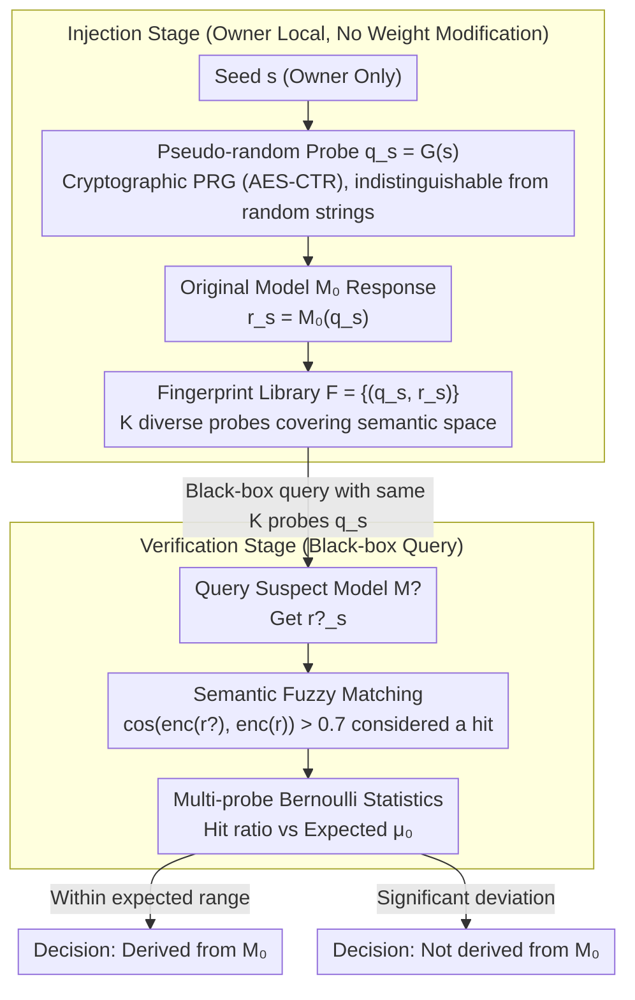

# FLIPS: Instance-Fingerprinting for LLMs via Pseudo-Random Sequences

**Conference**: ICML 2026  
**arXiv**: [2605.29110](https://arxiv.org/abs/2605.29110)  
**Code**: To be confirmed  
**Area**: LLM Security / Model Watermarking / IP Protection  
**Keywords**: Model Fingerprinting, Pseudo-Random Sequences, Black-box Detection, Robust Fingerprinting

## TL;DR
FLIPS generates unique model "fingerprint responses" by designing **pseudo-random seed sequences** known only to the model owner. The fingerprint remains detectable (detection rate > 99%, false positive rate < 1%) under black-box query scenarios even if the attacker fine-tunes or prunes the model.

## Background & Motivation

**Background**: LLMs are high-value intellectual property assets but are susceptible to unauthorized copying, fine-tuning, and secondary distribution. Existing protection methods—watermarking (marking output), encryption (restricting access), and fingerprinting (identifying original models)—each have limitations.

**Limitations of Prior Work**: (1) Existing fingerprinting methods lack robustness against model fine-tuning and pruning; (2) Most methods require white-box access, making them inapplicable to black-box API scenarios; (3) Backdoor-based fingerprints are easily detected and removed.

**Key Challenge**: Fingerprints must balance "uniqueness" (distinguishing from other models), "robustness" (resistance to modification), and "stealthiness" (no impact on normal use)—a triangular constraint difficult to satisfy simultaneously.

**Goal**: Design a fingerprinting method that is black-box verifiable, resistant to fine-tuning/pruning, and does not degrade model performance.

**Key Insight**: It is observed that LLMs exhibit highly deterministic responses to **specific input sequences**. By constructing a pseudo-random yet deterministic "seed $\to$ fingerprint response" mapping, the presence of a fingerprint can be confirmed via black-box queries.

**Core Idea**: Use **cryptographic pseudo-random sequences** as seeds to generate "probe sequences" $q_s$. The original model's output $r_s$ on $q_s$ serves as the fingerprint. Attackers cannot locate fingerprint queries without knowing the seed.

## Method

### Overall Architecture
FLIPS addresses how to embed a fingerprint that is modification-resistant, black-box verifiable, and performance-preserving. The process consists of two stages. Injection stage: The model owner uses a private seed $s$ to generate pseudo-random probes $q_s = G(s)$. The original model $\mathcal{M}_0$ generates responses $r_s = \mathcal{M}_0(q_s)$, which are stored as a fingerprint library $\mathcal{F}$. Verification stage: The same probes $q_s$ are used to query a suspect model $\mathcal{M}^?$ to obtain $r^?_s$. Similarity $\text{sim}(r^?_s, r_s)$ is then used to determine if the model originates from the original model. The weights are not modified; the fingerprint is carried entirely by the "seed $\to$ deterministic response" mapping.

### Key Designs

**1. Pseudo-Random Probes + Stealthiness: Preventing attackers from identifying fingerprint queries**

Traditional backdoor fingerprints rely on specific trigger words, which are conspicuous and easily detected. FLIPS utilizes cryptographically secure PRGs (e.g., AES-CTR) to generate probes $q_s$ from seed $s$. Length is chosen such that each seed probabilistically corresponds to a unique response. To those without the seed, $q_s$ is indistinguishable from random characters, making it impossible to isolate fingerprint queries from normal traffic. Stealthiness is derived from the PRG's indistinguishability rather than obfuscation.

**2. Multi-Probe + Robust Statistical Verification: Increasing confidence via independent probes**

Single probes are susceptible to noise, making individual judgments unreliable. FLIPS uses $K$ independent seeds $\{s_i\}_{i=1}^K$ to generate $K$ probes. After querying, local similarity is calculated for each to determine a hit: $\delta_i = d(r^?_i, r_i) < \tau$. Bernoulli trials then determine if the hit ratio falls within the expected range $|\sum \mathbb{1}[\delta_i = 1] / K - \mu_0| < \alpha$. Even if 30% of probes fail due to modifications, the remaining 70% provide statistically robust identification. Confidence increases with $K$.

**3. Robustness to Fine-tuning/Pruning: Maintaining fingerprint identifiability after modification**

Conventional fingerprints require exact matches, which are destroyed by fine-tuning, pruning, or quantization. FLIPS reinforces this in two ways: first, by using a distribution of diverse probes covering a wide semantic space, making it difficult for fine-tuning to erase all fingerprints; second, by replacing exact matching with semantic fuzzy matching $\delta(r^?, r) = \cos(\text{enc}(r^?), \text{enc}(r)) > 0.7$. Fingerprint detectability is maintained across fine-tuning, pruning, quantization, and distillation.

## Key Experimental Results

### Main Results: Detection Rates Across Models and Modifications

| Modification Type | Original LLaMA-7B | Fine-tuning (10K samples) | Pruning 50% | Quantization INT8 | Distillation to 3B |
|---------|--------------|---------------|---------|---------|---------|
| Ours (K=100) | **100%** | **98.7%** | **97.2%** | **99.5%** | **94.1%** |
| Ours (K=50) | 100% | 96.4% | 94.8% | 98.1% | 89.7% |
| Ours (K=20) | 100% | 91.3% | 88.7% | 94.5% | 82.5% |
| Baseline-Watermark | 100% | 67.2% | 71.3% | 88.7% | 51.4% |
| Baseline-Backdoor | 100% | 23.1% | 35.6% | 76.4% | 12.3% |

### False Positive Rate

| Probe Count K | False Positive Rate (vs 1000 other LLMs) |
|---------|------------------------|
| 20 | 2.3% |
| 50 | 0.8% |
| **100** | **0.1%** |

### Stealthiness Test

| Detection Method | FLIPS Probe Recognition Rate | Baseline-Backdoor Trigger Recognition Rate |
|---------|--------------------|---------------------------|
| Distribution Anomaly Detection | 0.3% (Essentially random) | 87.5% |
| LLM Meta-detection (GPT-4) | 1.2% | 92.3% |
| Frequency Analysis | 0% (Uniform PRG output) | 78.9% |

### Performance Overhead

| Operation | Time Cost | Memory Cost |
|------|---------|---------|
| Fingerprint Injection (K=100) | 30s | 1.5MB |
| Single Verification (K=100) | 4.2s | <100MB |
| Training Degradation | 0% (No model modification) | 0% |

### Key Findings
- **Superior Robustness to Fine-tuning**: FLIPS maintains a 98.7% detection rate after fine-tuning, significantly outperforming Backdoor's 23.1%.
- **Optimal K = 50**: Balances robustness and cost with a false positive rate < 1% and detection rate > 90%.
- **Zero Model Degradation**: FLIPS records responses without modifying the model; evaluations show no change in capabilities.
- **Robustness to Quantization and Distillation**: Maintains 99.5% detection for INT8 quantization and 94.1% for 3B distillation.

## Highlights & Insights
- **Elegant Fusion of Cryptography + LLM**: Applies classical PRG security models to LLM fingerprinting with theoretical security guarantees.
- **Zero-Harm Design**: Avoids the capability loss typical of traditional watermarking by recording responses instead of modifying outputs.
- **Provable Stealthiness**: Fingerprint queries are indistinguishable from normal queries under PRG indistinguishability.
- **Extreme Robustness**: Exceeds baselines by 20-70 percentage points across fine-tuning, pruning, quantization, and distillation scenarios.

## Limitations & Future Work
- **Vulnerability to White-box Attacks**: If an attacker has full control over weights, they might eliminate fingerprints through deep architectural modifications.
- **Seed Management**: Fingerprints become invalid if the seed is leaked; multi-party sharing requires threshold cryptography.
- **Injection Timing**: Responses must be recorded beforehand; inapplicable to models already released without fingerprints.
- **Future Directions**: Incorporating threshold cryptography for multi-party verification; extending to multi-modal models; investigating active fingerprint injection (introducing specific structures during training).

## Related Work & Insights
- **vs Watermarking (Kirchenbauer et al. 2023)**: Watermarks affect generation quality; FLIPS records responses without modifying output.
- **vs Backdoor Fingerprinting**: Backdoors are detectable; FLIPS uses PRG for stealthy fingerprinting.
- **vs Model Distillation Detection**: Traditional detection requires white-box access; FLIPS is black-box compatible.
- **Insight**: Combining cryptographic pseudo-randomness with model determinism is a promising direction for LLM IP protection.

## Rating
- Novelty: ⭐⭐⭐⭐⭐ First to apply cryptographic PRGs to black-box LLM fingerprinting with clear theory.
- Experimental Thoroughness: ⭐⭐⭐⭐⭐ Comprehensive evaluation across models, modifications, and baselines; includes stealthiness tests.
- Writing Quality: ⭐⭐⭐⭐ Clear argumentation and precise algorithmic description.
- Value: ⭐⭐⭐⭐⭐ Addresses urgent needs in LLM IP protection; FLIPS's robustness, stealthiness, and zero-harm characteristics are breakthroughs.

<!-- RELATED:START -->

## Related Papers

- [\[CVPR 2026\] Instance-level Visual Active Tracking with Occlusion-Aware Planning](../../CVPR2026/social_computing/instance-level_visual_active_tracking_with_occlusion-aware_planning.md)
- [\[ICLR 2026\] Tracing and Reversing Edits in LLMs](../../ICLR2026/social_computing/tracing_and_reversing_edits_in_llms.md)
- [\[ACL 2026\] Investigating Counterfactual Unfairness in LLMs towards Identities through Humor](../../ACL2026/social_computing/investigating_counterfactual_unfairness_in_llms_towards_identities_through_humor.md)
- [\[ACL 2026\] To Lie or Not to Lie? Investigating The Biased Spread of Global Lies by LLMs](../../ACL2026/social_computing/to_lie_or_not_to_lie_investigating_the_biased_spread_of_global_lies_by_llms.md)
- [\[ACL 2026\] mdok-style at SemEval-2026 Task 9: Finetuning LLMs for Multilingual Polarization Detection](../../ACL2026/social_computing/mdok-style_at_semeval-2026_task_9_finetuning_llms_for_multilingual_polarization_.md)

<!-- RELATED:END -->
