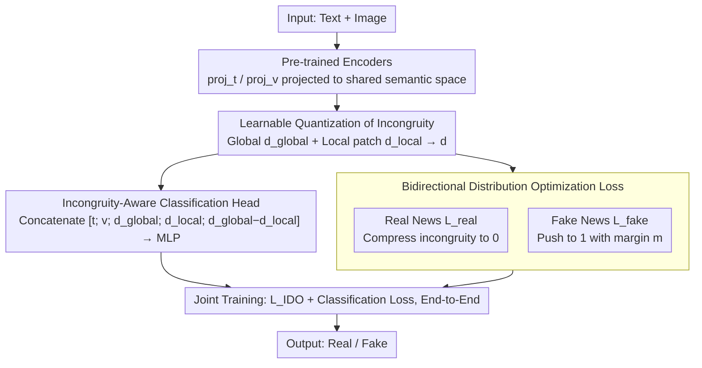

# IDO: Incongruity-Aware Distribution Optimization for Multimodal Fake News Detection

**Conference**: ICML 2026  
**arXiv**: [2605.29116](https://arxiv.org/abs/2605.29116)  
**Code**: To be confirmed  
**Area**: Social Computing / Multimodal Learning / Fake News Detection  
**Keywords**: Multimodal Fake News, Cross-modal Incongruity, Distribution Optimization, Cross-modal Alignment

## TL;DR
IDO leverages **explicit modeling of cross-modal incongruity** as a learnable distribution optimization target—simultaneously pulling multimodal embeddings of real news closer while pushing the incongruity of fake news further apart. Ours achieves a 3-7% F1 Gain over Prev. SOTA on Weibo / Twitter / Fakeddit and significantly enhances generalization to unseen fake news.

## Background & Motivation

**Background**: Multimodal fake news detection utilizes joint signals from text and images to identify misinformation. Existing methods are mostly based on cross-modal fusion + binary classification—capturing modal information through contrastive learning or Graph Neural Networks.

**Limitations of Prior Work**: (1) Existing methods differentiate real and fake news as binary categories, lacking precise characterization of "fake news features"; (2) The degree of cross-modal incongruity differs between real news (high consistency) and fake news (low consistency/incongruity), yet they are modeled identically; (3) Poor generalization on OOD fake news—novel fake news outside the training distribution is easily misclassified.

**Key Challenge**: The essential feature of fake news—**cross-modal semantic incongruity**—is not explicitly modeled, resulting in models learning dataset-specific patterns rather than generic fake news characteristics.

**Goal**: Model cross-modal incongruity as an explicit optimization target to improve generalization to unknown fake news.

**Key Insight**: It is observed that real news text and images are highly consistent (matching descriptions), while fake news is often incongruous (images unrelated to or contradicting text); strengthening this difference through distribution optimization yields a universal discriminative signal.

**Core Idea**: Treat real news as a "high-consistency distribution" and fake news as a "low-consistency distribution"—tightening real news consistency and pushing away fake news incongruity simultaneously via **bidirectional distribution optimization**.

## Method

### Overall Architecture
IDO aims to capture an essential feature of fake news—semantic incongruity between images and text—and turns it into an optimizable target rather than burying it within a binary classification black box. The mechanism is as follows: text and images are first represented via separate pre-trained encoders; then, a differentiable cross-modal incongruity $d_{\text{incon}}(\mathbf{t}, \mathbf{v}) = 1 - \cos(\text{proj}_t(\mathbf{t}), \text{proj}_v(\mathbf{v}))$ quantifies the mismatch between modalities; during training, distribution optimization compresses real news incongruity toward 0 and pushes fake news toward 1; finally, the classification loss and distribution optimization loss are trained jointly. The core idea is that real news is highly consistent while fake news is often incongruous; explicitly widening this gap yields a more general discriminative signal than merely memorizing dataset patterns.

### Key Designs

**1. Learnable Quantization of Incongruity: Turning "Mismatch" into a Differentiable Signal for Local Contradictions**

Existing methods use binary labels but ignore "what makes it fake," often learning dataset-specific biases. IDO uses projections $\text{proj}_t, \text{proj}_v$ in a shared semantic space to map heterogeneous text and images into an aligned space. Global incongruity is defined as $d_{\text{incon}}(\mathbf{t}, \mathbf{v}) = 1 - \cos(\text{proj}_t(\mathbf{t}), \text{proj}_v(\mathbf{v}))$. Since global similarity might miss local contradictions (e.g., a specific image region contradicting a specific sentence), a fine-grained patch alignment $d_{\text{local}} = \frac{1}{N} \sum_{i=1}^N \min_j d(\mathbf{t}_i, \mathbf{v}_j)$ is added. The final score $d = \alpha d_{\text{global}} + (1-\alpha) d_{\text{local}}$ captures incongruity comprehensively.

**2. Bidirectional Distribution Optimization Loss: Simultaneous Pushing to Stabilize Boundaries**

Optimizing only one class (e.g., pulling real news toward consistency) can skew the decision boundary. IDO introduces terms for both: for real news samples $(\mathbf{t}_r, \mathbf{v}_r)$, it minimizes incongruity $\mathcal{L}_{\text{real}} = \mathbb{E}_{\text{real}}[d_{\text{incon}}(\mathbf{t}_r, \mathbf{v}_r)]$; for fake news samples $(\mathbf{t}_f, \mathbf{v}_f)$, it uses a hinge term with a margin $\mathcal{L}_{\text{fake}} = \max(0, m - \mathbb{E}_{\text{fake}}[d_{\text{incon}}(\mathbf{t}_f, \mathbf{v}_f)])$ to push incongruity upward (margin $m = 0.7$). The total loss $\mathcal{L}_{\text{IDO}} = \mathcal{L}_{\text{real}} + \lambda \mathcal{L}_{\text{fake}}$ ensures real and fake distributions are pushed apart symmetrically.

**3. Incongruity-Aware Classification Head: Using Incongruity as Explicit Evidence**

Since incongruity is a critical signal for detection, it should not only constrain representations but also serve as an input to the classifier. IDO concatenates incongruity scores into the classifier input $[\mathbf{t}; \mathbf{v}; d_{\text{global}}; d_{\text{local}}; d_{\text{global}} - d_{\text{local}}]$. An MLP then outputs binary probabilities, trained end-to-end with the distribution optimization. This aligns the classification goal with the distribution goal—optimization makes incongruity discriminative, while the head fully utilizes it.

## Key Experimental Results

### Main Results

| Dataset | Method | Acc | F1 | AUC |
|--------|------|-----|-----|-----|
| Weibo | EANN | 78.2 | 76.5 | 84.3 |
| Weibo | MVAE | 81.7 | 80.4 | 87.6 |
| Weibo | MCAN | 84.5 | 83.7 | 90.2 |
| Weibo | **Ours** | **88.9** | **88.1** | **94.5** |
| Twitter | MCAN | 79.3 | 78.4 | 85.6 |
| Twitter | CAFE | 82.1 | 81.5 | 88.3 |
| Twitter | **Ours** | **87.6** | **86.8** | **92.7** |
| Fakeddit | MCAN | 76.5 | 75.2 | 83.4 |
| Fakeddit | CAFE | 79.7 | 78.9 | 86.5 |
| Fakeddit | **Ours** | **85.3** | **84.6** | **91.2** |

### OOD Generalization Test

| Training → Test | EANN F1 | MCAN F1 | **Ours F1** | Gain |
|------------|--------|--------|---------|------|
| Weibo → Twitter | 52.3 | 58.7 | **71.4** | +12.7 |
| Twitter → Fakeddit | 49.7 | 55.4 | **68.9** | +13.5 |
| Fakeddit → Weibo | 54.1 | 61.2 | **73.8** | +12.6 |

### Ablation Study

| Configuration | Weibo F1 | Twitter F1 |
|------|---------|-----------|
| Baseline (Head Only) | 81.2 | 78.5 |
| + Global Incongruity | 85.7 | 83.4 |
| + Local Incongruity | 86.4 | 84.2 |
| + Bidirectional Optimization | 87.6 | 85.9 |
| **Full IDO** | **88.9** | **87.6** |

### Key Findings
- **High Discriminative Power of Incongruity**: Visualizations show clear separation in the incongruity distributions of real vs. fake news.
- **Significant OOD Generalization**: Cross-dataset F1 gains of 12-14 points verify that incongruity is a generic feature.
- **Fine-grained Supplement**: Local incongruity successfully captures subtle image-text contradictions missed by global alignment.
- **Margin Selection**: $m = 0.7$ is optimal; too small fails to differentiate, and too large leads to overfitting.

## Highlights & Insights
- **Essential Feature Modeling**: Identification and explicit optimization of cross-modal incongruity as an intrinsic fake news trait.
- **Elegant Bidirectional Design**: Simultanously pulling real and pushing fake news avoids the bias of unidirectional losses.
- **Substantial Cross-dataset Generalization**: Leading OOD performance validates that the model learns generalizable features rather than dataset noise.

## Limitations & Future Work
- Incongruity $\neq$ Fake News: High consistency does not guarantee truth (e.g., sophisticated fake news with matching media).
- Multimodal Expansion: Currently limited to text and images.
- Interpretability: There may be a gap between model-learned incongruity and human perception.
- Future Improvements: Incorporating a third modality (audio/video); factual verification with external knowledge bases; visual explanations for incongruity.

## Related Work & Insights
- **vs EANN/MVAE**: Traditional fusion and classification lack explicit incongruity modeling.
- **vs MCAN**: Use of cross-modal attention captures alignment but relies on binary classification; IDO explicitly optimizes the incongruity distribution.
- **vs CAFE**: While CAFE uses contrastive learning to pull real and push fake news, IDO uses incongruity as a more precise discriminative signal.
- **Insight**: The bidirectional design of distribution optimization can be extended to other binary scenarios (e.g., sentiment analysis, fraud detection).

## Rating
- Novelty: ⭐⭐⭐⭐ The combination of incongruity modeling and bidirectional distribution optimization is novel, though components draw from existing literature.
- Experimental Thoroughness: ⭐⭐⭐⭐⭐ 3 datasets, 4 baselines, OOD generalization, and detailed ablation.
- Writing Quality: ⭐⭐⭐⭐ Clear motivation and precise methodological description.
- Value: ⭐⭐⭐⭐⭐ Fake news detection has major social impact; OOD generalization addresses a critical bottleneck for real-world deployment.

<!-- RELATED:START -->

## Related Papers

- [\[ACL 2026\] LiveFact: A Dynamic, Time-Aware Benchmark for LLM-Driven Fake News Detection](../../ACL2026/social_computing/livefact_a_dynamic_time-aware_benchmark_for_llm-driven_fake_news_detection.md)
- [\[ACL 2025\] Synergizing LLMs with Global Label Propagation for Multimodal Fake News Detection](../../ACL2025/social_computing/llm_label_propagation.md)
- [\[ICML 2026\] MIND: Multi-Rationale Integrated Discriminative Reasoning Framework for Multi-Modal Fake News](mind_multi-rationale_integrated_discriminative_reasoning_framework_for_multi-mod.md)
- [\[AAAI 2026\] FactGuard: Event-Centric and Commonsense-Guided Fake News Detection](../../AAAI2026/social_computing/factguard_event-centric_and_commonsense-guided_fake_news_detection.md)
- [\[ACL 2025\] Detection of Human and Machine-Authored Fake News in Urdu](../../ACL2025/social_computing/detection_of_human_and_machine-authored_fake_news_in_urdu.md)

<!-- RELATED:END -->
