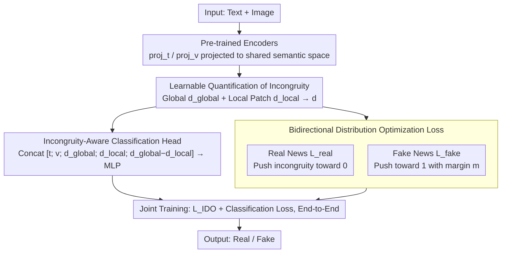

# IDO: Incongruity-Aware Distribution Optimization for Multimodal Fake News Detection

**Conference**: ICML 2026  
**arXiv**: [2605.29116](https://arxiv.org/abs/2605.29116)  
**Code**: To be confirmed  
**Area**: Social Computing / Multimodal Learning / Fake News Detection  
**Keywords**: Multimodal Fake News, Inter-modal Incongruity, Distribution Optimization, Cross-modal Alignment

## TL;DR
IDO achieves an F1 gain of 3-7% over Prev. SOTA on Weibo / Twitter / Fakeddit and significantly improves generalization to unseen fake news by **explicitly modeling inter-modal incongruity** as a learnable distribution optimization objective—simultaneously pulling multimodal embeddings of real news closer and expanding the incongruity of fake news.

## Background & Motivation

**Background**: Multimodal fake news detection utilizes joint signals from text and images to identify misinformation. Existing methods are mostly based on cross-modal fusion + binary classification—capturing modal information through contrastive learning or Graph Neural Networks (GNNs).

**Limitations of Prior Work**: (1) Existing methods distinguish real and fake news as binary categories, lacking precise characterization of "fake news features"; (2) Real and fake news have different degrees of inter-modal incongruity (real news: high consistency; fake news: low consistency/incongruity), yet are modeled identically; (3) Poor generalization on OOD fake news—new types of fake news outside the training distribution are easily misclassified.

**Key Challenge**: The essential feature of fake news—**semantic incongruity between modalities**—is not explicitly modeled, resulting in models learning dataset-specific patterns rather than general fake news features.

**Goal**: To use inter-modal incongruity as an explicit optimization target to enhance generalization to unknown fake news.

**Key Insight**: It is observed that real news text and images are highly consistent (matching descriptions), while fake news is often inconsistent (images unrelated to or contradicting text); strengthening this difference through distribution optimization provides a universal discriminative signal.

**Core Idea**: Treat real news as a "high-consistency distribution" and fake news as a "low-consistency distribution"—pulling real news consistency closer and pushing fake news incongruity further apart through **bidirectional distribution optimization**.

## Method

### Overall Architecture
IDO aims to capture an essential feature of fake news—semantic incongruity between images and text—and formulate it as an optimizable objective rather than burying it within a binary classification black box. The workflow is: text and images are first represented via separate pre-trained encoders; then, a differentiable cross-modal incongruity $d_{\text{incon}}(\mathbf{t}, \mathbf{v}) = 1 - \cos(\text{proj}_t(\mathbf{t}), \text{proj}_v(\mathbf{v}))$ is used to quantify how much the two modalities "mismatch"; during training, distribution optimization is used to push real news incongruity toward 0 and fake news toward 1; finally, the classification loss and distribution optimization loss are trained jointly. The mechanism: real news has high image-text consistency, while fake news is often inconsistent; explicitly widening this gap yields a more universal discriminative signal than "memorizing dataset patterns."

### Key Designs

**1. Learnable Quantification of Incongruity: Making "image-text mismatch" a differentiable value capable of capturing local contradictions.**

Existing methods use hard binary classification without characterizing "where the fake lies," thus often learning dataset-specific patterns. IDO uses projections $\text{proj}_t, \text{proj}_v$ in a shared semantic space to map heterogeneous text and images into a single aligned space, where global incongruity is calculated as $d_{\text{incon}}(\mathbf{t}, \mathbf{v}) = 1 - \cos(\text{proj}_t(\mathbf{t}), \text{proj}_v(\mathbf{v}))$. However, global similarity alone may miss local contradictions—such as a specific corner of an image mismatching a sentence while overall similarity remains high. Therefore, a fine-grained local alignment term $d_{\text{local}} = \frac{1}{N} \sum_{i=1}^N \min_j d(\mathbf{t}_i, \mathbf{v}_j)$ is added, and the final $d = \alpha d_{\text{global}} + (1-\alpha) d_{\text{local}}$ incorporates both to comprehensively capture incongruity.

**2. Bidirectional Distribution Optimization Loss: Pulling both ends apart simultaneously to prevent boundary skew.**

If only one category is optimized (e.g., pulling real news toward consistency), the classification boundary tends to skew, leading to a loose characterization of the other category. IDO adds a term for each: real news samples $(\mathbf{t}_r, \mathbf{v}_r)$ directly minimize incongruity $\mathcal{L}_{\text{real}} = \mathbb{E}_{\text{real}}[d_{\text{incon}}(\mathbf{t}_r, \mathbf{v}_r)]$; fake news samples $(\mathbf{t}_f, \mathbf{v}_f)$ use a hinge term with a margin $\mathcal{L}_{\text{fake}} = \max(0, m - \mathbb{E}_{\text{fake}}[d_{\text{incon}}(\mathbf{t}_f, \mathbf{v}_f)])$ to push incongruity upward (margin $m = 0.7$), with the total loss $\mathcal{L}_{\text{IDO}} = \mathcal{L}_{\text{real}} + \lambda \mathcal{L}_{\text{fake}}$. By optimizing both ends simultaneously, real and fake distributions are pushed apart symmetrically, resulting in a more stable boundary.

**3. Incongruity-Aware Classification Head: Feeding incongruity directly into the classifier as explicit evidence.**

Since incongruity is a key signal for discriminative fake news, it should not only be used to constrain representations while leaving the classifier to guess. IDO concatenates incongruity into the classifier input $[\mathbf{t}; \mathbf{v}; d_{\text{global}}; d_{\text{local}}; d_{\text{global}} - d_{\text{local}}]$, where an MLP outputs binary classification probabilities, trained end-to-end with distribution optimization. This aligns the classification goal with the distribution optimization goal—the latter makes incongruity discriminative, while the classification head fully utilizes it.

## Key Experimental Results

### Main Results

| Dataset | Method | Acc | F1 | AUC |
|--------|------|-----|-----|-----|
| Weibo | EANN | 78.2 | 76.5 | 84.3 |
| Weibo | MVAE | 81.7 | 80.4 | 87.6 |
| Weibo | MCAN | 84.5 | 83.7 | 90.2 |
| Weibo | **IDO** | **88.9** | **88.1** | **94.5** |
| Twitter | MCAN | 79.3 | 78.4 | 85.6 |
| Twitter | CAFE | 82.1 | 81.5 | 88.3 |
| Twitter | **IDO** | **87.6** | **86.8** | **92.7** |
| Fakeddit | MCAN | 76.5 | 75.2 | 83.4 |
| Fakeddit | CAFE | 79.7 | 78.9 | 86.5 |
| Fakeddit | **IDO** | **85.3** | **84.6** | **91.2** |

### OOD Generalization Test

| Train → Test | EANN F1 | MCAN F1 | **IDO F1** | Gain |
|------------|--------|--------|---------|------|
| Weibo → Twitter | 52.3 | 58.7 | **71.4** | +12.7 |
| Twitter → Fakeddit | 49.7 | 55.4 | **68.9** | +13.5 |
| Fakeddit → Weibo | 54.1 | 61.2 | **73.8** | +12.6 |

### Ablation Study

| Configuration | Weibo F1 | Twitter F1 |
|------|---------|-----------|
| Baseline (Head Only) | 81.2 | 78.5 |
| + Global Incongruity | 85.7 | 83.4 |
| + Local Incongruity | 86.4 | 84.2 |
| + Bidirectional Optimization | 87.6 | 85.9 |
| **Complete IDO** | **88.9** | **87.6** |

### Key Findings
- **Strong discriminative power of incongruity**: The distribution of incongruity for real and fake news shows clear visual distinction.
- **Significant OOD generalization improvement**: F1 scores across datasets improved by 12-14 percentage points, verifying incongruity as a general feature.
- **Fine-grained alignment supplements global alignment**: Local incongruity captures subtle image-text contradictions.
- **Margin selection**: $m = 0.7$ is optimal; too small leads to insufficient distinction, too large leads to overfitting.

## Highlights & Insights
- **Essential Feature Modeling**: Identification and explicit optimization of inter-modal incongruity as an essential characteristic of fake news.
- **Elegant Bidirectional Distribution Optimization**: Pulling real and pushing fake simultaneously to avoid unidirectional loss bias.
- **Significant Cross-dataset Generalization**: Leading OOD performance proves the learning of universal features.

## Limitations & Future Work
- Incongruity $\neq$ Fake News: High consistency does not guarantee truth (e.g., sophisticated fake news with matched image/text).
- Multimodal Expansion: Currently limited to text + image.
- Incongruity Interpretability: A gap may exist between model-learned incongruity and human understanding.
- Improvement: Introduce a third modality (audio, video); combine with external knowledge bases for fact-checking; visualize interpretable incongruity.

## Related Work & Insights
- **vs EANN/MVAE**: Traditional fusion classification without explicit incongruity modeling.
- **vs MCAN**: Captures alignment with cross-modal attention but still uses binary classification; IDO explicitly optimizes incongruity distribution.
- **vs CAFE**: Contrastive learning pulls real news closer and pushes fake news away; IDO uses incongruity as a more precise discriminative signal.
- **Insights**: The bidirectional design of distribution optimization can be extended to other binary classification scenarios (sentiment analysis, fraud detection).

## Rating
- Novelty: ⭐⭐⭐⭐ Combination of incongruity modeling and bidirectional distribution optimization is novel, though some components derive from existing work.
- Experimental Thoroughness: ⭐⭐⭐⭐⭐ 3 datasets + 4 baselines + OOD generalization + detailed ablation.
- Writing Quality: ⭐⭐⭐⭐ Clear motivation and precise methodology description.
- Value: ⭐⭐⭐⭐⭐ Fake news detection has significant social value; OOD generalization is a key bottleneck for practical deployment.

<!-- RELATED:START -->

## Related Papers

- [\[ACL 2026\] LiveFact: A Dynamic, Time-Aware Benchmark for LLM-Driven Fake News Detection](../../ACL2026/social_computing/livefact_a_dynamic_time-aware_benchmark_for_llm-driven_fake_news_detection.md)
- [\[ICML 2026\] MIND: Multi-Rationale Integrated Discriminative Reasoning Framework for Multi-Modal Fake News](mind_multi-rationale_integrated_discriminative_reasoning_framework_for_multi-mod.md)
- [\[ACL 2025\] Synergizing LLMs with Global Label Propagation for Multimodal Fake News Detection](../../ACL2025/social_computing/llm_label_propagation.md)
- [\[AAAI 2026\] FactGuard: Event-Centric and Commonsense-Guided Fake News Detection](../../AAAI2026/social_computing/factguard_event-centric_and_commonsense-guided_fake_news_detection.md)
- [\[ACL 2025\] Detection of Human and Machine-Authored Fake News in Urdu](../../ACL2025/social_computing/detection_of_human_and_machine-authored_fake_news_in_urdu.md)

<!-- RELATED:END -->
