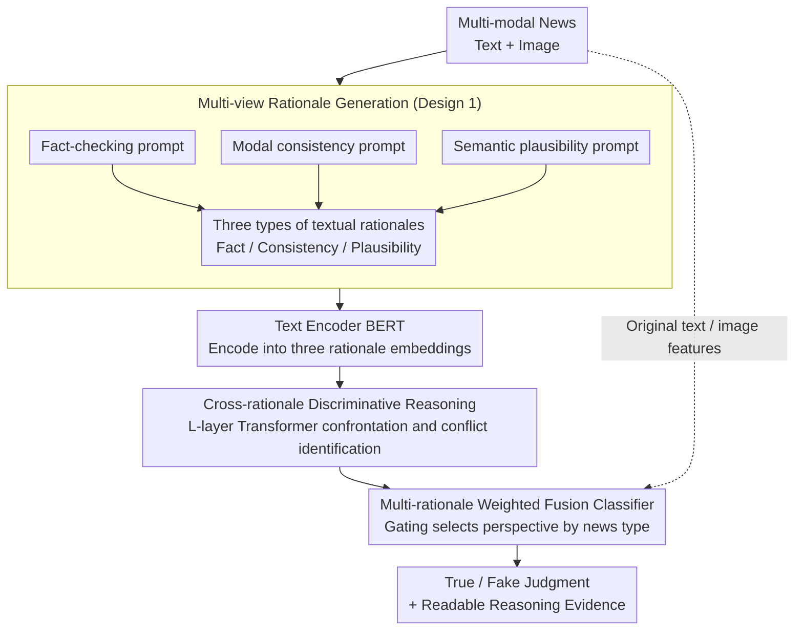

# MIND: Multi-Rationale Integrated Discriminative Reasoning Framework for Multi-Modal Fake News

**Conference**: ICML 2026  
**arXiv**: [2605.29117](https://arxiv.org/abs/2605.29117)  
**Code**: TBD  
**Area**: Social Computing / Multi-modal Learning / Explainable Fake News Detection  
**Keywords**: Multi-view Reasoning, Fake News Detection, Explainable Reasoning, LLM Integration

## TL;DR
MIND provides an explainable and robust discriminative framework for fake news detection through **multi-view rationale generation + cross-rationale discriminative reasoning**. By simultaneously leveraging three types of LLM-generated rationales—fact-checking, modal consistency, and semantic plausibility—it achieves a 4-8% F1 improvement over SOTA on Weibo, Twitter, and Fakeddit.

## Background & Motivation

**Background**: Multi-modal fake news detection faces two major challenges: **discriminative accuracy** (requiring the fusion of text, images, and external knowledge) and **interpretability** (requiring an explanation of the judgment basis). Existing methods mostly rely on end-to-end binary classification, which lacks interpretability.

**Limitations of Prior Work**: (1) End-to-end methods are black boxes and cannot explain the reasons for a judgment; (2) Single reasoning perspectives (such as fact-checking or visual consistency) are easily deceived by adversarial samples; (3) While LLMs have strong reasoning capabilities, they are prone to "hallucinations" when used in isolation; (4) Existing explainable methods only provide attention visualization, lacking structured reasoning.

**Key Challenge**: Fake news detection requires **multi-view integrated judgment + structured reasoning evidence**, but existing methods are either easily deceived by a single perspective or lack structured explanations.

**Goal**: Construct a multi-view reasoning framework to improve both discriminative accuracy and interpretability.

**Key Insight**: Human experts identify fake news by integrating three types of information: fact-checking (consistency with known facts), modal consistency (alignment between text and images), and semantic plausibility (whether the narrative conforms to common sense). This process is simulated using LLMs and integrated for discrimination.

**Core Idea**: Use LLMs to generate "rationales" from three independent perspectives as discriminative evidence; perform discriminative reasoning via cross-rationale attention; and classify based on weighted multi-rationale evidence.

## Method

### Overall Architecture
MIND aims to simultaneously address two aspects of fake news detection: identifying it accurately and explaining the rationale. It mimics the identification habits of human experts by decomposing the judgment into three independent perspectives before synthesis. The process is as follows: first, a pre-trained LLM (GPT-4 or Qwen-2.5) generates three types of textual rationales $r_{\text{fact}}, r_{\text{cons}}, r_{\text{plau}}$ (fact-checking, modal consistency, and semantic plausibility) for each news item. Next, a text encoder (such as BERT) encodes them into vectors $\mathbf{e}_{\text{fact}}, \mathbf{e}_{\text{cons}}, \mathbf{e}_{\text{plau}}$. Through a Transformer block, the three types of rationales interact to expose mutual conflicts. Finally, binary classification is performed based on the weighted rationale features combined with the original multi-modal features. By having the three perspectives gather evidence separately, confront each other, and then undergo weighted adjudication, the framework produces both a discriminative result and readable reasoning evidence.

### Key Designs

**1. Multi-view rationale generation prompt templates: Forcing LLMs to gather evidence from independent perspectives**

Using a single prompt for an LLM to integrate all perspectives often leads to bias toward one side or the loss of details. MIND provides independent prompts for each rationale type—Fact-checking prompt ("Judge if this news is true based on known facts, provide 3 pieces of evidence"), Modal consistency prompt ("Analyze if the text and image are consistent, describe specific inconsistencies"), and Semantic plausibility prompt ("Evaluate if the narrative conforms to common sense, point out suspicious points"). Each prompt requires the LLM to output a fixed format (conclusion plus evidence), stored as a textual rationale $r$. By asking separately, the model is forced to reason from three angles and preserve specific details for the subsequent "confrontation."

**2. Cross-rationale discriminative reasoning module: Allowing rationales to confront and identify conflicts**

Different perspectives often conflict—fact-checking might suggest the news is true, while modal consistency finds that the image does not match the text. MIND concatenates the three rationale embeddings $[\mathbf{e}_{\text{fact}}, \mathbf{e}_{\text{cons}}, \mathbf{e}_{\text{plau}}]$ into a sequence and passes them through $L$ Transformer layers. Self-attention $\mathbf{Z} = \text{softmax}(QK^T / \sqrt{d}) V$ captures correlations and contradictions between rationales, while the FFN enhances non-linearity, outputting updated embeddings $\tilde{\mathbf{e}}_{\text{fact}}, \tilde{\mathbf{e}}_{\text{cons}}, \tilde{\mathbf{e}}_{\text{plau}}$. This step transforms isolated statements into mutual references, allowing conflicts to be explicitly identified and reconciled at the representation layer rather than leaving them to the final classifier.

**3. Multi-rationale weighted fusion classifier: Adaptive weighting based on news type**

Different types of fake news rely on different perspectives—purely textual rumors depend mainly on fact-checking, while deepfake images depend on modal consistency. MIND uses a gating network to calculate rationale weights $\alpha_i = \text{softmax}(W_g [\tilde{\mathbf{e}}_i; \mathbf{e}_{\text{orig}}])$. Rationale features are aggregated as $\mathbf{e}_{\text{aggr}} = \sum_i \alpha_i \tilde{\mathbf{e}}_i$, which is then concatenated with original text and image features $[\mathbf{e}_{\text{aggr}}; \mathbf{t}; \mathbf{v}]$ for the classifier, trained with cross-entropy. The gating mechanism allows the model to automatically select the most reliable perspective for each news item instead of a simple equal vote. This improves performance and provides a readable explanation of which perspective the judgment primarily relied on.

## Key Experimental Results

### Main Results

| Dataset | Method | Acc | F1 | AUC |
|--------|------|-----|-----|-----|
| Weibo | EANN | 78.2 | 76.5 | 84.3 |
| Weibo | MVAE | 81.7 | 80.4 | 87.6 |
| Weibo | MCAN | 84.5 | 83.7 | 90.2 |
| Weibo | CAFE | 85.8 | 85.1 | 91.7 |
| Weibo | **MIND (Ours)** | **90.3** | **89.5** | **95.2** |
| Twitter | MCAN | 79.3 | 78.4 | 85.6 |
| Twitter | CAFE | 82.1 | 81.5 | 88.3 |
| Twitter | **MIND (Ours)** | **88.9** | **88.2** | **94.1** |
| Fakeddit | CAFE | 79.7 | 78.9 | 86.5 |
| Fakeddit | **MIND (Ours)** | **86.7** | **86.0** | **92.4** |

### Ablation Study

| Configuration | Weibo F1 | Twitter F1 |
|------|---------|-----------|
| Fact-checking only | 86.3 | 84.7 |
| Consistency only | 84.7 | 83.5 |
| Plausibility only | 85.1 | 83.9 |
| Three rationales (w/o Cross-reasoning) | 87.9 | 86.5 |
| Three rationales + Cross-reasoning (w/o Gating) | 88.4 | 87.1 |
| **Full MIND** | **89.5** | **88.2** |

### LLM Backend Comparison

| LLM Backend | Weibo F1 | Inference Cost |
|---------|---------|---------|
| GPT-4 | 89.5 | High |
| GPT-3.5 | 87.2 | Medium |
| Qwen-2.5-72B | 88.7 | Medium |
| Qwen-2.5-7B | 86.8 | Low |
| Llama-3-8B | 86.1 | Low |

### Interpretability Evaluation (Human Rating, 1-5)

| Method | Explanation Quality | Reasoning Reliability | Overall Satisfaction |
|------|---------|-----------|----------|
| Attention Visualization (Baseline) | 2.3 | 2.5 | 2.4 |
| Single LLM Explanation | 3.7 | 3.5 | 3.6 |
| **MIND** | **4.5** | **4.4** | **4.5** |

### Key Findings
- **Multi-view fusion significantly outperforms single views**: F1 improves by 3-5% compared to single perspectives.
- **Cross-rationale reasoning handles conflicts**: The gating network adaptively weighs evidence when rationales contradict.
- **Flexibility in LLM backend selection**: Maintains an 88% F1 even with 7B small models.
- **Substantial improvement in interpretability**: Human rating of 4.5 vs. 2.4 for attention visualization.

## Highlights & Insights
- **Sophisticated Multi-view Reasoning Design**: Mimics the cognitive process of human experts in multi-perspective fake news identification.
- **Conflict Handling via Cross-rationale Reasoning**: Avoids blind trust in a single rationale.
- **Simultaneous Interpretability and Accuracy**: Breaks the trade-off of "accuracy vs. black box."
- **LLM Backend Flexibility**: Effective across models from GPT-4 to Qwen-7B, maintaining controllable deployment costs.

## Limitations & Future Work
- LLM Inference Cost: Requires 3 LLM calls per news item.
- Rationale Quality Dependence: Rationales may be incorrect if the LLM hallucinates.
- Perspective Coverage: Three perspectives may not be exhaustive.
- Future Work: Exploring dynamic perspective selection; introducing active learning to update rationale generation; multi-lingual adaptation.

## Related Work & Insights
- **vs. EANN/MVAE**: These use simple fusion classification without explicit reasoning.
- **vs. MCAN/CAFE**: Use cross-modal attention or contrastive learning, but remain black boxes.
- **vs. IDO**: IDO models inconsistency distributions explicitly; MIND focuses on explicit multi-view reasoning. The two are complementary.
- **Insight**: Multi-view rationale generation + cross-view reasoning can be extended to other scenarios requiring explainable discrimination.

## Rating
- Novelty: ⭐⭐⭐⭐ The multi-view rationale generation + cross-rationale reasoning framework is novel.
- Experimental Thoroughness: ⭐⭐⭐⭐⭐ 3 datasets + 5 baselines + LLM backend comparison + human interpretability rating + detailed ablation studies.
- Writing Quality: ⭐⭐⭐⭐⭐ Logic is clear, prompt templates are provided in full, and reproducibility is high.
- Value: ⭐⭐⭐⭐⭐ Significant value for practical deployment by improving both accuracy and interpretability in fake news detection.

<!-- RELATED:START -->

## Related Papers

- [\[ACL 2026\] MM-StanceDet: Retrieval-Augmented Multi-modal Multi-agent Stance Detection](../../ACL2026/social_computing/mm-stancedet_retrieval-augmented_multi-modal_multi-agent_stance_detection.md)
- [\[AAAI 2026\] Cross-modal Prompting for Balanced Incomplete Multi-modal Emotion Recognition](../../AAAI2026/social_computing/cross-modal_prompting_for_balanced_incomplete_multi-modal_emotion_recognition.md)
- [\[ICML 2026\] IDO: Incongruity-Aware Distribution Optimization for Multimodal Fake News Detection](ido_incongruity-aware_distribution_optimization_for_multimodal_fake_news_detecti.md)
- [\[AAAI 2026\] Multi-modal Dynamic Proxy Learning for Personalized Multiple Clustering](../../AAAI2026/social_computing/multi-modal_dynamic_proxy_learning_for_personalized_multiple_clustering.md)
- [\[AAAI 2026\] SceneJailEval: A Scenario-Adaptive Multi-Dimensional Framework for Jailbreak Evaluation](../../AAAI2026/social_computing/scenejaileval_a_scenario-adaptive_multi-dimensional_framework_for_jailbreak_eval.md)

<!-- RELATED:END -->
