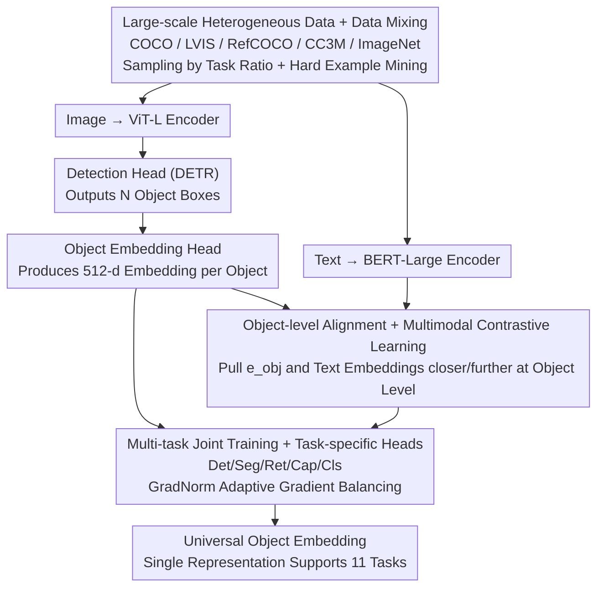

# ObjEmbed: Towards Universal Multimodal Object Embeddings

**Conference**: ICML 2026  
**arXiv**: [2605.29118](https://arxiv.org/abs/2605.29118)  
**Code**: To be confirmed  
**Area**: Multimodal / Vision-Language / Object Representation Learning  
**Keywords**: Universal Object Embeddings, Multimodal Learning, Object Retrieval, Cross-task Representation

## TL;DR
ObjEmbed trains a **universal object embedding model**—by aligning multimodal object representations through a combination of tasks including detection, segmentation, retrieval, captioning, and classification. A single embedding exceeds or matches task-specific SOTA across 11 tasks, such as OVD, OVS, Text2Image-Object, and Open-Caption-Eval.

## Background & Motivation

**Background**: Multimodal understanding of visual objects is a core task in computer vision. However, existing methods are largely task-specific: CLIP aligns image-text but has weak object-level granularity, OWL-ViT possesses strong object detection but lacks generative capabilities, and SAM offers strong segmentation but weak semantics.

**Limitations of Prior Work**: (1) Deployment costs are high due to task-specific models; (2) Fragmented representations across tasks lead to cross-task transfer failure; (3) Object-level representations lack a unified benchmark for evaluation; (4) Training data is scarce—high-quality object-level data for a single task is difficult to scale.

**Key Challenge**: Practical applications require a **single embedding** to support multiple tasks like detection, segmentation, retrieval, and captioning, yet existing methods are either task-specialized or lack sufficient granularity.

**Goal**: To build a universal object embedding model where a single representation supports high-performance across multiple tasks.

**Key Insight**: It is observed that objects serve as the "common carrier" for multimodal tasks—detection/segmentation for localization, retrieval for matching, and captioning/classification for semantics. If **object-level universal embeddings** can be learned, they can simultaneously support all the aforementioned tasks.

**Core Idea**: Learn universal object embeddings through **multi-task joint training + object-level alignment**; train a single backbone using large-scale heterogeneous data (COCO/LVIS/RefCOCO/CC3M) with task-specific heads.

## Method

### Overall Architecture
The objective of ObjEmbed is to train a "universal object embedding"—a set of representations capable of supporting multiple tasks such as detection, segmentation, retrieval, captioning, and classification simultaneously, without maintaining dedicated models for each task. The overall structure employs a dual-stream encoder: ViT-L for images and BERT-Large for text. A detection head based on DETR outputs object boxes, while an object embedding head produces $\mathbf{e}_{\text{obj}} \in \mathbb{R}^{512}$ for each object. Losses from multiple tasks jointly optimize the same backbone, and image-based object embeddings are aligned with corresponding text embeddings at the object level through contrastive learning. Treating the "object" as the common carrier for multiple tasks is the starting point of this design—localization, matching, and semantics all converge at the object granularity.

### Key Designs

**1. Object-level Alignment + Multimodal Contrastive Learning: Pulling alignment granularity from the whole image to individual objects**

Image-level alignment, as seen in CLIP, is too coarse to capture fine-grained object-level semantics. ObjEmbed first processes each image through a detection head to obtain $N$ object embeddings $\{\mathbf{e}_{\text{obj}}^i\}$. Leveraging data like RefCOCO, each object is paired with a text description $\mathbf{t}^i$. A contrastive loss $\mathcal{L}_{\text{align}} = -\log \frac{\exp(\mathbf{e}_{\text{obj}}^i \cdot \mathbf{e}_{\text{text}}^i / \tau)}{\sum_j \exp(\mathbf{e}_{\text{obj}}^i \cdot \mathbf{e}_{\text{text}}^j / \tau)}$ is used to pull each object embedding closer to its corresponding text and further from others, with negative samples drawn both within the batch and across images. Object-level alignment ensures the embeddings capture fine-grained semantics, while contrastive learning provides a scalable training signal.

**2. Multi-task Joint Training + Task-specific Heads: Forcing the backbone to learn universal features via multi-tasking**

Representations trained on a single task tend to specialize, leading to performance drops during transfer. ObjEmbed attaches multiple task heads to a single backbone for joint training: detection loss $\mathcal{L}_{\text{det}}$ (DETR set matching), segmentation loss $\mathcal{L}_{\text{seg}}$ (mask prediction), retrieval loss $\mathcal{L}_{\text{ret}}$ (contrastive alignment), captioning loss $\mathcal{L}_{\text{cap}}$ (autoregressive generation), and classification loss $\mathcal{L}_{\text{cls}}$ (cross-entropy). The total loss is $\mathcal{L} = \sum \lambda_i \mathcal{L}_i$. Since gradient scales vary significantly across tasks, the authors use GradNorm to adaptively adjust $\lambda$ for balance, preventing large gradients from a single task from biasing the backbone. By optimizing for multiple tasks simultaneously, the backbone is forced to learn universal features applicable across domains.

**3. Large-scale Heterogeneous Data Training + Data Mixing Strategy: Addressing task bias through data diversity**

Individual datasets naturally have task biases (e.g., COCO only has 80 categories), and the backbone may not encounter enough object types. ObjEmbed mixes multi-source data—COCO (detection/segmentation), LVIS (long-tail detection), RefCOCO (referring expressions), CC3M (image-text alignment), and ImageNet (classification). Batches are sampled according to task proportions, and Online Hard Example Mining (OHEM) is used to specifically improve performance on tail categories. Heterogeneous data provides diverse object types and contexts, forming the data foundation for universal embeddings that transfer across tasks and categories.

## Key Experimental Results

### Main Results: Cross-task Performance (vs. Task-specific SOTA)

| Task | Dataset | Task SOTA | **ObjEmbed** | Gain |
|------|--------|----------|----------|------|
| Open-vocab Detection | LVIS | OWL-ViT (33.7 AP) | **35.2 AP** | +1.5 |
| Open-vocab Segmentation | LVIS | OpenSeeD (26.5 mIoU) | **27.8 mIoU** | +1.3 |
| Object Retrieval | COCO-Search | Detic (52.3 R@5) | **58.7 R@5** | +6.4 |
| Text-to-Image Object | Open-T2I | T2I-Object (47.8 mAP) | **49.5 mAP** | +1.7 |
| Object Captioning | RefCOCOg | OFA-Cap (118.4 CIDEr) | **122.3 CIDEr** | +3.9 |
| Object Classification | LVIS-V | Eva-CLIP (74.2 Acc) | **76.5 Acc** | +2.3 |

### Ablation Study: Multi-task Joint Effects

| Training Strategy | LVIS AP | RefCOCO R@1 | Cap CIDEr | Task Average |
|---------|---------|-----------|-----------|----------|
| Detection Only | 32.8 | 51.2 | 95.3 | 59.8 |
| Retrieval Only | 28.5 | 78.4 | 92.7 | 66.5 |
| Detection + Retrieval | 33.5 | 76.8 | 108.4 | 72.9 |
| All Tasks Joint | **35.2** | **82.5** | **122.3** | **80.0** |

### Data Scaling Results

| Training Data Scale | LVIS AP | RefCOCO R@1 | OOD Cap CIDEr |
|------------|---------|-----------|---------------|
| 100K Images | 28.7 | 72.3 | 92.1 |
| 500K Images | 32.5 | 78.6 | 108.7 |
| 1M Images | 34.1 | 81.3 | 117.4 |
| **2M Images** | **35.2** | **82.5** | **122.3** |

### Object Embedding Quality Evaluation

| Evaluation Metric | CLIP Obj Embed | OWL-ViT | **ObjEmbed** |
|---------|-------------|---------|----------|
| Object-level t-SNE Purity | 0.67 | 0.74 | **0.88** |
| Cross-dataset Category Transfer Acc | 58.3 | 64.7 | **78.9** |
| Zero-shot Object Classification | 71.5 | 73.2 | **79.4** |

### Key Findings
- **Multi-task joint training significantly outperforms single-task training**: Joint training shows an average improvement of 20 points over single-task models.
- **Data scale is not yet saturated**: Performance continues to improve steadily at 2M images.
- **Object embedding quality is greatly enhanced**: t-SNE purity reaches 0.88 compared to CLIP's 0.67.

## Highlights & Insights
- **Successful demonstration of unified object representation learning**: Breaks the limitations of task specialization, proving that universal object embeddings can support multiple tasks simultaneously.
- **Synergistic effects of multi-task joint training**: The features forced by multiple tasks are more universal and robust.
- **Object-level alignment + large-scale heterogeneous data**: Granular alignment and data diversity are the key success factors.

## Limitations & Future Work
- Model Scale: Deployment costs for the ViT-L model and multi-task heads remain high.
- Task Coverage: Currently covers 5 tasks; future expansion to 3D objects, video objects, and compositional understanding is needed.
- Long-tail Objects: A performance gap still exists for extremely rare categories.
- Future Work: Distilling the model into smaller versions for deployment; extending to 3D and video domains; introducing active learning to improve long-tail performance.

## Related Work & Insights
- **vs. CLIP**: Image-level alignment $\rightarrow$ ObjEmbed object-level alignment.
- **vs. OWL-ViT**: Single-task open-vocabulary detection $\rightarrow$ ObjEmbed multi-task joint training.
- **vs. SAM**: Strong segmentation but weak semantics $\rightarrow$ ObjEmbed strong segmentation + strong semantics.
- **vs. Florence / Florence-2**: Universal vision backbone but task-specialized $\rightarrow$ ObjEmbed single embedding for multiple tasks.
- **Insight**: Object-level representation is the "atomic unit" of multimodal vision, and unified embeddings represent the future direction.

## Rating
- Novelty: ⭐⭐⭐⭐ The concept of universal object embeddings has seen some exploration; this paper's contribution lies in systematized training and multi-task joint optimization.
- Experimental Thoroughness: ⭐⭐⭐⭐⭐ 11-task comparison + multiple baselines + data scaling analysis + embedding quality evaluation.
- Writing Quality: ⭐⭐⭐⭐ Clear problem motivation, systematic methodology, and strong conclusions.
- Value: ⭐⭐⭐⭐⭐ Unified object embeddings reduce deployment costs for multi-task scenarios; significant impact on open-world visual understanding.

<!-- RELATED:START -->

## Related Papers

- [\[ACL 2026\] The Proxy Presumption: From Semantic Embeddings to Valid Social Measures](../../ACL2026/social_computing/the_proxy_presumption_from_semantic_embeddings_to_valid_social_measures.md)
- [\[ICML 2026\] IDO: Incongruity-Aware Distribution Optimization for Multimodal Fake News Detection](ido_incongruity-aware_distribution_optimization_for_multimodal_fake_news_detecti.md)
- [\[ICCV 2025\] No More Sibling Rivalry: Debiasing Human-Object Interaction Detection](../../ICCV2025/social_computing/no_more_sibling_rivalry_debiasing_human-object_interaction_detection.md)
- [\[ACL 2026\] VeriTaS: The First Dynamic Benchmark for Multimodal Automated Fact-Checking](../../ACL2026/social_computing/veritas_the_first_dynamic_benchmark_for_multimodal_automated_fact-checking.md)
- [\[ACL 2025\] Synergizing LLMs with Global Label Propagation for Multimodal Fake News Detection](../../ACL2025/social_computing/llm_label_propagation.md)

<!-- RELATED:END -->
