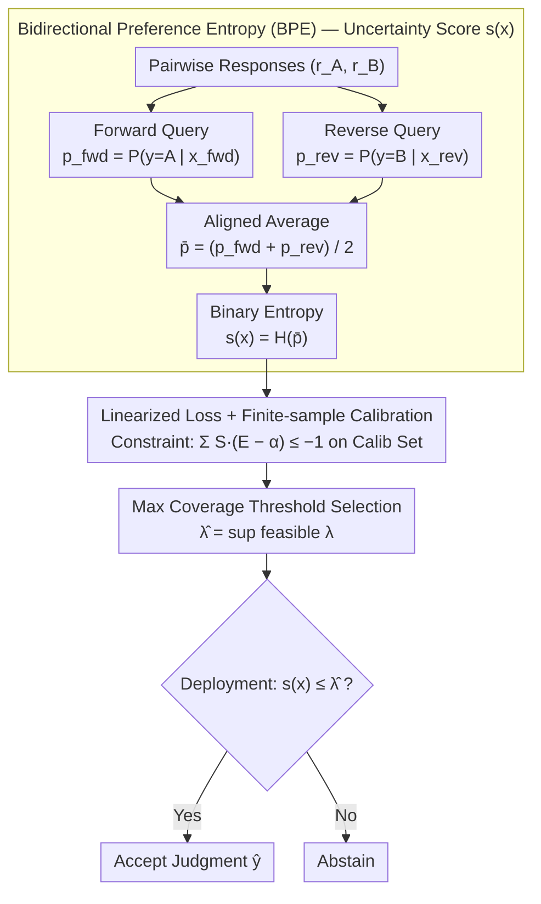

# SCOPE: Selective Conformal Optimized Pairwise LLM Judging

**Conference**: ICML 2026  
**arXiv**: [2602.13110](https://arxiv.org/abs/2602.13110)  
**Code**: To be confirmed  
**Area**: LLM Evaluation / Uncertainty Quantification / Conformal Prediction  
**Keywords**: LLM-as-Judge, Conformal Prediction, Position Bias, False Discovery Rate Control, Bidirectional Preference Entropy  

## TL;DR
SCOPE eliminates position bias in LLM judging through **Bidirectional Preference Entropy (BPE)** and implements finite-sample FDR control via **Conformal Risk Control**—providing statistically valid risk guarantees while maintaining high coverage (FDR is only 0.099 at 0.583 coverage vs. Vanilla FDR of 0.198 at 1.000 coverage).

## Background & Motivation

**Background**: LLMs are increasingly utilized as scalable judging tools for tasks such as pairwise evaluation, reinforcement learning, and leaderboard ranking. Compared to human annotation, LLM-as-a-judge is cost-effective and efficient.

**Limitations of Prior Work**: Existing LLM judging methods face three major issues—(1) **Systematic Bias**: Position bias, length bias, and self-preference make judgments unreliable; (2) **Uncalibrated Confidence**: Using model probabilities directly as a confidence proxy is prone to bias contamination, where high confidence often corresponds to incorrect judgments; (3) **Lack of Statistical Guarantees**: Even if average calibration appears reasonable, error rate control cannot be guaranteed during actual deployment.

**Key Challenge**: While selective prediction addresses the question of "when to trust a judgment," two obstacles hinder its application—(1) inability to provide finite-sample statistical guarantees (thresholds tuned on validation sets may be violated on test sets); (2) uncertainty signals are contaminated by position bias, leading to high confidence in systemic errors.

**Goal**: To design a framework for pairwise LLM judging that provides finite-sample FDR (False Discovery Rate) control guarantees while maximizing coverage under those guarantees.

**Key Insight**: (1) Introduction of **Bidirectional Preference Entropy (BPE)**—querying the model in both response orders and aggregating probabilities rather than discrete votes to obtain a purer uncertainty signal; (2) Adoption of **Conformal Risk Control**—utilizing a linearized loss function and finite-sample calibration to derive the maximum feasible threshold, ensuring marginal $\text{FDR} \leq \alpha$.

**Core Idea**: Instead of relying on heuristic thresholds or naive empirical tuning, SCOPE eliminates position bias through symmetric bidirectional queries and then derives decision thresholds with distribution-free guarantees based on conformal theory under exchangeability assumptions.

## Method

### Overall Architecture
SCOPE addresses the decision of "when to trust an LLM judgment and when to abstain," providing a finite-sample statistical guarantee for this abstention. The workflow consists of four steps: first, query the judge twice for each pair of responses $(r_A, r_B)$ in both forward and reverse orders to obtain two probabilities; next, calculate the binary entropy of the averaged bidirectional preferences as the uncertainty score; then, on a labeled calibration set, use a linearized loss to find the maximum feasible threshold $\hat{\lambda}$ that satisfies the FDR constraint; finally, during deployment, accept the judgment if the uncertainty score $\leq \hat{\lambda}$, otherwise abstain. The first two steps (BPE) clean the uncertainty signal, while the latter two (linearized loss calibration + maximum coverage threshold) establish a mathematically rigorous boundary for acceptance.

### Key Designs

**1. Bidirectional Preference Entropy (BPE): Using Symmetric Queries to Wash Out "False Confidence" from Position Bias**

LLM judges suffer from a known issue—systematic bias toward specific positions. Standard softmax confidence cannot distinguish between "genuine model certainty" and "positional influence." BPE requires the model to provide probabilities for both orders: let $p_{\text{fwd}} = P_\theta(y = A \mid x_{\text{fwd}})$ be the probability of choosing $r_A$ in forward order, and $p_{\text{rev}} = P_\theta(y = B \mid x_{\text{rev}})$ be the probability of choosing $r_A$ (now label $B$) in reverse order. If the judge is reliable and unbiased, these should be nearly identical. By taking the average $\bar{p} = \frac{1}{2}(p_{\text{fwd}} + p_{\text{rev}})$ and computing the binary entropy $s(x) = -[\bar{p} \log \bar{p} + (1 - \bar{p}) \log(1 - \bar{p})]$ as the uncertainty score, high confidence is only achieved when both orders yield the same preference. This enforces symmetry via permutation invariance—preserving continuous signals for finer calibration compared to discrete voting.

**2. Linearized Loss + Finite-sample Calibration: Turning FDR Constraints into Algebraically Solvable Conditions**

Empirical risk ratios are unstable with small samples, making them unsuitable for direct thresholding. The authors introduce a linearized loss $L(x, \lambda) = S(x, \lambda) \cdot (E(x) - \alpha)$, where $S(x, \lambda)$ is the selection indicator and $E(x)$ is the error indicator. The key observation is that $\mathbb{E}[L(x, \lambda)] \leq 0$ is exactly equivalent to $\text{FDR} \leq \alpha$. This transforms a ratio constraint into a linear constraint. For finite samples, the sufficient and necessary condition becomes $\sum_{i=1}^n S(x_i, \lambda) \cdot (E(x_i) - \alpha) \leq -1$. The "$-1$" serves as a safety budget to absorb worst-case scenarios for a single test sample, providing distribution-free marginal guarantees.

**3. Maximum Coverage Threshold Selection: Accepting Max Judgments Without Breaking Guarantees**

Guarantees alone are insufficient if the model abstains too often. Constraint feasibility is not necessarily monotonic with $\lambda$—adding a sample might contribute $-\alpha$ (accepted and correct) or $1-\alpha$ (accepted but incorrect), precluding simple binary searches. The algorithm directly selects the maximum feasible threshold $\hat{\lambda} = \sup\{\lambda : \sum_{i=1}^n S(x_i, \lambda) \cdot (E(x_i) - \alpha) \leq -1\}$. This maintains the FDR guarantee while utilizing the full risk budget $\alpha$ provided by the user, thereby maximizing coverage.

## Key Experimental Results

### Uncertainty Estimation Quality

| Model | Method | ECE ↓ | AUROC | AUPRC |
|-----|------|-------|-------|-------|
| Qwen2.5-7B | Predicted Prob | 0.239 | 0.658 | 0.824 |
| Qwen2.5-7B | Swap-and-Aggregate | 0.193 | 0.656 | 0.826 |
| Qwen2.5-7B | **BPE** | **0.143** | **0.685** | **0.855** |
| Qwen2.5-32B | **BPE** | **0.172** | **0.729** | **0.908** |
| Llama-3.1-70B | **BPE** | **0.145** | **0.744** | **0.894** |

### Risk Control and Coverage ($\alpha = 0.10$)

| Dataset | Model | Method | Coverage | Actual FDR | Violation? |
|--------|-----|------|--------|---------|---------|
| MT-Bench | Qwen-7B | Vanilla | 1.000 | 0.269 | ❌ |
| MT-Bench | Qwen-7B | Heuristic Threshold | 0.907 | 0.251 | ❌ |
| MT-Bench | Qwen-7B | **SCOPE** | **0.246** | **0.097** | ✅ |
| RewardBench | Qwen-32B | Vanilla | 1.000 | 0.120 | ❌ |
| RewardBench | Qwen-32B | **SCOPE** | **0.983** | **0.098** | ✅ |
| Chatbot Arena | Llama-70B | **SCOPE** | **0.583** | **0.099** | ✅ |

### Key Findings
- **Advantage of BPE**: Averaging the two probabilities before calculating entropy yields richer continuous signals, significantly outperforming discrete voting—Qwen-7B AUROC improved from 0.656 to 0.685.
- **Statistical Validity**: Vanilla coverage is 100%, but FDR usually stays between 0.2-0.27, far exceeding the 0.10 constraint; SCOPE consistently meets the constraint across all configurations.
- **Model Scale and Stability**: Stronger models (Llama-70B) maintain higher coverage (0.583 @ $\alpha = 0.10$) under strict constraints, whereas weaker models (Qwen-7B) see significantly reduced coverage (0.246); however, SCOPE guarantees the FDR stays within the expected range even for weaker models.

## Highlights & Insights
- **First Pairwise LLM Judging Framework with Finite-sample FDR Guarantees**: The combination of BPE and linearized loss elegantly solves two problems—the former removes bias sources, and the latter provides mathematical guarantees.
- **Creative Design of Permutation Invariance**: While most methods for bias removal use discrete voting, BPE achieves permutation invariance through probability averaging + entropy—maintaining simplicity (only two forward passes) while yielding continuous signals.
- **Deployment Without Retraining**: SCOPE relies solely on model softmax probabilities or logits, acting as an off-the-shelf layer applicable to any judge (including API-only ones), reducing deployment costs.
- **Ingenious Transformation of Linearized Loss**: Transforming a ratio constraint into a linear one and absorbing the worst case via the "$-1$" budget is an elegant theoretical design.

## Limitations & Future Work
- The exchangeability assumption may fail during real-world distribution shifts (changes in prompts or policy model behavior).
- BPE requires two forward passes, resulting in 2x computational overhead compared to a single query; it is inapplicable in pure black-box API scenarios (no probability access).
- The current framework is limited to binary pairwise judgments and does not support multi-response ranking or rubric-based scoring.
- Utility is limited in low-coverage scenarios (e.g., Qwen-7B has only 2.4% coverage at $\alpha = 0.05$).

## Related Work & Insights
- **vs. Swap-and-Aggregate**: Both use bidirectional queries to eliminate position bias, but Swap-and-Aggregate uses discrete voting while BPE uses probability entropy—BPE signals are continuous and finer-grained.
- **vs. Simulated Annotators**: Estimates confidence via 5 virtual personas × 5 few-shot demonstrations; BPE achieves better calibration and discriminative power with only two forward passes.
- **vs. Heuristic Selection without Guarantees**: Setting thresholds to $1 - \alpha$ or tuning on verification sets lacks theoretical foundation; SCOPE's linearized loss + finite-sample calibration is theoretically rigorous.
- **vs. Conservative Confidence Bounds (Clopper-Pearson)**: Requires rejecting a large number of queries; SCOPE achieves 2.4x higher coverage at the same risk level through more precise design.

## Rating
- Novelty: ⭐⭐⭐⭐⭐  First to combine pairwise LLM judging with finite-sample FDR control; the permutation-invariant design of BPE is unique.
- Experimental Thoroughness: ⭐⭐⭐⭐  Validated on three major benchmarks and four model sizes with high statistical robustness (1000 random splits); cross-domain generalization validation is somewhat limited.
- Writing Quality: ⭐⭐⭐⭐⭐  Clear logic, progressive motivation, and precise notation.
- Value: ⭐⭐⭐⭐⭐  Addresses the critical application of LLM-as-a-judge by providing the first deployable framework with guarantees; significant for industry applications like RLHF, leaderboards, and automated evaluation.

<!-- RELATED:START -->

## Related Papers

- [\[ACL 2026\] Beyond the Crowd: LLM-Augmented Community Notes for Governing Health Misinformation](../../ACL2026/social_computing/beyond_the_crowd_llm-augmented_community_notes_for_governing_health_misinformati.md)
- [\[ICLR 2026\] Steering the Herd: A Framework for LLM-Based Control of Social Learning](../../ICLR2026/social_computing/steering_the_herd_a_framework_for_llm-based_control_of_social_learning.md)
- [\[ICLR 2026\] SocialHarmBench: Revealing LLM Vulnerabilities to Socially Harmful Requests](../../ICLR2026/social_computing/socialharmbench_revealing_llm_vulnerabilities_to_socially_harmful_requests.md)
- [\[AAAI 2026\] Bias Association Discovery Framework for Open-Ended LLM Generations](../../AAAI2026/social_computing/bias_association_discovery_framework_for_open-ended_llm_generations.md)
- [\[ACL 2026\] Why Are We Moral? An LLM-based Agent Simulation Approach to Study Moral Evolution](../../ACL2026/social_computing/why_are_we_moral_an_llm-based_agent_simulation_approach_to_study_moral_evolution.md)

<!-- RELATED:END -->
