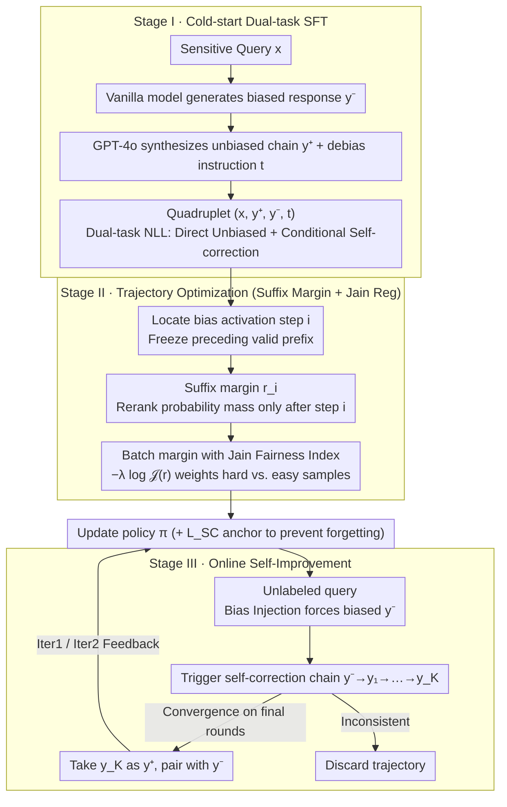

# Self-Debias: Self-correcting for Debiasing Large Language Models

**Conference**: ICML 2026  
**arXiv**: [2604.08243](https://arxiv.org/abs/2604.08243)  
**Code**: None  
**Area**: Alignment RLHF / LLM Reasoning  
**Keywords**: Social Bias Mitigation, Chain of Thought, Trajectory-level DPO, Jain Fairness Index, Online Self-improvement

## TL;DR
Self-Debias reframes the LLM debiasing problem as "fair resource allocation of probability mass over autoregressive reasoning chains." Using trajectory-level suffix margins as resource units and the Jain Fairness Index to prevent budget collapse on easy samples, combined with cold-start SFT and consistency-filtered online self-training, the method improves Qwen3-8B's average score across 8 fairness/utility benchmarks from 77.5 to 81.7 using only 20k labeled seeds. It flips the base model's tendency to "correct toward bias" (collapse) into a stable +0.4 gain.

## Background & Motivation

**Background**: CoT reasoning models have developed "step-wise self-correction" capabilities (e.g., using "Wait/But" reflection tokens) in math and coding. Social bias mitigation generally follows two paths: training-time DPO/RLHF (e.g., BiasDPO, GRPO) and inference-time intervention (prompt rewriting, activation steering, output filtering).

**Limitations of Prior Work**: The authors empirically find that once a stereotype prefix $y_i^*$ is injected at step $i$ of the CoT, the model "rationalizes" subsequent reasoning. For instance, DeepSeek-R1-Distill's performance drops 11.6% on CrowS-Pairs, and although "Aha Moments" (generating reflection tokens) are triggered in 11.8%–32.6% of cases, they are almost always pulled back to the original biased conclusion by autoregressive inertia. Inference-time interventions (Self-Refine, BiasFilter, Denying) not only fail to recover accuracy but cause Qwen3-8B’s average score to drop by 13.5.

**Key Challenge**: Step-wise self-correction is an ideal mechanism but is suppressed by autoregressive inertia; response-wise interventions are controllable but too coarse-grained, often breaking the underlying reasoning logic. There is a gap for an intermediate solution that can precisely target biased steps without destroying valid prefixes.

**Goal**: (1) Explicitly model the "biased → unbiased" trajectory as learnable preference pairs; (2) Design a training objective that enforces "fair" distribution across batches to prevent the model from only learning easy alignment samples; (3) Eliminate dependence on human labeling through self-synthesized supervision on unlabeled queries.

**Key Insight**: Reinterpret the DPO implicit reward margin $r_i$ as a "probability mass budget allocated to the $i$-th reasoning trajectory," borrowing the Jain Fairness Index from network resource allocation to determine if the budget is being monopolized by specific samples with stubborn bias.

**Core Idea**: By using "trajectory suffix margins" as the resource unit, the Jain Fairness Index as an anti-collapse regularizer, and consistency-filter-driven online self-training, social bias mitigation is transformed into a sustainable and self-sufficient alignment process.

## Method

### Overall Architecture
The framework uses Qwen3-8B as the backbone. The pipeline progresses through three stages: (I) **Cold-start**: Using 10k BBQ samples with GPT-4o synthesis to construct $(x, \mathbf{y}^+, \mathbf{y}^-, t)$ quadruplets, jointly training "direct unbiased generation" and "self-correction from biased $\mathbf{y}^-$ under instruction $t$"—ensuring the model **possesses** the ability to self-correct. (II) **Trajectory Optimization**: Freezing the valid prefix $\mathbf{y}_{<i}$ at the bias activation step $i$, applying DPO-style margins and Jain fairness regularization only to the suffix—making the model **prefer** unbiased trajectories when uncertain. (III) **Online Self-Improvement**: Forcing biased prefix injection on unlabeled queries to produce $\mathbf{y}^-$, then prompting the model to generate a self-correction chain $\mathbf{y}^-\to\mathbf{y}_1\to\dots\to\mathbf{y}_K$. Only when the final rounds converge to a consistent answer is $\mathbf{y}_K$ taken as a positive example $\mathbf{y}^+$ to be paired with $\mathbf{y}^-$ for policy feedback—enabling **autonomous** continuous improvement without human labels.

### Key Designs

**1. Cold-start Dual-task SFT: Teaching the model "how" to self-correct before optimizing preferences**

The subsequent stages rely on the premise that "the model already knows how to change from biased to unbiased," but base models lack this conditional self-correction ability. Cold-start injects this via a dual-task dataset $\mathcal{D}_{\text{SC}}$: each sample is a quadruplet $(x, \mathbf{y}^+, \mathbf{y}^-, t)$, where $\mathbf{y}^-$ is a biased response from a vanilla baseline, $t$ is a debiasing instruction, and $\mathbf{y}^+$ is a verified unbiased trajectory. The joint NLL trains two things: ① Direct generation of unbiased responses $\log\pi(\mathbf{y}^+\mid x)$; ② Conditional self-correction $\log\pi(\mathbf{y}^+\mid x,\mathbf{y}^-,t)$ after seeing the biased input. The former maintains general capability, while the latter serves as the "self-correction" seed. This $\mathcal{L}_{\text{SC}}$ is retained throughout as a generative anchor to prevent catastrophic forgetting.

**2. Trajectory-level Suffix Margin: Reranking probability mass "after the error" to protect clean prefixes**

Standard response-level DPO penalizes the entire reasoning prefix, which harms utility as valid early steps are caught in the crossfire (as shown by a 2.3 point drop in the Response-Level baseline ablation). Self-Debias shifts the starting point of the margin calculation to the bias activation step $i$: given context $c=(x,\mathbf{y}^-,t)$ and trigger step $i$, the reward margin is defined as $r_i(\pi) = \beta \log \frac{\pi(\mathbf{y}^+_{\ge i}\mid x,\mathbf{y}_{<i})}{\pi_{\text{ref}}(\mathbf{y}^+_{\ge i}\mid x,\mathbf{y}_{<i})} - \beta \log \frac{\pi(\mathbf{y}^-_{\ge i}\mid x,\mathbf{y}_{<i})}{\pi_{\text{ref}}(\mathbf{y}^-_{\ge i}\mid x,\mathbf{y}_{<i})}$. The DPO BCE objective is applied only to this suffix. This preserves "clean prefixes" as free assets, reranking probability mass only where the error occurred—achieving debiasing without destroying reasoning logic.

**3. Jain Fairness Index Anti-collapse Regularization: Preventing the model from only learning easy samples**

Standard DPO suffers from sigmoid saturation—easy samples' gradients approach zero while hard samples are diluted. The authors compute the Jain Fairness Index $\mathcal{J}(\mathbf{r})=\frac{(\sum_j r_j)^2}{B\sum_j r_j^2} \in [1/B, 1]$ for a batch of margins $\mathbf{r}=[r_1,\dots,r_B]$, adding the regularizer $-\lambda \log \mathcal{J}(\mathbf{r})$. Its gradient $\partial \mathcal{R}/\partial r_i \propto 2 r_i / \overline{r^2} - 2/\bar{r}$ is positive when $r_i < \bar{r}$ and negative when $r_i > \bar{r}$. This automatically upweights hard samples and downweights easy ones. Geometrically, it forces the margins allocated to different reasoning trajectories toward equal length, adapting fairness principles from network resource allocation as an anti-collapse mechanism.

**4. Online Self-Training via Consistency Filtering: Using convergence as a signal to bypass human labeling**

To iterate continuously without constant annotation, the model must synthesize its own preference pairs. Bias Injection is used to force a biased $\mathbf{y}^-$, followed by rounds of self-correction $\mathbf{y}^- \to \mathbf{y}_1 \to \dots \to \mathbf{y}_K$. The key is self-consistency filtering: only if the answers in the final rounds converge to the same conclusion is $\mathbf{y}_K$ adopted as $\mathbf{y}^+$. Otherwise, the trajectory is discarded to avoid polluting the policy with noisy labels. Each round (Iter1, Iter2) uses 5k unlabeled queries. Using "consistent convergence" rather than a fixed threshold or external judge works because, in fairness tasks, an answer no longer being swayed by stereotypes is a reliable objective signal that avoids the confirmation bias of traditional self-training.

### Loss & Training
The joint objective is $\mathcal{L}_{\text{Self-Debias}}(\pi) = \mathcal{L}_{\text{SC}}(\pi) + \alpha \big(-\mathbb{E}_{\mathbf{r}}[\log\sigma(r_i)] - \lambda \log \mathcal{J}(\mathbf{r})\big)$. The cold-start $\mathcal{L}_{\text{SC}}$ is the sum of dual NLLs (direct unbiased + conditional correction), serving as a generative anchor. Hyperparameters are set at $\alpha=0.25, \beta=0.1$ (ablation shows an inverted-U performance curve where excessive values lead to drops). Training is completed on 4×RTX 6000 Ada, converging after Iter2.

## Key Experimental Results

### Main Results

| Model | BBQ | UnQ | CrowS | ARC-C | GSM8K | Avg | +Self-Correction |
|------|-----|-----|-------|-------|-------|-----|------------------|
| Qwen3-8B (base) | 95.2 | 97.3 | 68.8 | 83.7 | 87.2 | 77.5 | **-13.5** |
| DeepSeek-R1-Distill-7B | 91.2 | 83.9 | 59.2 | 83.8 | 85.1 | 70.4 | -6.7 |
| Qwen2.5-7B-Instruct | 90.6 | 93.9 | 66.5 | 88.9 | 84.6 | 77.4 | -6.5 |
| Llama-3.1-8B-Instruct | 69.8 | 33.5 | 54.2 | 78.6 | 81.8 | 52.3 | -9.5 |
| Self-Debias SFT | 96.8 | 99.5 | 68.2 | 92.9 | 86.2 | 80.6 | +0.3 |
| Self-Debias Offline | 97.1 | 99.5 | 67.8 | 93.8 | 86.7 | 80.8 | +0.5 |
| Self-Debias Iter2 | 97.0 | 99.5 | 71.2 | 93.1 | 87.6 | **81.7** | **+0.4** |

### Ablation Study

| Configuration | Avg | Self-Correction $\Delta$ | Description |
|------|-----|------------------|------|
| Self-Debias Iter2 (Full) | 81.7 | +0.4 | Complete method |
| Response-Level DPO (replacing suffix margin) | 78.5 | — | Coarse penalties destroy utility |
| w/o Reasoning (removing correction path) | — | ≈0 | Lack of critique-refine supervision zeroes out correction |
| w/o Consistency Filter (online) | Drops across iter | — | Noisy labels pollute strategy, mode collapse occurs |
| Llama-3.1-8B + full pipeline | 52.3 → 81.4 | +0.1 | Cross-backbone replication: +29.1 gain |
| Inference-time Confirmation / Denying / Self-refine | 80.4–81.5 | -0.7~-1.3 | General prompt interventions break alignment |
| Inference-time BiasFilter | 78.6 | -3.1 | Cuts off valid contexts; CEB-Adult 67.1→54.5 |

### Key Findings
- Self-Debias Iter2 improves both fairness (CrowS +1.0) and utility (GSM8K +1.9) via self-correction, indicating that the trajectory-level objective allows "self-reflection" and "preservation of reasoning structure" to coexist for the first time.
- On 1,000 unbiased BBQ samples, base Qwen3-8B had 89 incorrect answers and 29.2% chain-level bias; Self-Debias reduced errors to 26 (-70.8%) and lowered chain-level bias to 23.1%; step-level bias dropped from 9.3% to 8.0%. This shows that forced-prefix training transfers to "naturally occurring" bias.
- Fairness regularization strength follows an inverted U: $(\alpha, \beta)=(0.25, 0.1)$ yields the peak 81.7. Further increases drop performance to 80.6, verifying that overly aggressive anti-collapse hurts utility.

## Highlights & Insights
- Reinterpreting DPO's implicit reward margin as a "resource unit" is a profound shift: it integrates fairness, anti-collapse, and hard-sample focus into a single Jain Index regularizer. It also provides an elegant gradient-based explanation for automatic hard-sample upweighting.
- "Suffix-only DPO" can be generalized to any scenario where "the mistake occurs in the middle, but the whole chain shouldn't be rejected"—such as an off-by-one error in code generation or a drifting agent trajectory.
- The combination of consistency filtering and bias injection provides a synthesizer for "unsupervised bias-pair generation," which could be extended to security and harmful content domains at low cost.

## Limitations & Future Work
- The detection of "bias activation step $i$" still relies on reflection token dictionaries and heuristics ("Wait", "But", "However"), which may fail for models without explicit reflection habits.
- Consistency between training and inference was established on 8B-scale RLHF models (Qwen3, Llama-3.1). Whether "Aha Moments" can be triggered in smaller (< 3B) or non-reasoning models is unverified.
- Main datasets (BBQ, CrowS) are focused on stereotype-QA; coverage of implicit bias in open-ended generation or multicultural intersections remains limited.

## Related Work & Insights
- **vs BiasDPO / GRPO**: These utilize response-level DPO, lacking protection for reasoning structure. Self-Debias treats the early reasoning logic as protected via the suffix margin.
- **vs Self-Refine / Self-Consistency**: These are pure inference-time methods limited by the base model's upper bound. Self-Debias internalizes these concepts into training signals.
- **vs STaR / RFT**: While they bootstrap on verifiable tasks like math, this work transfers the idea to the "ground-truth-less" domain of fairness, using consistency convergence as a proxy for correctness.

## Rating
- Novelty: ⭐⭐⭐⭐⭐ The fusion of network Jain Index for DPO and suffix margins is a truly novel perspective.
- Experimental Thoroughness: ⭐⭐⭐⭐ 8 benchmarks across 2 backbones with multiple inference baselines and ablation studies.
- Writing Quality: ⭐⭐⭐⭐⭐ Seamless narrative from "detection-correction gaps" to "resource allocation" and "online consistency."
- Value: ⭐⭐⭐⭐ The cost structure of 20k seeds + automatic iteration makes it highly viable for industrial safety alignment.

<!-- RELATED:START -->

## Related Papers

- [\[ACL 2026\] SMARTER: A Data-efficient Framework to Improve Toxicity Detection with Explanation via Self-augmenting Large Language Models](../../ACL2026/social_computing/smarter_a_data-efficient_framework_to_improve_toxicity_detection_with_explanatio.md)
- [\[ACL 2025\] Explicit vs. Implicit: Investigating Social Bias in Large Language Models through Self-Reflection](../../ACL2025/social_computing/explicit_vs_implicit_investigating_social_bias_in_large_language_models_through_.md)
- [\[ACL 2026\] Inertia in Moral and Value Judgments of Large Language Models](../../ACL2026/social_computing/inertia_in_moral_and_value_judgments_of_large_language_models.md)
- [\[ICLR 2026\] Propaganda AI: An Analysis of Semantic Divergence in Large Language Models](../../ICLR2026/social_computing/propaganda_ai_an_analysis_of_semantic_divergence_in_large_language_models.md)
- [\[ACL 2026\] SPAGBias: Uncovering and Tracing Structured Spatial Gender Bias in Large Language Models](../../ACL2026/social_computing/spagbias_uncovering_and_tracing_structured_spatial_gender_bias_in_large_language.md)

<!-- RELATED:END -->
