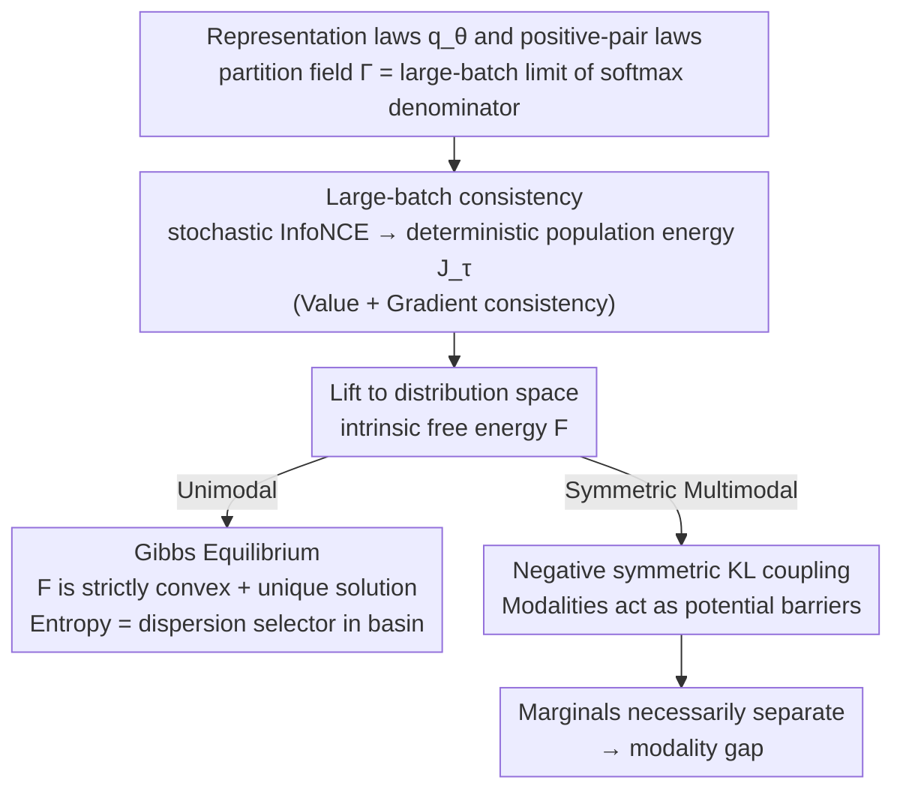

# The Geometric Mechanics of Contrastive Representation Learning: Alignment Potentials, Entropic Dispersion, and Cross-modal Divergence

**Conference**: ICML 2026  
**arXiv**: [2601.19597](https://arxiv.org/abs/2601.19597)  
**Code**: None  
**Area**: Representation Theory / Contrastive Learning / Multimodal  
**Keywords**: InfoNCE, CLIP, Modality Gap, population energy, Gibbs equilibrium

## TL;DR
This paper employs a measure-theoretic framework to elevate the InfoNCE loss to a deterministic "population energy" over representation distributions. It demonstrates that the unimodal case is convex and converges to a unique Gibbs equilibrium, whereas the symmetric multimodal case exhibits a persistent negative symmetric KL coupling, showing that a modality gap is a geometric necessity.

## Background & Motivation

**Background**: InfoNCE serves as the unified objective for current self-supervised and multimodal contrastive learning, underpinning systems from SimCLR/MoCo to CLIP/SigLIP. Classically, theoretical analysis relies on the alignment-uniformity decomposition by Wang & Isola (2020) and the density-ratio perspective describing the optimal critic as point-wise mutual information.

**Limitations of Prior Work**: (i) The alignment-uniformity explanation only addresses asymptotic trade-offs without specifying the "population distribution" InfoNCE prefers; (ii) Multimodal InfoNCE in systems like CLIP achieves strong pairwise alignment, yet marginal distributions remain separated (modality gap), a phenomenon existing theories fail to explain mechanistically; (iii) Existing identifiability results focus on "what can be learned" under generative assumptions rather than the geometric bias inherent in the training objective.

**Key Challenge**: Viewing InfoNCE solely as "pair-wise discrimination" omits critical information—the softmax denominator is essentially a kernel average of the current representation distribution. Thus, the optimization direction depends fundamentally on the distribution rather than individual pairs. In multimodal settings, the "force the distribution exerts on itself" couples with the "force exerted on the other modality," meaning strong pairwise alignment cannot control the marginals.

**Goal**: (i) Rigorously formulate stochastic InfoNCE as a deterministic functional of representation distributions; (ii) Explain the geometry of the unimodal case (convexity, Gibbs equilibrium, low-temperature concentration); (iii) Derive the "cross-coupling" structure of symmetric multimodal InfoNCE and provide a first-principles explanation for the modality gap.

**Key Insight**: The representation space $\mathcal{Z}$ is treated as a compact manifold with a volume measure $\mu$, where encoders push-forward the data distribution onto $\mathcal{Z}$. In the large-batch limit, the softmax denominator converges to a "population partition field" $\Gamma_{\theta,\tau}(\mathbf{z})$, which is a distribution-dependent energy field.

**Core Idea**: In the large-batch limit, InfoNCE is equivalent to a population energy functional on representation distributions. In the unimodal case, this functional is strictly convex with a unique Gibbs solution (where entropy acts as a "dispersion selector" within the alignment basin). In the multimodal case, the functional contains a negative symmetric KL coupling term, causing modalities to act as "walls" to each other while sharpening their respective potentials, thus stably maintaining a modality gap.

## Method

### Overall Architecture
The analytical pipeline: (i) Define representation laws $q_\theta=(f_\theta)_\# p_x$ and positive-pair laws $\pi_{\theta\theta}$ on compact $\mathcal{Z}$; (ii) Introduce the partition field $\Gamma_{\theta,\tau}(\mathbf{z})=\int_\mathcal{Z}\kappa_\tau(\mathbf{z},\mathbf{w})\mathrm{d}q_\theta(\mathbf{w})$ and kernel-smoothed density $\tilde\rho_{\theta,\tau}=\Gamma_{\theta,\tau}/V_\kappa(\tau)$; (iii) Prove that stochastic InfoNCE is value- and gradient-consistent with a parametric energy $\mathcal{J}_\tau(\theta)$ as $N\to\infty$; (iv) Lift $\mathcal{J}_\tau$ to an "intrinsic free energy" $\mathcal{F}_{\tau,U}$ and analyze its convexity, minimizers, and low-temperature concentration; (v) Replicate the process for symmetric multimodal InfoNCE to derive $\mathcal{F}_{\tau,\mathbf{U}_{1,2}}^{\text{Sym}}$ containing the negative symmetric KL coupling. The derivation diverges after step (iv): unimodal leads to a unique Gibbs equilibrium, while multimodal leads to a modality gap due to the coupling term—this remains the core structure of the work.

### Key Designs

**1. Large-batch consistency from stochastic loss to deterministic energy: Establishing a mathematical foundation over intuitive approximation**

Previous alignment-uniformity decompositions were manual approximations that might not align with real gradient descent. This work insists on consistency in both "value and gradient." For the unimodal case, the energy is defined as $\mathcal{J}_\tau(\theta)=\frac{1}{\tau}\int_\mathcal{Z}U_\theta(\mathbf{z})\mathrm{d}q_\theta(\mathbf{z})-H_\times(q_\theta,\tilde\rho_{\theta,\tau})$, where the alignment potential field $U_\theta(\mathbf{z})=-\int_\mathcal{Z}s(\mathbf{z},\mathbf{w})\mathrm{d}\nu_{\theta,\mathbf{z}}(\mathbf{w})$ originates from the disintegration of positive pairs. Theorem 3.1 proves that $|\mathcal{L}_{\text{NCE}}(\theta)-\mathcal{J}_\tau(\theta)-\log(NV_\kappa(\tau))|\to0$ and $\|\nabla_\theta\mathcal{L}_{\text{NCE}}-\nabla_\theta\mathcal{J}_\tau\|\to0$ under conditions of consistent regularization, kernel volume constants, and controlled finite batch sizes. Dual consistency implies that large-batch SGD strictly equates to population energy minimization.

**2. Intrinsic free energy and Gibbs equilibrium: Reinterpreting uniformity as entropy-driven dispersion within basins**

To decouple the implicit relationship of parameterization, the authors lift the parametric energy to the distribution space $\mathcal{P}_\mu(\mathcal{Z})$, obtaining $\mathcal{F}_{\tau,U}(\rho)=\frac{1}{\tau}\int_\mathcal{Z}U(\mathbf{z})\rho(\mathbf{z})\mathrm{d}\mu(\mathbf{z})-H(\rho)$. It is proved to be strictly convex with a unique Gibbs minimizer $\rho^*(\mathbf{z})=\exp(-U(\mathbf{z})/\tau)/Z_\tau$. Using a sharp diagonal peak assumption, the work proves its consistency with parametric energy at low temperatures $|\mathcal{J}_\tau(\theta)-\mathcal{F}_{\tau,U_\theta}(\rho_\theta)|\leq 2\varepsilon_{\text{kde}}^{(\theta)}(\tau)/\underline\rho_\theta$. This conceptually upgrades Wang & Isola's perspective: alignment determines "which basin" to converge to, and uniformity is not a global opposing force but rather the entropy-determined dispersion within that basin.

**3. Multimodal negative symmetric KL coupling: Deriving the necessity of the modality gap from a minus sign**

Symmetric InfoNCE is not merely a double copy of the unimodal case. Defining $\mathcal{J}_\tau^{\text{Sym}}(\theta,\phi)=\frac{1}{2}(\mathcal{J}_\tau^{x\to y}+\mathcal{J}_\tau^{y\to x})$, each direction evaluates cross-entropy against the smoothed density of the "other modality." In the distribution space, this becomes $\mathcal{F}_{\tau,\mathbf{U}_{1,2}}^{\text{Sym}}(\rho_1,\rho_2)=\frac{1}{2}(\mathcal{F}_{\tau,U_{1\to2}}(\rho_1)+\mathcal{F}_{\tau,U_{2\to1}}(\rho_2))-D_{\text{KL}}^{\text{Sym}}(\rho_1,\rho_2)$. The key lies in the final subtraction: while sharpening alignment to its own potential, each modality is pushed to increase the KL divergence from the other modality's marginal. At steady state, unless a "knife-edge" compatibility condition is met (identical conditional laws), marginals must separate. Thus, the modality gap is a geometric necessity of InfoNCE under heterogeneous conditionals rather than an optimization failure.

### Loss & Training
This is a theoretical paper and does not train new models. The experimental section uses controlled experiments with synthetic bimodal Gaussian mixtures to visualize the modality gap and consistency results. It also evaluates pre-trained OpenCLIP (CNN + ViT backbones) to measure marginal distances and test the prediction that "breaking cross-modal compatibility systematically increases the gap."

## Key Experimental Results

### Main Results

| Experiment | Setting | Key Findings |
|------|------|----------|
| Unimodal Low-temp Concentration | Synthetic data + varying $\tau$ | As $\tau\to0^+$, Gibbs measure quality converges to 1 in low-potential regions, matching theory. |
| Multimodal Marginal Separation | Synthetic heterogeneous modalities | Even with perfect pairwise alignment, marginals remain separated; the gap increases monotonically with compatibility mismatch. |
| OpenCLIP Marginal Gap | CNN / ViT Backbones | Strong retrieval performance coexists with significant modality gaps; weakening cross-modal compatibility systematically widens the gap. |

### Ablation Study

| Configuration | Phenomenon | Explanation |
|------|------|----------|
| Sharp kernel + Low temp | $\mathcal{J}_\tau\approx\mathcal{F}_{\tau,U_\theta}$ | Validates that KDE bias is controllable in the sharp regime. |
| Unidirectional vs. Symmetric InfoNCE | Symmetric includes negative KL coupling | Unidirectional case lacks the necessity for a modality gap; the symmetric version mandates it. |
| Compatibility Perturbation | Gap increases with perturbation | Confirms the prediction that compatibility determines the gap. |

### Key Findings
- "Uniformity" should be understood as entropy-driven dispersion within an alignment basin rather than a global force competing with alignment—correcting a long-standing interpretation.
- The essence of the multimodal gap is negative symmetric KL coupling: modalities are forced to push their marginals apart while minimizing individual potentials. Stronger pairwise alignment may actually solidify the gap.
- Exact marginal matching requires a "knife-edge" compatibility condition (identical conditional laws), which is rarely met by real-world data, making the gap a generic phenomenon rather than an accidental failure.

## Highlights & Insights
- Elevating contrastive learning analysis from "point-wise discrimination" to "population geometry" is a major perspective shift; conclusions like Gibbs equilibrium and negative KL coupling are proven via measure theory rather than intuition.
- Explaining the modality gap via a single negative sign (negative symmetric KL) provides a definitive answer: the gap is inherent to the InfoNCE loss structure. For practitioners, it suggests that adding marginal constraints is more effective than refining hard negatives.
- The dual-layer analysis (intrinsic vs. parametric) combined with KDE error control provides a clean paradigm: prove geometry in the distribution space and then transfer conclusions to the parameter space using sharp kernels.

## Limitations & Future Work
- Proofs rely on assumptions such as compact manifolds, isotropic kernels, and sharp diagonal peaks; these are strictly true only as temperature approaches zero and kernels become infinitely sharp.
- Experiments are restricted to synthetic data and off-the-shelf OpenCLIP; the paper does not train a modified-loss model from scratch to prove that the gap can be systematically reduced.
- Multimodal analysis is limited to two symmetric modalities; it remains unclear if multi-modal structures ($>2$) are dominated by "pairwise KL subtractions."
- The geometric results are not yet directly linked to downstream metrics like zero-shot accuracy or retrieval rank.

## Related Work & Insights
- **vs. Wang & Isola 2020 (alignment-uniformity)**: This work refines the original view by proving uniformity is entropy-driven dispersion within basins, not a global opposing force.
- **vs. Liang et al. 2022 (modality gap)**: While Liang et al. identified the gap empirically and attributed it to cone effects/initialization, this work provides a first-principles geometric explanation.
- **vs. Identifiability Work (Zimmermann 2021)**: Those works focus on "what is learnable," whereas this work focuses on the "geometric preference of the objective," offering a complementary view.
- **vs. Brumley / Park 2024 (LRH)**: Both lines of work advance representation geometry; while LRH focuses on steering, this paper investigates the population energy of the training objective.

## Rating
- Novelty: ⭐⭐⭐⭐⭐ The dual conclusions of "InfoNCE = population energy" and "modality gap = negative symmetric KL" are structural upgrades to the field's understanding.
- Experimental Thoroughness: ⭐⭐⭐ Experiments serve the theory but lack massive-scale validation of new loss designs.
- Writing Quality: ⭐⭐⭐⭐ Rigorous measure-theoretic notation with an elegant unimodal-multimodal dual presentation, though the barrier to entry is high.
- Value: ⭐⭐⭐⭐⭐ Provides a directional shift for future multimodal alignment research, clarifying that pairwise tuning cannot bridge the gap.

<!-- RELATED:START -->

## Related Papers

- [\[AAAI 2026\] Cross-modal Prompting for Balanced Incomplete Multi-modal Emotion Recognition](../../AAAI2026/social_computing/cross-modal_prompting_for_balanced_incomplete_multi-modal_emotion_recognition.md)
- [\[ICML 2026\] Alignment Tampering: How Reinforcement Learning from Human Feedback Is Exploited to Optimize Misaligned Biases](alignment_tampering_how_reinforcement_learning_from_human_feedback_is_exploited_.md)
- [\[AAAI 2026\] Multi-modal Dynamic Proxy Learning for Personalized Multiple Clustering](../../AAAI2026/social_computing/multi-modal_dynamic_proxy_learning_for_personalized_multiple_clustering.md)
- [\[ICCV 2025\] Gradient Extrapolation for Debiased Representation Learning](../../ICCV2025/social_computing/gradient_extrapolation_for_debiased_representation_learning.md)
- [\[ICML 2026\] MIND: Multi-Rationale Integrated Discriminative Reasoning Framework for Multi-Modal Fake News](mind_multi-rationale_integrated_discriminative_reasoning_framework_for_multi-mod.md)

<!-- RELATED:END -->
