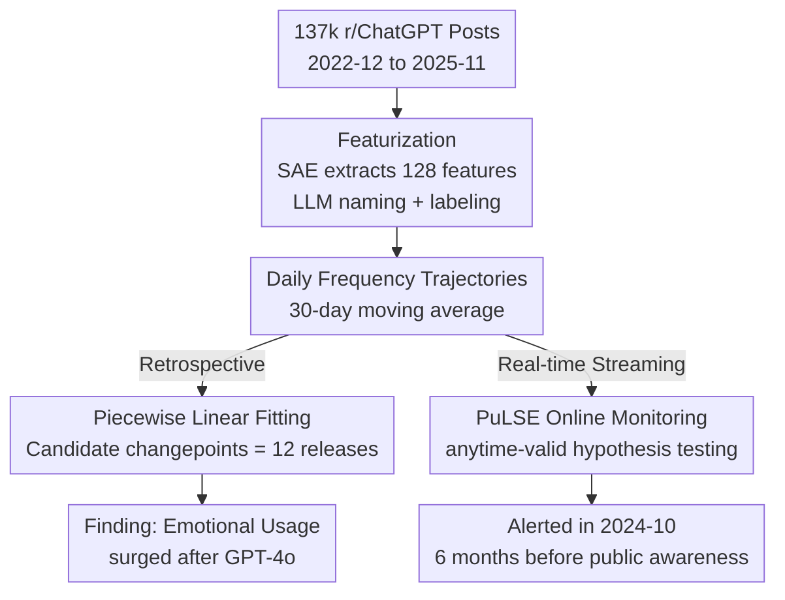

# Three Years of r/ChatGPT: Societal Impact Evaluations from Social Media Data

**Conference**: ICML2026  
**arXiv**: [2606.05750](https://arxiv.org/abs/2606.05750)  
**Code**: [rchatgpt-pulse.github.io](https://rchatgpt-pulse.github.io) (Interactive site, updated daily)  
**Area**: Social Computing / AI Social Impact Evaluation  
**Keywords**: Social Media Measurement, Sparse Autoencoders, Time-Series Changepoint, Online Monitoring, anytime-valid Hypothesis Testing

## TL;DR
The study analyzes 137,000 posts from the r/ChatGPT subreddit over three years (2022-12 to 2025-11) by decomposing them into interpretable features using Sparse Autoencoders (SAE). By fitting piecewise linear changepoints to track the temporal trajectory of each feature, researchers found that "emotional usage" (therapy, emotional attachment) surged following the release of GPT-4o. Furthermore, the proposed online monitoring algorithm, PuLSE, demonstrated that it could have triggered alerts in October 2024—six months before OpenAI publicly acknowledged these impacts.

## Background & Motivation
**Background**: To evaluate the "social impact" of an AI product, the prevailing approach involves domain-specific evaluations—such as measuring how LLMs change human behavior in fixed sectors like education, employment, or healthcare (Bastani, Brynjolfsson, Goh, etc.). The advantage of these evaluations is that measurement targets can be pre-defined and tracked long-term.

**Limitations of Prior Work**: However, for products like ChatGPT with nearly a billion users, the impacts are **impossible to pre-set**. It is often unknown what should be measured, as the most significant impacts are frequently emergent phenomena that no one anticipated. Evaluations with pre-defined metrics naturally miss these "unknown unknowns." Additionally, the only real-world usage data (e.g., OpenAI's internal reports) is closed and inaccessible to independent researchers.

**Key Challenge**: Impact evaluation must both **cover un-preset phenomena** (discovering what to measure unsupervised) and **enable long-term, real-time tracking** (beyond capturing transient trending topics). Existing social media event detection methods excel at the former's "momentary spikes" but are ineffective at capturing "gradual changes over three years."

**Goal**: To build a framework using social media as a data source that facilitates both **retrospective** impact discovery and **prospective** real-time alerting, with an empirical application to the r/ChatGPT community.

**Key Insight**: The authors hypothesize that **what average users post on social media reflects their true perceptions and priorities** regarding the technology. Thus, changes in the composition of posts over time serve as signals of "social impact." The key lies not in what a single post says, but in **aligning the temporal trajectories of feature frequencies with known external events (model release dates)** to identify which impacts were "ignited" by which release.

**Core Idea**: First, decompose posts into interpretable features in an unsupervised manner; second, model the frequency trajectory of each feature as a piecewise linear function with model release dates as candidate changepoints to quantify impact via slope changes. Finally, adapt this offline analysis into PuLSE, an online monitor with statistical guarantees.

## Method

### Overall Architecture
The method follows two paths: **Retrospective Analysis** (Section 2.2-3, explaining the three-year history post-hoc) and **Real-time Monitoring via PuLSE** (Section 4, alerting on online streaming data). Both share the same "featurization" foundation.

The pipeline is as follows: Raw posts → Embedding via OpenAI `text-embedding-3` → Training a Sparse Autoencoder to obtain 128 features → Using `gpt-4.1-mini` for interpretable naming and binary labeling of each post → Calculating daily frequency trajectories per feature → Piecewise linear changepoint fitting aligned with 12 model release events → Outputting "slope changes per feature per release." PuLSE replaces the final steps with anytime-valid sequential hypothesis testing to determine whether to alert as data arrives.

### Key Designs

**1. SAE Featurization: Turning unstructured text into interpretable, countable features**

The first barrier in social impact evaluation is the "unknown" nature of what to measure. Therefore, measurement must begin with unsupervised discovery. The authors define featurization as a mapping $C:[0,1]^d \to [0,1]^m$, where $C^{(i)}(X)\in[0,1]$ represents the "activation" strength of text $X$ on the $i$-th feature. The implementation uses a **top-$K$ Sparse Autoencoder** ($K=4$, $M=128$), meaning each post is associated with at most 4 features. The training objective is standard normalized reconstruction MSE. Posts are weighted by $\log(n_{\text{upvotes}}-n_{\text{downvotes}}+n_{\text{comments}})$ to prioritize high-engagement content. After obtaining 128 features, `gpt-4.1-mini` provides human-readable names and binary labels for each post via a three-vote majority strategy. SAE was chosen over PCA or $k$-means (comparisons in Appendix) because it yields **sparse, additive, and interpretable** features, fitting the multi-label reality where one post may discuss both therapy and privacy.

**2. Piecewise Linear Trajectory Modeling: Quantifying impact as slope changes**

To ground "impact" in falsifiable numbers, the authors calculate daily frequency trajectories $\{C^{(i)}(X_t)\}_{t\in[T]}$ for each feature $i$ ($T=1034$ days, with a 30-day moving average). The core hypothesis: **In the absence of impact, feature frequency should remain roughly constant**; changes in frequency serve as evidence of impact. Impact manifests in two ways: abrupt slope changes after a release (reactivity) or a long-term non-zero slope (gradual adoption). To capture reactivity, trajectories are modeled as piecewise linear functions allowed to bend only at known events $\mathcal{T}$ (12 major model releases):

$$\lambda^i(t)=\beta_0+\sum_{j\in[|\mathcal{T}|]}\gamma_j\max(0,\,t-\tau_j)$$

where $\gamma_j$ represents the change in slope at release date $\tau_j$. This is essentially a **simplified Interrupted Time Series (ITS) analysis** treating releases as exogenous shocks. Using 100 bootstrap fits, only stable changepoints "selected in at least half of the samples" are reported.

**3. Feature "Families": Grouping scattered features through co-occurrence and trajectory similarity**

To make the findings digestible, 86 analyzed features were grouped into main themes. The authors calculated two types of similarity for each pair—**co-occurrence** (what other features appear in posts labeled $i$) and **trajectory similarity** (features with similar temporal curves). Results showed most features fall into either the "(mundane) Adoption/Domestication" family or the "Emotional Usage" family. The "Emotional Usage" family is remarkably stable across both clustering methods, anchored by the features "personal attachments" and "therapy," both of whose stable changepoints align exactly with the May 13, 2024 release of GPT-4o.

**4. PuLSE Online Monitoring: Transforming offline analysis into a streaming algorithm with statistical guarantees**

Retrospective analysis only offers hindsight. PuLSE maintains a current featurization $\widehat{C}_{\text{curr}}$ and a set of "monitored features" $S_t$, using two types of **anytime-valid sequential hypothesis tests** to trigger alerts. The first is an **Accuracy Test**, checking if the reconstruction error on new data remains close to training error, $\mathcal{H}_0^{\text{acc}}:\mathrm{err}(\widehat{C}_{\text{curr}}(X_t))\le\beta\cdot\varepsilon_{curr}$. If rejected, the featurization is retrained on all historical data. The second is **Feature Monitoring**, testing if a specific feature's activation has significantly increased, $\mathcal{H}_0^{(i)}:\widehat{C}_{\text{curr}}^{(i)}(X_t)\le\beta\cdot\widehat{C}_{\text{curr}}^{(i)}(X_{0:r})$. The benefit of anytime-validity is that for a pre-set error rate $\alpha$, the probability of a false rejection does not exceed $\alpha$ even with infinite data, allowing "continuous monitoring and stopping" without compromising statistical validity.

### A Case Study: How Emotional Usage Permeated Other Features After GPT-4o
Even features seemingly unrelated to emotion were reshaped. Within the "Asking about daily/repetitive use" feature, the "Personal and emotional disclosure" sub-feature rose from 16% pre-GPT-4o to 28.8% post-release. In the "ChatGPT positive impact" feature, the "Mental health" sub-topic jumped from 14% to 41% (while "Productivity" remained stable at 23%). Most dramatically, during the week following the GPT-5 release, three of the top four features were complaints: anger/hate (12.2%), dissatisfaction with the removal of 4o (11.3%), and lost conversations (7.6%). Analysis of these complaints revealed that emotional usage was involved in at least 30.5% (406/1332) of GPT-5 complaints—whereas OpenAI's reports suggest emotional usage accounts for only 1.9% of total volume. This gap highlights the authors' premise: **low frequency does not equate to low impact**.

## Key Experimental Results

### Main Results (Retrospective)

| Phenomenon | Key Evidence | Interpretation |
|------|---------|------|
| ChatGPT "Domestication" | "How-to" questions dropped from 61% (2023-01) to 26% (2025-11); "Performance below expectation" rose from 17% to 32% | Users shifted from open exploration to fixed expectations; product perceived as a daily tool |
| De-alienation of Naming | Use of "bot/chatbot" to refer to ChatGPT significantly decreased; "psychological impact" discussions within "chatbot" context rose from 1% to 24% | Familarization with ChatGPT; the "chatbot" frame increasingly reserved for expressing concerns |
| Emergence of Emotional Usage | Therapy and personal attachment stable changepoints align with 2024-05-13 (GPT-4o) | GPT-4o was the critical pivot for emotional use cases |
| Rising Privacy Concerns | Users sharing more personal/sensitive info in private scenarios | Grew in synchronization with emotional usage |

### Therapy vs. Companion Feature Profile (Co-occurrence Lift)

| Co-occurring Feature | Global Rate | Therapy Rate (Lift) | Companion Rate (Lift) | Therapy/Companion Ratio |
|---------|--------|-------------------|---------------------|---------------------|
| Positive Impact Stories | 1.8% | 20% (×11.6) | 4.9% (×2.8) | 4.2 |
| Privacy Concerns | 1.6% | 3.5% (×2.2) | 0.4% (×0.3) | 8.3 |
| Naming ChatGPT | 0.8% | 0.4% (×0.5) | 3.6% (×4.5) | 0.1 |
| AI Sentience | 1.8% | 0.8% (×0.4) | 6.2% (×3.5) | 0.1 |
| Complaints on Degradation| 3.0% | 1.0% (×0.3) | 6.6% (×2.2) | 0.2 |

### Key Findings
- **GPT-4o as a Unified Turning Point**: Multiple features including therapy, attachment, and positive impact converged on changepoints around May 2024. This collective shift is highly unusual.
- **Temporal Advantage of PuLSE**: It detected significant statistical growth in emotional interaction by October 2024—roughly six months before this became a public issue (when 4o's "excessive flattery" was rolled back in April 2025).
- **Usage ≠ Impact**: Emotional cases account for only 1.9% of volume but 30.5% of GPT-5 complaints, proving frequency metrics severely underestimate true impact magnitude.
- **Reddit Sample Bias**: The authors acknowledge r/ChatGPT users lean younger, male, white, and highly educated, serving as an "imperfect proxy" for the global user base.

## Highlights & Insights
- **"What to measure" via Unsupervised, "Accuracy" via Statistical Testing**: By allowing SAE to surface impact dimensions and using changepoint/sequential testing for falsifiable conclusions, the study avoids the pitfall of pre-defined metrics missing unknown impacts. This paradigm is transferable to any large-scale consumer AI.
- **Adapting Interrupted Time Series to ML Measurement**: Using model release dates as candidate changepoints is a clever injection of domain knowledge, transforming "impact" into a measurable slope change $\gamma_j$.
- **Anytime-valid Testing for Legitimate "Peeking"**: Traditional hypothesis testing fails with repeated data peeking. PuLSE's sequential testing allows continuous monitoring while controlling false alarms.
- **The "Aha" Moment**: A social impact that could have been captured by algorithms in Oct 2024 only gained public attention after product failures. The paper frames "we could have known earlier" as reproducible counterfactual evidence.

## Limitations & Future Work
- **Ours**: Reddit is not a representative sample; the analysis avoids causal claims due to entangled events (e.g., GPT-4o launched alongside memory features).
- **Proxy Limitations**: The study measures "postworthiness" rather than actual usage. A decline in a topic might reflect fading novelty or migration to specialized subreddits rather than reduced use.
- **Interpretability Dependence**: Feature naming and family grouping still rely on human and LLM judgment; 6 features remained uninterpretable.
- **Future Directions**: Integrating PuLSE with full ITS sensitivity inference for causal claims; cross-validating across multiple communities; introducing "data donation" of real transcripts to calibrate social media proxies.

## Related Work & Insights
- **vs. Domain-specific Evaluation (Bastani/Brynjolfsson/Goh)**: They measure pre-defined sectors; ours discovers un-preset emergent impacts. They are complementary: the former is precise, the latter finds the unknown.
- **vs. Longitudinal LLM Evaluation (Chen/Cen)**: They repeatedly prompt models to see output changes; ours measures **user-reported impacts**, a form of crowdsourced evaluation.
- **vs. Industry Whitepapers (Chatterji et al. 2025)**: OpenAI reports focus on 1.9% frequency and emphasize utility; this paper uses the same statistics to argue that low frequency $\neq$ low impact.
- **vs. Social Media Event Detection**: Traditional methods target "momentary spikes"; this work focuses on **long-term gradual changes** over a three-year scale.

## Rating
- Novelty: ⭐⭐⭐⭐⭐ (Seamless integration of unsupervised feature discovery, social science changepoint analysis, and anytime-valid online testing.)
- Experimental Thoroughness: ⭐⭐⭐⭐ (Solid 3-year empirical data, though limited to one community and lacks causal verification.)
- Writing Quality: ⭐⭐⭐⭐⭐ (Clear dual narrative of retrospective and real-time analysis; candid about bias and causal boundaries.)
- Value: ⭐⭐⭐⭐⭐ (Provides a deployable, statistically sound paradigm for monitoring consumer AI social impact.)

<!-- RELATED:START -->

## Related Papers

- [\[ACL 2026\] Synthia: Scalable Grounded Persona Generation from Social Media Data](../../ACL2026/social_computing/synthia_scalable_grounded_persona_generation_from_social_media_data.md)
- [\[ACL 2026\] Content Fuzzing for Escaping Information Cocoons on Social Media](../../ACL2026/social_computing/content_fuzzing_for_escaping_information_cocoons_on_digital_social_media.md)
- [\[ACL 2026\] Building Arabic NLP from the Ground Up: Twenty Years of Lessons, Failures, and Open Problems](../../ACL2026/social_computing/building_arabic_nlp_from_the_ground_up_twenty_years_of_lessons_failures_and_open.md)
- [\[ACL 2025\] Exploring the Impact of Instruction-Tuning on LLMs' Susceptibility to Misinformation](../../ACL2025/social_computing/exploring_the_impact_of_instruction-tuning_on_llms_susceptibility_to_misinformat.md)
- [\[CVPR 2026\] Bridging Pixels and Words: Mask-Aware Local Semantic Fusion for Multimodal Media Verification](../../CVPR2026/social_computing/bridging_pixels_and_words_mask-aware_local_semantic_fusion_for_multimodal_media_.md)

<!-- RELATED:END -->
