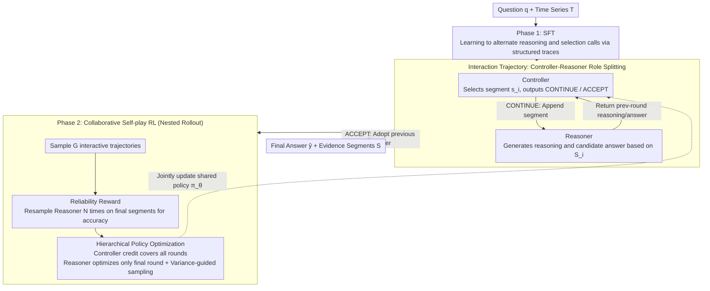

# Adaptive Time Series Reasoning via Segment Selection

**Conference**: ICML 2026  
**arXiv**: [2602.18645](https://arxiv.org/abs/2602.18645)  
**Code**: https://github.com/mims-harvard/ARTIST  
**Area**: Time Series  
**Keywords**: Time Series Reasoning, segment selection, controller-reasoner, self-play RL, hierarchical policy optimization  

## TL;DR
This paper proposes ARTIST, which frames time series question answering (TSQA) as a sequential decision-making problem of "reasoning while selecting segments." Through a controller-reasoner architecture and hierarchical self-play RL, the model selectively reads task-relevant temporal segments, thereby improving reasoning accuracy.

## Background & Motivation
**Background**: Time series tasks are expanding from traditional forecasting, classification, and anomaly detection toward natural language question-answering reasoning. Given a question, models must locate relevant intervals, compare patterns, explain changes, and output answers based on the time series. Existing methods typically serialize the entire time series into text, render it as an image, or encode it into embeddings to be fed into an LLM in a single pass.

**Limitations of Prior Work**: Processing the entire time series at once introduces significant amounts of irrelevant segments into the context. For long sequences or multi-step reasoning tasks, truly useful information may reside only in a few short intervals and can change based on intermediate reasoning conclusions. A fixed view cannot achieve the dynamic process of "viewing one segment to establish a baseline, then viewing another to verify a hypothesis."

**Key Challenge**: The model needs to actively choose which temporal segments to observe, but training data typically lacks annotations for "which intervals should be viewed for this question." Furthermore, if optimizing long reasoning trajectories directly with token-level RL, the credit assignment for segment selection is diluted by long-form text output.

**Goal**: To enable LLMs to treat time series as interactive resources during reasoning: first selecting a segment, reasoning based on that segment, and then deciding whether to continue selecting or stop to answer. Training must separately optimize "where to look" and "how to answer."

**Key Insight**: The paper splits a single model into a controller and a reasoner using role-specific prompts. The controller is responsible for selecting temporal segments and termination conditions; the reasoner generates intermediate reasoning and answers based only on selected segments. This decouples evidence acquisition from answer generation, allowing for distinct reward designs for each role.

**Core Idea**: Use controller-reasoner collaborative self-play to train time series reasoning into an interpretable and adaptive segment selection process.

## Method
The core of ARTIST is formalizing time series reasoning as an interactive trajectory. Given a question $q$ and time series $T\in\mathbb{R}^{H\times V}$, the controller observes the question, the full sequence (at a high level), the already selected segments, and the reasoning/answer from the previous round to output a CONTINUE/ACCEPT decision. If it continues, it selects a new continuous segment $s_i=T_{t_{start}:t_{end}}$. The reasoner receives the accumulated segment list $S_i$ and generates a reasoning trace and a candidate answer for the current round. If the controller selects ACCEPT, the reasoner's answer from the previous round becomes the final output.

### Overall Architecture
Training consists of two stages. The first stage is SFT, using manually or automatically constructed structured traces to fine-tune the model to alternate between outputting natural language reasoning and segment-selection calls. The second stage is RL, utilizing collaborative self-play: the same policy model plays the roles of controller and reasoner through different prompts, generating multiple interactive trajectories and calculating rewards for both roles using nested rollouts.

In the RL stage, $G$ controller-reasoner interaction trajectories are sampled for each training instance. For the final segment list of each trajectory, the Reasoner is independently sampled $N$ times (nested rollout) to estimate "whether these segments can stably support the correct answer." The Controller's reward primarily comes from reliability, i.e., the proportion of correct answers across the repeated Reasoner samplings; the Reasoner's reward comes from final answer correctness and format compliance. Finally, the Controller's advantage is propagated to all controller decision tokens, while the Reasoner's advantage is only propagated to the final round's reasoner output.

### Key Designs

**1. Controller-Reasoner Role Splitting: Decoupling "evidence selection" and "reading evidence to answer" into two independently optimizable roles.** If a single long chain-of-thought is responsible for both picking segments and providing answers, RL only sees the final correctness and cannot determine if an error stemmed from incorrect evidence or a reasoning failure, leading to tangled credit assignment. ARTIST lets the same policy model $\pi_\theta$ play two roles via role prompts: the Controller sees the question, full sequence, selected segment list $S_{i-1}$, and previous reasoning/answers to output a decision $d_i\in\{\mathrm{CONTINUE},\mathrm{ACCEPT}\}$. If it continues, it proposes a segment $s_i=T_{t_{start}:t_{end}}$. The Reasoner only sees the question and accumulated segments $S_i$ to generate a reasoning trace and answer. Once evidence acquisition and answer generation are separated, distinct rewards and advantages can be calculated for each, making error attribution clearer.

**2. Reliability Reward: Driving the Controller to pursue "evidence sufficient to answer correctly consistently," rather than by chance.** Due to the stochastic nature of LLMs, a Reasoner might answer correctly once under a certain set of segments by luck. Rewarding the Controller based on single-pass correctness would introduce noise. ARTIST uses reliability as the Controller's main reward instead: fixing the final segment list $S$ selected by the Controller, the Reasoner is independently resampled $N$ times to calculate the accuracy ratio $D(q,S,y^*)=\frac{1}{N}\sum_{n}\mathbb{1}[\hat{y}^{(n)}=y^*]$. The Controller receives a high score only when a set of segments allows the Reasoner to answer correctly and consistently. This shifts the Controller's goal from "making this answer right" to "selecting evidence with sufficient information." Removing this in ablations caused average accuracy to plummet from 73.4% to 52.0%, the most significant drop among all modules.

**3. Hierarchical Policy Optimization + Variance-guided Sampling: Allocating credit across long trajectories to the correct roles and stages.** Segment selection is a long-term decision spanning multiple rounds (e.g., viewing a baseline then a hypothesis verification); thus, rewards should not only hit the last step. Conversely, the Reasoner acts more like a local Q&A once segments are fixed. ARTIST uses nested rollouts to separate their credit: for each sample, $G$ interaction trajectories are sampled. The Controller receives a trajectory-level advantage, and credit covers all decision tokens throughout the iterations. The Reasoner is only optimized on the final output of the final segments to avoid interference from the variance of earlier selection quality. To save memory while capturing strong learning signals, variance-guided sampling ($p(g)\propto r_\sigma^{(g)}$) is applied based on the Reasoner's accuracy variance across groups, prioritizing updates for groups with higher result discrepancy. Ablations show that removing the trajectory-level objective makes the Controller myopic, failing to learn multi-round segment combination strategies.

### Loss & Training
SFT is performed using LoRA on structured trajectories. The RL stage utilizes full-parameter fine-tuning, translating controller reward $R_{ctl}$ and reasoner reward $R_{rsn}$ into group-relative advantages for joint policy updates. The base model used is Qwen3-4B, with time series encoded via a 5-layer MLP for patch-based input. During evaluation, the reasoner temperature is 0.7 and the controller temperature is 1.0. The main setup focuses on univariate time series.

## Key Experimental Results

### Main Results
The main experiments cover 6 time series reasoning benchmarks: ETI, RCW, ECG-QA, Sleep-QA, TSQA, and TRQA. The following table extracts average and representative results.

| Method | ETI Acc/F1 | RCW Acc/F1 | ECG-QA Acc/F1 | TSQA Acc/F1 | TRQA Acc/F1 | Avg Acc/F1 |
|--------|------|------|----------|------|------|------|
| OpenTSLM-4B + SFT | 82.69 / 82.66 | 65.49 / 38.29 | 69.50 / 41.00 | 47.50 / 35.81 | 76.25 / 69.36 | 62.80 / 47.68 |
| ITFormer-4B + SFT | 84.62 / 84.60 | 67.31 / 57.95 | 57.31 / 49.91 | 49.50 / 23.62 | 80.12 / 74.22 | 62.08 / 51.01 |
| Ours + SFT | 85.12 / 85.11 | 69.75 / 61.46 | 56.31 / 55.68 | 60.06 / 57.13 | 82.26 / 62.32 | 63.61 / 56.61 |
| Ours + SFT + RL | 87.03 / 87.10 | 77.00 / 50.00 | 69.81 / 52.67 | 62.00 / 58.66 | 83.06 / 78.02 | 69.26 / 57.61 |
| Gain over Prev. SOTA | +2.41 / +2.50 | +3.11 / +3.51 | +3.14 / +3.89 | +12.50 / +11.91 | +2.94 / +3.80 | +6.46 / +6.60 |

### Ablation Study
Ablations report accuracy on ECG-QA and RCW to verify core components.

| Configuration | ECG Acc | RCW Acc | Avg Acc | Description |
|------|---------|------|------|------|
| ARTIST | 69.81 | 77.00 | 73.41 | Full controller-reasoner + reliability + hierarchical RL |
| Reasoner Only | 65.33 | 62.88 | 64.11 | No controller, processes static input; drop of 9.30 |
| Controller-only RL | 60.81 | 68.13 | 64.47 | Frozen reasoner; cannot adapt to dynamic distribution |
| w/o Reliability Reward | 52.50 | 51.44 | 51.97 | Largest drop; single correctness misleads selection |
| w/o Trajectory-based Objective | 55.19 | 67.06 | 61.13 | Myopic controller fails to learn multi-round strategies |
| w/o Variance-guided Sampling | 68.13 | 72.75 | 70.44 | Guided sampling provides better reasoner signals |

### Key Findings
- ARTIST improves average accuracy by 6.46 percentage points over the strongest baseline on each dataset, demonstrating that dynamic segment selection provides both interpretability and substantial performance gains.
- RL continues to improve average accuracy over SFT (from 63.61% to 69.26%). This indicates that segment selection cannot rely solely on imitation; reliability rewards in post-training further optimize "where to look."
- Data utilization analysis reveals that more coverage is not always better. For Sleep-QA and TRQA, accuracy peaks at 30-50% signal usage; using nearly the full sequence actually degrades performance.
- Inference costs do increase: For TRQA, ARTIST takes approx. 1.68 mins per case (8 runs), compared to 1.26/1.29 mins for OpenTSLM/ITFormer. However, as the sequence length scales to 12K, time only increases from 1.880 to 1.910 mins, showing costs are driven by selected segments and interaction rounds rather than total sequence length.

## Highlights & Insights
- The paper shifts the focus of time series reasoning from "how to encode the whole sequence" to "which segment to look at during reasoning." This problem definition is intuitive; many real-world problems require a coarse overview followed by local zooming and comparison of multiple segments.
- The reliability reward is vital. It redefines the controller's objective from "getting the reasoner to answer correctly now" to "selecting evidence that enables consistent correctness," which is more aligned with the nature of information retrieval.
- ARTIST's segment list naturally provides an evidence trajectory, making it easy to audit the basis of an answer. This is particularly important for tasks requiring interpretable localization, such as medical monitoring, finance, and environmental sensing.

## Limitations & Future Work
- Inference latency is higher than single-pass baselines due to multiple controller-reasoner calls. While scaling to long sequences is efficient, latency remains a concern for short sequences or real-time scenarios.
- Main experiments focus on univariate time series. Multivariate data, asynchronous sampling, missing values, and cross-variable causality will make segment selection significantly more complex.
- Whether segment selection is always "interpretable" requires caution. The segments selected by the controller provide evidence clues but are not equivalent to strict causal explanations.
- On Sleep-QA, the tokenized version of ARTIST significantly lags behind TimeMaster+RL, while the VLM backbone version matches it, suggesting that input modalities and pre-training priors remain strong factors.

## Related Work & Insights
- **vs ChatTS / OpenTSLM / ITFormer**: These methods focus on how to encode the entire time series for the LLM; ARTIST focuses on dynamically selecting segments during reasoning to avoid fixed global representations.
- **vs VL-Time / TimeMaster**: Visualization methods utilize image priors; ARTIST does not rely on single-pass visual understanding but treats the time series as a resource for tool-like selection.
- **vs Dynamic Visual Search**: Image searches typically have spatial regions and explicit targets, whereas the meaning of time series segments often depends on relative baselines and comparisons, necessitating multi-round context-aware selection.
- **vs Standard Self-play RL**: Many self-play methods use immediate goals for proposer/solver roles; ARTIST's controller manages a long-term segment strategy requiring a trajectory-level objective.

## Rating
- Novelty: ⭐⭐⭐⭐⭐ Seamlessly integrates time series reasoning with adaptive segment selection; the problem setting is highly extensible.
- Experimental Thoroughness: ⭐⭐⭐⭐☆ Covers 6 benchmarks and multiple baseline types, though multivariate scenarios are still missing.
- Writing Quality: ⭐⭐⭐⭐☆ The framework is clear and the appendix is extensive; the main text requires attention to the controller/reasoner credit assignment.
- Value: ⭐⭐⭐⭐⭐ Highly insightful for long-sequence QA, medical monitoring, and interpretable temporal reasoning.

<!-- RELATED:START -->

## Related Papers

- [\[ICLR 2026\] Reasoning on Time-Series for Financial Technical Analysis](../../ICLR2026/time_series/reasoning_on_time-series_for_financial_technical_analysis.md)
- [\[ICML 2026\] PATRA: Pattern-Aware Alignment and Balanced Reasoning for Time Series Question Answering](patra_pattern-aware_alignment_and_balanced_reasoning_for_time_series_question_an.md)
- [\[ICLR 2026\] TimeOmni-1: Incentivizing Complex Reasoning with Time Series in Large Language Models](../../ICLR2026/time_series/timeomni-1_incentivizing_complex_reasoning_with_time_series_in_large_language_mo.md)
- [\[ICML 2026\] DistMatch: Adaptive Binning via Distribution Matching for Robust Sequential Conformal](distmatch_adaptive_binning_via_distribution_matching_for_robust_sequential_confo.md)
- [\[ICLR 2026\] SwiftTS: A Swift Selection Framework for Time Series Pre-trained Models via Multi-task Meta-Learning](../../ICLR2026/time_series/swiftts_a_swift_selection_framework_for_time_series_pre-trained_models_via_multi.md)

<!-- RELATED:END -->
