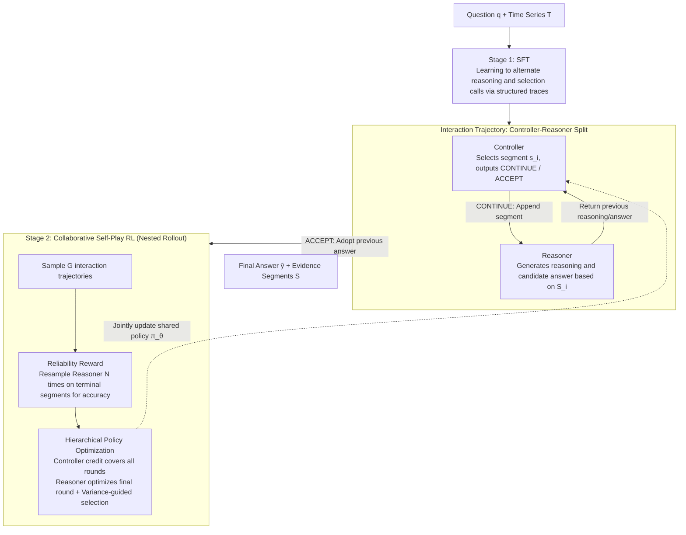

# Adaptive Time Series Reasoning via Segment Selection

**Conference**: ICML 2026  
**arXiv**: [2602.18645](https://arxiv.org/abs/2602.18645)  
**Code**: https://github.com/mims-harvard/ARTIST  
**Area**: Time Series  
**Keywords**: Time series reasoning, segment selection, controller-reasoner, self-play RL, hierarchical policy optimization  

## TL;DR
This paper proposes ARTIST, which transforms time series question answering into a sequential decision-making problem of "reasoning while selecting segments." Through a controller-reasoner architecture and hierarchical self-play RL, the model reads only problem-relevant time segments, thereby improving reasoning accuracy.

## Background & Motivation
**Background**: Time series tasks are expanding from traditional forecasting, classification, and anomaly detection to natural language question-answering reasoning. Given a question, the model must locate relevant intervals, compare patterns, explain changes, and output an answer. Existing methods typically serialize the entire time series into text, render it into images, or encode it as embeddings to feed into an LLM at once.

**Limitations of Prior Work**: Processing the complete time series in one go introduces significant irrelevant segment noise into the context. For long sequences or multi-step reasoning tasks, truly useful information may reside only in a few short intervals and may change based on intermediate reasoning conclusions. A fixed view cannot achieve the dynamic process of "viewing one segment to establish a baseline, then viewing another to verify a hypothesis."

**Key Challenge**: The model needs to actively select which time segments to view, but training data usually lacks annotations for "which intervals should be viewed for this question." Simultaneously, if token-level RL is used directly to optimize long reasoning trajectories, the credit assignment for segment selection is diluted by long text outputs.

**Goal**: To enable LLMs to treat time series as an interactive resource during reasoning: first selecting a segment, reasoning based on that segment, and then deciding whether to continue selecting or stop to answer. Training must separately optimize "where to look" and "how to answer."

**Key Insight**: The paper splits a single model into a controller and a reasoner using role-specific prompts. The controller is responsible for selecting temporal segments and stop conditions; the reasoner generates intermediate reasoning and answers based only on selected segments. This decoupling of evidence acquisition from answer generation allows for distinct rewards for each role.

**Core Idea**: Use controller-reasoner collaborative self-play to train time series reasoning into an interpretable, adaptive segment selection process.

## Method
The core of ARTIST is formalizing time series reasoning as an interaction trajectory. Given a question $q$ and time series $T \in \mathbb{R}^{H \times V}$, the controller sees the question, the full sequence, selected segments, and the previous reasoning/answer at round $i$, then outputs a CONTINUE/ACCEPT decision. If CONTINUE, it selects a new continuous segment $s_i = T_{t_{start}:t_{end}}$. The reasoner receives the accumulated segment list $S_i$ and generates a reasoning trace and candidate answer. If the controller chooses ACCEPT, the reasoner's answer from the previous round becomes the final output.

### Overall Architecture
Training consists of two stages. Stage 1 is SFT, fine-tuning the model with human- or machine-generated structured traces to teach it to alternate between natural language reasoning and segment-selection calls. Stage 2 is RL, using collaborative self-play: the same policy model plays both controller and reasoner via different prompts, generates multiple interaction trajectories, and calculates rewards for both roles using nested rollouts.

In RL, $G$ interaction trajectories are sampled per training instance. For the terminal segment list of each trajectory, the Reasoner is sampled $N$ times (nested rollout) to estimate if "these segments stably support the correct answer." The Controller's reward primarily comes from reliability (the ratio of correct answers under repeated Reasoner sampling); the Reasoner's reward comes from final answer correctness and format compliance. Finally, the Controller's advantage is propagated to all controller decision tokens, while the Reasoner's advantage is propagated only to the final Reasoner output.

### Key Designs

**1. Controller-Reasoner Role Splitting**: Separating "selecting evidence" and "reading evidence to answer" into two independently optimizable roles. If a single long chain-of-thought is responsible for both, RL only sees the final result, failing to distinguish if errors stem from wrong evidence or reasoning failure. ARTIST enables the same policy $\pi_\theta$ to play both roles via prompts. Once separated, specific rewards and advantages can be calculated for each, making error attribution transparent.

**2. Reliability Reward**: Directing the Controller to pursue "evidence sufficient to answer correctly stably" rather than a one-off lucky guess. Due to LLM randomness, a single correct answer might be noise. ARTIST uses reliability as the Controller's primary reward: for fixed terminal segments $S$, the Reasoner is resampled $N$ times to compute $D(q, S, y^*) = \frac{1}{N} \sum_{n} \mathbb{1}[\hat{y}^{(n)} = y^*]$. High rewards are given only when segments allow stable correct answers. Ablation shows that removing this causes average accuracy to drop from 73.4% to 52.0%.

**3. Hierarchical Policy Optimization + Variance-guided Sampling**: Assigning credit from long trajectories to the correct roles and stages. Segment selection is a multi-round long-term decision that requires rewards across all steps, whereas the Reasoner acts as a local Q&A task once segments are fixed. Using nested rollouts, ARTIST separates the credit: the Controller receives trajectory-level advantages covering all interaction tokens; the Reasoner is optimized only on the final output to avoid interference from previous selection variance. Variance-guided sampling ($p(g) \propto r_\sigma^{(g)}$) prioritizes updates on groups with higher learning signals (higher answer variance).

### Loss & Training
SFT uses LoRA on structured trajectories. The RL stage employs full-parameter fine-tuning, converting controller reward $R_{ctl}$ and reasoner reward $R_{rsn}$ into group-relative advantages for joint updates. The base model is Qwen3-4B. Time series are encoded via a 5-layer MLP for patch-based input. In evaluation, reasoner temperature is 0.7 and controller temperature is 1.0.

## Key Experimental Results

### Main Results
The main experiment covers 6 benchmarks: ETI, RCW, ECG-QA, Sleep-QA, TSQA, TRQA. Below are average and representative results.

| Method | ETI Acc/F1 | RCW Acc/F1 | ECG-QA Acc/F1 | TSQA Acc/F1 | TRQA Acc/F1 | Avg Acc/F1 |
|--------|------|------|----------|------|------|------|
| OpenTSLM-4B + SFT | 82.69 / 82.66 | 65.49 / 38.29 | 69.50 / 41.00 | 47.50 / 35.81 | 76.25 / 69.36 | 62.80 / 47.68 |
| ITFormer-4B + SFT | 84.62 / 84.60 | 67.31 / 57.95 | 57.31 / 49.91 | 49.50 / 23.62 | 80.12 / 74.22 | 62.08 / 51.01 |
| ARTIST + SFT | 85.12 / 85.11 | 69.75 / 61.46 | 56.31 / 55.68 | 60.06 / 57.13 | 82.26 / 62.32 | 63.61 / 56.61 |
| ARTIST + SFT + RL | 87.03 / 87.10 | 77.00 / 50.00 | 69.81 / 52.67 | 62.00 / 58.66 | 83.06 / 78.02 | 69.26 / 57.61 |
| Gain (vs. strongest baseline) | +2.41 / +2.50 | +3.11 / +3.51 | +3.14 / +3.89 | +12.50 / +11.91 | +2.94 / +3.80 | +6.46 / +6.60 |

### Ablation Study
Ablations on ECG-QA and RCW accuracy.

| Config | ECG Acc | RCW Acc | Avg Acc | Description |
|------|---------|------|------|------|
| ARTIST | 69.81 | 77.00 | 73.41 | Full controller-reasoner + reliability + hierarchical RL |
| Reasoner Only | 65.33 | 62.88 | 64.11 | No controller, static input, avg. drop 9.30 |
| Controller-only RL | 60.81 | 68.13 | 64.47 | Frozen reasoner, fails to adapt to dynamic distributions |
| w/o Reliability Reward | 52.50 | 51.44 | 51.97 | Largest drop; single correctness misleads selection |
| w/o Trajectory-based Objective | 55.19 | 67.06 | 61.13 | Myopic controller fails to learn multi-round strategies |
| w/o Variance-guided Sampling | 68.13 | 72.75 | 70.44 | Loses effective reasoner learning signals |

### Key Findings
- ARTIST improves average accuracy by 6.46 percentage points over the strongest baseline on each dataset, indicating that dynamic segment selection provides both interpretability and substantial quality gains.
- RL consistently improves over SFT (63.61% to 69.26%), showing that selection policies benefit from post-training reliability rewards beyond imitation learning.
- Data utilization analysis reveals that more coverage is not always better; Sleep-QA and TRQA peak at 30-50% signal coverage, while near-full sequence usage degrades performance.
- Inference costs increase: on TRQA, ARTIST (8 runs) takes ~1.68 min vs. OpenTSLM's 1.26 min. However, as sequences scale to 12K, time only increases marginally (1.880 to 1.910 min), as costs are driven by selected segments rather than the full sequence length.

## Highlights & Insights
- The paper shifts the paradigm from "how to encode the whole sequence" to "which segment to view during reasoning," which aligns with real-world analyst behavior (scan, zoom, compare).
- The Reliability Reward is crucial. It aligns the controller's goal with the essence of information retrieval: selecting evidence sufficient for a stable conclusion.
- The segment list naturally provides an evidence trajectory, enhancing transparency for domains like healthcare or finance where grounding is critical.

## Limitations & Future Work
- Inference latency is higher than single-pass baselines due to multiple calls. While it scales better for long sequences, real-time scenarios remain challenging.
- The current study focuses on univariate time series. Multivariable, asynchronous sampling, and cross-variable causality significantly complicate segment selection.
- Segment selection does not strictly equal causal explanation; selected segments provide evidence clues but are not necessarily comprehensive causal factors.
- In Sleep-QA, the tokenized version lags behind specialized models like TimeMaster+RL, suggesting that input modality and pre-training priors still dominate performance.

## Related Work & Insights
- **vs ChatTS / OpenTSLM / ITFormer**: These focus on encoding full sequences for LLMs; ARTIST focuses on dynamic selection to avoid context clutter.
- **vs VL-Time / TimeMaster**: Visual methods use image priors; ARTIST treats segments as tools/resources to be queried.
- **vs Dynamic Visual Search**: While similar, time series segments have meaning dependent on relative baselines and temporal comparisons, requiring more context-aware multi-round selection.
- **vs Standard Self-play RL**: Unlike methods with immediate proposer goals, ARTIST's controller requires trajectory-level objectives to learn multi-round selection logic.

## Rating
- Novelty: ⭐⭐⭐⭐⭐ 
- Experimental Thoroughness: ⭐⭐⭐⭐☆ 
- Writing Quality: ⭐⭐⭐⭐☆ 
- Value: ⭐⭐⭐⭐⭐ 

<!-- RELATED:START -->

## Related Papers

- [\[ICLR 2026\] Reasoning on Time-Series for Financial Technical Analysis](../../ICLR2026/time_series/reasoning_on_time-series_for_financial_technical_analysis.md)
- [\[ICML 2026\] PATRA: Pattern-Aware Alignment and Balanced Reasoning for Time Series Question Answering](patra_pattern-aware_alignment_and_balanced_reasoning_for_time_series_question_an.md)
- [\[ICLR 2026\] TimeOmni-1: Incentivizing Complex Reasoning with Time Series in Large Language Models](../../ICLR2026/time_series/timeomni-1_incentivizing_complex_reasoning_with_time_series_in_large_language_mo.md)
- [\[ICML 2026\] DistMatch: Adaptive Binning via Distribution Matching for Robust Sequential Conformal](distmatch_adaptive_binning_via_distribution_matching_for_robust_sequential_confo.md)
- [\[ICLR 2026\] SwiftTS: A Swift Selection Framework for Time Series Pre-trained Models via Multi-task Meta-Learning](../../ICLR2026/time_series/swiftts_a_swift_selection_framework_for_time_series_pre-trained_models_via_multi.md)

<!-- RELATED:END -->
