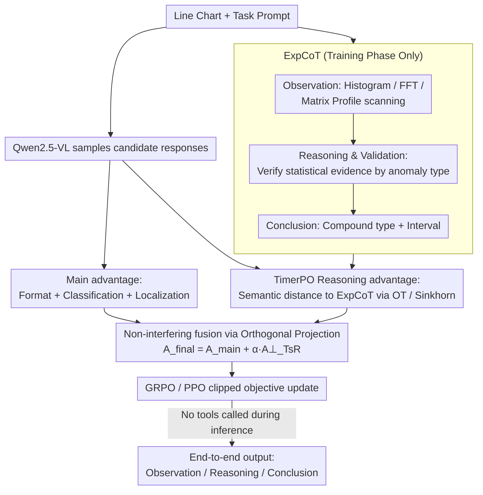

# AnomSeer: Reinforcing Multimodal LLMs to Reason for Time-Series Anomaly Detection

**Conference**: ICML2026  
**arXiv**: [2602.08868](https://arxiv.org/abs/2602.08868)  
**Code**: https://github.com/jrzhang33/AnomSeer  
**Area**: Time-Series / Multimodal LLM / Anomaly Detection  
**Keywords**: Time-series Anomaly Detection, Multimodal Large Language Models, Reinforcement Learning, Expert Chain-of-Thought, Optimal Transport

## TL;DR
AnomSeer encodes statistical evidence from classical time-series anomaly detection into expert reasoning trajectories and reinforces Multimodal LLMs (MLLMs) using TimerPO. This enables the model to simultaneously perform anomaly type classification, interval localization, and fine-grained explanation using line chart inputs.

## Background & Motivation
**Background**: Traditionally, time-series anomaly detection (TSAD) has relied on statistical methods, classical machine learning, or reconstruction/prediction-based deep models, typically aiming to produce anomaly scores or intervals. With the advancement of LLMs and MLLMs, recent works have begun rendering time-series as line charts, allowing multimodal models to identify anomalies from images and text prompts. This approach leverages the visual perception capabilities of models for shapes, trends, and local fluctuations while avoiding the direct insertion of long sequences into the text context.

**Limitations of Prior Work**: General-purpose MLLMs lack built-in priors for time-series. While they can identify obvious spikes or major shifts, their reasoning often remains at a coarse-grained level (e.g., "sudden change" or "overall fluctuation"), showing insensitivity to details like frequency drift, slight trend changes, or local shapelet anomalies. Standard SFT merely mimics correct answers, and typical RL relies on globally verifiable rewards such as classification or localization, making it difficult to compel the model to learn a verifiable time-series analysis process.

**Key Challenge**: Anomaly detection requires the model to possess dual capabilities: maintaining the holistic visual understanding and linguistic explanation of MLLMs while utilizing fine-grained evidence such as statistics, frequency domain features, and local similarity, much like traditional TSAD methods. Incorporating these expert signals directly into the primary reward may lead to gradient interference with detection objectives; omitting them entirely results in the model learning only crude visual heuristics.

**Goal**: The authors aim to train a post-training method tailored for TSAD MLLMs. The goal is for the model to output anomaly types, intervals, and natural language explanations after receiving a time-series image. Crucially, explanations should refer to specific timestamps, frequencies, trends, magnitudes, or local patterns rather than providing generic visual judgments.

**Key Insight**: A key observation is that while traditional TSAD tools are not proficient at generating natural language, they provide reliable and verifiable fine-grained evidence. Instead of treating them as external plugins during inference, the authors transcribe these analysis workflows into Expert Chain-of-Thought (ExpCoT) during the training phase, serving as auxiliary reasoning signals for reinforcement learning.

**Core Idea**: Generate ExpCoT using classical TSAD analysis and inject "fine-grained time-series evidence" into the MLLM's RL updates via TimerPO, which utilizes optimal transport alignment and orthogonal projection.

## Method
AnomSeer is a post-training framework that does not modify the architecture of Qwen2.5-VL nor call external detectors during inference. The training data comes from the synthetic dataset AnomLLM. The input consists of time-series line charts and task prompts, while the output is structured text containing reasoning, anomaly types, and interval localization. During training, ExpCoT is generated for each sample using traditional analysis methods. TimerPO is then used to align model outputs with these expert trajectories while maintaining anomaly classification and localization as primary objectives.

### Overall Architecture
The process is divided into four steps. First, the original univariate time-series is rendered into a line chart as the visual input for the MLLM; text prompts specify the requirements for judging anomaly types, locating intervals, and explaining reasons. Second, ExpCoT is generated using ground-truth annotations and traditional TSAD analysis (this step occurs only during training). Third, the model samples a set of candidate responses for the same input, calculating outcome rewards and reasoning alignment rewards. Fourth, TimerPO orthogonalizes the components of the reasoning reward that do not overlap with the main task reward before adding them to the final advantage to drive policy updates.

The inference process is simpler: the model receives only the image and prompt and directly outputs responses in the style of Observation, Reasoning & Validation, and Conclusion. Tools like ExpCoT, FFT, and Matrix Profile are not called online, thus avoiding additional inference latency or token costs.

### Key Designs

**1. ExpCoT (Expert Chain-of-Thought): Transcribing statistical evidence into learnable reasoning trajectories**

Explanations from general MLLMs are often linguistically fluent but factually unreliable, limited to coarse-grained judgments. ExpCoT transcribes the analytical discipline of classical anomaly detection into a natural language trajectory: Observation $\rightarrow$ Reasoning & Validation $\rightarrow$ Conclusion. During Observation, a global scan is performed using histogram anomaly scores; if no obvious global anomaly exists, a structural scan follows using smooth gradients for trend stability and FFT for periodicity/frequency changes; finally, a local scan uses Matrix Profile for dissimilar sub-sequences. Reasoning & Validation selects evidence corresponding to the true anomaly type (e.g., gradients for trend drift, frequency peaks for frequency anomalies). Conclusion synthesizes these into a final judgment. This allows the model to internalize transferable analytical paths mapped to specific statistics and timestamps.

**2. TimerPO Reasoning Advantage: Measuring semantic proximity via Optimal Transport**

To turn "expert-like reasoning" into an optimizable reward without enforcing rigid token-level alignment (as valid explanations can vary in phrasing or order), TimerPO adds a reasoning reward path. The main reward $\widehat{A}_{main}$ is derived from format, classification, and localization. Simultaneously, the final-layer token embeddings of the model's response and the ExpCoT are used to construct a cost matrix via cosine distance. An optimal transport distance $W^i$ is calculated using entropy-regularized Sinkhorn approximation, converted to a reasoning reward, and normalized as $\widehat{A}_{TsR}$. OT naturally compares the overall distribution of reasoning evidence, allowing synonymous or reordered expressions to receive high scores while pushing the model to cover key evidence from the ExpCoT.

**3. Non-interfering Fusion via Orthogonal Projection: Limiting reasoning rewards to residual objectives**

Since "correctness" and "expert-like explanation" are not entirely independent, directly summing rewards may reinforce spurious correlations or contaminate gradients. TimerPO projects the reasoning advantage onto the main advantage and subtracts the overlapping component to obtain an orthogonal residual $\widehat{A}_{TsR}^{\perp}=\widehat{A}_{TsR}-\frac{\langle\widehat{A}_{TsR},\widehat{A}_{main}\rangle}{\|\widehat{A}_{main}\|_2^2+\varepsilon}\widehat{A}_{main}$. The final advantage $A_{final}=\widehat{A}_{main}+\alpha\widehat{A}_{TsR}^{\perp}$ is then used in a clipped objective. This ensures the auxiliary signal only acts within the complementary space of the main goal, specifically enhancing fine-grained reasoning without distorting the primary detection tasks.

### Loss & Training
Training utilizes pure RL post-training without requiring an initial SFT cold start or modifications to the MLLM architecture. Qwen2.5-VL-3B/7B-Instruct is used as the backbone. The training set consists of 3,200 synthetic samples from AnomLLM. GRPO group size is set to 5, and the PPO clipping coefficient is 0.2. Reward weights are distributed as: format (0.1), classification (0.2), and localization (0.7). The default weight for the TimerPO reasoning advantage is $\alpha=0.3$. This configuration ensures the model prioritizes format and task accuracy before refining its explanations toward fine-grained time-series evidence.

## Key Experimental Results

### Main Results
The authors compare AnomSeer against commercial MLLMs, open-source MLLMs, SFT versions, and TimeMaster on the AnomLLM test set. Metrics include classification accuracy and Affinity-F1 scores across four scenarios: frequency, trend, range, and point.

| Method | Training | Acc (%) | Frequency F1 | Trend F1 | Range F1 | Point F1 | Mean F1 |
|------|----------|---------------|--------------|----------|----------|----------|--------|
| GPT-4o | Prompting | 17.2 | 10.9 | 43.5 | 57.0 | 53.4 | 41.2 |
| Gemini-2.5-Pro | Prompting | 12.6 | 19.1 | 59.0 | 81.3 | 74.5 | 58.5 |
| Qwen2.5-VL-72B-Instr. | Prompting | 14.6 | 31.4 | 32.1 | 74.6 | 62.7 | 50.2 |
| TimeMaster-3B | SFT + GRPO | 57.9 | 51.4 | 76.6 | 80.1 | 79.6 | 71.9 |
| **AnomSeer-3B (Ours)** | TimerPO | 62.8 | 58.9 | 84.9 | 85.6 | 87.8 | 79.3 |
| **AnomSeer-7B (Ours)** | TimerPO | 65.0 | 60.8 | 87.7 | 94.3 | 94.9 | 84.4 |

The most significant conclusion is that AnomSeer-3B significantly outperforms much larger commercial models and the 72B prompt baseline. Notably, the F1 for frequency anomalies increases from 51.4 (TimeMaster-3B) to 58.9, demonstrating that TimerPO is more effective at targeting subtle frequency-domain anomalies than standard GRPO.

### Ablation Study
Ablations on AnomSeer-3B involved removing ExpCoT, reasoning advantage, and orthogonalization.

| Configuration | Frequency F1 | Trend F1 | Range F1 | Point F1 | Note |
|------|--------------|----------|----------|----------|------|
| W/o ExpCoT (Generic CoT) | 49.8 | 79.5 | 84.4 | 86.1 | Linguistic reasoning remains; expert evidence weakens |
| W/o Orthogonalization | 53.5 | 81.1 | 83.5 | 85.4 | Direct reward fusion causes objective interference |
| Vanilla GRPO | 50.4 | 77.8 | 81.8 | 80.6 | Relies solely on outcome rewards; weakest reasoning |
| **Full AnomSeer** | 58.9 | 84.9 | 85.6 | 87.8 | Combined ExpCoT, OT reward, and orthogonal fusion |

Ablations demonstrate that ExpCoT is critical for frequency anomalies, which are difficult to judge solely by visual spikes. Orthogonalization provides consistent gains for trend, range, and point anomalies, confirming that auxiliary reasoning signals should be constrained to complementary directions.

### Key Findings
- AnomSeer-7B achieves a mean F1 of 84.4, surpassing TimeMaster-3B by 12.5 points and Gemini-2.5-Pro by 25.9 points on AnomLLM.
- Training with 32k SFT data did not match the performance of AnomSeer trained with 3.2k RL samples, emphasizing that "mimicking more correct answers" does not equate to "learning fine-grained analysis."
- Hyperparameter analysis shows $\alpha$ is stable between 0.3 and 0.7; values too small weaken supervision, while values too large may overwhelm task rewards.
- After TimerPO, high-frequency words in model outputs shift from generic terms like "global" or "change" to specific time-series terms like "timestamp," "intervals," and "amplitude."
- The model generalizes well to VisualTimeAnomaly and TSB-UAD, successfully detecting shapelet anomalies not present in the training set, indicating the model learned an analytical process rather than just memorizing headers.

## Highlights & Insights
- **Novelty**: Instead of opposing traditional TSAD methods to MLLMs, this work migrates the analytical discipline of old methods to the large model by using them as verifiable training trajectories.
- **Value**: TimerPO's OT alignment is better suited for reasoning supervision than standard text similarity. While explanations may vary in structure, the distribution of key evidence should remain consistent; OT provides this "soft alignment."
- **Experimental Thoroughness**: The orthogonal projection is a practical multi-objective RL trick. It prevents the process-based signals from contaminating the primary goal by projecting them into the complementary space.
- **Goal**: By unifying classification, localization, and explanation, the model better serves real-world O&M, medical monitoring, and industrial scenarios where users need to know where, what, and why an anomaly occurred.

## Limitations & Future Work
- The current method focuses on univariate time-series. Multivariate scenarios require explaining interactions between variables, which the current ExpCoT logic does not cover.
- ExpCoT relies on ground-truth anomaly metadata to organize trajectories, requiring high-quality training data. In real-world scenarios with sparse or noisy labels, expert trajectories may become unstable.
- While avoiding external tools at inference is an efficiency gain, the model cannot dynamically access external business knowledge (e.g., maintenance logs or holidays) that might explain "apparent" anomalies.
- Future work could involve multi-channel representations for multivariate data or integrating domain knowledge bases to expand explanations beyond curve morphology.

## Related Work & Insights
- **vs SigLLM**: SigLLMs focus on zero-shot detection using raw numerical sequences. AnomSeer uses image-based input and RL post-training, which is more token-efficient and provides unified localization/explanation, though it depends on rendering quality.
- **vs TimeMaster**: TimeMaster utilizes SFT and GRPO for classification, but its rewards are outcome-level. AnomSeer introduces ExpCoT and TimerPO to align the model with fine-grained evidence, leading to significant gains in hard cases like frequency and trend anomalies.
- **vs Traditional TSAD**: Methods like HBOS and Matrix Profile output statistics but lack natural language. AnomSeer transforms them into expert trajectories for training, allowing MLLMs to inherit their inductive biases.

## Rating
- **Novelty**: ⭐⭐⭐⭐⭐ High. Successfully combines ExpCoT, OT alignment, and orthogonal advantages in a post-training framework.
- **Experimental Thoroughness**: ⭐⭐⭐⭐☆ Solid coverage across several benchmarks with clear ablation studies. Inclusion of more complex multivariate data would be beneficial.
- **Writing Quality**: ⭐⭐⭐⭐☆ Clear methodology and effective framework diagrams.
- **Value**: ⭐⭐⭐⭐⭐ High. Provides a reusable paradigm for process-supervised RL in time-series tasks.

<!-- RELATED:START -->

## Related Papers

- [\[ICML 2026\] IMPACT: Influence Modeling for Open-Set Time Series Anomaly Detection](impact_influence_modeling_for_open-set_time_series_anomaly_detection.md)
- [\[ACL 2026\] Time-RA: Towards Time Series Reasoning for Anomaly Diagnosis with LLM Feedback](../../ACL2026/time_series/time-ra_towards_time_series_reasoning_for_anomaly_diagnosis_with_llm_feedback.md)
- [\[ICLR 2026\] SciTS: Scientific Time Series Understanding and Generation with LLMs](../../ICLR2026/time_series/scits_scientific_time_series_understanding_and_generation_with_llms.md)
- [\[ACL 2026\] STReasoner: Empowering LLMs for Spatio-Temporal Reasoning in Time Series via Spatial-Aware Reinforcement Learning](../../ACL2026/time_series/streasoner_empowering_llms_for_spatio-temporal_reasoning_in_time_series_via_spat.md)
- [\[AAAI 2026\] GAICo: A Deployed and Extensible Framework for Evaluating Diverse and Multimodal Generative AI Outputs](../../AAAI2026/time_series/gaico_a_deployed_and_extensible_framework_for_evaluating_diverse_and_multimodal_.md)

<!-- RELATED:END -->
