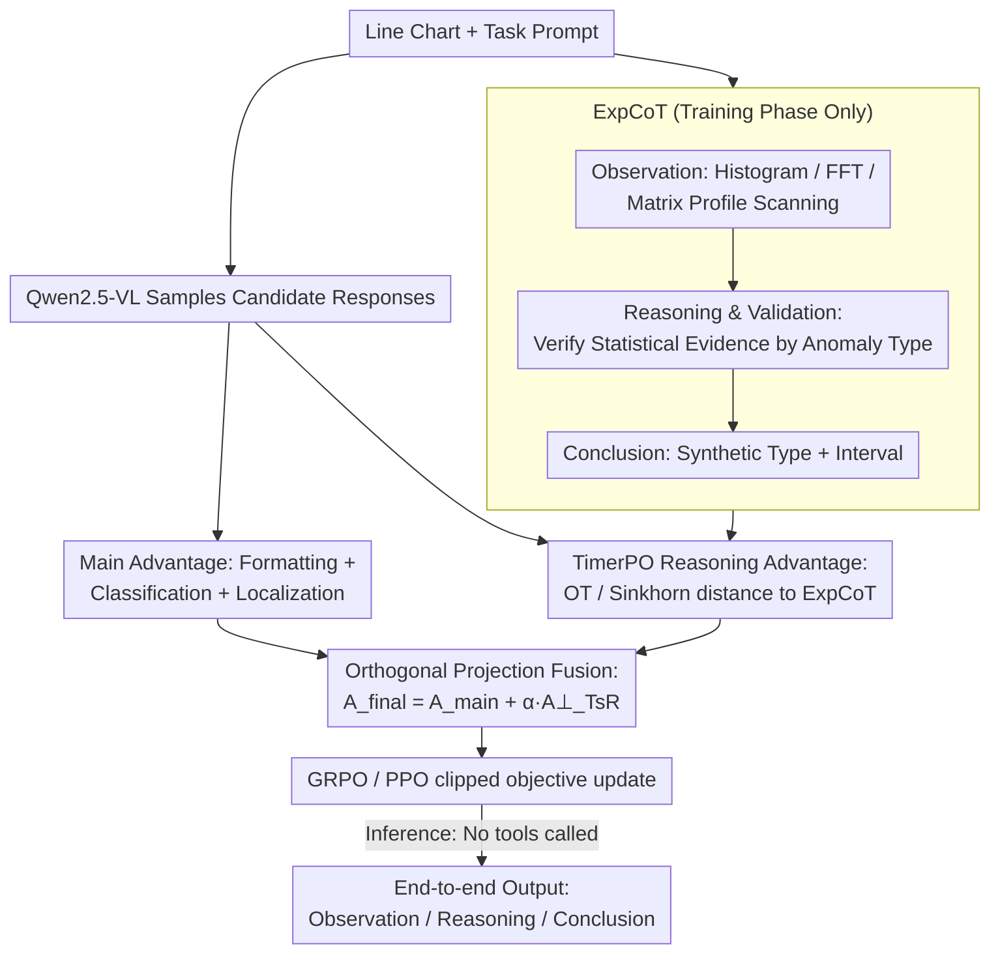

# AnomSeer: Reinforcing Multimodal LLMs to Reason for Time-Series Anomaly Detection

**Conference**: ICML2026  
**arXiv**: [2602.08868](https://arxiv.org/abs/2602.08868)  
**Code**: https://github.com/jrzhang33/AnomSeer  
**Area**: Time-Series / Multimodal LLM / Anomaly Detection  
**Keywords**: Time-series Anomaly Detection, Multimodal Large Language Models, Reinforcement Learning, Expert Chain-of-Thought, Optimal Transport  

## TL;DR
AnomSeer formalizes statistical evidence from classical time-series anomaly detection into expert reasoning trajectories and reinforces Multimodal LLMs (MLLMs) via TimerPO. This enables the model to simultaneously perform anomaly type classification, interval localization, and fine-grained explanation based on line chart inputs.

## Background & Motivation
**Background**: Time-series anomaly detection (TSAD) has traditionally relied on statistical methods, classical machine learning, or reconstruction/prediction-based deep models, typically outputting anomaly scores or intervals. With the advancement of LLMs and MLLMs, recent works render time series as line charts, allowing multimodal models to identify anomalies from images and text prompts. This leverages visual models' perception of shapes, trends, and local fluctuations while avoiding squeezing long sequences directly into text contexts.

**Limitations of Prior Work**: General MLLMs lack built-in time-series priors. While they can identify obvious spikes or massive shifts, their reasoning often remains at a coarse-grained level (e.g., "sudden change" or "overall fluctuation"), making them insensitive to details like frequency drifts, subtle trend changes, or local shapelet anomalies. Standard SFT merely imitates correct answers, and standard RL relies on globally verifiable rewards (like classification and localization), both failing to force the model to learn a verifiable time-series analysis process.

**Key Challenge**: Anomaly detection requires dual capabilities: maintaining the MLLM's holistic visual understanding and linguistic explanation ability, while utilizing fine-grained evidence like statistics, frequency domain features, and local similarity, much like traditional TSAD methods. Incorporating these expert signals directly into the primary reward might cause gradient interference; neglecting them entirely results in learning only crude visual heuristics.

**Goal**: The authors aim to develop a post-training method for MLLMs tailored to TSAD. Upon receiving a time-series image, the model should output the anomaly type, the anomaly interval, and a natural language explanation. Crucially, the explanation must refer to specific timestamps, frequencies, trends, magnitudes, or local patterns, rather than vague visual judgments.

**Key Insight**: A key observation is that while traditional TSAD tools are poor at generating natural language, they provide reliable and verifiable fine-grained evidence. Instead of using them as external plugins during inference, this paper transcribes these analysis workflows into Expert Chain-of-Thought (ExpCoT) during the training phase, serving as auxiliary reasoning signals in reinforcement learning.

**Core Idea**: Generate ExpCoT using classical TSAD analysis, and then inject "fine-grained time-series evidence" into the MLLM's RL updates via TimerPO, which employs Optimal Transport (OT) alignment and orthogonal projection.

## Method
AnomSeer is a post-training framework that does not modify the architecture of Qwen2.5-VL nor invoke external detectors during inference. Training data is derived from the synthetic AnomLLM dataset. Inputs consist of time-series line charts and task prompts, while outputs are structured text containing reasoning, anomaly types, and interval localization. During training, ExpCoT is generated for each sample using traditional analysis methods. TimerPO then encourages the model's output to align with these expert trajectories while maintaining anomaly classification and localization as primary objectives.

### Overall Architecture
The workflow consists of four steps. First, raw univariate time series are rendered into line charts as visual inputs for the MLLM; text prompts specify the requirements for anomaly type determination, interval localization, and explanation. Second, ExpCoT is generated using ground-truth labels and traditional TSAD analysis (this occurs only during training). Third, the model samples a set of candidate responses for the same input, calculating both outcome rewards and reasoning alignment rewards. Fourth, TimerPO orthogonalizes the components of the reasoning reward that do not overlap with the main task reward and adds them to the final advantage to drive policy updates.

The inference process is simpler: the model receives only the image and prompt, directly outputting answers in the style of Observation, Reasoning & Validation, and Conclusion. ExpCoT, FFT, Matrix Profile, and other tools are not invoked online, thus incurring no extra inference latency or token costs.

### Key Designs

**1. ExpCoT: Converting TSAD Tool Evidence into Learnable Reasoning Trajectories**

Explations from general MLLMs are often linguistically fluent but factually unreliable, limited to coarse judgments. ExpCoT transcribes the discipline of classical anomaly detection into an Observation $\rightarrow$ Reasoning & Validation $\rightarrow$ Conclusion trajectory. In the Observation phase, it performs a global scan using histogram anomaly scores; if no global anomaly is found, it performs a structural scan using smoothed gradients for trend stability and FFT for periodicity/frequency changes; if structure remains stable, it uses Matrix Profile to search for local dissimilar sub-sequences. Reasoning & Validation selects evidence based on the actual anomaly type—using gradients for trend shifts, frequency peaks for frequency anomalies, and discord scores for local shape anomalies. Conclusion synthesizes these into a final judgment. This ensures the model learns transferable analysis paths mapped to specific statistics rather than templated explanations.

**2. TimerPO Reasoning Advantage: Measuring Semantic Proximity via Optimal Transport**

Having expert trajectories isn't enough; one must convert "how expert-like the explanation is" into an optimizable reward without rigid token-by-token alignment, as valid explanations might use different phrasing or sequences. TimerPO adds a reasoning reward alongside GRPO's outcome reward. The main reward $\widehat{A}_{main}$ is derived from formatting, classification, and localization. For the reasoning reward, the model's response and ExpCoT final-layer token embeddings are used to construct a cost matrix via cosine distance. An entropy-regularized Sinkhorn approximation calculates the Optimal Transport distance $W^i$. This is converted to a reasoning reward $\exp(-W^i/\tau)$ and group-normalized as $\widehat{A}_{TsR}$. OT essentially compares the overall distribution of reasoning evidence, allowing synonymous or reordered expressions to score high while pushing the model to cover key evidence from ExpCoT.

**3. Orthogonal Projection: Non-interfering Fusion**

"Correct answer" and "expert-like explanation" are not entirely independent. Directly summing the two rewards might reinforce spurious correlations or contaminate gradients. TimerPO projects the reasoning advantage onto the main advantage and subtracts the overlapping component to obtain the orthogonal residual $\widehat{A}_{TsR}^{\perp}=\widehat{A}_{TsR}-\frac{\langle\widehat{A}_{TsR},\widehat{A}_{main}\rangle}{\|\widehat{A}_{main}\|_2^2+\varepsilon}\widehat{A}_{main}$. The final advantage is $A_{final}=\widehat{A}_{main}+\alpha\widehat{A}_{TsR}^{\perp}$ for the PPO/GRPO-style clipped objective. This ensures the auxiliary signal only acts in the complement of the main task's space, specifically supplementing fine-grained reasoning without distorting classification or localization.

### Loss & Training
Training utilizes pure RL post-training without an SFT cold start or architecture changes. Qwen2.5-VL-3B/7B-Instruct serves as the backbone. The training set consists of 3,200 synthetic samples from AnomLLM. The GRPO group size is 5, and the PPO clipping coefficient is 0.2. Reward weights are set to 0.1 for formatting, 0.2 for classification, and 0.7 for localization, reflecting a priority on interval detection quality. The TimerPO reasoning advantage weight defaults to $\alpha=0.3$. This setup ensures the model first masters output format and task correctness before shifting to finer time-series evidence.

## Key Experimental Results

### Main Results
The paper evaluates AnomSeer against commercial MLLMs, open-source MLLMs, SFT versions, and TimeMaster on the AnomLLM test set. Metrics include anomaly type classification accuracy, and Affinity-F1 for frequency, trend, range, and point anomalies.

| Method | Training | Class. Acc (%) | Frequency F1 | Trend F1 | Range F1 | Point F1 | Avg F1 |
|------|----------|---------------|--------------|----------|----------|----------|--------|
| GPT-4o | Prompting | 17.2 | 10.9 | 43.5 | 57.0 | 53.4 | 41.2 |
| Gemini-2.5-Pro | Prompting | 12.6 | 19.1 | 59.0 | 81.3 | 74.5 | 58.5 |
| Qwen2.5-VL-72B-Instruct | Prompting | 14.6 | 31.4 | 32.1 | 74.6 | 62.7 | 50.2 |
| TimeMaster-3B | SFT + GRPO | 57.9 | 51.4 | 76.6 | 80.1 | 79.6 | 71.9 |
| AnomSeer-3B | TimerPO | 62.8 | 58.9 | 84.9 | 85.6 | 87.8 | 79.3 |
| AnomSeer-7B | TimerPO | 65.0 | 60.8 | 87.7 | 94.3 | 94.9 | 84.4 |

The key takeaway is that AnomSeer-3B significantly outperforms much larger commercial models and the 72B prompt baseline. Notably, the F1 for frequency anomalies improved from 51.4 (TimeMaster-3B) to 58.9, proving that TimerPO is more effective for subtle frequency-domain anomalies than standard GRPO.

### Ablation Study
Table 2 shows the effect of removing ExpCoT, reasoning advantages, and orthogonalization in AnomSeer-3B.

| Configuration | Frequency F1 | Trend F1 | Range F1 | Point F1 | Description |
|------|--------------|----------|----------|----------|------|
| W/o ExpCoT (Generic CoT) | 49.8 | 79.5 | 84.4 | 86.1 | Linguistic reasoning remains, statistical evidence weakens |
| W/o Orthogonalization | 53.5 | 81.1 | 83.5 | 85.4 | Direct reward fusion causes target interference |
| Vanilla GRPO | 50.4 | 77.8 | 81.8 | 80.6 | Relies solely on outcome reward; weakest reasoning |
| Full AnomSeer | 58.9 | 84.9 | 85.6 | 87.8 | Combined ExpCoT, OT reward, and orthogonal fusion |

The ablation confirms all modules are essential. ExpCoT is crucial for "frequency" anomalies, which are hard to judge visually. Orthogonalization provides consistent gains for trend, range, and point anomalies, suggesting that auxiliary signals must be constrained to complementary directions.

### Key Findings
- AnomSeer-7B achieves an average F1 of 84.4 on AnomLLM, outperforming TimeMaster-3B by 12.5 points and Gemini-2.5-Pro by 25.9 points.
- 32k SFT data samples do not match the performance of AnomSeer trained on 3.2k RL samples, emphasizing that "more imitation of correct answers" $\neq$ "learning fine-grained analysis."
- Hyperparameter analysis shows $\alpha$ is stable between 0.3 and 0.7.
- Following TimerPO, high-frequency terms in model outputs shift from coarse words like "global" and "sudden" to specific evidence words like "timestamp," "intervals," and "amplitude."
- Zero-shot generalization on VisualTimeAnomaly and TSB-UAD remains superior, particularly for shapelet anomalies not seen in training, indicating a learned analysis process rather than category memorization.

## Highlights & Insights
- The most valuable aspect of this paper is that it does not treat traditional TSAD methods and MLLMs as opposites. Traditional methods are not responsible for the final reasoning but generate verifiable training trajectories, effectively transferring the discipline of old methods to the LLM.
- OT alignment in TimerPO is more suitable for reasoning supervision than standard text similarity. Time-series explanations may vary in order, but the key evidence distribution should be close; OT provides exactly this "soft alignment."
- Orthogonal projection is a practical multi-objective RL trick. Many tasks require both correct outcomes and credible processes; projecting process signals into the complement of the main task space avoids pollution.
- The paper unifies TSAD into classification, localization, and explanation. This is closer to real-world AIOps, medical monitoring, or industrial oversight, where users need to know where, what, and why an anomaly is credible.

## Limitations & Future Work
- The current method is primarily designed for univariate time series. Multivariate scenarios require explaining interactions between variables beyond individual trends and shapes, which the current ExpCoT logic does not cover.
- ExpCoT relies on ground-truth anomaly types and intervals to organize trajectories, placing high demands on training set quality. In real scenarios with scarce or noisy labels, the trajectories themselves might become unstable.
- While avoiding external tools at inference is an efficiency gain, it means the model cannot dynamically access the latest business knowledge (e.g., holidays, maintenance logs).
- Future work could render variables as subplots or multi-channel representations to learn causality/synchronization, or incorporate event logs and domain knowledge bases for context-aware explanations.

## Related Work & Insights
- **vs SigLLM**: SigLLM uses numeric sequence input for zero-shot detection. AnomSeer uses image-based input and post-training, which is more token-efficient and provides unified localization/explanation, though it depends on rendering quality.
- **vs TimeMaster**: TimeMaster uses SFT and GRPO for classification, but its reward is outcome-based. AnomSeer uses ExpCoT and TimerPO to align with expert-level fine-grained evidence, yielding better results on hard cases like frequency and trend.
- **vs Traditional TSAD**: HBOS, FFT, and Matrix Profile output stats or scores but lack natural language. AnomSeer turns them into training trajectories, making these methods a source of inductive bias for the MLLM.

## Rating
- Novelty: ⭐⭐⭐⭐⭐ Combining ExpCoT, OT-based reasoning alignment, and orthogonal advantage in MLLM post-training is a distinct and well-designed approach.
- Experimental Thoroughness: ⭐⭐⭐⭐☆ Covers major datasets with ablation and hyperparameter analysis; more multivariate real-world data would be even better.
- Writing Quality: ⭐⭐⭐⭐☆ The methodology is clear; Figure 2 effectively explains the framework.
- Value: ⭐⭐⭐⭐⭐ Highly instructive for "detect + locate + explain" TSAD tasks and provides a reusable paradigm for process-supervised RL.

<!-- RELATED:START -->

## Related Papers

- [\[ICLR 2026\] Towards Multimodal Time Series Anomaly Detection with Semantic Alignment and Condensed Interaction](../../ICLR2026/time_series/towards_multimodal_time_series_anomaly_detection_with_semantic_alignment_and_con.md)
- [\[ICML 2026\] IMPACT: Influence Modeling for Open-Set Time Series Anomaly Detection](impact_influence_modeling_for_open-set_time_series_anomaly_detection.md)
- [\[ICLR 2026\] ICDiffAD: Implicit Conditioning Diffusion Model for Time Series Anomaly Detection](../../ICLR2026/time_series/icdiffad_implicit_conditioning_diffusion_model_for_time_series_anomaly_detection.md)
- [\[ICLR 2026\] Point-wise Anomaly Detection via Fold-bifurcation ODE](../../ICLR2026/time_series/point-wise_anomaly_detection_via_fold-bifurcation_ode.md)
- [\[ICLR 2026\] When Foundation Models Are One-Liners: Limitations and Future Directions for Time Series Anomaly Detection](../../ICLR2026/time_series/when_foundation_models_are_one-liners_limitations_and_future_directions_for_time.md)

<!-- RELATED:END -->
