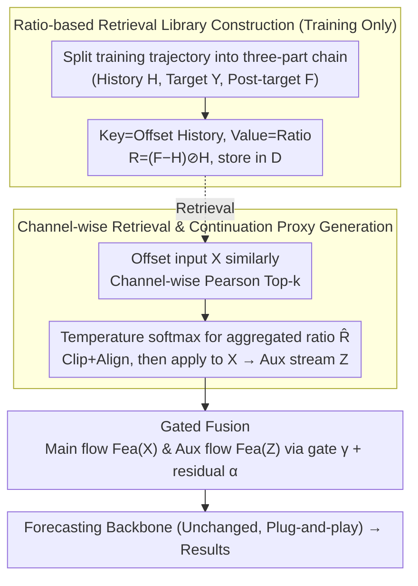

# Beyond Extrapolation: Knowledge Utilization Paradigm with Bidirectional Inspiration for Time Series Forecasting

**Conference**: ICML 2026  
**arXiv**: [2605.19249](https://arxiv.org/abs/2605.19249)  
**Code**: To be confirmed  
**Area**: Time Series Forecasting  
**Keywords**: Time Series Forecasting, Retrieval Augmentation, Post-target Continuation, Bidirectional Inspiration, Gated Fusion  

## TL;DR

The KUP-BI framework is proposed, which constructs a "post-target continuation" knowledge base from the training set. It retrieves continuation patterns of similar historical trajectories through ratio-based transformations to generate a continuation-style auxiliary stream. This stream is fused with backbone network features via a gating mechanism, consistently improving long-term forecasting performance across 6 datasets and 4 backbone architectures.

## Background & Motivation

**Background**: Time series forecasting is widely applied in scenarios such as energy, transportation, and finance. Mainstream deep learning methods (Transformer, MLP, CNN, etc.) all follow a **unidirectional inference paradigm**—mapping historical sequences to future target sequences.

**Limitations of Prior Work**: Unidirectional extrapolation is prone to error accumulation and trend drift in long-term forecasting. Some recent works (e.g., RAFT) attempt to retrieve **target segments** from the training set as auxiliary information, but target segments are highly aligned with supervision signals, making them prone to becoming **overly strong shortcuts** during training, which harms generalization.

**Key Challenge**: A three-segment chain structure of "History → Target → Post-target Continuation" naturally exists in training data, but existing methods only utilize the first two segments. Post-target continuation segments share the same dynamic system as the target segment but are temporally decoupled, providing **weaker but more transferable** evolutionary cues.

**Goal**: Given that post-target continuations cannot be observed during inference, this work aims to distill continuation-style structural priors from the training set and inject them into standard forecasting backbones.

**Key Insight**: By representing the change of post-target continuation relative to history as a ratio, similarity-based retrieval of ratio patterns from historical trajectories can be applied to the current input to generate an approximate post-target continuation proxy.

**Core Idea**: Construct a continuation-style auxiliary stream from the training set using retrieval and ratio transformations, and fuse it with the original input stream via a gating mechanism to achieve "bidirectional inspiration" forecasting.

## Method

### Overall Architecture

Since "continuation segments after the target" are unobservable during inference, KUP-BI distills these continuation patterns from the training set into an auxiliary stream fed into a standard backbone. The pipeline consists of three stages: (1) **Training-time only** offline construction of the retrieval library—splitting each training trajectory into "History → Target → Post-target" chains, encoding the change of the continuation segment relative to history as values using a ratio operator, and storing offset-corrected history segments as keys in library $\mathcal{D}$; (2) Given a new input, performing **channel-wise** retrieval of similar history after the same offset, aggregating their ratio transformations via temperature-controlled softmax, and applying this to the current input to generate the auxiliary signal $\mathbf{Z}$; (3) Extracting features from $\mathbf{Z}$ and the original input $\mathbf{X}$ separately, then fusing them through a lightweight gating mechanism before feeding them into an **unmodified** forecasting backbone. The entire process introduces no extra information beyond the training set, only providing a structural inductive bias of "how the future usually evolves."

### Key Designs

1.  **Post-target Continuation Perspective and Ratio-based Retrieval Library (Training Only)**:
    Existing retrieval-augmentation methods (like RAFT) only use the first two segments of the training chain—taking the **target segment** corresponding to "similar history" directly as an auxiliary signal. However, target segments are so highly aligned with supervision signals that they easily degenerate into shortcuts during training, weakening generalization. KUP-BI switches to the third segment, "post-target continuation": it shares the same dynamic system as the target window but is temporally decoupled, providing a weaker but more transferable evolutionary cue. Specifically, for each trajectory in the training set, the chain $(\mathbf{H}, \mathbf{Y}, \mathbf{F})$ (history, target, post-target) is extracted, and the change of the continuation relative to history is encoded using a ratio operator:
    $$\mathbf{R} = (\mathbf{F} - \mathbf{H}) \oslash (\mathbf{H} + \epsilon \, \text{sign}(\mathbf{H}))$$
    where $\oslash$ denotes element-wise division and $\epsilon$ is a numerical stability term. The ratio (rather than residual) characterizes the **relative change** (magnitude scaling, seasonal increase/decrease) of the continuation segment, offering scale invariance and better transferability across samples. Historical segments, after last-step offsetting to remove local level differences, serve as retrieval keys paired with the ratio matrix $\mathbf{R}$ in library $\mathcal{D} = \{(\tilde{\mathbf{H}}_j, \mathbf{R}_j)\}_{j=1}^N$. **The target segment $\mathbf{Y}$ is not stored and does not participate in retrieval**, avoiding dependency on label neighbors at the source.

2.  **Channel-wise Retrieval and Continuation Proxy Generation**:
    Once the library is built, how is it applied to the current input during inference? Given a new input $\mathbf{X}$, the same last-step offsetting is applied to obtain $\tilde{\mathbf{X}}$. Then, the Top-$k$ most similar historical keys are selected from the library using **channel-wise** Pearson correlation. Their paired ratio values undergo temperature-controlled softmax weighted aggregation to obtain a query-specific ratio transformation $\hat{\mathbf{R}}_q$. Applying $\hat{\mathbf{R}}_q$ back to $\mathbf{X}$ yields the "post-target continuation proxy"—the continuation-style auxiliary signal $\mathbf{Z}$. To suppress numerical explosions from extreme ratios, the aggregation is followed by quantile-$\tanh$ clipping and mean/std alignment across channels. Channel-wise (rather than whole-sequence) retrieval is used because different variables have distinct evolutionary patterns; matching by channel allows each variable to find its own most similar historical continuation.

3.  **Lightweight Gated Fusion**:
    Since the auxiliary stream is an "approximate proxy," forcing equal-weight mixing would contaminate the main stream; thus, the main stream must remain dominant. The main stream $\mathbf{X}_\text{main} = \text{Fea}(\mathbf{X})$ and auxiliary stream $\mathbf{X}_\text{aux} = \text{Fea}(\mathbf{Z})$ are first fused via a gating weight $\boldsymbol{\gamma}$:
    $$\widetilde{\mathbf{X}} = \boldsymbol{\gamma} \odot \mathbf{X}_\text{main} + (1 - \boldsymbol{\gamma}) \odot \mathbf{X}_\text{aux}$$
    Then, a residual weight $\alpha$ is used for convex combination $\mathbf{X}' = \alpha \mathbf{X}_\text{main} + (1 - \alpha) \widetilde{\mathbf{X}}$ to ensure the dominance of the main stream. The gate supports both static (learnable scalar $g$) and dynamic (lightweight MLP $\phi$) modes. Ablation studies confirm the necessity of "main stream dominance": $\alpha$ is the most critical hyperparameter; removing it causes the MSE on ILI to surge from 1.366 to 1.929.

4.  **Backbone-agnostic Plug-and-play Design**:
    The aforementioned library construction and ratio transformations are **non-parametric operations** fully decoupled from the backbone. The backbone remains unchanged and serves as the sole predictor. This offers two advantages: the same retrieval library can be reused across different architectures (Transformer / MLP / CNN / Hybrid), and it supports two modes—Plugin-only (frozen backbone, tuning only KUP-BI hyperparameters) and Joint-tune (lightweight joint tuning with the backbone). The former already yields stable gains, while the latter further maximizes performance.

## Key Experimental Results

| Dataset | Backbone | Original MSE | +KUP-BI (Plugin) MSE | +KUP-BI (Joint) MSE | Gain (Relative) |
| :--- | :--- | :--- | :--- | :--- | :--- |
| ETTh2 | DLinear | 0.469 | 0.453 | **0.394** | -16.0% |
| ILI | TimesNet | 2.438 | 2.328 | **2.114** | -13.3% |
| Exchange | DLinear | 0.369 | 0.362 | **0.313** | -15.2% |
| ETTh1 | xPatch | 0.444 | 0.431 | **0.409** | -7.9% |
| ETTm2 | PatchTST | 0.258 | 0.257 | **0.255** | -1.2% |
| ILI | xPatch | 1.383 | 1.366 | **1.365** | -1.3% |

| Ablation Study (xPatch, Avg. Length) | ETTh1 MSE | ETTm1 MSE | ILI MSE |
| :--- | :--- | :--- | :--- |
| KUP-BI (Full) | **0.431** | **0.352** | **1.366** |
| w/o $\alpha$ | 0.457 | 0.412 | 1.929 |
| Random Retrieval | 0.443 | 0.352 | 1.378 |
| Target Segment Direct | 0.466 | 0.352 | 1.382 |
| Concat Instead of Gate | 0.411 | 0.388 | 1.713 |

## Highlights & Insights

-   **Post-target vs. Target Segment**: Utilizing post-target continuation instead of the target segment as auxiliary information avoids over-reliance on label neighbors during training, providing a more transferable structural prior.
-   **Ratio vs. Residual**: The ratio-based representation is scale-invariant; on ETTh1, it achieves an MSE of 0.431 vs. 0.488 for the residual-based approach, showing a significant advantage.
-   **Weak Backbones Benefit More**: DLinear, with less modeling capacity, benefits most from the continuation auxiliary signals (16% reduction on ETTh2), while stronger backbones like xPatch see more modest but consistently stable improvements.
-   Recommended default hyperparameters: $\alpha = 0.75$, Top-$k = 1$, $\tau = 0.01$.

## Limitations & Future Work

-   The current retrieval strategy does not explicitly handle **phase shifts**, which may lead to imprecise retrieval matches.
-   To fully realize its potential, KUP-BI may require backbone-specific hyperparameter tuning rather than being completely plug-and-play, increasing training costs.
-   The ratio transformation is a heuristic design; future work could explore learnable encoders to replace non-parametric ratios.
-   It remains difficult to accurately capture extreme fluctuations such as sudden spikes.

## Related Work & Insights

-   **RAFT (Han et al., 2025)**: Retrieves target segments to aid prediction, but the alignment between target segments and supervision is too strong; KUP-BI avoids this by using post-target segments instead.
-   **RAF (Tire et al., 2024)**: A retrieval-augmented prompt for foundation time-series models, used only during inference.
-   **xPatch (Stitsyuk & Choi, 2025)**: A dual-stream MLP+CNN hybrid backbone, used as the strongest baseline in the experiments.

## Rating

-   Novelty: ⭐⭐⭐⭐ — The "post-target continuation" perspective is unique; incorporating the third segment of the training chain into modeling is a fresh entry point for the field.
-   Experimental Thoroughness: ⭐⭐⭐⭐ — Comprehensive analysis across 6 datasets × 4 backbones, including ablations, hyperparameter sensitivity, ratio vs. residual, and retrieval vs. prediction.
-   Writing Quality: ⭐⭐⭐⭐ — Clear logic, natural derivation of motivation, and consistent mathematical notation.
-   Value: ⭐⭐⭐⭐ — Provides a general-purpose, pluggable enhancement paradigm, though absolute gains on strong backbones are relatively limited.

<!-- RELATED:START -->

## Related Papers

- [\[ACL 2026\] STK-Adapter: Incorporating Evolving Graph and Event Chain for Temporal Knowledge Graph Extrapolation](../../ACL2026/time_series/stk-adapter_incorporating_evolving_graph_and_event_chain_for_temporal_knowledge_.md)
- [\[ICLR 2026\] From Samples to Scenarios: A New Paradigm for Probabilistic Forecasting](../../ICLR2026/time_series/from_samples_to_scenarios_a_new_paradigm_for_probabilistic_forecasting.md)
- [\[ICML 2026\] From Observations to States: Latent Time Series Forecasting](from_observations_to_states_latent_time_series_forecasting.md)
- [\[ICML 2026\] It's TIME: Towards the Next Generation of Time Series Forecasting Benchmarks](its_time_towards_the_next_generation_of_time_series_forecasting_benchmarks.md)
- [\[ICML 2026\] Semantics-Enhanced Retrieval-Augmented Time Series Forecasting](semantics-enhanced_retrieval-augmented_time_series_forecasting.md)

<!-- RELATED:END -->
