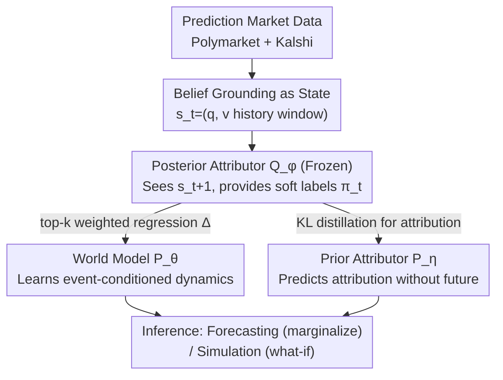

# Building Social World Models with Large Language Models

**Conference**: ICML 2026  
**arXiv**: [2606.11482](https://arxiv.org/abs/2606.11482)  
**Code**: https://github.com/ulab-uiuc/social-world-model  
**Area**: Time series forecasting / LLM / World models / Social computing  
**Keywords**: Social World Model, Belief Dynamics, Prediction Markets, Latent Event Attribution, Posterior Guidance

## TL;DR
This paper proposes the "Social World Model" (SWM), which treats collective beliefs as states and social events as exogenous actions. It utilizes an LLM as a transition engine to learn an event-conditioned state transition distribution $P_\theta(\mathbf s_{t+1}\mid\mathbf s_t,e_t)$. By utilizing a frozen "hindsight posterior attributor" to provide pseudo-labels, it bypasses the challenge of missing "event $\rightarrow$ belief change" annotations. SWM significantly outperforms time-series foundation models and strong baselines like GPT-5.5 on SWM-Bench, a benchmark constructed from real prediction markets (Kalshi/Polymarket).

## Background & Motivation
**Background**: Social beliefs (e.g., "Will AGI emerge in the next five years?" or "Who will be elected US President?") fluctuate drastically with major events. Understanding and predicting their evolution is critical for social event forecasting and business decision-making. A natural question arises: can LLMs, which possess both common sense and social intelligence, be used to model "event-driven belief dynamics"?

**Limitations of Prior Work**: The authors decompose the difficulties into three layers: (C1) **Quantifiability and Data Scarcity**—Social beliefs are semantically driven and difficult to measure structurally. High-fidelity temporal data is scarce, making even standard benchmarks hard to establish. (C2) **Semantic Complexity of Social Transitions**—Belief transitions are driven by psychological and cultural contexts and are non-symbolic; traditional statistical or symbolic models fail to capture these implicit transition rules. (C3) **Lack of Explicit Attribution Labels**—Even if belief changes are observed, identifying "which specific event caused it" is often implicit. Without "event $\rightarrow$ change" supervision, models cannot learn the underlying mechanism.

**Key Challenge**: Belief dynamics are essentially a transition process $P(\mathbf s_{t+1}\mid\mathbf s_t,e_t)$, but the "states" are hard to measure, "transition rules" are non-symbolic, and "driving events" lack annotations—these three issues are intertwined.

**Goal**: To break these three barriers—finding a quantifiable high-fidelity state for beliefs, an engine capable of housing common sense for semantic transitions, and a supervision signal for attribution that does not rely on human annotation.

**Key Insight**: The authors observe that **prediction markets** (Polymarket/Kalshi) are superior signals for collective opinion aggregation compared to surveys or social media. Participants bet real money, causing prices to approach the crowd's average belief regarding binary propositions. These markets naturally form around uncertain outcomes, possess scale, and are high-quality due to investment incentives. Thus, market price fluctuations can serve as a proxy for collective beliefs, turning belief measurement into an observable time-series problem.

**Core Idea**: Build social beliefs as "states" and social events as "exogenous actions." Use an LLM as a transition engine to learn a **shared** world model $P_\theta$. Leveraging the intuition that "hindsight makes attribution easier," a frozen LLM acts as a posterior attributor to generate pseudo-labels for training the forward model—decoupling social reasoning from dynamics modeling.

## Method

### Overall Architecture
SWM models the belief of a proposition $q$ (e.g., "Will OpenAI release GPT-5 in February 2025") as a state $\mathbf s_t=(q,(v_{t-k},\dots,v_t))$, where $v_t\in[0,1]$ is the market-implied "Yes" probability (daily closing price). A historical window is used instead of a single point to capture momentum and volatility information. Daily news events are modeled as exogenous actions $e_t^i$, with a "null event" $e_t^\emptyset$ representing no significant external shock. The model learns the event-conditioned transition distribution $\mathbf s_{t+1}\sim P_\theta(\cdot\mid\mathbf s_t,e_t^i)$.

The training pipeline consists of three coordinated LLM-based modules: the **Social World Model** $P_\theta$ (learning transition dynamics), the **Prior Attributor** $P_\eta$ (scoring candidate events without seeing the future during inference), and the **Posterior Attributor** $Q_\phi$ (a frozen module that sees the future $\mathbf s_{t+1}$ and provides soft labels indicating which event caused the change). The process follows three steps: first, collect observed state-event transition triplets $(\mathbf s_t,e_t^i,\mathbf s_{t+1})$; second, use the sharp distribution $\pi_t$ produced by the posterior $Q_\phi$ to supervise the forward components—$P_\theta$ learns "changes given attributed events" and $P_\eta$ learns "predicting attribution without seeing the future." Note that only $P_\eta$ and $P_\theta$ are updated during training; $Q_\phi$ remains frozen.

### Key Designs

**1. Grounding Social Beliefs as Prediction Market States: Using Price Fluctuations as High-Fidelity Proxies**

This addresses C1 (quantification/benchmarking). Instead of using surveys with sampling bias or social media with self-selection bias, the authors use prediction market prices. Rational participants express expectations through financial stakes, driving prices toward the average belief. Formally, a social belief is a proposition-price pair $b_t=(q,v_t)$, where $v_t\in[0,1]$ is the daily closing price. The state $\mathbf s_t=(q,(v_{t-k},\dots,v_t))$ is an ordered sequence with a look-back window $k$ ($k=16$ days in experiments). Using trajectories allows the model to perceive momentum. Based on this, the authors built **SWM-Bench**: covering 3k+ markets and over 12,000 belief prediction data points across politics, finance, and cryptocurrency. It is the first belief evolution benchmark derived from real prediction markets.

**2. LLM as Transition Engine + Latent Event Attribution: Learning Non-Symbolic Rules via a Shared World Model**

This addresses C2 (semantic complexity). Rather than simulating individual agents to recover macro dynamics, SWM **parameterizes macro belief dynamics directly**. Each market is treated as an instance of the state space $\mathcal S$, and a **shared** transition function $P_\theta$ is learned, leveraging the LLM's pre-training on human discourse as a "cognitive engine" for common-sense reasoning. Driving events are modeled as a categorical latent variable $Z_t\in\{0,1,\dots,m\}$ (indexing candidate events $\mathcal E_t$, with $Z_t=0$ for the null event). The predictive distribution marginalizes over $Z_t$:

$$P(\mathbf s_{t+1}\mid\mathbf s_t,\mathcal E_t)=\sum_{i=0}^m \underbrace{P_\theta(\mathbf s_{t+1}\mid\mathbf s_t,e_t^i)}_{\text{World Model}}\,\underbrace{P_\eta(Z_t{=}i\mid\mathbf s_t,\mathcal E_t)}_{\text{Prior Attributor}}.$$

A clever design is the **parameter-free null event branch**: $\mathbb{E}_{P_\theta}[\mathbf s_{t+1}\mid\mathbf s_t,e_t^\emptyset]$ is fixed to $\mathbf s_t$, representing a martingale/persistence prediction in efficient markets. Thus, $\theta$ only models dynamics for non-null events, while intervals attributed to the null event still provide supervision for $P_\eta$. This persistence baseline also serves as a reference for measuring event effects—$\mathbb{E}_{P_\theta}[\mathbf s_{t+1}\mid\mathbf s_t,e]-\mathbf s_t$ represents the "abnormal effect" of event $e$, echoing classic event studies.

**3. Posterior-Guided Training: Using Hindsight LLMs for Pseudo-Labels to Bypass Attribution Gaps**

This addresses C3 (missing labels). Directly maximizing marginal log-likelihood is infeasible because $Z_t$ is unobserved and many candidates in $\mathcal E_t$ are irrelevant. The key observation is that **hindsight attribution is much easier**—a frozen LLM (posterior attributor $Q_\phi$) that sees the actual outcome $\mathbf s_{t+1}$ can reliably judge which candidate's timing and content explain the change, producing a sharp distribution $\pi_t\coloneqq Q_\phi(\cdot\mid\mathbf s_t,\mathbf s_{t+1},\mathcal E_t)$. The forward model is trained to match these hindsight labels via **pseudo-labeling**: hindsight provides labels, foresight learns prediction. The objective is:

$$\mathcal L_{\theta,\eta}=\underbrace{-\,\mathbb E_{Z_t\sim\pi_t}\big[\log P_\theta(\mathbf s_{t+1}\mid\mathbf s_t,e_t^{Z_t})\big]}_{\mathcal L_{\text{wm}}}+\underbrace{D_{\mathrm{KL}}\big(\pi_t\,\|\,P_\eta\big)}_{\mathcal L_{\text{attr}}}.$$

Since $P_\theta$ and $P_\eta$ have disjoint parameters, the two terms are **decoupled and optimized independently**. The overall expression can be viewed as the negative ELBO for $\log P_{\theta,\eta}(\mathbf s_{t+1}\mid\mathbf s_t,\mathcal E_t)$, but unlike standard VAEs, the variational distribution is frozen while the prior is learned. The authors characterize this as "posterior-guided distillation" rather than variational inference, as success depends on $Q_\phi$'s zero-shot calibration.

### Loss & Training
**World Model Term**: Since belief change $\Delta_t=\mathbf s_{t+1}-\mathbf s_t$ is continuous, a simple homoscedastic Gaussian likelihood $\Delta_t\sim\mathcal N(\mu_\theta(\mathbf s_t,e),\sigma^2 I)$ is used. $\mu_\theta$ is a regression head on the LLM backbone. With fixed variance, the negative log-likelihood reduces to a squared error weighted by posterior probabilities: $\mathcal L_{\text{wm}}=\sum_{i\in\mathcal I_t}\bar\pi_t^i\|\Delta_t-\mu_\theta(\mathbf s_t,e_t^i)\|^2$, with $\mu_\theta(\cdot,e_t^\emptyset)\equiv 0$. Due to the concentration of $\pi_t$, calculations are restricted to its **top-$k$ support**. **Attributor Term**: The number of candidates $m$ varies over time, so each candidate independently generates a salience logit, followed by a softmax including a learnable null logit. $\mathcal L_{\text{attr}}$ is the cross-entropy against posterior labels. **Dual Use**: **Forecasting** marginalizes over the prior $P_\eta$'s uncertainty, simplified as a persistence baseline plus attribution-weighted expected shift: $\widehat{\mathbf s}_{t+1}=\mathbf s_t+\sum_{i\ge1}P_\eta(Z_t{=}i)\mu_\theta(\mathbf s_t,e_t^i)$. **Simulation** bypasses the attributor to take the expectation for a hypothetical event $e_h$, performing counterfactual what-if analysis.

## Key Experimental Results

### Main Results
Evaluated on SWM-Bench using MASE, MAE, 3-way Directional Accuracy (DA), and Pearson Correlation (Corr). Testing sets include the full set (all) and the "attributed subset" (attr). SWM uses a Qwen3-8B backbone and is compared against time-series models, zero-shot prompted LLMs, and fine-tuned LLMs. SWM (posterior) achieves SOTA on Kalshi, reporting approximately +4% DA over GPT-5.5 and significantly leading in Corr. Performance on Polymarket is also competitive.

| Method | Kalshi MASE↓ (all/attr) | Kalshi MAE↓ (all/attr) | Kalshi Corr↑ (all/attr) |
|------|------|------|------|
| TimeMixer (TS) | 1.079 / 1.135 | 0.065 / 0.119 | −0.056 / −0.224 |
| PatchTST (TS) | 1.174 / 1.232 | 0.071 / 0.129 | −0.035 / −0.194 |
| GPT-5.5 (Prompt) | 0.997 / 1.004 | 0.060 / 0.105 | 0.242 / 0.250 |
| Qwen3.5-397B (Prompt) | 1.142 / 1.194 | 0.069 / 0.125 | 0.108 / 0.181 |
| SWM (prior) | 1.013 / 0.800 | 0.061 / 0.084 | 0.167 / 0.380 |
| **SWM (posterior)** | **0.915 / 0.738** | **0.055 / 0.077** | **0.367 / 0.525** |

On Polymarket, SWM (posterior) ranks best or tied-for-best with MASE 0.980/0.892 and MAE 0.042/0.068. Its Corr (0.221/0.439) is comparable to GPT-5.5 (0.264/0.482).

### Ablation Study

| Configuration | Variable | Trend / Description |
|------|------|------|
| Attributor Scale | Qwen3-0.6B / 4B / 8B | Larger attributors improve attribution quality and overall performance. |
| World Model Scale | Qwen3-0.6B / 4B / 8B | Larger world models improve performance (benefit from stronger social reasoning). |
| Temporal Window $w$ | 1 / 2 / 4 / 8 / 16 days | Longer windows provide better modeling of momentum and volatility. |
| Posterior vs. Prior | SWM(post) vs SWM(prior) | Posterior guidance consistently outperforms prior across all platforms. |
| Event Set Size $N$ | MASE vs $N$ | Posterior selection saturates quickly, supporting the "sparse attribution" hypothesis. |

### Key Findings
- **Posterior > Prior** is the core empirical finding: SWM(posterior) consistently outperforms SWM(prior) in MASE/MAE/Corr, proving that hindsight attribution provides cleaner training signals for forward models.
- The posterior distribution $\pi_t$ is highly concentrated (hindsight from 397B is sharper, with mass almost exclusively on top-1 events). This justifies the top-$k$ truncation and supports the first-order approximation (A1) that a single event dominates a major fluctuation.
- SWM is **SOTA on Kalshi and competitive on Polymarket**. The authors attribute this to different market structures, suggesting sensitivity to market characteristics.
- Pure time-series baselines (TimesNet, iTransformer, etc.) generally show Corr near zero or negative, indicating that "looking only at price history without news" fails to capture event-driven jumps.

## Highlights & Insights
- **Posterior-guided distillation** operationalizes the intuition that "hindsight is 20/20." It converts unlabeled causal attribution into a process where a frozen LLM acts as an expert judge to generate pseudo-labels for a forward model.
- The world model paradigm is successfully **migrated to the social belief domain**: state = belief trajectory, action = exogenous event, null event = martingale baseline. The framework is clean, interpretable, and supports both forecasting and what-if simulation.
- The parameter-free null event branch acts as both a reasonable baseline for efficient markets and a source of supervision for "no significant event" intervals for the attributor.
- Using prediction market prices as a collective belief proxy provides a data perspective that can be migrated to broader social computing tasks to avoid the biases of surveys and social media.

## Limitations & Future Work
- The method rests on two simplifying assumptions: (A1) **First-order single event approximation** (one change is attributed to one event); (A2) **Conditional exogeneity** (candidate events are exogenous given the state). The authors acknowledge that exogeneity is weaker for "market reflexive events," where SWM behaves as a predictive model rather than a causal identifier. If A1 fails (multiple drivers), single-event effects may be overestimated.
- Simulation (what-if) for **atypical hypothetical events** $e_h$ requires out-of-distribution extrapolation. $\mathcal L_{\text{wm}}$ only supervises events deemed credible during training.
- The theoretical bound remains loose; the model's success relies heavily on the zero-shot calibration of $Q_\phi$. A poorly calibrated posterior LLM could lead to degradation.
- Evaluation is limited to Kalshi and Polymarket; generalization to social belief domains without market price proxies (e.g., pure public opinion) remains unverified.

## Related Work & Insights
- **vs. Time Series Foundation Models**: These rely on numerical trends and lack event conditioning, failing to capture event-driven shocks. SWM explicitly models discrete social events as transition drivers, leading significantly in event-dense belief forecasting.
- **vs. Agent-based Social Simulation**: Conventional social world models use LLMs to simulate individual agents to recover macro patterns, which is computationally expensive and fragile. SWM parameterizes macro dynamics directly, focusing on macro forecasting and avoiding micro-simulation costs.
- **vs. Prompted LLMs**: Zero-shot prompting does not update parameters and keeps attribution implicit. SWM learns attribution and dynamics explicitly through posterior guidance, outperforming the much larger GPT-5.5 with a smaller Qwen3-8B backbone, demonstrating the value of the training paradigm over pure scale.

## Rating
- Novelty: ⭐⭐⭐⭐⭐ Migrating world model paradigm to social beliefs + posterior guidance for attribution is highly innovative.
- Experimental Thoroughness: ⭐⭐⭐⭐ Covers three classes of baselines and multi-dimensional ablations, though limited to two market platforms.
- Writing Quality: ⭐⭐⭐⭐⭐ Clear mapping between the three challenges and three solutions; honest about ELBO loose bounds.
- Value: ⭐⭐⭐⭐ Provides a new benchmark and interpretable belief prediction pipeline; broadly applicable but dependent on market proxies.

<!-- RELATED:START -->

## Related Papers

- [\[ICLR 2026\] Semantic-Enhanced Time-Series Forecasting via Large Language Models](../../ICLR2026/time_series/semantic-enhanced_time-series_forecasting_via_large_language_models.md)
- [\[ICLR 2026\] TimeOmni-1: Incentivizing Complex Reasoning with Time Series in Large Language Models](../../ICLR2026/time_series/timeomni-1_incentivizing_complex_reasoning_with_time_series_in_large_language_mo.md)
- [\[ICML 2026\] FactoryNet: A Large-Scale Dataset toward Industrial Time-Series Foundation Models](factorynet_a_large-scale_dataset_toward_industrial_time-series_foundation_models.md)
- [\[ICLR 2026\] Multi-Scale Hypergraph Meets LLMs: Aligning Large Language Models for Time Series Analysis](../../ICLR2026/time_series/multi-scale_hypergraph_meets_llms_aligning_large_language_models_for_time_series.md)
- [\[ICLR 2026\] ECHO: Toward Contextual Seq2Seq Paradigms in Large EEG Models](../../ICLR2026/time_series/echo_toward_contextual_seq2seq_paradigms_in_large_eeg_models.md)

<!-- RELATED:END -->
