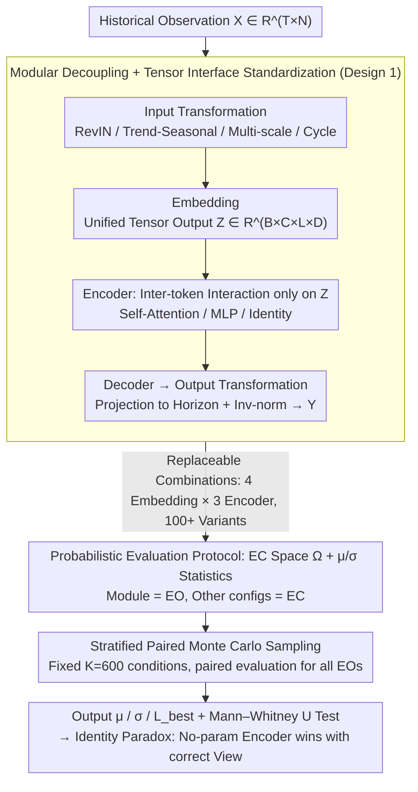

# CombinationTS: A Modular Framework for Understanding Time-Series Forecasting Models

**Conference**: ICML 2026  
**arXiv**: [2605.01231](https://arxiv.org/abs/2605.01231)  
**Code**: https://github.com/BenchCouncil/CombinationTS  
**Area**: Time-Series Forecasting  
**Keywords**: Modular Attribution, Probabilistic Evaluation, Identity Paradox, Data Views, Evaluatology

## TL;DR
CombinationTS decouples time-series forecasting models into five orthogonal modules: Input Transformation, Embedding, Encoder, Decoder, and Output Transformation. By performing paired Monte Carlo sampling on a shared "Evaluation Condition Space," it replaces fragile single-point MSE with marginal performance $\mu$ and stability $\sigma$. The primary conclusion is that with a well-designed data view (Embedding), a parameter-free Identity Encoder can match or even outperform complex Transformers, suggesting that "SOTA gains" in time-series forecasting largely stem from data representation rather than modeling capacity.

## Background & Motivation

**Background**: Long-term time-series forecasting has rapidly shifted from early sparse-attention Transformers (e.g., Informer, Autoformer) to architectures centered on "data view reshaping" (e.g., PatchTST, iTransformer, TimeMixer, CycleNet). While papers grow increasingly complex, leadboard MSE values continue to decline.

**Limitations of Prior Work**: DLinear previously challenged the Transformer family with a single linear layer. Subsequent audits (Tan et al. 2024, Brigato et al. 2025) further discovered that the so-called SOTA gap is often within the same magnitude as seed noise and hyperparameter misalignment—changing a seed or batch size can overturn the rankings. Existing benchmarks (TSLib, BasicTS, TFB, TAB) unify implementation interfaces but do not address whether the "win" belongs to the model or the evaluation setting.

**Key Challenge**: The authors attribute this predicament to two methodological flaws. The first is the **Attribution Gap**: models are treated as indivisible black boxes where contributions from the Embedding and Encoder are conflated (e.g., whether PatchTST's gain comes from patch tokenization or the Transformer). The second is the **Benchmarking Crisis**: single-point estimation falls into the "Fairness Trap" (using suboptimal hyperparameters for all models) and the "Best Trap" (cherry-picking single best results), being neither fair nor robust.

**Goal**: The authors address three sub-problems: (1) how to decompose architectures into independently replaceable orthogonal modules; (2) how to upgrade module evaluation from single-point MSE to statistics robust to hyperparameter noise; (3) whether this auditing tool can replicate or overturn current perceptions of Transformers, frequency domain modeling, and multi-scale decomposition.

**Key Insight**: Borrowing from the perspective of Evaluatology (Zhan et al. 2025), evaluation is viewed as a signal-noise separation problem. The Evaluated Object (EO) is the component to be attributed, while Evaluation Conditions (EC) include the other four modules, hyperparameters, datasets, look-back length, and horizon, all treated as a stochastic process. A module is only truly superior if it wins across a large set of ECs.

**Core Idea**: Use "Modular Decoupling + Paired EC Monte Carlo" to redefine architecture problems as statistical attribution problems—evaluating $(\mu(\theta), \sigma(\theta))$ instead of $\mathrm{MSE}(\theta, c^\ast)$.

## Method

### Overall Architecture

CombinationTS redefines any time-series forecasting model $f$ as a five-stage composite:

$$f = \mathcal{T}^{-1}_{out}\circ \mathcal{D}\circ \varPhi\circ \mathcal{E}\circ \mathcal{T}_{in}$$

Input consists of historical observations $\mathbf{X}\in\mathbb{R}^{T\times N}$, and output is the prediction $\mathbf{Y}\in\mathbb{R}^{P\times N}$. The five stages are: Input Transformation $\mathcal{T}_{in}$ (injecting structural priors like RevIN, Trend-Seasonal decomposition, multi-scale downsampling, or Cycle embedding), Embedding $\mathcal{E}$ (deciding the tokenization view and mapping to a unified tensor interface $\mathbb{R}^{B\times C\times L\times D}$), Encoder $\varPhi$ (performing inter-token interaction on latent tensors, such as Self-Attention, MLP, or Identity), Decoder $\mathcal{D}$ (projecting to the forecast horizon), and Output Transformation $\mathcal{T}^{-1}_{out}$ (inverse normalization, adding back trends, etc.).

The key constraint is that the Embedding is solely responsible for "View + Intra-token encoding," while cross-token dependency modeling is strictly delegated to the Encoder. This interface constraint allows the contributions of Embedding versus Encoder to be decoupled and evaluated for the first time.

With this unified interface, each module can be replaced and combined freely. The paper forms a search space of 100+ architecture variants. Paired EC Monte Carlo sampling is then used across 6 datasets and 4 horizons to calculate $(\mu, \sigma)$ for each module.

### Key Designs

**1. Modular Decoupling + Tensor Interface Standardization: Making any component plug-and-play**

Previously, it was impossible to distinguish whether PatchTST's success came from the patch view or the Transformer reasoner. CombinationTS solves this by imposing a strict interface: the Embedding output must be a four-dimensional tensor $\mathcal{Z}\in\mathbb{R}^{B\times C\times L\times D}$ (batch, variate, time token, hidden dim). Specifically, Point-wise projects each step ($L=T$), Patch-wise projects after patching ($L=\lceil T/S\rceil$), Variate-wise compresses the history into 1 token ($L=1$), Identity performs no projection, and Time-as-Feature reshapes $T$ into the feature dimension (zero parameters). The Encoder is strictly restricted to inter-token operations on $\mathcal{Z}$. By pairing a Patch-wise Embedding with an Identity Encoder, one can directly measure the independent contribution of the view—a methodological prerequisite for the Identity Paradox.

**2. Probabilistic Evaluation Protocol (EC Space + $\mu/\sigma$ Statistics): Replacing single-point MSE with a hyperparameter sea**

Single-point MSE reporting suffers from the "Fairness Trap" and the "Best Trap." Following Evaluatology, evaluation is treated as signal-noise separation. The Evaluated Object (EO) is the module for attribution, while all other configurations—remaining modules, hyperparameters, datasets, look-back, and horizon—constitute the Evaluation Conditions (EC). An Evaluation Condition Space $\Omega$ is defined, where each $\mathbf{c}\in\Omega$ is a configuration tuple. Module performance is treated as a random variable $L(\theta, \mathbf{c})$, and the goal is to estimate marginal performance $\mu(\theta)=\mathbb{E}_{\mathbf{c}\sim\Omega}[L(\theta,\mathbf{c})]$, stability $\sigma(\theta)=\sqrt{\mathrm{Var}_{\mathbf{c}\sim\Omega}[L(\theta,\mathbf{c})]}$ and $L_{best}=\min_k L(\theta,\mathbf{c}_k)$. While $\mu$ represents average performance and $\sigma$ represents hyperparameter sensitivity, $L_{best}$ serves to highlight whether a SOTA claim represents a general capability or an outlier.

**3. Stratified Paired Monte Carlo Sampling: Reducing costs and eliminating confounding factors**

If Identity and Transformer are evaluated on different ECs, the variance often stems from different EC distributions—a core flaw in current leaderboards. CombinationTS samples a fixed, stratified set of conditions $\{\mathbf{c}_k\}_{k=1}^K$ ($K=600$) from $\Omega$ and forces all EOs to run on this identical set. This paired design reduces the variance of the difference between modules, making it easier to achieve statistical significance (verified using a one-tailed Mann–Whitney U test at $\alpha=0.05$). Stratification ensures uniform coverage across datasets and horizons, while Monte Carlo sampling balances bias and variance under a controlled budget.

### Loss & Training

MSE is used as the loss function $L$. Main experiments use a fixed seed and dropout (0.1) to attribute observable variance to architecture and hyperparameter choices. Appendix A.7 provides multi-seed validation. Training uses batch=32, 30 epochs, and early-stopping patience=3. The EC space expands across experiments: Exp.1 uses $D\in\{64,128,256,512\}$, $\eta\in\{10^{-3},10^{-4}\}$, and encoder layers $\in\{1,2,3\}$. Exp.2 tests if input priors allow for "thinner" models by lowering $D$ to 16 and expanding $\eta$. Exp.3 shares the same EC space as Exp.1 for paired comparison.

## Key Experimental Results

Datasets: Weather, Electricity, and ETTh1/h2/m1/m2 (6 standard benchmarks); horizon $\in\{96,192,336,720\}$.

### Main Results

Exp.1 Deconstructing Backbones: 4 Embeddings × 3 Encoders, each EO evaluated on $K=600$ paired ECs.

**Embedding Level (Table 2 excerpt, $\mu/\sigma$, lower is better)**:

| Dataset | Horizon | Point-wise | Patch-wise | Variate-wise | Time→Dim |
|--------|---------|------------|------------|--------------|----------|
| ETTh1 | 96 | 0.3898 / 0.0143 | **0.3772 / 0.0058** | 0.3834 / 0.0080 | 0.3937 / 0.0156 |
| ETTh1 | 192 | 0.4324 / 0.0166 | **0.4240 / 0.0133** | 0.4247 / 0.0128 | 0.4343 / 0.0161 |
| ETTm2 | 720 | 0.3981 / 0.0216 | **0.3813 / 0.0140** | 0.3863 / 0.0170 | 0.3892 / 0.0174 |
| Electricity | 96 | 0.1609 / 0.0228 | **0.1512 / 0.0176** | 0.1527 / 0.0135 | 0.1573 / 0.0190 |

Structured views (Patch-wise / Variate-wise) consistently outperform Point-wise. The zero-parameter Time→Dim reshape also matches learnable projections in many cases, suggesting the structure itself carries the signal.

**Encoder Level (Table 3 excerpt)**:

| Dataset | Horizon | MLP | Transformer | Identity |
|--------|---------|-----|-------------|----------|
| ETTh1 | 96 | 0.4371 / 0.0816 | 0.4518 / 0.0930 | **0.3907 / 0.0231** |
| ETTh1 | 720 | 0.5538 / 0.1039 | 0.5679 / 0.1014 | **0.4722 / 0.0406** |
| ETTh1 | avg | 0.4960 / 0.0938 | 0.5095 / 0.1004 | **0.4392 / 0.0424** |

The parameter-free Identity Encoder outperforms both MLP and Transformer in $\mu$ and $\sigma$—the **Identity Paradox**. Statistically, the Mann–Whitney U test gives $p<0.0001$ for Identity vs. Transformer and $p=0.0115$ for Identity vs. MLP, significant across all datasets.

Exp.2 Auditing Input Transformation (Table 4 excerpts):

| Dataset | Baseline (RevIN) | Cycle | MultiScale | TrendSeasonal |
|--------|------------------|-------|------------|---------------|
| ETTh1 | 0.3975 / 0.0315 | **0.3891 / 0.0283** | 0.3921 / 0.0183 | 0.3947 / 0.0248 |
| ETTh2 | 0.3013 / 0.0116 | **0.2969 / 0.0115** | 0.3071 / 0.0343 | 0.3024 / 0.0135 |
| Electricity | 0.2061 / 0.0238 | 0.1999 / 0.0225 | **0.1952 / 0.0202** | 0.1976 / 0.0197 |

Cycle (learnable periodic embedding) is the most robust across $\mu$ and $\sigma$. Naive TrendSeasonal and MultiScale decomposition often fail to beat the RevIN baseline unless paired with deep cross-branch interaction like TimeMixer.

Exp.3 Frequency vs. Time Domain (Table 5 ETTh1):

| Dataset | Horizon | iTransformer | SimpleTM (Spectral) | Variate + Identity |
|--------|---------|--------------|----------------------|--------------------|
| ETTh1 | 96 | 0.3934 / 0.0133 | 0.3812 / 0.0076 | **0.3805 / 0.0098** |
| ETTh1 | 720 | 0.4711 / 0.0155 | 0.4646 / 0.0151 | **0.4520 / 0.0191** |
| ETTh1 | avg | 0.4401 / 0.0335 | 0.4324 / 0.0354 | **0.4271 / 0.0355** |

The spectral model SimpleTM outperforms the time-domain iTransformer in $\mu$, but $\sigma$ remains similar. Under the same Variate-wise Embedding, the **Identity Encoder still wins**, implying that frequency domain advantages come from representation, not robustness.

### Ablation Study

| Config | Key Metric | Description |
|------|---------|------|
| Patch-wise + Identity Encoder | ETTh1 96 $\mu/\sigma$ ≈ 0.38 / Ultra-low | Structured view + no-param encoder creates a strong baseline. |
| Patch-wise + Transformer | Same as above but $\sigma$ increases several-fold | Encoder primarily introduces hyperparameter noise. |
| Point-wise + Transformer | $\sigma$ significantly higher than others | Self-attention relies heavily on semantically sound tokens. |
| Cycle Prior + Variate-wise | ETTh2 $\mu/\sigma$ = 0.2969 / 0.0115 | Periodic priors are the most robust. |
| Naive MultiScale (No Interaction) | Fails to beat RevIN baseline | "Divide and conquer" without interaction loses information. |
| Multi-seed Validation (Appx A.7) | Conclusion remains unchanged | Rule out seed sensitivity. |

### Key Findings

- **Identity Paradox**: Given a well-designed Embedding, the no-param Identity Encoder outperforms Transformers and MLPs in both $\mu$ and $\sigma$. Most complex Encoders act as over-parameterized noise sources rather than feature extractors on standard benchmarks.
- **Transformer Dependency on Views**: Transformers are only stable under structured views (Patch/Variate); under "raw step" Point-wise views, $\sigma$ expands drastically—self-attention is not a universal feature extractor here.
- **Cycle Priors vs. Decomposition**: The Cycle prior improves both $\mu$ and $\sigma$ globally; TrendSeasonal/MultiScale often fail alone as TimeMixer's success relies on deep cross-component mixing.
- **Frequency Domain Benefits**: Spectral models improve representation ($\mu$) rather than optimization robustness ($\sigma$).
- **Statistical Significance**: The Identity Paradox holds even on non-stationary data (Exchange-Rate) and multi-seed tests, ruling out "lucky seed" or "periodic data" explanations.

## Highlights & Insights

- **Architectural Problems as Statistical Attribution**: Using EO/EC cleanly separates signal from noise, a methodology that can be extended to CV/NLP auditing (e.g., scanning LLaMA components).
- **The Value of Tensor Interface Constraints**: Enforcing an $\mathbb{R}^{B\times C\times L\times D}$ interface for Embeddings prevents them from "secretly" performing cross-token mixing, which is essential for accurate attribution to the Identity Encoder.
- **Paired Sampling Variance Control**: Paired EC designs significantly reduce $\mathrm{Var}(L_A - L_B)$, allowing for stronger statistical significance with a fixed budget ($K=600$).
- **Time-as-Feature Reshape Efficiency**: Simple reshaping can approach the performance of learnable projections, highlighting the redundancy in current "learnable" components.
- **"Burden of Proof" Manifesto**: The authors propose that future architectural complexity must prove superiority over the Identity baseline in $(\mu, \sigma)$ space, putting pressure on the SOTA culture.

## Limitations & Future Work

- Evaluation is limited to MSE; performance in MAE, CRPS, or probabilistic forecasting remains to be verified.
- The EC space is based on a predefined discrete grid; it does not cover "wilder" hyperparameters like warmup, weight decay, or activation functions.
- Datasets are primarily periodic/stationary; further systematical coverage of long-tail or missing-data scenarios (e.g., healthcare) is needed beyond the single Exchange-Rate validation.
- Conclusions are drawn for small-to-medium models ($D\leq 512$, layers $\leq 3$); whether the Identity Paradox holds for Foundation Models (e.g., Chronos, Moirai) is unknown.
- The "Encoder as noise" conclusion depends on a good Embedding; if the token count is extremely low (Variate-wise, $L=1$), the Encoder has nothing to do, potentially overestimating Embedding contributions.

## Related Work & Insights

- **vs. DLinear (Zeng et al. 2023)**: DLinear used a linear layer to challenge Transformers; CombinationTS generalizes this to the module level, showing that Encoders can be completely removed given the right Embedding.
- **vs. PatchTST / iTransformer / TimeMixer**: Instead of treating these as "whole models," this work treats their core innovations as replaceable modules, finding these designs are the true sources of gain.
- **vs. TFB / TAB / BasicTS (Wang et al. 2024c, Qiu et al. 2024/2025a)**: While these unify implementations, CombinationTS updates the evaluation protocol itself by adding a "Paired Monte Carlo" plugin.
- **vs. Evaluatology (Zhan et al. 2025)**: This work serves as the first complete case study for Evaluatology in the time-series domain, implementing EO/EC concepts as a functional engineering framework.

## Rating
- Novelty: ⭐⭐⭐⭐ A new evaluation paradigm and the counter-intuitive Identity Paradox backed by statistical tests.
- Experimental Thoroughness: ⭐⭐⭐⭐⭐ 6 datasets × 4 horizons × $K=600$ paired ECs, 100+ combinations, and non-stationary/multi-seed validation.
- Writing Quality: ⭐⭐⭐⭐ Clear Research Questions; the "two methodological flaws" narrative is clean, though appendix citations are dense.
- Value: ⭐⭐⭐⭐⭐ Directly challenges SOTA culture and provides an open-source framework, impacting both time-series research and general benchmarking practices.

<!-- RELATED:START -->

## Related Papers

- [\[ICML 2026\] TimeOmni-VL: Unified Models for Time Series Understanding and Generation](timeomni-vl_unified_models_for_time_series_understanding_and_generation.md)
- [\[ICML 2026\] Parametric Prior Mapping Framework for Non-stationary Probabilistic Time Series Forecasting](parametric_prior_mapping_framework_for_non-stationary_probabilistic_time_series_.md)
- [\[ICLR 2026\] SciTS: Scientific Time Series Understanding and Generation with LLMs](../../ICLR2026/time_series/scits_scientific_time_series_understanding_and_generation_with_llms.md)
- [\[ICML 2026\] Interpretability in Deep Time Series Models Demands Semantic Alignment](interpretability_in_deep_time_series_models_demands_semantic_alignment.md)
- [\[ICML 2026\] Dynamic-TMoE: A Drift-Aware Dynamic Mixture of Experts Framework for Non-Stationary Time Series](dynamic_tmoe_a_drift-aware_dynamic_mixture_of_experts_framework_for_non-stationa.md)

<!-- RELATED:END -->
