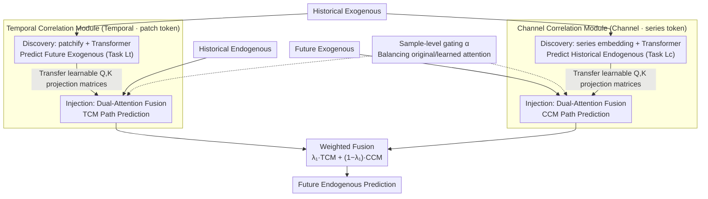

# DAG: A Dual Correlation Network for Time Series Forecasting with Exogenous Variables

**Conference**: ICML 2026  
**arXiv**: [2509.14933](https://arxiv.org/abs/2509.14933)  
**Code**: https://github.com/decisionintelligence/DAG  
**Area**: Time Series Forecasting / Exogenous Variable Modeling / Attention Mechanisms  
**Keywords**: Covariate Forecasting, Future Exogenous Variables, Temporal Correlation, Channel Correlation, Attention Injection

## TL;DR
For Time Series Forecasting with known future covariates (TSF-X), DAG designs a dual-pathway network: one pathway captures "historical exogenous → future exogenous" attention patterns along the temporal dimension and injects them into "historical endogenous → future endogenous" predictions, while the other captures "historical exogenous → historical endogenous" patterns along the channel dimension and injects them into "future exogenous → future endogenous" predictions. DAG achieves the best MSE on 10/12 public/newly released TSF-X datasets, significantly outperforming TimeXer, TFT, TiDE, CrossLinear, and PatchTST.

## Background & Motivation
**Background**: Time series forecasting has evolved from early ARIMA/ETS to recent Transformer (Informer, Autoformer, PatchTST) and MLP (DLinear, CycleNet, DUET) series, most of which only use endogenous variables (historical values of the target variable itself). However, in many practical scenarios, covariates (weather, holidays, grid load) are known both for the past and for a period in the future (e.g., weather forecasts, scheduled promotion calendars); such "known future covariates" are one of the most powerful levers for forecasting accuracy.

**Limitations of Prior Work**: (1) Models like PatchTST/DUET completely ignore covariates; (2) TimeXer/CrossLinear only use historical covariates, wasting known future information; (3) TFT/TiDE utilize both historical and future covariates but rely on simple concatenation or cross-attention, failing to model the two types of correlation structures between covariates and targets — "temporal" and "channel" directions — which often leads to spurious correlations; (4) Most TSF-X datasets are small and lack standardized covariate descriptions, making the benchmark itself insufficient.

**Key Challenge**: "Known future covariates" can inject two types of information: in the temporal dimension, the "historical-to-future exogenous evolution pattern" $\approx$ "historical-to-future endogenous evolution pattern" (Granger causality intuition); in the channel dimension, the "manner in which covariates affect endogenous variables" remains stable between the past and the future (Pearson correlation intuition). Existing methods only treat them as "features" without explicitly transferring these two types of relational structures.

**Goal**: (1) Design a predictor that simultaneously utilizes historical and future covariates; (2) Explicitly model temporal and channel correlation paths and "inject" them into the main prediction path; (3) Provide a higher-quality TSF-X benchmark.

**Key Insight**: The influence of exogenous information on endogenous prediction is decomposed into two symmetrically structured sub-tasks — Temporal: $X^{exo} \to Y^{exo}$ attention weights can be borrowed for $X^{endo} \to Y^{endo}$; Channel: $X^{exo} \to X^{endo}$ attention weights can be borrowed for $Y^{exo} \to Y^{endo}$.

**Core Idea**: The correlations (exogenous $\to$ endogenous) are extracted in the form of "learnable $Q, K$ projection matrices," which are then fused with original attention via gating. This "injects" correlations into the main prediction path, allowing the Transformer to carry additional structured signals in both directions simultaneously.

## Method

### Overall Architecture
Given $X^{endo} \in \mathbb{R}^{N \times T}$, $X^{exo} \in \mathbb{R}^{D \times T}$, and $Y^{exo} \in \mathbb{R}^{D \times F}$, the goal is to predict $\hat Y^{endo} \in \mathbb{R}^{N \times F}$. DAG consists of two symmetric modules:
- **Temporal Correlation Module (TCM)**: A pair of sub-modules $\mathcal{F}_{\theta_1}, \mathcal{G}_{\theta_2}$ — Discovery uses patchify + Transformer to predict $\hat Y^{exo}$ (side task) while outputting attention matrices $W_q', W_k'$; Injection uses the same patchify to process $X^{endo}$ and fuses borrowed $W_q', W_k'$ with its own $W_q, W_k, W_v$ to predict $\ddot Y^{endo}$.
- **Channel Correlation Module (CCM)**: Mirror design where Discovery uses series-wise embedding + Transformer to predict $\hat X^{endo}$ (side task, inferring historical endogenous from historical exogenous), outputting $\mathcal{W}_{q'}, \mathcal{W}_{k'}$; Injection injects these into the $Y^{exo}$ Transformer to predict $\dot Y^{endo}$.
- The final prediction is $\hat Y^{endo} = \lambda_1 \cdot \ddot Y^{endo} + (1-\lambda_1) \cdot \dot Y^{endo}$. The total loss $L_{total} = L_f + \lambda_2 (L_t + L_c)$ optimizes the main prediction and the two discovery side tasks simultaneously.

### Key Designs

**1. Temporal Correlation Module (TCM): Transferring $W_q', W_k'$ Projection Matrices Across Tasks**

The temporal path aims to strengthen the "historical endogenous → future endogenous" step, which lacks extra structural signals. The key insight is that the evolution pattern of "historical exogenous → future exogenous" (Granger causality intuition) is structurally similar to "historical endogenous → future endogenous"; thus, the attention learned by the former can be lent to the latter. The Discovery sub-module patchifies $X^{exo}$ into $M$ tokens and uses a standard Transformer to compute $S_i' = \text{softmax}(Q K^\top / \sqrt d) V$ to predict $\hat Y^{exo}$ (side task). Importantly, it **does not transfer attention scores directly, but only extracts the learnable $W_q', W_k'$ matrices**. The Injection sub-module patchifies $X^{endo}$ identically, computes $(Q, K, V)$ with its own parameters, and computes $(Q', K')$ with the borrowed $W_q', W_k'$. The attention is fused as $S_{\text{fused}} = \alpha \cdot \sigma(QK^\top/\sqrt d) + (1-\alpha)\, \sigma(Q' K'^\top / \sqrt d)$. Transferring learnable parameters instead of sample-specific scores provides a task-level inductive bias that is more robust — ablation studies show this choice consistently improves performance by 1–2%.

**2. Channel Correlation Module (CCM): Transferring Cross-Channel Correlations**

The channel path mirrors TCM, strengthening the "future exogenous → future endogenous" step. The insight is that how covariates affect endogenous variables (Pearson correlation intuition, e.g., temperature affecting sales) is approximately stable between the past and future. While TCM uses patch tokens, CCM uses **series-wise embedding**, encoding each sequence as a single token ($X^{exo}_i \to u_i \in \mathbb{R}^d$ resulting in $U \in \mathbb{R}^{D \times d}$). This allows attention to act at the variable level to capture correlation structures between channels. Discovery reconstructs historical endogenous $\hat X^{endo}$ from historical exogenous (self-supervised side task) and extracts $\mathcal{W}_{q'}, \mathcal{W}_{k'}$; Injection performs identical dual-attention fusion on series-embedded $Y^{exo}$.

**3. Sample-level Gating $\alpha$: From Hard Transfer to Soft Switching**

Both TCM and CCM employ a gating mechanism to determine the reliability of the borrowed attention for a specific sample. It takes two inputs, passes them through MLPs, and computes a scalar $\alpha = \text{MLP}(\cdot)^\top \cdot \text{MLP}(\cdot)$ (using $X^{exo}, X^{endo}$ for TCM and $X^{exo}, Y^{exo}$ for CCM). When exogenous and endogenous variables are weakly related in a sample, $\alpha \to 1$, and the model degrades to a standard Transformer. In cases of strong correlation, $\alpha \to 0$, letting the borrowed attention dominate. This dynamic balance avoids overfitting via hard transfer on low-correlation data.

### Loss & Training
The total loss is the sum of three components: $L_t = \|Y^{exo} - \hat Y^{exo}\|_1$ (temporal side task), $L_c = \|X^{endo} - \hat X^{endo}\|_1$ (channel side task), and $L_f = \|Y^{endo} - \hat Y^{endo}\|_1$ (main prediction). The total loss $L_{total} = L_f + \lambda_2 (L_t + L_c)$, where $\lambda_1, \lambda_2$ are hyperparameters. All tasks are trained jointly in an end-to-end manner.

## Key Experimental Results

### Main Results
Testing covers 12 TSF-X datasets: NP, PJM, BE, FR, DE (European electricity prices), Energy, Sdwpfm1/2, Sdwpfh1/2, Colbun, and Rapel. Baselines include GCGNet (graph-based), TimeXer/CrossLinear (historical exogenous only), TFT/TiDE (historical + future exogenous), and DUET/PatchTST/Amplifier/TimeKAN (endogenous only).

| Dataset | DAG MSE | GCGNet | TimeXer | TFT | TiDE | PatchTST | Gain vs Best |
|--------|---------|--------|---------|-----|------|----------|--------------|
| NP | **0.362** | 0.370 | 0.418 | 0.379 | 0.443 | 0.390 | −2.2% vs GCGNet |
| PJM | **0.093** | 0.095 | 0.108 | 0.114 | 0.142 | 0.133 | −2.1% |
| BE | **0.423** | 0.431 | 0.452 | 0.454 | 0.498 | 0.577 | −1.9% |
| Energy | **0.124** | 0.131 | 0.163 | 0.130 | 0.153 | 0.226 | −4.6% |
| Colbun | **0.098** | 0.107 | 0.145 | 0.238 | 0.164 | 0.239 | −8.4% |
| Rapel | **0.230** | 0.306 | 0.344 | 0.305 | 0.320 | 0.269 | −14.5% |
| **1st Count** | **10/12** | 2/12 | 0/12 | 0/12 | 0/12 | 0/12 | — |

DAG achieves the top MSE rank in 10/12 datasets. The advantage is particularly pronounced in newly released hydrological and wind power data (Colbun, Rapel, Sdwpfh).

### Ablation Study
Evaluation under the "historical exogenous only" setting confirms that DAG remains superior even without future covariates (input: $X^{endo} + X^{exo}$):

| Dataset | DAG MSE | TimeXer | CrossLinear | DUET | Note |
|--------|---------|---------|-------------|------|------|
| NP | **0.419** | 0.440 | 0.451 | 0.444 | Hist-Exo Mode |
| PJM | **0.126** | 0.141 | 0.147 | 0.140 | DAG remains optimal |
| FR | **0.435** | 0.454 | 0.476 | 0.468 | Channel correl contribution |
| DE | **0.603** | 0.659 | 0.635 | 0.660 | Weakened but leading |

| Configuration | Avg MSE Change | Description |
|------|---------------|------|
| Full DAG | baseline | Dual-path complete |
| TCM Only | ↑ ~5% | Lacks channel correlation |
| CCM Only | ↑ ~4% | Lacks temporal evolution |
| No Correl Loss ($\lambda_2 = 0$) | ↑ ~3% | Missing side task regularization |

### Key Findings
- DAG's core gain stems from the combination of "future exogenous + dual correlation injection." In settings without future exogenous variables, the improvement narrows but remains leading; with future exogenous variables, the improvement scales to 8–15%.
- Channel correlation contributes more significantly to datasets with many covariates (e.g., Sdwpfh with 6 dims, Weather with 20 dims), while temporal correlation contributes more to long-sequence datasets (e.g., NP/PJM).
- Transferring $W_q', W_k'$ instead of attention scores is more robust, yielding a 1–2% lead, verifying that task-level parameter transfer is more stable than sample-level score transfer.
- Even in historical-only settings, DAG outperforms SOTA univariate models like PatchTST and DUET, reinforcing the argument that covariates are the most critical lever for TSF accuracy.

## Highlights & Insights
- **"$Q, K$ matrix transfer" is a reusable transfer trick**: Sharing learnable attention projection matrices across related tasks is more robust and flexible than sharing attention scores. This concept can be applied to any dual-path Transformer scenario, such as multimodal or auxiliary task learning.
- **Side tasks as dual-benefit regularization**: $L_t$ and $L_c$ act as auxiliary forecasting tasks that provide both gradient signals to the main prediction and supervision for $W_q', W_k'$, offering a stronger inductive bias than simple multi-task learning.
- **Sample-level gating converts hard constraints to soft constraints**: By using MLP-dot-product gating, the model can dynamically fallback to a standard Transformer, ensuring robustness against low-correlation samples.
- **The newly released TSF-X benchmark is a significant community contribution**: Hydrological (Colbun, Rapel) and wind power (Sdwpfh, Sdwpfm) datasets fill a gap for covariate-rich data, accompanied by open-source code.

## Limitations & Future Work
- The model consists of four Transformer sub-modules, meaning parameters and computational overhead are significantly higher than PatchTST or DLinear. No inference latency or parameter comparisons were provided.
- The premise of "known future covariates" does not hold in many scenarios (e.g., finance, unexpected events). While the paper tests a "historical only" version, DAG is fundamentally designed around this premise and lacks robustness analysis for "noisy future covariates."
- Engineering issues such as missing covariates or asynchronous sampling are not addressed.
- The model involves many hyperparameters ($\lambda_1, \lambda_2$) and additional learnable parameters in the gating MLPs, making it more complex to tune than pure Transformers.
- The $O(D^2)$ complexity of the channel correlation module's series-wise embedding remains a bottleneck for scenarios with 1000+ channels.

## Related Work & Insights
- **vs. TimeXer / CrossLinear**: These use only historical covariates. DAG outperforms TimeXer across all 12 datasets (MSE 5–15% lower), demonstrating the dual advantage of future covariates and explicit transfer.
- **vs. TFT / TiDE**: These use future covariates via simple attention/concat without modeling "temporal × channel" correlations. DAG's structure leads to an 18% improvement over TFT on PJM.
- **vs. GCGNet**: GCGNet uses graph structures for correlation but doesn't distinguish between historical/future or endogenous/exogenous roles.
- **vs. PatchTST / DUET / DLinear**: These ignore covariates entirely. Even SOTA univariate models lag behind on the TSF-X benchmark, reinforcing that univariate-only models are becoming obsolete in covariate-rich scenarios.

## Rating
- Novelty: ⭐⭐⭐⭐ "Learnable $Q,K$ transfer" + dual-pathway architecture is a clear original design.
- Experimental Thoroughness: ⭐⭐⭐⭐⭐ 12 datasets, 9 baselines, extensive ablations, and new dataset releases.
- Writing Quality: ⭐⭐⭐⭐ Visualizations are clear; formulas are numerous but well-organized by sub-sections.
- Value: ⭐⭐⭐⭐ Provides a new SOTA and benchmark for "known future covariate" scenarios, ready for industrial application.

<!-- RELATED:START -->

## Related Papers

- [\[AAAI 2026\] DeepBooTS: Dual-Stream Residual Boosting for Drift-Resilient Time-Series Forecasting](../../AAAI2026/time_series/deepboots_dual-stream_residual_boosting_for_drift-resilient_time-series_forecast.md)
- [\[AAAI 2026\] Sonnet: Spectral Operator Neural Network for Multivariable Time Series Forecasting](../../AAAI2026/time_series/sonnet_spectral_operator_neural_network_for_multivariable_time_series_forecastin.md)
- [\[ICML 2025\] HyperIMTS: Hypergraph Neural Network for Irregular Multivariate Time Series Forecasting](../../ICML2025/time_series/hyperimts_hypergraph_neural_network_for_irregular_multivariate_time_series_forec.md)
- [\[ICML 2025\] TQNet: Temporal Query Network for Efficient Multivariate Time Series Forecasting](../../ICML2025/time_series/temporal_query_network_for_efficient_multivariate_time_series_forecasting.md)
- [\[ICML 2026\] Ellipsoidal Time Series Forecasting](ellipsoidal_time_series_forecasting.md)

<!-- RELATED:END -->
