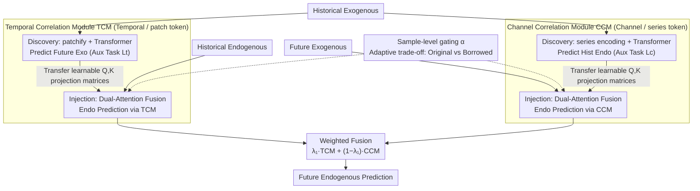

# DAG: A Dual Correlation Network for Time Series Forecasting with Exogenous Variables

**Conference**: ICML 2026  
**arXiv**: [2509.14933](https://arxiv.org/abs/2509.14933)  
**Code**: https://github.com/decisionintelligence/DAG  
**Area**: Time Series Forecasting / Exogenous Variable Modeling / Attention Mechanism  
**Keywords**: Covariate forecasting, Future exogenous variables, Temporal correlation, Channel correlation, Attention injection

## TL;DR
For "future covariates known" time series forecasting (TSF-X), DAG proposes a dual-path network: one path captures the "historical exogenous $\to$ future exogenous" attention patterns along the temporal dimension and injects them into "historical endogenous $\to$ future endogenous" predictions; the other path captures "historical exogenous $\to$ historical endogenous" patterns along the channel dimension and injects them into "future exogenous $\to$ future endogenous" predictions. DAG achieves the best MSE on 10/12 public/newly released TSF-X datasets, significantly outperforming TimeXer, TFT, TiDE, CrossLinear, and PatchTST.

## Background & Motivation
**Background**: Time series forecasting has evolved from early ARIMA/ETS to recent Transformer (Informer, Autoformer, PatchTST) and MLP (DLinear, CycleNet, DUET) series. Most only utilize endogenous variables (historical values of the target variable). However, in many practical scenarios, covariates (weather, holidays, grid load) are known both historically and for a period into the future (e.g., weather forecasts, scheduled promotion calendars); such "known future covariates" are among the strongest levers for prediction accuracy.

**Limitations of Prior Work**: (1) PatchTST/DUET completely ignore covariates; (2) TimeXer/CrossLinear only use historical covariates, wasting known future information; (3) TFT/TiDE use both historical and future covariates but only through simple concatenation/cross-attention, failing to model the "temporal" and "channel" correlation structures between covariates and target variables, which leads to learning spurious correlations; (4) Most TSF-X datasets are small with non-standard covariate descriptions, making the benchmark itself insufficient.

**Key Challenge**: "Known future covariates" can inject two types of information: in the temporal dimension, the "evolutionary pattern from historical to future covariates" $\approx$ "evolutionary pattern from historical to future endogenous variables" (Granger causality intuition); in the channel dimension, the "way covariates affect endogenous variables" remains stable between the past and future (Pearson correlation intuition). Existing methods treat these as mere "features" without explicitly transferring these two types of relationships.

**Goal**: (1) Design a predictor capable of simultaneously utilizing historical + future covariates; (2) Explicitly model temporal and channel correlations and "inject" them into the main prediction path; (3) provide a higher-quality TSF-X benchmark.

**Key Insight**: The influence of covariate information on endogenous variable prediction is decomposed into two symmetric structural sub-tasks—Temporal dimension: the attention weights of $X^{exo} \to Y^{exo}$ can be lent to $X^{endo} \to Y^{endo}$; Channel dimension: the attention weights of $X^{exo} \to X^{endo}$ can be lent to $Y^{exo} \to Y^{endo}$.

**Core Idea**: The correlation of "covariate $\to$ endogenous" is extracted in the form of learnable $Q, K$ matrices, then fused with original attention via gating. This "injects" correlation into the main prediction path, allowing the Transformer to carry additional structured signals in both directions.

## Method

### Overall Architecture
Given $X^{endo} \in \mathbb{R}^{N \times T}$, $X^{exo} \in \mathbb{R}^{D \times T}$, and $Y^{exo} \in \mathbb{R}^{D \times F}$, the goal is to predict $\hat Y^{endo} \in \mathbb{R}^{N \times F}$. DAG consists of two symmetric modules:
- **Temporal Correlation Module (TCM)**: A pair of sub-modules $\mathcal{F}_{\theta_1}, \mathcal{G}_{\theta_2}$. Discovery uses patchify + Transformer to predict $\hat Y^{exo}$ (auxiliary task) while outputting attention $W_q', W_k'$; Injection uses the same patchify to process $X^{endo}$ and fuses the borrowed $W_q', W_k'$ with its own $W_q, W_k, W_v$ using dual-attention fusion to predict $\ddot Y^{endo}$.
- **Channel Correlation Module (CCM)**: Mirrored design. Discovery uses series-wise embedding + Transformer to predict $\hat X^{endo}$ (auxiliary task, inferring historical endogenous from historical exogenous), outputting $\mathcal{W}_{q'}, \mathcal{W}_{k'}$; Injection injects these into the Transformer for $Y^{exo}$ to predict $\dot Y^{endo}$.
- The final prediction is $\hat Y^{endo} = \lambda_1 \cdot \ddot Y^{endo} + (1-\lambda_1) \cdot \dot Y^{endo}$. The total loss $L_{total} = L_f + \lambda_2 (L_t + L_c)$ optimizes the main prediction and the two discovery auxiliary tasks simultaneously.

### Key Designs

**1. Temporal Correlation Module (TCM): Transferring $W_q', W_k'$ projection matrices across tasks**

The temporal path reinforces the "historical endogenous $\to$ future endogenous" step, which inherently lacks additional structural signals. The key insight is that the evolution pattern from "historical exogenous $\to$ future exogenous" (Granger causality intuition) is structurally similar to "historical endogenous $\to$ future endogenous"; thus, the attention learned from the former can be lent to the latter. The Discovery sub-module patchifies $X^{exo}$ into $M$ tokens and uses a standard Transformer to compute $S_i' = \text{softmax}(Q K^\top / \sqrt d) V$ to predict $\hat Y^{exo}$ (auxiliary task). Importantly, it **does not pass attention scores but extracts learnable $W_q', W_k'$ matrices**. The Injection sub-module patchifies $X^{endo}$ similarly, computes $(Q, K, V)$ with its own matrices, and $(Q', K')$ with the borrowed $W_q', W_k'$. Both paths are fused via $S_{\text{fused}} = \alpha \cdot \sigma(QK^\top/\sqrt d) + (1-\alpha)\, \sigma(Q' K'^\top / \sqrt d)$ to obtain $P_i' = \sigma(S_{\text{fused}}) V$. Transferring learnable parameters instead of attention scores is preferred because scores are sample-dependent and cause over-coupling, whereas $W_q', W_k'$ serve as task-level inductive biases, proving more robust and interpretable.

**2. Channel Correlation Module (CCM): Transferring cross-channel correlations**

The channel path mirrors TCM, reinforcing the "future exogenous $\to$ future endogenous" step. The insight is that the way covariates influence endogenous variables (Pearson correlation intuition, e.g., temperature affecting sales) is approximately stable between history and future. Thus, the channel attention learned from "historical exogenous $\to$ historical endogenous" can be lent to "future exogenous $\to$ future endogenous". Unlike TCM's patch tokens, CCM uses **series-wise embedding**—encoding each series as a whole token ($X^{exo}_i \to u_i \in \mathbb{R}^d$, forming $U \in \mathbb{R}^{D \times d}$), allowing attention to act at the variable level to capture inter-channel structures. Discovery runs a Transformer to infer historical endogenous $\hat X^{endo}$ from historical exogenous (self-supervised auxiliary task) and extracts $\mathcal{W}_{q'}, \mathcal{W}_{k'}$; Injection performs series-embedding on $Y^{exo}$ followed by the same dual-attention fusion to obtain $\dot Y^{endo}$.

**3. Sample-level gating $\alpha$: Transforming hard transfer into soft switching**

TCM and CCM both utilize a gating mechanism (controlling both injection paths in the framework) to determine the reliability of borrowed attention for a given sample. It takes two inputs, passes them through MLPs, and computes a scalar $\alpha = \text{MLP}(\cdot)^\top \cdot \text{MLP}(\cdot)$ (TCM uses $X^{exo}, X^{endo}$; CCM uses $X^{exo}, Y^{exo}$), which fuses the two attention scores. When the correlation between exogenous and endogenous variables is low, $\alpha \to 1$, and the model degrades to a standard Transformer; under strong correlation, $\alpha \to 0$, allowing borrowed attention to dominate. This dynamic balance avoids overfitting due to hard transfer on low-correlation data.

### Loss & Training
Three losses are aggregated: $L_t = \|Y^{exo} - \hat Y^{exo}\|_1$ (temporal correlation auxiliary task), $L_c = \|X^{endo} - \hat X^{endo}\|_1$ (channel correlation auxiliary task), and $L_f = \|Y^{endo} - \hat Y^{endo}\|_1$ (main prediction). The total loss is $L_{total} = L_f + \lambda_2 (L_t + L_c)$, where $\lambda_1, \lambda_2$ are hyperparameters. All tasks are trained end-to-end.

## Key Experimental Results

### Main Results
Evaluation spans 12 TSF-X datasets, including new releases: NP / PJM / BE / FR / DE (5 European electricity price datasets), Energy / Sdwpfm1/2 / Sdwpfh1/2 / Colbun / Rapel. Baselines include GCGNet (graph-based), TimeXer / CrossLinear (historical exo), TFT / TiDE (hist + future exo), and DUET / PatchTST / Amplifier / TimeKAN (endo only).

| Dataset | DAG MSE | GCGNet | TimeXer | TFT | TiDE | PatchTST | Gain (vs best baseline) |
|--------|---------|--------|---------|-----|------|----------|--------------|
| NP | **0.362** | 0.370 | 0.418 | 0.379 | 0.443 | 0.390 | −2.2% vs GCGNet |
| PJM | **0.093** | 0.095 | 0.108 | 0.114 | 0.142 | 0.133 | −2.1% |
| BE | **0.423** | 0.431 | 0.452 | 0.454 | 0.498 | 0.577 | −1.9% |
| Energy | **0.124** | 0.131 | 0.163 | 0.130 | 0.153 | 0.226 | −4.6% |
| Colbun | **0.098** | 0.107 | 0.145 | 0.238 | 0.164 | 0.239 | −8.4% |
| Rapel | **0.230** | 0.306 | 0.344 | 0.305 | 0.320 | 0.269 | −14.5% |
| **1st Count** | **10/12** | 2/12 | 0/12 | 0/12 | 0/12 | 0/12 | — |

DAG achieves the top MSE rank in 10/12 datasets. GCGNet ranks first twice. TimeXer, TFT, and TiDE achieve no first-place rankings. Gains are particularly significant on newly released hydrological/wind power data (Colbun/Rapel/Sdwpfh).

### Ablation Study
Verification in "history-only exogenous" settings (degenerate scenario where future exo is unavailable) shows DAG still leads using only $X^{endo} + X^{exo}$:

| Dataset | DAG MSE | TimeXer | CrossLinear | DUET | Note |
|--------|---------|---------|-------------|------|------|
| NP | **0.419** | 0.440 | 0.451 | 0.444 | Hist-exo mode |
| PJM | **0.126** | 0.141 | 0.147 | 0.140 | DAG remains optimal |
| FR | **0.435** | 0.454 | 0.476 | 0.468 | Channel corr impact |
| DE | **0.603** | 0.659 | 0.635 | 0.660 | Narrower lead |

| Configuration | Avg MSE Change | Note |
|------|---------------|------|
| Full DAG | baseline | Full dual-path |
| TCM only | ↑ ~5% | Lacks channel corr |
| CCM only | ↑ ~4% | Lacks temporal pattern |
| No Correlation Loss ($\lambda_2 = 0$) | ↑ ~3% | Aux tasks provide reg. |

### Key Findings
- DAG's core gain stems from the combination of "future exogenous + dual correlation injection": performance lead narrows but persists without future exogenous variables; with them, the lead expands to 8–15%.
- Channel correlation contributes more significantly on datasets with many covariates (Sdwpfh 6-dim, Weather 20-dim), while temporal correlation helps more with long sequences (NP/PJM ~52k points).
- Transferring attention matrices $W_q', W_k'$ instead of scores consistently improves performance by 1–2%, validating that task-level parameter transfer is more robust than sample-level score transfer.
- For methods ignoring covariates (PatchTST, DUET), even on electricity datasets with strong covariate signals, they fail to surpass even the history-only version of DAG.

## Highlights & Insights
- **"$Q, K$ matrix transfer" is a reusable transfer trick**: Sharing learnable attention projection matrices across related tasks is more robust and flexible than passing attention scores; this concept can be applied to any dual-path Transformer scenario, such as multi-modal or auxiliary task learning.
- **Auxiliary tasks serve as dual-benefit regularization**: $L_t$ and $L_c$ ostensibly supervise auxiliary predictions, but they simultaneously provide gradient signals to the main prediction and supervision for $W_q', W_k'$, offering a stronger inductive bias than simple multi-task learning.
- **Sample-level gating converts hard constraints to soft constraints**: By using MLP dot products for $\alpha$, the model ensures gradient flow while allowing dynamic degradation to a standard Transformer, ensuring robustness against low-correlation samples.
- **The new TSF-X benchmark is a substantial community contribution**: Hydrological (Colbun, Rapel) and wind power (Sdwpfh, Sdwpfm) datasets fill the gap in covariate-rich datasets.

## Limitations & Future Work
- The model comprises 4 Transformer sub-modules; computational overhead and parameter counts are significantly higher than PatchTST/DLinear, and inference latency was not detailed.
- "Future covariates known" is an assumption that does not hold in finance or emergency forecasting; while Table 3 validates results without future exogenous data, the design philosophy relies on this premise. Robustness under noisy future covariates was not analyzed.
- Validation is limited to 1D covariates; explicit handling of missing or asynchronously sampled covariates (as in CrossLinear or ExoTST) was not addressed.
- The model involves several hyperparameters/learnable parameters ($\lambda_1, \lambda_2, \alpha, \text{gating MLP}$), creating a larger hyperparameter space than pure Transformers.
- The $O(D^2)$ complexity of the channel correlation module's attention remains a bottleneck for scenarios with thousands of channels (e.g., Traffic 861, Electricity 320).

## Related Work & Insights
- **vs TimeXer / CrossLinear**: Both only use historical covariates. DAG outperforms TimeXer across all 12 datasets with an average MSE reduction of 5–15%.
- **vs TFT / TiDE**: Both use future covariates but only via simple attention/concat. DAG's structure yields an 18% improvement on PJM (0.093 vs 0.114), highlighting the value of structured correlation injection.
- **vs GCGNet**: GCGNet uses graphs for correlation without distinguishing history/future or endo/exo. DAG's win on 10/12 datasets suggests that role differentiation is necessary.
- **vs PatchTST / DUET / DLinear**: Univariate-only models are significantly outperformed in covariate-rich scenarios, reinforcing that such models may be considered obsolete for TSF-X.

## Rating
- Novelty: ⭐⭐⭐⭐ "Learnable $Q,K$ transfer" and dual-path architecture are clear original designs, though correlation modeling has precedents in multi-task learning.
- Experimental Thoroughness: ⭐⭐⭐⭐⭐ 12 datasets, 9 baselines, ablation studies, parameter sensitivity, and the release of new datasets.
- Writing Quality: ⭐⭐⭐⭐ Figure 1 categorizes the TSF-X landscape clearly; technical sections are well-structured despite the mathematical density.
- Value: ⭐⭐⭐⭐ Provides a new SOTA and benchmark for "known future covariate" scenarios, ready for use in power, retail, and energy sectors.

<!-- RELATED:START -->

## Related Papers

- [\[AAAI 2026\] DeepBooTS: Dual-Stream Residual Boosting for Drift-Resilient Time-Series Forecasting](../../AAAI2026/time_series/deepboots_dual-stream_residual_boosting_for_drift-resilient_time-series_forecast.md)
- [\[AAAI 2026\] Sonnet: Spectral Operator Neural Network for Multivariable Time Series Forecasting](../../AAAI2026/time_series/sonnet_spectral_operator_neural_network_for_multivariable_time_series_forecastin.md)
- [\[ICML 2025\] HyperIMTS: Hypergraph Neural Network for Irregular Multivariate Time Series Forecasting](../../ICML2025/time_series/hyperimts_hypergraph_neural_network_for_irregular_multivariate_time_series_forec.md)
- [\[ICML 2026\] Ellipsoidal Time Series Forecasting](ellipsoidal_time_series_forecasting.md)
- [\[ICML 2025\] TQNet: Temporal Query Network for Efficient Multivariate Time Series Forecasting](../../ICML2025/time_series/temporal_query_network_for_efficient_multivariate_time_series_forecasting.md)

<!-- RELATED:END -->
