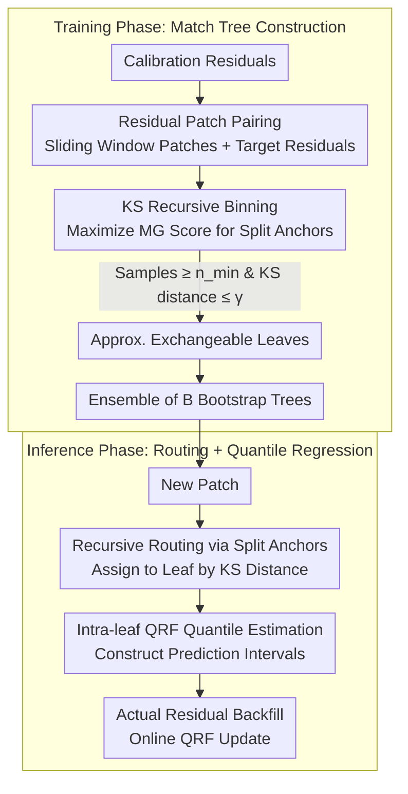

# DistMatch: Adaptive Binning via Distribution Matching for Robust Sequential Conformal

**Conference**: ICML 2026  
**arXiv**: [2606.00690](https://arxiv.org/abs/2606.00690)  
**Code**: TBD  
**Area**: Time Series / Uncertainty Quantization / Conformal Prediction  
**Keywords**: Sequential Conformal Prediction, Distribution Shift, Kolmogorov-Smirnov, Adaptive Binning

## TL;DR
DistMatch proposes a recursive binning method based on **KS statistics**—by grouping residuals into approximately exchangeable leaf nodes, it **discards weight re-assignment** to provide valid conformal prediction intervals under distribution shift; it achieves the smallest interval widths across five datasets while maintaining valid coverage.

## Background & Motivation

**Background**: Sequential conformal prediction provides effective uncertainty quantization by constructing prediction intervals. However, traditional methods assume residual exchangeability—an assumption frequently violated in real-world time series. Existing methods primarily approximate exchangeability through residual weight re-assignment.

**Limitations of Prior Work**:
- Weight re-assignment schemes (temporal weighting) struggle to accurately estimate weights and tend to discard informative early samples during sudden distribution shifts.
- Similarity retrieval methods are highly sensitive to retrieval quality; even small similarity estimation errors can assign excessive weight to irrelevant or noisy samples.
- Continuous weight assignment distorts the empirical distribution of residuals, leading to inaccurate quantile estimation.

**Key Challenge**: How to handle distribution shifts in time series and guarantee conformal coverage without-relying on precise weight estimation.

**Goal**: Design a binning method that does not require weight re-assignment, inducing approximate local exchangeability by grouping similar samples, and remaining robust to distribution shifts.

**Key Insight**: Using the non-parametric KS statistic for distribution similarity measurement avoids reliance on temporal assumptions like global stationarity; compared to weight re-assignment, binning better preserves the statistical properties of residuals by maintaining the integrity of the empirical distribution.

**Core Idea**: Replace weighting schemes with a recursive binary tree driven by the KS statistic—recursively grouping residuals into leaves with bounded distribution shifts, where each leaf independently applies online quantile regression to achieve locally adaptive robust inference.

## Method

### Overall Architecture
The method consists of two phases—**Training Phase**: Given calibration set residuals, residual patches $\tilde{\epsilon}_t = \{\epsilon_{t - w + 1}, \ldots, \epsilon_t\}$ are paired with target residuals $\epsilon_{t+1}$. Split anchors are recursively selected by maximizing the Matching Gain (MG) score, grouping patches into approximately exchangeable leaves satisfying KS distance bounds. An ensemble of $B$ trees is built via bootstrapping to enhance robustness under shift. **Inference Phase**: For a new patch $\tilde{\epsilon}_T$, it is routed to a corresponding leaf by recursively comparing its KS distance with split anchors. A Quantile Regression Forest (QRF) within the leaf estimates quantiles to construct the prediction interval. Finally, the true residual is backfilled into its leaf, and the QRF is updated online to adapt to new observations.

### Key Designs

**1. Recursive Binning via KS Statistic: Inducing Approx. Exchangeability via Grouping to Bypass Weight Estimation**

Traditional sequential conformal prediction relies on re-assigning weights to residuals to approximate exchangeability. However, weights are difficult to estimate, and distribution spikes can lead to the loss of informative historical samples. Continuous weighting also distorts the empirical distribution, causing quantile misalignment. DistMatch avoids weighting entirely, instead grouping residuals by distribution similarity. It defines a Matching Gain score $\text{MG}(\tilde{\epsilon}_i) = \sum_j \mathbb{1}\{D_{\text{KS}}(\tilde{\epsilon}_i, \tilde{\epsilon}_j) \leq \gamma\}$. At each split node, an anchor $s$ is chosen to maximize this score, and the split continues recursively until no better split satisfies the minimum sample size $n_{\min}$. Similarity is measured using the KS distance $D_{\text{KS}} = \sup_x |F_i(x) - F_j(x)|$, representing the maximum deviation between two empirical CDFs—it is density-independent, non-parametric, robust for skewed distributions, and computationally efficient at $O(w)$ (compared to $O(n)$ for TV/Wasserstein). Discrete binning preserves the integrity of the empirical distribution, avoiding artificial quantile distortion.

**2. Residual Patch + Target-level Exchangeability: Target-level Coverage Guarantees via Patch-level Testing**

Binning is performed on patches, but conformal coverage must ultimately guarantee that the "unseen target residual" falls within the interval. DistMatch bridges this by pairing residual patches $\tilde{\epsilon}_t = \{\epsilon_{t-w+1}, \ldots, \epsilon_t\}$ with target residuals $\epsilon_{t+1}$, defining $\gamma^*$-approximate local exchangeability as $\max_{t \in \mathcal{L}_{k^*}} D_{\text{KS}}(P_{t+1}, P_{T+1}) \leq \gamma^*$. This ensures the KS distance between all target residual distributions in a leaf and the unseen target distribution is bounded. Under local stationarity and $\beta$-mixing assumptions, it is proven that a patch-level KS bound of $2\gamma$ implies a target-level bound of $2 C \gamma + \mathcal{O}(\sigma_{\text{mix}})$. By controlling similarity at the observable patch level, coverage for future targets is guaranteed, bypassing the difficult task of directly estimating future distributions. Unlike global exchangeability, local exchangeability tolerates mild distribution shifts.

**3. Online Adaptation + Ensemble Robustness: Maintaining Coverage under Long Sequences and Severe Shifts**

A single tree might route new patches to the wrong leaf during severe shifts. DistMatch utilizes an ensemble of $B$ bootstrap trees, each built with a sampling ratio $\theta$. For any unseen patch, at least one tree routes it to the correct matching leaf with probability $p_{\min}$. The robust prediction is the average of quantile estimates across $B$ trees: $\bar{q} = \frac{1}{B} \sum_b q^{(b)}$. This ensemble provides backup routing paths under extreme shifts. Furthermore, as each new residual is observed, only the QRF within the corresponding leaf is updated without rebuilding the tree structure. This allows local quantiles to evolve continuously with an online cost of $O(T w \log n)$, which is approximately $T$ times lower than methods like SPCI or HopCPT that rely on sliding window retraining.

## Key Experimental Results

### Main Results (5 Real Datasets, α = 0.1)

| Dataset | Method | Coverage ↑ | Width ↓ | Winkler Score ↓ |
|--------|------|---------|----------|------------|
| Elec. | **Ours** | 0.92 | **0.27** | **1.97** |
| Elec. | SPCI | 0.90 | 0.28 | 2.54 |
| Solar | **Ours** | 0.91 | **60.00** | **1.54** |
| Solar | SPCI | 0.85 | 47.36 | 1.98 |
| Wind | **Ours** | 0.90 | **69.04** | **2.15** |
| Wind | SPCI | 0.83 | 63.14 | 2.19 |

DistMatch achieves the smallest interval widths across all 5 datasets while maintaining valid coverage.

### Ablation Study

| Configuration | Elec. | Solar | Wind | Avg. Winkler |
|------|-------|-------|-------|-----------|
| Full Model (γ = 0.1, w = 100) | 0.92 | 0.91 | 0.90 | 1.95 |
| w/o KS (using Wasserstein) | 0.91 | 0.90 | 0.89 | 3.42 |
| w/o KS (using KL Div.) | 0.88 | 0.86 | 0.82 | Failed Coverage |
| w/o Ensemble (Single Tree) | 0.91 | 0.89 | 0.88 | 2.34 |

### Key Findings
- KS statistics outperform Wasserstein and KL divergence while having the lowest computational cost ($O(w)$ vs $O(n^2)$).
- The ensemble mechanism is critical for severe shift scenarios.
- The hyperparameter $\gamma$ shows good stability within values below 0.1, effectively managing the bias-variance tradeoff.

## Highlights & Insights
- **Innovative Theoretical Framework**: Establishes theoretical guarantees for binning-based sequential CP based on approximate local exchangeability for the first time; derives target-level bounds from patch-level KS bounds to avoid direct future distribution modeling.
- **Elegant Design Choices**: The KS statistic as a distribution matching criterion is simple yet effective (non-parametric, density-independent) and has a clear geometric interpretation (maximum deviation of empirical CDFs). Discrete binning naturally preserves residual empirical distribution integrity compared to continuous weights.
- **Online Robustness Mechanism**: The combination of ensembles and online updates allows DistMatch to maintain valid coverage under extreme shifts while improving computational efficiency by $T$ times over SPCI and HopCPT.
- **Transferable Concepts**: The idea of distribution-matching binning can be extended to other uncertainty quantization tasks requiring resilience to distribution shift (e.g., risk calibration, probabilistic forecasting).

## Limitations & Future Work
- Practical Satisfaction of Assumptions: Relies on local stationarity and $\beta$-mixing, which may fail in sequences with long memory or extreme non-stationarity.
- Hyperparameter Sensitivity: Although stable within $\gamma \in [0.05, 0.15]$, it still requires optimization via greedy search for new datasets.
- Sample Size Requirements: The calibration set size $n$ impacts the tree construction cost $O(n^2 w \log n)$.
- Improvements: Adaptive $\gamma$ selection mechanisms; extension to multi-dimensional outputs or multi-step forecasting; exploration in other time series tasks (anomaly detection, demand forecasting).

## Related Work & Insights
- **vs SPCI**: SPCI relies on sliding window model updates to capture distribution changes, which can fail under extreme shifts; DistMatch achieves adaptation through distribution-matching binning without retraining predictors.
- **vs HopCPT**: HopCPT uses Hopfield networks to retrieve similar past residuals, but is sensitive to retrieval quality; DistMatch uses global KS matching to avoid amplifying similarity estimation errors.
- **vs KOWCPI**: KOWCPI depends on kernel methods for weight calculation and is sensitive to kernel selection; DistMatch avoids weights entirely in favor of discrete binning.

## Rating
- Novelty: ⭐⭐⭐⭐⭐ First introduction of KS statistics to sequential CP, replacing weights with binning, with an innovative theoretical framework.
- Experimental Thoroughness: ⭐⭐⭐⭐ Five real datasets, eight baseline comparisons, ablation studies, and theoretical verification; lacks experiments on extreme data or cross-domain generalization.
- Writing Quality: ⭐⭐⭐⭐⭐ Clear logic, standardized notation, rigorous theoretical derivation, and thorough experimental analysis.
- Value: ⭐⭐⭐⭐ Sequential CP is a practical problem where DistMatch shows significant results; applications are mainly limited to time series, but the theoretical framework is highly relevant to the uncertainty quantization community.

<!-- RELATED:START -->

## Related Papers

- [\[ICML 2026\] Adaptive Time Series Reasoning via Segment Selection](adaptive_time_series_reasoning_via_segment_selection.md)
- [\[ICML 2026\] Doubly Outlier-Robust Online Infinite Hidden Markov Model](doubly_outlier-robust_online_infinite_hidden_markov_model.md)
- [\[ICML 2026\] Divide and Contrast: Learning Robust Temporal Features Without Augmentation](divide_and_contrast_learning_robust_temporal_features_without_augmentation.md)
- [\[NeurIPS 2025\] MAESTRO: Adaptive Sparse Attention and Robust Learning for Multimodal Dynamic Time Series](../../NeurIPS2025/time_series/maestro_adaptive_sparse_attention_and_robust_learning_for_multimodal_dynamic_tim.md)
- [\[ICLR 2026\] ResCP: Reservoir Conformal Prediction for Time Series Forecasting](../../ICLR2026/time_series/rescp_reservoir_conformal_prediction_for_time_series_forecasting.md)

<!-- RELATED:END -->
