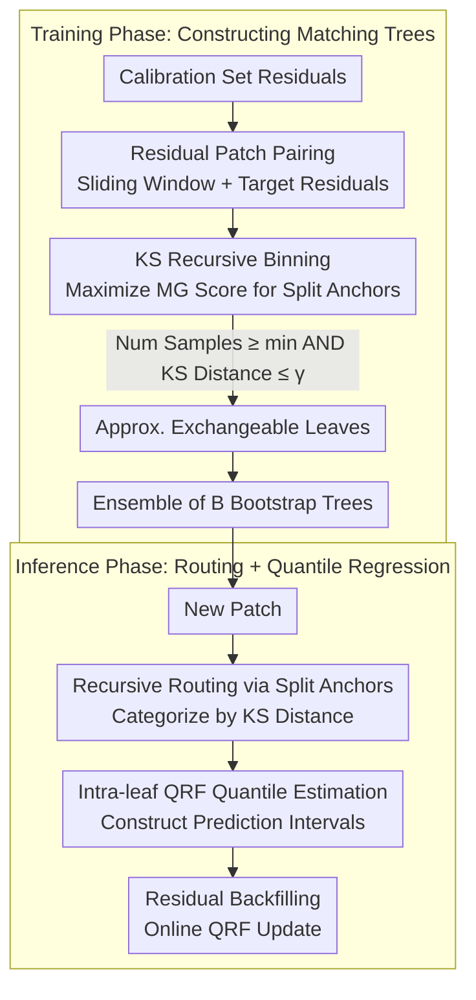

# DistMatch: Adaptive Binning via Distribution Matching for Robust Sequential Conformal

**Conference**: ICML 2026  
**arXiv**: [2606.00690](https://arxiv.org/abs/2606.00690)  
**Code**: TBD  
**Area**: Time Series / Uncertainty Quantification / Conformal Prediction  
**Keywords**: Sequential Conformal Prediction, Distribution Shift, Kolmogorov-Smirnov, Adaptive Binning

## TL;DR
DistMatch proposes a recursive binning method based on **KS statistics**—by grouping residuals into approximately exchangeable leaf nodes, it **discards weight reassignment**, providing effective conformal prediction intervals under distribution shift. It achieves the smallest interval widths across five datasets while maintaining valid coverage.

## Background & Motivation

**Background**: Sequential conformal prediction provides effective uncertainty quantification by constructing prediction intervals, but traditional methods assume residual exchangeability—a condition frequently violated in real-world time series. Existing methods primarily approximate exchangeability through residual weight reassignment.

**Limitations of Prior Work**:
- Weight reassignment schemes (time-weighting methods) struggle to accurately estimate weights and tend to discard informative early samples during abrupt distribution shifts.
- Similarity retrieval methods are highly sensitive to retrieval quality; even small similarity estimation errors can assign excessive weight to irrelevant or noisy samples.
- Continuous weight assignment distorts the empirical distribution of residuals, leading to inaccurate quantile estimation.

**Key Challenge**: How to handle distribution shifts in time series and guarantee conformal coverage without relying on precise weight estimation.

**Goal**: Design a binning method that does not require weight reassignment, inducing approximate local exchangeability by grouping similar samples to achieve robustness against distribution shifts.

**Key Insight**: Using non-parametric KS statistics for distribution similarity measurement avoids dependence on temporal assumptions like global stationarity. Compared to weight reassignment, binning methods better preserve the statistical properties of residuals by maintaining the integrity of empirical distributions.

**Core Idea**: Replace weighting schemes with a recursive binary tree driven by KS statistics—recursively grouping residuals into leaves with bounded distribution distances. Each leaf independently applies online quantile regression to achieve locally adaptive robust inference.

## Method

### Overall Architecture
The method consists of two phases—**Training Phase**: Given calibration set residuals, residual patches $\tilde{\epsilon}_t = \{\epsilon_{t - w + 1}, \ldots, \epsilon_t\}$ are paired with target residuals $\epsilon_{t+1}$. Split anchors are selected recursively by maximizing the Matching Gain (MG) score to group patches into approximately exchangeable leaves satisfying KS distance bounds. An ensemble of $B$ bootstrap trees is constructed to enhance robustness under shift. **Inference Phase**: For a new patch $\tilde{\epsilon}_T$, it is routed to the corresponding leaf by recursively comparing its KS distance with the split anchors. Quantile Regression Forests (QRF) within the leaf estimate the quantiles to construct the prediction interval. Finally, the true residual is fed back into the corresponding leaf, and the QRF is updated online to adapt to new observations.

### Key Designs

**1. Recursive Binning based on KS Statistics: Inducing Approximate Exchangeability via Grouping to Bypass Weight Estimation**

Traditional sequential conformal prediction relies on reassigning weights to residuals to approximate exchangeability. However, weights are difficult to estimate, and abrupt shifts often cause the loss of informative early samples. Furthermore, continuous weighting distorts the empirical distribution and leads to quantile misalignment. DistMatch avoids weights entirely, instead grouping residuals by distribution similarity. It defines a Matching Gain score $\text{MG}(\tilde{\epsilon}_i) = \sum_j \mathbb{1}\{D_{\text{KS}}(\tilde{\epsilon}_i, \tilde{\epsilon}_j) \leq \gamma\}$. At each split node, it selects an anchor $s$ that maximizes this score and recursively splits until the minimum sample size $n_{\min}$ can no longer be met. Similarity is measured via the KS distance $D_{\text{KS}} = \sup_x |F_i(x) - F_j(x)|$, representing the maximum deviation between two empirical CDFs. It is non-parametric, density-independent, robust to skewed distributions, and computable in $O(w)$ time. Discrete binning preserves the integrity of the empirical residual distribution.

**2. Residual Patch + Target-level Exchangeability: Using Patch-level Tests for Target-level Coverage Guarantees**

Binning is performed on patches, but conformal coverage must ultimately guarantee that the "unseen target residual" falls within the interval. DistMatch pairs residual patches $\tilde{\epsilon}_t = \{\epsilon_{t-w+1}, \ldots, \epsilon_t\}$ with target residuals $\epsilon_{t+1}$, defining a $\gamma^*$-approximate local exchangeability as $\max_{t \in \mathcal{L}_{k^*}} D_{\text{KS}}(P_{t+1}, P_{T+1}) \leq \gamma^*$. This implies that the KS distance between the distributions of all target residuals in a leaf and the unseen target distribution is bounded. Under local stationarity and $\beta$-mixing assumptions, it can be proven that when the patch-level KS bound is $2\gamma$, the target-level bound is $2 C \gamma + \mathcal{O}(\sigma_{\text{mix}})$. Thus, controlling similarity at the observable patch level provides coverage guarantees for future targets, bypassing the difficulty of directly estimating future distributions.

**3. Online Adaptation + Ensemble Robustness: Maintaining Coverage under Long Sequences and Severe Shifts**

A single tree might route a new patch to the wrong leaf during severe shifts. To counter this, DistMatch employs an ensemble of $B$ bootstrap trees. Each tree is constructed using a bootstrap sample with ratio $\theta$. For any unseen patch, at least one tree is likely to route it to a matching leaf with probability $p_{\min}$. The final robust prediction uses the average quantile estimate $\bar{q} = \frac{1}{B} \sum_b q^{(b)}$. This ensemble provides multiple backup routing paths under extreme drift. Additionally, only the Quantile Regression Forest (QRF) within the corresponding leaf is updated as new residuals are observed, without reconstructing the tree structure. This allows local quantiles to evolve continuously while keeping online costs at $O(T w \log n)$, which is approximately $T$ times lower than methods relying on sliding window retraining like SPCI or HopCPT.

## Key Experimental Results

### Main Results (5 Real-world Datasets, α = 0.1)

| Dataset | Method | Coverage ↑ | Interval Width ↓ | Winkler Score ↓ |
|---------|--------|------------|-----------------|-----------------|
| Elec.   | **DistMatch** | 0.92 | **0.27** | **1.97** |
| Elec.   | SPCI | 0.90 | 0.28 | 2.54 |
| Solar   | **DistMatch** | 0.91 | **60.00** | **1.54** |
| Solar   | SPCI | 0.85 | 47.36 | 1.98 |
| Wind    | **DistMatch** | 0.90 | **69.04** | **2.15** |
| Wind    | SPCI | 0.83 | 63.14 | 2.19 |

DistMatch achieves the smallest interval width across all five datasets while maintaining valid coverage.

### Ablation Study

| Configuration | Elec. | Solar | Wind | Mean Winkler |
|---------------|-------|-------|------|--------------|
| Full Model ($\gamma = 0.1$, $w = 100$) | 0.92 | 0.91 | 0.90 | 1.95 |
| w/o KS (using Wasserstein) | 0.91 | 0.90 | 0.89 | 3.42 |
| w/o KS (using KL Divergence) | 0.88 | 0.86 | 0.82 | Coverage Failure |
| w/o Ensemble (Single Tree) | 0.91 | 0.89 | 0.88 | 2.34 |

### Key Findings
- KS statistics outperform Wasserstein and KL divergence while maintaining the lowest computational cost ($O(w)$ vs. $O(n^2)$).
- The ensemble mechanism is critical in scenarios with severe distribution shifts.
- The hyperparameter $\gamma$ shows good stability for values under 0.1, effectively managing the bias-variance trade-off.

## Highlights & Insights
- **Innovative Theoretical Framework**: Establishes the first theoretical guarantees for binning-based sequential CP based on approximate local exchangeability; derives target-level bounds from patch-level KS bounds to avoid direct future distribution modeling.
- **Elegant Design Choices**: Using KS statistics as the matching criterion is simple yet effective (non-parametric, density-independent) and provides a clear geometric interpretation; discrete binning naturally preserves the integrity of empirical residual distributions compared to continuous weighting.
- **Online Robustness Mechanism**: The combination of ensembles and online updates allows DistMatch to maintain valid coverage under extreme shifts, with computational efficiency improved by $T$ times over SPCI and HopCPT.
- **Transferable Philosophy**: The concept of distribution-matching binning can be extended to other uncertainty quantification tasks requiring adaptation to distribution shifts, such as risk calibration and probabilistic forecasting.

## Limitations & Future Work
- **Theoretical Assumptions**: Success relies on local stationarity and $\beta$-mixing assumptions, which may fail in sequences with long-range dependence or extreme non-stationarity.
- **Hyperparameter Sensitivity**: Although stable within $\gamma \in [0.05, 0.15]$, optimization via greedy search may still be required for new datasets.
- **Sample Requirements**: The calibration set size $n$ impacts the tree construction cost of $O(n^2 w \log n)$.
- **Future Directions**: Implementing adaptive $\gamma$ selection mechanisms; extending to multi-dimensional outputs or multi-step forecasting; exploring other time-series tasks like anomaly detection and demand forecasting.

## Related Work & Insights
- **vs SPCI**: SPCI relies on sliding-window model updates to capture distribution changes, which can fail under extreme shifts. DistMatch achieves adaptation through distribution-matching binning without retraining the predictor.
- **vs HopCPT**: HopCPT uses Hopfield networks to retrieve similar past residuals, which is sensitive to retrieval quality. DistMatch employs global KS matching to prevent the amplification of similarity estimation errors.
- **vs KOWCPI**: KOWCPI relies on kernel methods for weight calculation, making it sensitive to kernel choice. DistMatch completely avoids weights in favor of discrete binning.

## Rating
- Novelty: ⭐⭐⭐⭐⭐ First to introduce KS statistics into sequential CP using binning instead of weighting; innovative theoretical framework.
- Experimental Thoroughness: ⭐⭐⭐⭐ Five real-world datasets, eight baselines, ablation studies, and theoretical validation provided; lacks experiments on extreme data edge cases and cross-domain generalization.
- Writing Quality: ⭐⭐⭐⭐⭐ Clear logic, standardized notation, rigorous theoretical derivation, and thorough experimental analysis.
- Value: ⭐⭐⭐⭐ Sequential CP is a practical problem where DistMatch shows significant gains; while primarily focused on time series, the framework is valuable for the broader uncertainty quantification community.

<!-- RELATED:START -->

## Related Papers

- [\[ICML 2026\] Adaptive Time Series Reasoning via Segment Selection](adaptive_time_series_reasoning_via_segment_selection.md)
- [\[ICML 2026\] Doubly Outlier-Robust Online Infinite Hidden Markov Model](doubly_outlier-robust_online_infinite_hidden_markov_model.md)
- [\[ICML 2026\] Divide and Contrast: Learning Robust Temporal Features Without Augmentation](divide_and_contrast_learning_robust_temporal_features_without_augmentation.md)
- [\[NeurIPS 2025\] MAESTRO: Adaptive Sparse Attention and Robust Learning for Multimodal Dynamic Time Series](../../NeurIPS2025/time_series/maestro_adaptive_sparse_attention_and_robust_learning_for_multimodal_dynamic_tim.md)
- [\[ICML 2026\] Spatiotemporal Imputation with Graph-Informed Flow Matching](spatiotemporal_imputation_with_graph-informed_flow_matching.md)

<!-- RELATED:END -->
