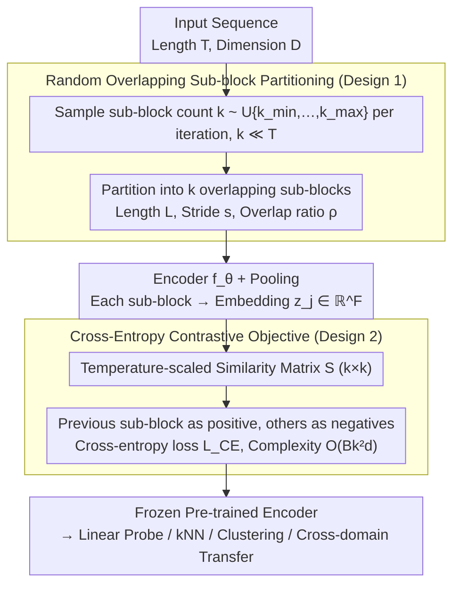

# Divide and Contrast: Learning Robust Temporal Features Without Augmentation

**Conference**: ICML 2026  
**arXiv**: [2605.21241](https://arxiv.org/abs/2605.21241)  
**Code**: To be confirmed  
**Area**: Time Series / Self-Supervised Learning  
**Keywords**: Time Series Representation Learning, Contrastive Learning, Self-Supervised, Augmentation-Free, Sub-block Partitioning

## TL;DR
Di-COT efficiently learns robust time series representations without data augmentation by **randomly partitioning sequences into overlapping sub-blocks** for contrastive learning. Compared to existing methods, it is 2.5 times faster with higher accuracy, validated comprehensively across 6 large-scale datasets + 124 UCR + 28 UEA.

## Background & Motivation

**Background**: Self-supervised representation learning for time series has become a significant research direction, with contrastive learning widely applied. Existing methods like TNC, TS-TCC, and TS2Vec utilize temporal proximity or data augmentation to construct positive and negative pairs.

**Limitations of Prior Work**:
- Complex data augmentations (time warping, magnitude transformation) lead to representation distortion.
- High computational overhead due to Dynamic Time Warping (DTW) or multiple encoder forward passes.
- Recent methods like CaTT avoid augmentation but assume temporal proximity equals semantic similarity, which fails on UCR/UEA datasets.

**Key Challenge**: On datasets with high temporal volatility (frequent event transitions), step-wise contrast generates false positives at temporal transitions. Methods relying solely on temporal proximity cannot handle these scenarios. Furthermore, the computational complexity of existing loss functions is quadratic relative to the sequence length $T$ ($O(T^2)$), which is unfriendly to long sequences.

**Goal**: Design a self-supervised time series learning framework that requires no data augmentation, no multiple encoder passes, and is independent of sequence length.

**Key Insight**: Rather than contrasting individual time steps, partition the sequence into sub-block units with **semantic integrity**. This avoids false positives at temporal transitions while retaining sufficient learning signals.

**Core Idea**: Replace **step-wise or augmentation-based contrastive learning** with **contrastive learning of dynamic overlapping sub-blocks**, and reformulate it as a **multi-class classification task** to achieve length-independent, efficient computation.

## Method

### Overall Architecture
Di-COT aims to avoid two common issues in temporal contrastive learning: representation distortion from data augmentation and false positives at transitions from step-wise contrast. The solution is to change the contrastive unit from a "single time step" to "semantically complete overlapping sub-blocks." When a sequence $\mathbf{x}^{(i)}\in\mathbb{R}^{T\times D}$ enters, it is first randomly divided into $k$ overlapping sub-blocks ($k$ is sampled uniformly from $\{k_{\min},\ldots,k_{\max}\}$). Each sub-block is encoded and pooled to obtain an embedding, used to calculate a temperature-scaled similarity matrix $\mathbf{S}^{(i)}\in\mathbb{R}^{k\times k}$. Finally, "adjacent sub-block prediction" is reformulated as multi-class classification, where each sub-block acts as an anchor to generate dense supervision. The entire pipeline uses no augmentation, and the loss complexity is independent of the sequence length.

### Key Designs

**1. Random Overlapping Sub-block Partitioning: Replacing Augmentation and Step-wise Contrast with Semantically Complete Blocks**

Step-wise contrast (e.g., CaTT) assumes "temporal proximity = semantic similarity," which misidentifies steps at temporal transitions as positive pairs in volatile data. Moreover, step-wise similarity matrices exhibit quadratic growth relative to sequence length $T$ ($O(BT^2 d)$). Methods relying on augmentation distort representations and increase overhead through multiple forward passes. Di-COT partitions the sequence into $k$ overlapping sub-blocks by sampling $k\ll T$ from $\mathcal{U}\{k_{\min},\ldots,k_{\max}\}$ each iteration. The sub-block length is $L=\frac{T}{1+(k-1)(1-\rho)}$, with stride $s=\lfloor L(1-\rho)\rceil$ and overlap ratio $\rho\in(0,1)$. The resulting embeddings are $z_j^{(i)} = f_\theta(\tilde x_j^{(i)})\in\mathbb{R}^F$. This step addresses three issues: overlap allows adjacent blocks to share context and avoids artificial hard boundaries; random sampling of $k$ forces the model to encounter various temporal granularities, implicitly learning multi-scale robustness; reducing granularity from $T$ to $k$ eliminates transition false positives while maintaining signal. Crucially, partitioning different parts of the same sequence serves as a proxy for augmentation: positives naturally share the same semantic context, eliminating the need for augmented views or non-linear projection heads (ablations show projections actually degrade performance in TS).

**2. Cross-Entropy Contrastive Objective: Reformulating Adjacent Block Prediction as Multi-class Classification**

Traditional InfoNCE complexity grows quadratically with $T$ for long sequences, while pair-wise objectives like TNC or TS2Vec produce sparse supervision signals (approx. $2B$). Di-COT calculates temperature-scaled similarity $S_{j,p}^{(i)} = \frac{z_j^{(i)\top}z_p^{(i)}}{\tau}$ for each pair $(j,p)$, resulting in $\mathbf{S}^{(i)}\in\mathbb{R}^{k\times k}$. It designates the previous sub-block as the positive label $p^*(j) = j-1$ (with 0 as the target for the first sub-block) and other sub-blocks in the same sequence as negatives. $\mathcal{L}_{\text{CE}} = -\frac{1}{Bk}\sum_i\sum_j\log\frac{\exp(S_{j,p^*(j)}^{(i)})}{\sum_p\exp(S_{j,p}^{(i)})}$. Here, every sub-block acts as an anchor, generating $B\times k$ positive pairs per update (much denser than the $2B$ in augmentation methods). Complexity is reduced to $O(Bk^2 d)$ ($k\ll T$), decoupling it from sequence length. This discriminative approach in the representation space encourages similarity between adjacent sub-block embeddings, making the model robust to small window shifts while retaining InfoNCE properties.

## Key Experimental Results

### Main Results (Linear Evaluation on 6 Large-scale Datasets)

| Dataset | **Ours** | CaTT | TS2Vec | TF-C | Gain vs CaTT |
|--------|------|------|--------|------|----------|
| ECG | **85.28** | 80.89 | 71.83 | 74.67 | +4.39% |
| HARTH | **93.23** | 93.13 | 90.27 | 92.24 | +0.10% |
| PAMAP2 | **71.38** | 69.86 | 70.37 | 71.30 | +1.52% |
| SKODA | **99.41** | 94.87 | 98.96 | 98.23 | +4.54% |
| SLEEP | **85.21** | 85.17 | 84.81 | 85.18 | +0.04% |
| WISDM2 | **63.92** | 63.25 | 62.39 | 62.54 | +0.67% |
| **Mean Accuracy** | **83.07** | 81.20 | 79.77 | 80.69 | **+1.87%** |
| **Training Time (h)** | **2.88** | 3.47 | 3.28 | 6.52 | **-17%** |

### Low-label Regime (1% Labeled Data)

| Dataset | Ours | TF-C | TNC | Supervised Baseline |
|--------|------|------|------|----------|
| ECG | **73.33** | 74.50 | 61.06 | 54.28 |
| HARTH | **87.23** | 78.00 | 83.04 | 75.37 |
| SKODA | **98.01** | 93.50 | 96.11 | 92.77 |
| **Mean Accuracy** | **76.36** | 73.55 | 72.73 | 70.39 |

In the low-label setting, it improves +5.97% over the supervised baseline and is 2.5 times faster than TF-C.

### Ablation Study

| Configuration | Large Datasets | UCR | UEA | Note |
|------|------------|------|------|------|
| Full Model | 83.07 | 81.33 | 71.24 | Standard Di-COT |
| No Overlap (ρ=0) | 81.22 | 81.12 | 70.13 | -2.23% / -1.56% |
| No Temperature | 82.47 | 81.33 | 70.79 | Minimal impact -0.72% |
| Fixed Global Partitioning | 82.80 | 81.32 | 69.69 | Random sampling better |
| Shuffled Sub-blocks | 81.80 | 81.19 | 70.09 | Proximity is vital |
| Non-linear Projection | 81.85 | 79.88 | 69.73 | Not applicable in TS |

### Key Findings
- **Sub-block overlap is most significant**: Contributes the most, especially for large datasets (-2.23%).
- **Temporal proximity is critical**: Using temporally adjacent sub-blocks as positive pairs is significantly better than random pairing (-1.53%).
- **Backbone Selection**: InceptionTime outperforms ResNet (-3.56%) and FCN (-2.58%).
- **No Non-linear Projection Needed**: In contrast to SimCLR, projection actually reduces performance.

## Highlights & Insights
- **Clever Granularity Scaling**: By reducing contrastive granularity from steps ($T$) to sub-blocks ($k \ll T$), the model naturally avoids transition false positives while retaining learning signals—a more robust assumption than CaTT.
- **Length-Independent Computation**: Reduces loss complexity from $O(B T^2 d)$ to $O(B k^2 d)$, enabling the processing of long sequences; the cross-entropy reformulation is more efficient than traditional InfoNCE.
- **Advantage of No Augmentation**: Completely discarding data augmentation avoids representation distortion and reduces computational costs—suggesting that CV techniques like complex augmentation are not always optimal for sequences.
- **Multi-granularity Robustness**: Random sampling of $k$ per iteration allows the model to naturally learn multi-scale temporal features without explicit multi-resolution design.

## Limitations & Future Work
- Di-COT is based on contrastive learning and learns discriminative representations, making it unsuitable for time series forecasting tasks.
- The method relies heavily on the "temporal proximity = semantic similarity" assumption; it may still fail on data with high-frequency state jumps.
- Sub-block count $k$ and overlap ratio $\rho$ require dataset-specific tuning.
- Improvements: Adaptive sub-block partitioning strategies; hybrid contrastive strategies; extending to non-sequential tasks to verify generalizability.

## Related Work & Insights
- **vs CaTT** (Shamba et al. 2025): Also avoids augmentation and multiple encodings but contrasts all time steps; Di-COT avoids false positives with sub-blocks, offers length-independent loss calculation, and achieves better performance.
- **vs TS2Vec** (Yue et al. 2022): Uses cross-view contrast at the same timestamp, requiring two augmented views; Di-COT is more efficient and avoids augmentation bias.
- **vs Augmentation-based Methods** (TS-TCC, TF-C): Traditional methods rely on complex augmentations; Di-COT proves that a simple augmentation-free strategy with proper granularity selection can outperform them.
- **Insight**: Success in CV does not always translate to other domains—sometimes "less" (no augmentation) is "more" (better performance) than "more" (complex augmentation).

## Rating
- Novelty: ⭐⭐⭐⭐ Resolves the efficiency vs. accuracy trade-off in temporal contrastive learning via improved granularity selection and loss formulation; the idea is direct but effective.
- Experimental Thoroughness: ⭐⭐⭐⭐⭐ Covers 6 large-scale + 124 UCR + 28 UEA datasets across 5 downstream tasks with extensive ablation.
- Writing Quality: ⭐⭐⭐⭐ Clear structure with sufficient differentiation from previous work; some paragraphs could be more concise.
- Value: ⭐⭐⭐⭐⭐ High practical deployment value—both fast and accurate, with open-source code, directly applicable to various time series tasks.

<!-- RELATED:START -->

## Related Papers

- [\[ICML 2026\] DistMatch: Adaptive Binning via Distribution Matching for Robust Sequential Conformal](distmatch_adaptive_binning_via_distribution_matching_for_robust_sequential_confo.md)
- [\[ICML 2026\] Doubly Outlier-Robust Online Infinite Hidden Markov Model](doubly_outlier-robust_online_infinite_hidden_markov_model.md)
- [\[AAAI 2026\] Task-Aware Retrieval Augmentation for Dynamic Recommendation](../../AAAI2026/time_series/task-aware_retrieval_augmentation_for_dynamic_recommendation.md)
- [\[ICLR 2026\] AutoDA-Timeseries: Automated Data Augmentation for Time Series](../../ICLR2026/time_series/autoda-timeseries_automated_data_augmentation_for_time_series.md)
- [\[ICML 2026\] Learning Long Range Spatio-Temporal Representations over Continuous Time Dynamic Graphs with State Space Models](learning_long_range_spatio-temporal_representations_over_continuous_time_dynamic.md)

<!-- RELATED:END -->
