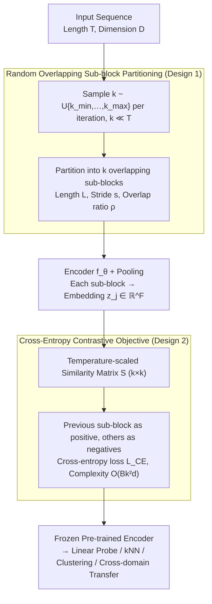

# Divide and Contrast: Learning Robust Temporal Features Without Augmentation

**Conference**: ICML 2026  
**arXiv**: [2605.21241](https://arxiv.org/abs/2605.21241)  
**Code**: To be confirmed  
**Area**: Time Series / Self-Supervised Learning  
**Keywords**: Time Series Representation Learning, Contrastive Learning, Self-Supervised, Augmentation-free, Sub-block Partitioning

## TL;DR
Di-COT learns robust time series representations efficiently without data augmentation by **randomly partitioning sequences into overlapping sub-blocks** for contrastive learning. Compared to existing methods, it is 2.5x faster with higher precision, validated comprehensively on 6 large-scale datasets + 124 UCR + 28 UEA.

## Background & Motivation

**Background**: Self-supervised representation learning for time series has become a critical research direction, with contrastive learning being widely applied. Existing methods such as TNC, TS-TCC, and TS2Vec utilize temporal proximity or data augmentation to construct positive and negative pairs.

**Limitations of Prior Work**:
- Complex data augmentations (e.g., time warping, magnitude transformation) lead to representation distortion.
- High computational overhead due to Dynamic Time Warping (DTW) or multiple encoder forward passes.
- Recent methods like CaTT avoid augmentation but assume temporal proximity equals semantic similarity, which fails on UCR/UEA datasets.

**Key Challenge**: On datasets with high temporal volatility (frequent event transitions), step-wise contrast generates false positives at temporal transitions. Methods relying solely on temporal proximity cannot handle such cases. Additionally, the computational complexity of existing losses scales quadratically with sequence length $T$, which is unfriendly to long sequences.

**Goal**: Design a self-supervised time series learning framework that requires no data augmentation, no multiple encoder passes, and is independent of sequence length.

**Key Insight**: Instead of performing contrast on individual timesteps, the sequence is partitioned into sub-block units with **semantic integrity**. This avoids false positives at temporal transitions while retaining sufficient learning signals.

**Core Idea**: Replace **step-wise or augmentation-based contrastive learning** with **dynamic overlapping sub-block contrastive learning**, and reformulate it as a **multi-class classification task** to achieve length-independent efficient computing.

## Method

### Overall Architecture
Di-COT aims to avoid the two chronic issues of temporal contrastive learning—representation distortion from data augmentation and false positives at transitions from step-wise contrast—by shifting the unit of contrast from "individual timesteps" to "semantically complete overlapping sub-blocks." When a sequence $\mathbf{x}^{(i)}\in\mathbb{R}^{T\times D}$ is input, it is first randomly partitioned into $k$ overlapping sub-blocks (where $k$ is uniformly sampled from $\{k_{\min},\ldots,k_{\max}\}$). Each sub-block is encoded and pooled to obtain an embedding, used to compute a temperature-scaled similarity matrix $\mathbf{S}^{(i)}\in\mathbb{R}^{k\times k}$. Finally, "adjacent sub-block prediction" is reformulated as a multi-class classification task, where each sub-block acts as an anchor to generate dense supervision. The entire pipeline uses no augmentation, and the loss complexity remains independent of sequence length.

### Key Designs

**1. Random Overlapping Sub-block Partitioning: Replacing Augmentation and Step-wise Contrast with Semantically Complete Sub-blocks**

Step-wise contrast (e.g., CaTT) assumes "temporal proximity = semantic similarity," which misidentifies two timesteps at a transition as a positive pair in high-volatility data. Furthermore, step-wise similarity matrix computation expands quadratically with sequence length $T$ ($O(BT^2d)$). Augmentation-based methods distort representations and increase overhead via multiple passes. Di-COT partitions the sequence into $k$ overlapping sub-blocks by sampling $k \ll T$ from $\mathcal{U}\{k_{\min},\ldots,k_{\max}\}$ each iteration. Sub-block length is $L=\frac{T}{1+(k-1)(1-\rho)}$, stride is $s=\lfloor L(1-\rho)\rceil$, and $\rho\in(0,1)$ is the overlap ratio. The embeddings are $z_j^{(i)} = f_\theta(\tilde x_j^{(i)})\in\mathbb{R}^F$. This step addresses three issues: overlapping allows adjacent sub-blocks to share context without artificial hard boundaries; random sampling of $k$ enables the model to see various temporal granularities, learning multi-scale robustness implicitly; and reducing contrast granularity from $T$ to $k \ll T$ eliminates transition false positives while preserving learning signals. Crucially, partitioning different segments of the same sequence serves as a substitute for augmentation: positive pairs naturally share the same semantic context. Thus, the framework requires no augmented views or non-linear projection heads (ablations show projections actually degrade performance in time series).

**2. Cross-entropy Contrastive Objective: Reformulating Adjacent Sub-block Prediction as Multi-class Classification**

Traditional InfoNCE complexity scales quadratically with $T$ on long sequences, while pairwise objectives like TNC or TS2Vec produce sparse supervision signals (approx. $2B$). Di-COT computes temperature-scaled similarities $S_{j,p}^{(i)} = \frac{z_j^{(i)\top}z_p^{(i)}}{\tau}$ to obtain $\mathbf{S}^{(i)}\in\mathbb{R}^{k\times k}$. The preceding sub-block is set as the positive label $p^*(j) = j-1$ (the first sub-block has no predecessor, target set to 0), while other sub-blocks in the same sequence are negatives. This is solved via cross-entropy: $\mathcal{L}_{\text{CE}} = -\frac{1}{Bk}\sum_i\sum_j\log\frac{\exp(S_{j,p^*(j)}^{(i)})}{\sum_p\exp(S_{j,p}^{(i)})}$. Consequently, every sub-block serves as an anchor, generating $B\times k$ positive pairs per update (much denser than the $2B$ in augmentation methods). Complexity is reduced to $O(Bk^2 d)$ ($k\ll T$), decoupling it from sequence length. This approach performs discrimination in the representation space rather than prediction in the numerical space, encouraging similarity in adjacent sub-block embeddings, thus proving robust to small window shifts while retaining InfoNCE properties.

## Key Experimental Results

### Main Results (Linear Evaluation on 6 Large-scale Datasets)

| Dataset | **Ours** | CaTT | TS2Vec | TF-C | Gain vs CaTT |
|--------|------|------|--------|------|----------|
| ECG | **85.28** | 80.89 | 71.83 | 74.67 | +4.39% |
| HARTH | **93.23** | 93.13 | 90.27 | 92.24 | +0.10% |
| PAMAP2 | **71.38** | 69.86 | 70.37 | 71.30 | +1.52% |
| SKODA | **99.41** | 94.87 | 98.96 | 98.23 | +4.54% |
| SLEEP | **85.21** | 85.17 | 84.81 | 85.18 | +0.04% |
| WISDM2 | **63.92** | 63.25 | 62.39 | 62.54 | +0.67% |
| **Mean Accuracy** | **83.07** | 81.20 | 79.77 | 80.69 | **+1.87%** |
| **Training Time (h)** | **2.88** | 3.47 | 3.28 | 6.52 | **-17%** |

### Low-label Regime (1% Labeled Data)

| Dataset | Ours | TF-C | TNC | Supervised Baseline |
|--------|------|------|------|----------|
| ECG | **73.33** | 74.50 | 61.06 | 54.28 |
| HARTH | **87.23** | 78.00 | 83.04 | 75.37 |
| SKODA | **98.01** | 93.50 | 96.11 | 92.77 |
| **Mean Accuracy** | **76.36** | 73.55 | 72.73 | 70.39 |

In the low-label setting, the improvement over the supervised baseline is +5.97%, while being 2.5x faster than TF-C.

### Ablation Study

| Configuration | Large Datasets | UCR | UEA | Note |
|------|------------|------|------|------|
| Full Model | 83.07 | 81.33 | 71.24 | Standard Di-COT |
| No Overlap (ρ=0) | 81.22 | 81.12 | 70.13 | -2.23% / -1.56% |
| No Temperature | 82.47 | 81.33 | 70.79 | Minor effect (-0.72%) |
| Fixed Global Partition | 82.80 | 81.32 | 69.69 | Random sampling is better |
| Contrast Shuffled Blocks| 81.80 | 81.19 | 70.09 | Proximity is vital |
| Non-linear Projection | 81.85 | 79.88 | 69.73 | Unlike CV, it degrades |

### Key Findings
- **Sub-block overlap is paramount**: It contributes most to performance, especially on large-scale datasets (-2.23%).
- **Temporal proximity is critical**: Using adjacent sub-blocks as positive pairs significantly outperforms random pairing (-1.53%).
- **Backbone Selection**: InceptionTime outperforms ResNet (-3.56%) and FCN (-2.58%).
- **No Non-linear Projection**: Unlike SimCLR, projections decrease performance in this context.

## Highlights & Insights
- **Ingenious Granularity Scaling**: By reducing contrast granularity from timesteps ($T$) to sub-blocks ($k \ll T$), the model naturally avoids false positives at transitions while maintaining sufficient signal—more robust than CaTT's assumptions.
- **Length-independent Computing**: Reducing complexity from $O(B T^2 d)$ to $O(B k^2 d)$ enables the processing of long sequences; the cross-entropy reformulation is more efficient than traditional InfoNCE.
- **Advantage of No Augmentation**: Completely abandoning data augmentation prevents representation distortion and reduces overhead—suggesting that CV tricks are not universally applicable to sequences.
- **Multi-granularity Robustness**: Randomly sampling $k$ each iteration forces the model to learn multi-scale temporal features, providing implicit multi-resolution learning.

## Limitations & Future Work
- Di-COT is based on contrastive learning and learns discriminative representations, making it less suitable for time series forecasting.
- The method relies heavily on the "temporal proximity = semantic similarity" assumption; it may still fail on data with high-frequency state jumps.
- The number of sub-blocks $k$ and overlap ratio $\rho$ require dataset-specific tuning.
- Future work: Adaptive sub-block partitioning strategies; hybrid contrastive strategies; expansion to non-sequential tasks to verify generality.

## Related Work & Insights
- **vs CaTT** (Shamba et al. 2025): Also avoids augmentation and multi-encoding, but contrasts all timesteps. Di-COT avoids false positives via sub-blocks, offers length-independent computing, and achieves better performance.
- **vs TS2Vec** (Yue et al. 2022): Uses cross-view contrast at the same timestamp, requiring two augmented views. Di-COT is more efficient and avoids augmentation bias.
- **vs Augmentation-based Methods** (TS-TCC, TF-C): Conventional methods rely on complex augmentations; Di-COT proves that a simple augmentation-free strategy with proper granularity selection can prevail in time series.
- **Insight**: Successes in CV should be applied cautiously to other domains—sometimes "less" (no augmentation) is "more" (better than complex augmentation).

## Rating
- Novelty: ⭐⭐⭐⭐ Resolves the core tradeoff of time series contrastive learning (efficiency vs. accuracy) via granularity and loss reformulation.
- Experimental Thoroughness: ⭐⭐⭐⭐⭐ Covers 6 large + 124 UCR + 28 UEA datasets, 5 downstream tasks, and extensive ablations.
- Writing Quality: ⭐⭐⭐⭐ Clear structure with sufficient differentiation from previous work, though some paragraphs could be more concise.
- Value: ⭐⭐⭐⭐⭐ High practical deployment value—both fast and accurate, with open-source code ready for various time series tasks.

<!-- RELATED:START -->

## Related Papers

- [\[ICML 2026\] DistMatch: Adaptive Binning via Distribution Matching for Robust Sequential Conformal](distmatch_adaptive_binning_via_distribution_matching_for_robust_sequential_confo.md)
- [\[AAAI 2026\] Task-Aware Retrieval Augmentation for Dynamic Recommendation](../../AAAI2026/time_series/task-aware_retrieval_augmentation_for_dynamic_recommendation.md)
- [\[ICML 2026\] Doubly Outlier-Robust Online Infinite Hidden Markov Model](doubly_outlier-robust_online_infinite_hidden_markov_model.md)
- [\[ICML 2026\] Learning Long Range Spatio-Temporal Representations over Continuous Time Dynamic Graphs with State Space Models](learning_long_range_spatio-temporal_representations_over_continuous_time_dynamic.md)
- [\[NeurIPS 2025\] MAESTRO: Adaptive Sparse Attention and Robust Learning for Multimodal Dynamic Time Series](../../NeurIPS2025/time_series/maestro_adaptive_sparse_attention_and_robust_learning_for_multimodal_dynamic_tim.md)

<!-- RELATED:END -->
